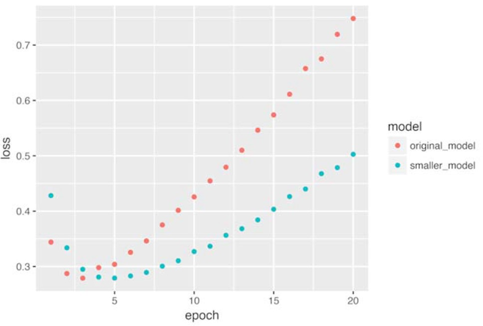
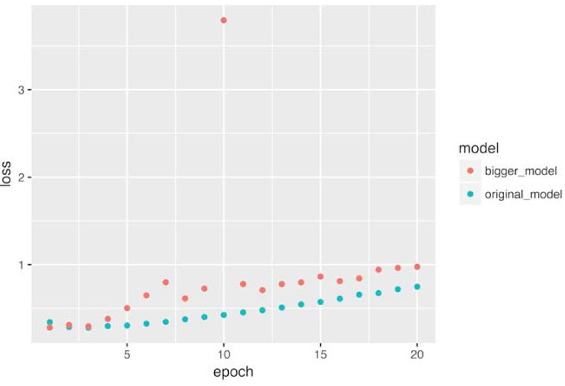
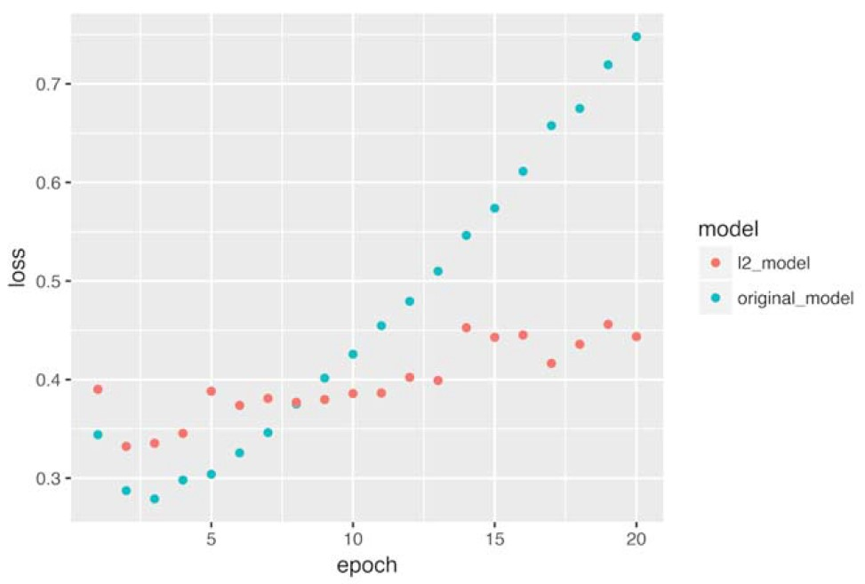
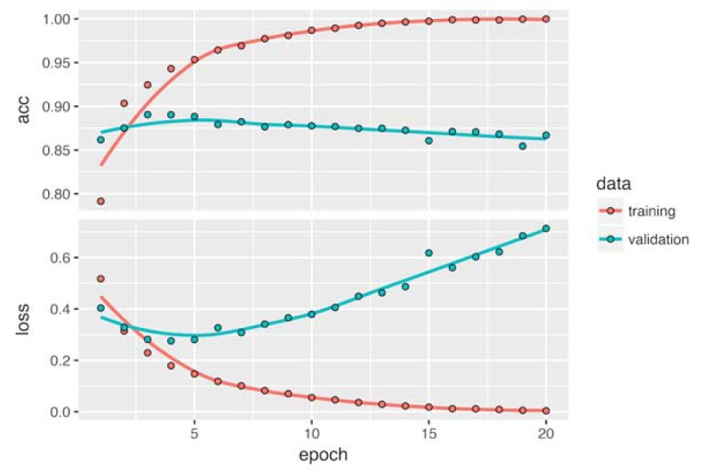

<style type="text/css">
p{ /* Normal  */
   font-size: 14px;
   line-height: 18px;}
body{ /* Normal  */
   font-size: 14px;}
td {  /* Table  */
   font-size: 12px;}
h1 { /* Header 1 */
 font-size: 26px;
 color: #4294ce;}
h2 { /* Header 2 */
 font-size: 22px;}
h3 { /* Header 3 */
 font-size: 18px;}
code.r{ /* Code block */
  font-size: 12px;}
pre { /* Code block */
  font-size: 12px}
#table-of-contents h2 {
background-color: #4294ce;}
#table-of-contents{
background: #688FAD;}
#nav-top span.glyphicon{
color: #4294ce;}
#postamble{
background: #4294ce;
border-top: ;}
</style>

```{r setup, include=FALSE}
knitr::opts_knit$set(
     root.dir = 'C:/Users/czwea/Documents/GitHub/DeepLearning/DeepLearningwithR/FinalDocs/')
```
```{r echo=FALSE, warning=FALSE, message=FALSE}
#remotes::install_github("rstudio/gt")

if(!require(easypackages)){install.packages("easypackages")}
library(easypackages)
packages("tidyverse", "keras", "gt", "here", "stringr", prompt = TRUE)
setwd("~/GitHub/DeepLearning/DeepLearningwithR/FinalDocs/")
```

```{r openRData1, echo=FALSE, eval=FALSE}
load("../RData/Pt1BianaryClassification.RData")
```

# Notes from *Deep Learning with R*

## Web Links

[Keras RStudio](https://keras.rstudio.com/)
[Book Code](https://github.com/jjallaire/deep-learning-with-r-notebooks)
[Live Book](https://www.manning.com/books/deep-learning-with-r)

> Install Anaconda with Python 6, update conda, then `install_keras`

- Anaconda2-4.3.1-Windows-x86_64
      - installed defaults including path and default Python
- conda update conda in Anaconda prompt (used admin rights by right clicking)
- `install_keras`

# Part 1: Fundamentals of Deep Learning

Anatomy of a neural network:

Training a neural network revolves around the following objects:

1. Layers, which are combined into a network (or model) 
2. The input data and corresponding targets
3. The loss function, which defines the feedback signal used for learning 
4. The optimizer which determines how learning proceeds 

1. The fundamental data structure in neural networks is the layer. A layer is a data-processing module that takes as input one or more tensors and that outputs one or more tensors. Some layers are stateless, but more frequently layers have a state: the layer weights, one or several tensors learned with stochastic gradient descent, which together contain the network knowledge. 

2. Different layers are appropriate for different tensor formats and different types of data processing. For instance, simple vector data, stored in 2D tensors of shape (samples, features), is often processed by densely connected layers, also called fully connected or dense layers (the `layer_dense` function in Keras). Sequence data, stored in 3D tensors of shape (samples, timesteps, features), is typically processed by recurrent layers such as `layer_lstm.` Image data, stored in 4D tensors, is usually processed by 2D convolution layers (`layer_conv_2d`). 

The notion of layer compatibility here refers specifically to the fact that every layer will only accept input tensors of a certain shape and will return output tensors of a certain shape. 

---

The topology of a network defines a hypothesis space. Machine learning is defined as *searching for useful representations of some input data, within a predefined space of possibilities, using guidance from a feedback signal.* By choosing a network topology, you constrain your space of possibilities (hypothesis space) to a specific series of tensor operations, mapping input data to output data. What you will then be searching for is a good set of values for the weight tensors involved in these tensor operations. 

---

```{r, out.width = "400px", echo=FALSE}

```

3. **Loss Function** (Objective Function):  The quantity that will be minimized during training.  It represents a measure of success for the task.

- A neural network that has multiple outputs may have multiple loss functions (one per output).  Gradient descent process must be based on a single scalar loss value.  For multiloss networks, all losses are combined and averaged into a single scalar quantity.
     - Choosing the right loss function is extremely important
          - Two-Class Classifications use *binary crossentropy*
          - many-class classification uses *categorical crossentropy*
          - Regression uses mean squared error
          - Sequence learning tasks use *connectionist temporal classification* (CTC)

> Connectionist temporal classification is a type of neural network output and associated scoring function, for training recurrent neural networks such as LSTM networks to tackle sequence problems where the timing is variable. It can be used for tasks like on-line handwriting recognition or recognizing phonemes in speech audio. CTC refers to the outputs and scoring, and is independent of the underlying neural network structure. 

4. **Optimizer**: Determines how the network will be updated based on the loss function.  It implements a specific variant of stochastic gradient descent (SGD).  [stochastic simply means random]

## Developing with Keras

The typical Keras workflow looks like:

1. Define your training data: input tensors and target tensors.
2. Define a network of layers (or model) that maps your inputs to your targets. 
3. Configure the learning process by choosing a loss function, an optimizer and some metrics to monitor.
4. Iterate on your training data by calling the fit() method of your model. 

**Vectorization**:  All inputs and targets in a neural network must be tensors of floating-point data (or, in specific cases, tensors of integers). Whatever data you need to process - ”sound, images, text - ”you must first turn into tensors, a step called _data vectorization_. For instance, in the two following text-classification examples, start from text represented as lists of integers (standing for sequences of words), and  used one-hot encoding to turn them into a tensor of floating-point data. In the examples of classifying digits and predicting house prices, the data already comes in vectorized form. 

**Value normalization**: In the digit-classification example below, start from image data encoded as integers in the 0 - “255 range, encoding grayscale values. Before you feed this data into the network, divide by 255 so you would end up with floating-point values in the 0-1 range. Similarly, when predicting house prices, you start from features that took a variety of ranges some features had small floating-point values, and others had fairly large integer values. Before feeding this data into the network, you had to normalize each feature independently so that it had a standard deviation of 1 and a mean of 0. 

In general, it is not safe to feed into a neural network data that takes relatively large values (for example, multidigit integers, which are much larger than the initial values taken by the weights of a network) or data that is heterogeneous (for example, data where one feature is in the range 0-1 and another is in the range 100 - 200). Doing so can trigger large gradient updates that will prevent the network from converging. 

To make learning easier for your network, your data should have the following characteristics:

- Take small values. Typically, most values should be in the 0 - 1 range. 
- Be homogeneous€”That is, all features should take values in roughly the same range.

Additionally, the following stricter normalization practice is common and can help, although it is not always necessary: 

-Normalize each feature independently to have a mean of 0.
-Normalize each feature independently to have a standard deviation of 1.

This is easy to do with R using the scale() function: 

```{r eval=FALSE}
x <- scale(x)                         1
```
Assuming x is a 2D matrix of shape (samples, features)

> Typically, you normalize features in both training and test data. In this case, you want to compute the mean and standard deviation on the training data only and then apply them to both the training and test data.

```{}
1 mean <- apply(train_data, 2, mean) 
2 std <- apply(train_data, 2, sd)
3 train_data <- scale(train_data, center = mean, scale = std) 
4 test_data <- scale(test_data, center = mean, scale = std)
```

1. Calculates the mean and standard deviation on the training data
2. Scales the training and test data using the mean and standard deviation from the training data

The `caret` and `recipes` packages both include many more high-level functions for data preprocessing and normalization. 

**Feature Engineering**:  Modern deep learning removes the need for most feature engineering because neural networks are capable of automatically extracting useful features from raw data. Does this mean you do not have to worry about feature engineering as long as you are using deep neural networks? No, for two reasons: 

- Good features still allow you to solve problems more elegantly while using fewer resources. For instance, it would be ridiculous to solve the problem of reading a clock face using a convolutional neural network. 
- Good features let you solve a problem with far less data. The ability of deep-learning models to learn features on their own relies on having lots of training data available; if you have only a few samples, then the information value in their features becomes critical. 

**Overfitting**:  In all three examples below, predicting movie reviews, topic classification, and house-price regressions, the performance of the model on the held-out validation data always peaked after a few epochs and then began to degrade: the model quickly started to overfit to the training data. Overfitting happens in every machine-learning problem. Learning how to deal with overfitting is essential to mastering machine learning. 

The fundamental issue in machine learning is the tension between optimization and generalization. Optimization refers to the process of adjusting a model to get the best performance possible on the training data (the learning in machine learning), whereas generalization refers to how well the trained model performs on data it has never seen before. The goal of the game is to get good generalization, of course, but you do not control generalization; you can only adjust the model based on its training data. 

At the beginning of training, optimization and generalization are correlated: the lower the loss on training data, the lower the loss on test data. While this is happening, your model is said to be underfit: there is still progress to be made; the network has not yet modeled all relevant patterns in the training data. But after a certain number of iterations on the training data, generalization stops improving, and validation metrics stall and then begin to degrade: the model is starting to overfit. It is beginning to learn patterns that are specific to the training data but that are misleading or irrelevant when it comes to new data. 

To prevent a model from learning misleading or irrelevant patterns found in the training data, the best solution is to get more training data. A model trained on more data will naturally generalize better. When that is not possible, the next-best solution is to modulate the quantity of information that your model is allowed to store or to add constraints on what information it is allowed to store. If a network can only afford to memorize a small number of patterns, the optimization process will force it to focus on the most prominent patterns, which have a better chance of generalizing well. 

The process of fighting overfitting this way is called `regularization.` Review some of the most common regularization techniques and apply them in practice to improve the movie-classification model. 

1. Reducing the network size 

The simplest way to prevent overfitting is to reduce the size of the model: the number of learnable parameters in the model (which is determined by the number of layers and the number of units per layer). In deep learning, _the number of learnable parameters in a model is often referred to as the models capacity_. Intuitively, a model with more parameters has more memorization capacity and therefore can easily learn a perfect dictionary - like mapping between training samples and their target a mapping without any generalization power. For instance, a model with 500,000 binary parameters could easily be made to learn the class of every digit in the MNIST training set: we need only 10 binary parameters for each of the 50,000 digits. But such a model would be useless for classifying new digit samples. Always keep this in mind: deep-learning models tend to be good at fitting to the training data, but the real challenge is generalization, not fitting. 

On the other hand, if the network has limited memorization resources, it will not be able to learn this mapping as easily; thus, in order to minimize its loss, it will have to resort to learning compressed representations that have predictive power regarding the targets precisely the type of representations we are interested in. At the same time, keep in mind that you should use models that have enough parameters that they do not underfit: your model should not be starved for memorization resources. There is a compromise to be found between too much capacity and not enough capacity. 

Unfortunately, there is no magical formula to determine the right number of layers or the right size for each layer. You must evaluate an array of different architectures (on your validation set, not on your test set) in order to find the correct model size for your data. _the general workflow to find an appropriate model size is to start with relatively few layers and parameters, and increase the size of the layers or add new layers until you see diminishing returns with regard to validation loss_. 

Try this on the movie-review classification network. The original network is shown next.

```{r eval=FALSE}
model <- keras_model_sequential() %>%
  layer_dense(units = 16, activation = "relu", input_shape = c(10000)) %>%
  layer_dense(units = 16, activation = "relu") %>%
  layer_dense(units = 1, activation = "sigmoid")
```

Replace it with this smaller network.

```{r eval=FALSE}
model <- keras_model_sequential() %>%
  layer_dense(units = 4, activation = "relu", input_shape = c(10000)) %>%
  layer_dense(units = 4, activation = "relu") %>%
  layer_dense(units = 1, activation = "sigmoid")
```

The figure below shows a comparison of the validation losses of the original network and the smaller network (remember, a lower validation loss signals a better model). As you can see, the smaller network starts overfitting later than the reference network, and its performance degrades more slowly once it begins to overfit. 

```{r, out.width = "400px", echo=FALSE}

```

Add to this benchmark a network that has much more capacity far more than the problem warrants.

```{r eval=FALSE}
model <- keras_model_sequential() %>%
  layer_dense(units = 512, activation = "relu", input_shape = c(10000)) %>%
  layer_dense(units = 512, activation = "relu") %>%
  layer_dense(units = 1, activation = "sigmoid")
```

Figure below shows how the bigger network fares compared to the reference network. The bigger network starts overfitting almost immediately, after just one epoch, and it overfits much more severely. Its validation loss is also noisier. 

```{r, out.width = "400px", echo=FALSE}

```

Meanwhile, the figure below shows the training losses for the two networks. As you can see, the bigger network gets its training loss near zero very quickly. The more capacity the network has, the more quickly it can model the training data (resulting in a low training loss), but the more susceptible it is to overfitting (resulting in a large difference between the training and validation loss). 

```{r, out.width = "400px", echo=FALSE}
knitr::include_graphics("../images/figure4_6_p98.jpg")
```

2. Adding weight regularization 

You may be familiar with the principle of Occams razor: _given two explanations for something, the explanation most likely to be correct is the simplest ones the one that makes fewer assumptions_. This idea also applies to the models learned by neural networks: given some training data and a network architecture, multiple sets of weight values (multiple models) could explain the data. Simpler models are less likely to overfit than complex ones. 

A simple model in this context is a model where the distribution of parameter values has less entropy (or a model with fewer parameters, as you saw in the previous section). Thus, a common way to mitigate overfitting is to put constraints on the complexity of a network by forcing its weights to take only small values, which makes the distribution of weight values more regular. This is called weight regularization, and it is done by adding to the loss function of the network a cost associated with having large weights. This cost comes in two flavors: 

- L1 regularization:€”The cost added is proportional to the __absolute value__ of the weight coefficients (the L1 norm of the weights). 
- L2 regularization:€”The cost added is proportional to the __square of the value__ of the weight coefficients (the L2 norm of the weights). L2 regularization is also called weight decay in the context of neural networks. Do not let the different name confuse you: weight decay is mathematically the same as L2 regularization. 

In Keras, weight regularization is added by passing weight regularizer instances to layers as keyword arguments. Add L2 weight regularization to the movie-review classification network. 

```{r eval=FALSE}
model <- keras_model_sequential() %>%
  layer_dense(units = 16, kernel_regularizer = regularizer_l2(0.001), activation = "relu", input_shape = c(10000)) %>%
  layer_dense(units = 16, kernel_regularizer = regularizer_l2(0.001), activation = "relu") %>%
  layer_dense(units = 1, activation = "sigmoid")
```

`regularizer_l2(0.001)` means every coefficient in the weight matrix of the layer will add `0.001 * weight_coefficient_value` to the total loss of the network. Note that because this *penalty is only added at training time*, the loss for this network will be much higher at training time than at test time. 

The next figure shows the impact of the L2 regularization penalty. As you can see, the model with L2 regularization has become much more resistant to overfitting than the reference model, even though both models have the same number of parameters. 

```{r, out.width = "400px", echo=FALSE}

```
 
As an alternative to L2 regularization, you can use one of the following Keras weight regularizers. 

```{r eval=FALSE}
regularizer_l1(0.001)
regularizer_l1_l2(l1 = 0.001, l2 = 0.001)
```

3. Adding dropout 

Dropout is one of the most effective and most commonly used regularization techniques for neural networks. Dropout, applied to a layer, consists of randomly dropping out (setting to zero) a number of output features of the layer during training. Say a given layer would normally return a vector `[0.2, 0.5, 1.3, 0.8, 1.1]` for a given input sample during training. After applying dropout, this vector will have a few zero entries distributed at random: for example, `[0, 0.5, 1.3, 0, 1.1]`. The _dropout rate is the fraction of the features that are zeroed out_; it is usually set between 0.2 and 0.5. At test time, no units are dropped out; instead, the layers output values are scaled down by a factor equal to the dropout rate, to balance for the fact that more units are active than at training time. 

Consider a matrix containing the output of a layer, `layer_output`, of shape (`batch_size, features`). At training time, we zero out at random a fraction of the values in the matrix: 

```{r eval=FALSE}
layer_output <- layer_output * sample(0:1, length(layer_output), replace = TRUE)
```

At test time, we scale down the output by the dropout rate. Here, we scale by 0.5 (because we previously dropped half the units): 

```{r eval=FALSE}
layer_output <- layer_output * 0.5
```

Note that this process can be implemented by doing both operations at training time and leaving the output unchanged at test time, which is often the way it is implemented in practice (see below): 

```{r, out.width = "400px", echo=FALSE}

```

```{r eval=FALSE}
layer_output <- layer_output * sample(0:1, length(layer_output), replace = TRUE) # at training time
layer_output <- layer_output / 0.5  #scaling up rather scaling down in this case
```

This technique may seem strange and arbitrary. Why would this help reduce overfitting? The core idea is that introducing noise in the output values of a layer can break up happenstance patterns that are not significant, which the network will start memorizing if no noise is present. 

In Keras, you  introduce dropout in a network via `layer_dropout`, which is applied to the output of the layer immediately before it: 

```{r eval=FALSE}
layer_dropout(rate = 0.5)
```

Add two dropout layers in the IMDB network to see how well they do at reducing overfitting.

```{r eval=FALSE}
model <- keras_model_sequential() %>%
  layer_dense(units = 16, activation = "relu", input_shape = c(10000)) %>%
  layer_dropout(rate = 0.5) %>%
  layer_dense(units = 16, activation = "relu") %>%
  layer_dropout(rate = 0.5) %>%
  layer_dense(units = 1, activation = "sigmoid")
```

The figure shows a plot of the results. Again, this is a clear improvement over the reference network. 

```{r, out.width = "400px", echo=FALSE}
knitr::include_graphics("../images/figure4_9_p102.jpg")
```
 
To recap, these are the most common ways to prevent overfitting in neural networks:

- Get more training data
- Reduce the capacity of the network
- Add weight regularization
- Add dropout

## Binary Classification Example

Two-class classification, or binary classification, may be the most widely applied kind of machine learning problem. In this example, we will learn to classify movie reviews into _positive_ reviews and _negative_ reviews, just based on the text content of the reviews.

### The IMDB dataset

The IMDB dataset consists of 50,000 highly-polarized reviews from the Internet Movie Database. They are split into 25,000 reviews for training and 25,000 reviews for testing, each set consisting in 50% negative and 50% positive reviews.

Just like the MNIST dataset, the IMDB dataset comes packaged with Keras. It has already been preprocessed: the reviews (sequences of words) have been turned into sequences of integers, where each integer stands for a specific word in a dictionary.

The following code will load the dataset (when you run it for the first time, about 80MB of data will be downloaded):

```{r, results='hide'}
imdb <- dataset_imdb(num_words = 10000)

#c(c(train_data, train_labels), c(test_data, test_labels)) %<-% imdb

train_data <- imdb$train$x
train_labels <- imdb$train$y
test_data <- imdb$test$x
test_labels <- imdb$test$y
```

> multi-assignment operator (%<-%) from the `zeallot` package to unpack the list into a set of distinct variables

The argument `num_words = 10000` means that we keep the top 10,000 most frequently occurring words in the training data. Rare words will be discarded. 

The variables `train_data` and `test_data` are lists of reviews, each review being a list of word indices (encoding a sequence of words). `train_labels` and `test_labels` are lists of 0s and 1s, where 0 stands for "negative" and 1 stands for "positive":

```{r}
str(train_data[[1]])
```

```{r}
head(train_labels, 10)
```

### Preparing the data

You cannot feed lists of integers into a neural network. You have to turn your lists into tensors. This can be done using One-hot-encoding your lists to turn them into vectors of 0s and 1s. This would mean, for instance, turning the sequence `[3, 5]` into a 10,000-dimensional vector that would be all zeros except for indices 3 and 5, which would be ones. Then you could use as the first layer in your network a dense layer, capable of handling floating-point vector data.

> Typical one-hot encoding will not work because there are a difference number of values in each nested branch

> Similarly, `as.data.frame` and `as.matrix` fail for the same reason.

Therefore a prepopulated matrix must be created and then filled by the loop.

```{r vectorize_sequences}
vectorize_sequences <- function(sequences, dimension = 10000) {
  # Create an all-zero matrix of shape (len(sequences), dimension)
  results <- matrix(0, nrow = length(sequences), ncol = dimension)
  for (i in 1:length(sequences))
    # Sets specific indices of results[i] to 1s
    results[i, sequences[[i]]] <- 1
  results}

# Our vectorized training data
x_train <- vectorize_sequences(train_data)
# Our vectorized test data
x_test <- vectorize_sequences(test_data)
```

Here is what our samples look like now:

```{r}
str(x_train[1,])
```

We should also vectorize our labels:

```{r}
# Our vectorized labels
y_train <- as.numeric(train_labels)
y_test <- as.numeric(test_labels)
```

Now our data is ready to be fed into a neural network.

### Building the network

The input data is vectors and the labels are scalars (1s and 0s): this is the easiest setup you will  encounter. _A type of network that performs well on such a problem is a simple stack of fully connected ("dense") layers with `relu` activations_: `layer_dense(units = 16, activation = "relu")`.

The argument being passed to each dense layer (16) is the number of hidden units of the layer. A _hidden unit_ is a dimension in the representation space of the layer. You may remember that each such dense layer with a `relu` activation implements the following chain of tensor operations:

`output = relu(dot(W, input) + b)`

Having 16 hidden units means that the weight matrix `W` will have shape `(input_dimension, 16)`, i.e. the dot product with `W` will project the input data onto a 16-dimensional representation space (and then we would add the bias vector `b` and apply the `relu` operation). You can intuitively understand the dimensionality of your representation space as _how much freedom you are allowing the network to have when learning internal representations_. Having more hidden units (a higher-dimensional representation space) allows your network to learn more complex representations, but it makes your network more computationally expensive and may lead to learning unwanted patterns (patterns that will improve performance on the training data but not on the test data).

> The dot product or scalar product is an algebraic operation that takes two equal-length sequences of numbers (usually coordinate vectors) and returns a single number.

There are two key architecture decisions to be made about such stack of dense layers:

* How many layers to use
* How many "hidden units" to chose for each layer

For the time being trust the following architecture choice: 

- two intermediate layers with 16 hidden units each
- a third layer which will output the scalar prediction regarding the sentiment of the current review. 

The intermediate layers will use `relu` as their "activation function" and the final layer will use a `sigmoid` activation  to output a probability (a score between 0 and 1, indicating how likely the sample is to have the target "1", i.e. how likely the review is to be positive). A `relu` (rectified linear unit) is a function meant to zero-out negative values, while a sigmoid "squashes" arbitrary values into the `[0, 1]` interval, thus outputting something that can be interpreted as a probability.

```{r, out.width = "400px", echo=FALSE}

```

```{r, out.width = "400px", echo=FALSE}

```

Here is what our network looks like:

```{r, out.width = "400px", echo=FALSE}

```

And here is the Keras implementation:

```{r}
model <- keras_model_sequential() %>% 
  layer_dense(units = 16, activation = "relu", input_shape = c(10000)) %>% 
  layer_dense(units = 16, activation = "relu") %>% 
  layer_dense(units = 1, activation = "sigmoid")
```

Lastly, pick a loss function and an optimizer. Since we are facing a binary classification problem and the output of our network is a probability (we end our network with a single-unit layer with a sigmoid activation), is it best to use the `binary_crossentropy` loss. It is not the only viable choice: you could use, for instance, `mean_squared_error`. But _crossentropy is usually the best choice when you are dealing with models that output probabilities_. `Crossentropy` is a quantity from the field of Information Theory that measures the _distance_ between probability distributions, or in our case, between the ground-truth distribution and our predictions.

---

Without an activation function like `relu` (also called a non-linearity), the dense layer would consist of 2 linear operations - a dot product and an addition:
$$output = dot(W, input) + b$$
So the layer could only learn linear transformations of the input data: the *hypothesis space* of the layer would be the set of all possible linear transformations of the input data into a 16-dimension space.  This is too restrictive and would not benefit from multiple payers or representations because a deep stack of linear layers would still implement a linear operation.  A non-linearity or activation function is needed to access a much richer *hypothesis space* that would benefit from deep representations.

---

Configure the model with the `rmsprop` optimizer and the `binary_crossentropy` loss function. Note that we will also monitor accuracy during training.

```{r eval=FALSE}
model %>% compile(optimizer = "rmsprop", loss = "binary_crossentropy", metrics = c("accuracy"))
```

You are passing your optimizer, loss function, and metrics as strings, which is possible because `rmsprop`, `binary_crossentropy`, and `accuracy` are packaged as part of Keras. Sometimes you may want to configure the parameters of your optimizer or pass a custom loss function or metric function. The former can be done by passing an optimizer instance as the `optimizer` argument: 

```{r eval=FALSE}
model %>% compile(optimizer = optimizer_rmsprop(lr=0.001), loss = "binary_crossentropy", metrics = c("accuracy")) 
```

The latter can be done by passing function objects as the `loss` or `metrics` arguments:

```{r eval=FALSE}
model %>% compile(optimizer = optimizer_rmsprop(lr = 0.001), loss = loss_binary_crossentropy,
                  metrics = metric_binary_accuracy) 
```

### Validating Approach

In order to monitor during training the accuracy of the model on data that it has never seen before, create a "validation set" by setting apart 10,000 samples from the original training data:

```{r}
val_indices <- 1:10000

x_val <- x_train[val_indices,]
partial_x_train <- x_train[-val_indices,]

y_val <- y_train[val_indices]
partial_y_train <- y_train[-val_indices]
```

Now train the model for 20 epochs (20 iterations over all samples in the `x_train` and `y_train` tensors), in mini-batches of 512 samples. At this same time  monitor loss and accuracy on the 10,000 samples that we set apart. This is done by passing the validation data as the `validation_data` argument:

```{r, echo=TRUE, results='hide', eval=FALSE}
model %>% compile(optimizer = "rmsprop", loss = "binary_crossentropy", metrics = c("accuracy"))

history <- model %>% fit(partial_x_train, partial_y_train, epochs = 20, batch_size = 512,
                         validation_data = list(x_val, y_val))
```

```{r, out.width = "500px", echo=FALSE}

```

Note that the call to `fit()` returns a `history` object:

```{r eval=FALSE}
str(history)
```

```{r, out.width = "400px", echo=FALSE}

```

The `history` object includes various parameters used to fit the model (`history$params`) as well as data for each of the metrics being monitored (`history$metrics`).

The `history` object has a `plot()` method that enables us to visualize the training and validation metrics by epoch:

```{r eval=FALSE}
plot(history)
```

```{r, out.width = "400px", echo=FALSE}

```

The accuracy is plotted on the top panel and the loss on the bottom panel. Note results may vary slightly due to a different random initialization of your network.

The dots are the training loss and accuracy, while the solid lines are the validation loss and accuracy. Note that your own results may vary slightly due to a different random initialization of your network.

The training loss decreases with every epoch and the training accuracy increases with every epoch. That's what you would expect when running a gradient-descent optimization - the quantity you're trying to minimize should be less with every iteration. But that isn't the case for the validation loss and accuracy: they seem to peak at the fourth epoch. This is an example of what we warned against earlier: a model that performs better on the training data isn't necessarily a model that will do better on data it has never seen before. In precise terms, what you're seeing is _overfitting_: after the second epoch, you're over-optimizing on the training data, and you end up learning representations that are specific to the training data and don't generalize to data outside of the training set.

---

`plot` used above uses `ggplot2`.  To create a custom plot, use `as.data.frame` to produce a data frame with factors for each metric as well as validation.

```{r eval=FALSE}
history_df <- as.data.frame(history)
str(history_df)
```

```{r, out.width = "400px", echo=FALSE}

```

---

In this case, to prevent overfitting, you could stop training after three epochs. 

Train a new network from scratch for four epochs and then evaluate it on the test data.

```{r, echo=TRUE, results='hide', eval=FALSE}
model <- keras_model_sequential() %>% 
  layer_dense(units = 16, activation = "relu", input_shape = c(10000)) %>% 
  layer_dense(units = 16, activation = "relu") %>% 
  layer_dense(units = 1, activation = "sigmoid")

model %>% compile(optimizer = "rmsprop",loss = "binary_crossentropy", metrics = c("accuracy"))

model %>% fit(x_train, y_train, epochs = 4, batch_size = 512)
results <- model %>% evaluate(x_test, y_test)
```

```{r eval=FALSE}
results
```

Our fairly naive approach achieves an accuracy of 88%. With state-of-the-art approaches, one should be able to get close to 95%.

### Predictions on new data

After having trained a network, use it in a practical setting. You can generate the likelihood of reviews being positive by using the `predict` method:

```{r}
model %>% predict(x_test[1:10,])
```

The network is very confident for some samples but less confident for others. 

### Further experiments

* Try to use 1 or 3 hidden layers and see how it affects validation and test accuracy.
* Try to use layers with more hidden units or less hidden units: 32 units, 64 units...
* Try to use the `mse` loss function instead of `binary_crossentropy`.
* Try to use the `tanh` activation (an activation that was popular in the early days of neural networks) instead of `relu`.

These experiments will help convince you that the architecture choices we have made are all fairly reasonable, although they can still be improved!

### Conclusions

Here is what you should take away from this example:

* You usually need to do quite a bit of preprocessing on your raw data in order to be able to feed it -- as tensors -- into a neural network. Sequences of words can be encoded as binary vectors, but there are other encoding options, too.
* Stacks of dense layers with `relu` activations can solve a wide range of problems (including sentiment classification), and you'll likely use them frequently.
* In a binary classification problem (two output classes), your network should end with a dense layer with one unit and a `sigmoid` activation. That is, the output of your network should be a scalar between 0 and 1, encoding a probability.
* With such a scalar sigmoid output on a binary classification problem, the loss function you should use is `binary_crossentropy`.
* The `rmsprop` optimizer is generally a good enough choice, whatever your problem. That's one less thing for you to worry about.
* As they get better on their training data, neural networks eventually start _overfitting_ and end up obtaining increasingly worse results on data they've never seen before. Be sure to always monitor performance on data that is outside of the training set.

```{r saveRData1, eval=FALSE}
save.image("../RData/Pt1BianaryClassification.RData")
```

