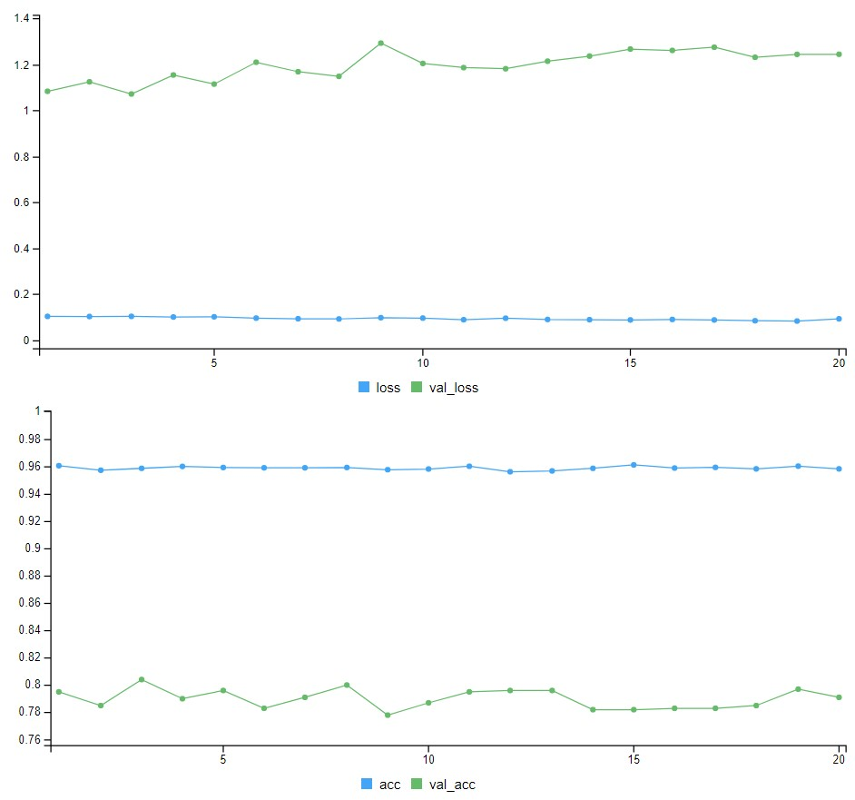
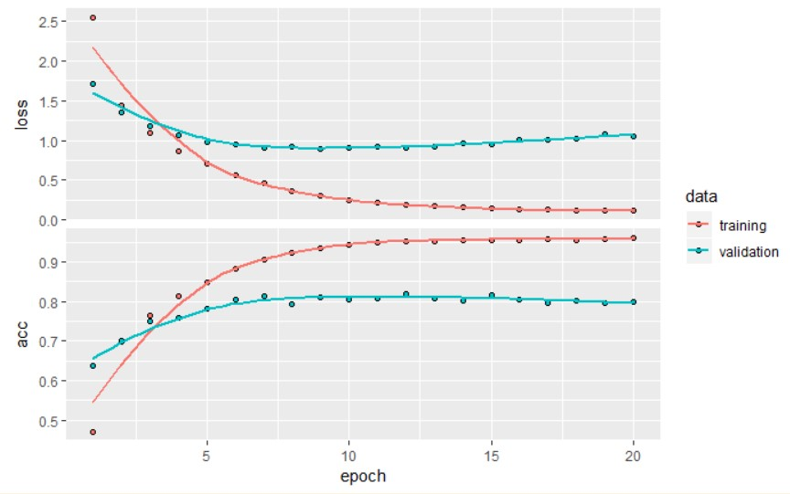
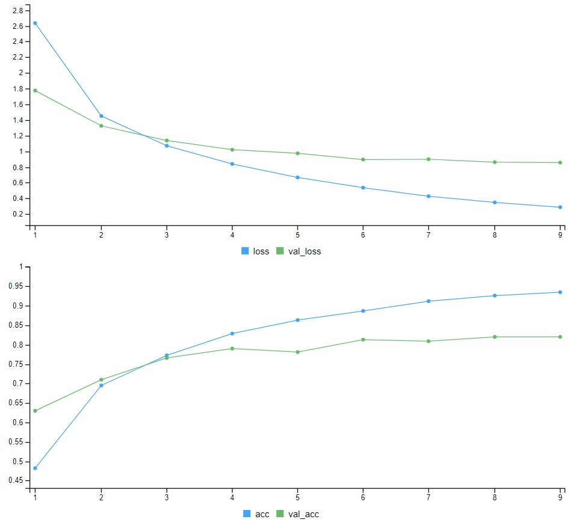
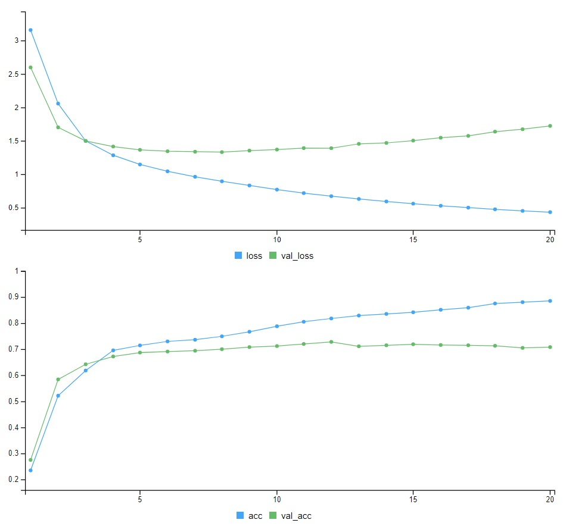

<style type="text/css">
p{ /* Normal  */
   font-size: 14px;
   line-height: 18px;}
body{ /* Normal  */
   font-size: 14px;}
td {  /* Table  */
   font-size: 12px;}
h1 { /* Header 1 */
 font-size: 26px;
 color: #4294ce;}
h2 { /* Header 2 */
 font-size: 22px;}
h3 { /* Header 3 */
 font-size: 18px;}
code.r{ /* Code block */
  font-size: 12px;}
pre { /* Code block */
  font-size: 12px}
#table-of-contents h2 {
background-color: #4294ce;}
#table-of-contents{
background: #688FAD;}
#nav-top span.glyphicon{
color: #4294ce;}
#postamble{
background: #4294ce;
border-top: ;}
</style>

```{r echo=FALSE}
rm(list = ls())
```

```{r setup, include=FALSE}
knitr::opts_knit$set(
     root.dir = 'C:/Users/czwea/Documents/GitHub/DeepLearning/DeepLearningWithR/FinalDocs/')
```

```{r echo=FALSE, warning=FALSE, message=FALSE, eval=FALSE}
#remotes::install_github("rstudio/gt")

if(!require(easypackages)){install.packages("easypackages")}
library(easypackages)
packages("tidyverse", "keras", "gt", "here", "stringr", prompt = TRUE)
setwd("~/GitHub/DeepLearning/DeepLearningWithR/FinalDocs/")
```

# Review and Links

## Web Links

[Keras RStudio](https://keras.rstudio.com/)
[Book Code](https://github.com/jjallaire/deep-learning-with-r-notebooks)
[Live Book](https://www.manning.com/books/deep-learning-with-r)

Anatomy of a neural network:

Training a neural network revolves around the following objects:

1. Layers, which are combined into a network (or model) 
2. The input data and corresponding targets
3. The loss function, which defines the feedback signal used for learning 
4. The optimizer which determines how learning proceeds 

## Previous Lessons

* You usually need to do quite a bit of preprocessing on your raw data in order to be able to feed it -- as tensors -- into a neural network. Sequences of words can be encoded as binary vectors, but there are other encoding options, too.
* Stacks of dense layers with `relu` activations can solve a wide range of problems (including sentiment classification), and you'll likely use them frequently.
* In a binary classification problem (two output classes), your network should end with a dense layer with one unit and a `sigmoid` activation. That is, the output of your network should be a scalar between 0 and 1, encoding a probability.
* With such a scalar sigmoid output on a binary classification problem, the loss function you should use is `binary_crossentropy`.
* The `rmsprop` optimizer is generally a good enough choice, whatever your problem. That's one less thing for you to worry about.
* As they get better on their training data, neural networks eventually start _overfitting_ and end up obtaining increasingly worse results on data they've never seen before. Be sure to always monitor performance on data that is outside of the training set.

# Part 1 Multiclass Classification

Build a network to classify Reuters newswires into 46 different mutually-exclusive topics. Since there are many classes, this problem is an instance of *multi-class classification* and since each data point should be classified into only one category, the problem is more specifically an instance of *single-label, multi-class classification*. If each data point could have belonged to multiple categories then it would be a *multi-label, multi-class classification* problem.

## The Reuters dataset

The _Reuters dataset_ is a set of short newswires and their topics, published by Reuters in 1986. It's a very simple, widely used toy dataset for text classification. There are 46 different topics; some topics are more represented than others, but each topic has at least 10 examples in the training set.

Like IMDB and MNIST, the Reuters dataset comes packaged as part of Keras. 

```{r eval=FALSE}
reuters <- dataset_reuters(num_words = 10000)
summary(reuters)
```

      Length Class  Mode
train 2      -none- list
test  2      -none- list

```{r eval=FALSE}
summary(reuters$train)
```

  Length Class  Mode   
x 8982   -none- list   
y 8982   -none- numeric

```{r eval=FALSE}
summary(reuters$train$x[1:10])
```

      Length Class  Mode   
 [1,]  87    -none- numeric
 [2,]  56    -none- numeric
 [3,] 139    -none- numeric
 [4,] 224    -none- numeric
 [5,] 101    -none- numeric
 [6,] 116    -none- numeric
 [7,] 100    -none- numeric
 [8,] 100    -none- numeric
 [9,]  82    -none- numeric
[10,] 106    -none- numeric

```{r eval=FALSE}
c(c(train_data, train_labels), c(test_data, test_labels)) %<-% reuters
```

The argument `num_words = 10000` restricts the data to the 10,000 most frequently occurring words found in the data.

We have 8,982 training examples and 2,246 test examples:

```{r eval=FALSE}
length(train_data)
```

[1] 8982

```{r eval=FALSE}
length(test_data)
```

[1] 2246

Each example is a list of integers (word indices):

```{r eval=FALSE}
train_data[[1]]
```

 [1]    1    2    2    8   43   10  447    5   25  207  270    5 3095  111   16  369  186   90   67    7   89    5   19  102    6
[26]   19  124   15   90   67   84   22  482   26    7   48    4   49    8  864   39  209  154    6  151    6   83   11   15   22
[51]  155   11   15    7   48    9 4579 1005  504    6  258    6  272   11   15   22  134   44   11   15   16    8  197 1245   90
[76]   67   52   29  209   30   32  132    6  109   15   17   12

```{r eval=FALSE}
train_labels[[1]]
```

[1] 3

### Preparing Data

We can vectorize the data with the exact same code as before:

```{r eval=FALSE}
vectorize_sequences <- function(sequences, dimension = 10000) {
  results <- matrix(0, nrow = length(sequences), ncol = dimension)
  for (i in 1:length(sequences))
    results[i, sequences[[i]]] <- 1
  results}

x_train <- vectorize_sequences(train_data)
x_test <- vectorize_sequences(test_data)
```

To vectorize the labels, there are two possibilities: we could just cast the label list as an integer tensor, or we could use a _one-hot_ encoding. One-hot encoding is a widely used format for categorical data, also called _categorical encoding_. In this case, one-hot encoding of our labels consists in embedding each label as an all-zero vector with a 1 in the place of the label index, e.g.:

```{r eval=FALSE}
to_one_hot <- function(labels, dimension = 46) {
  results <- matrix(0, nrow = length(labels), ncol = dimension)
  for (i in 1:length(labels))
    results[i, labels[[i]] + 1] <- 1
  results}

one_hot_train_labels <- to_one_hot(train_labels)
one_hot_test_labels <- to_one_hot(test_labels)
```

> Note that there is a _built-in way to do this in Keras_ using `to_categorical`:

```{r eval=FALSE}
one_hot_train_labels <- to_categorical(train_labels)
one_hot_test_labels <- to_categorical(test_labels)
```

Below is what was used in the binary classification. 
```{r eval=FALSE}
y_train <- as.numeric(train_labels)
y_test <- as.numeric(test_labels)
```

---

__A different way to handle the labels and the loss__

Another way to encode the labels would be to preserve their integer values. The only thing this approach would change is the choice of the loss function. The loss function currently used, `categorical_crossentropy`, expects the labels to follow a categorical encoding. With integer labels, you should use s`parse_categorical_crossentropy`: 

```{r eval=FALSE}
model %>% compile(optimizer = "rmsprop", loss = "sparse_categorical_crossentropy", metrics = c("accuracy"))
```

---

## Building Network

This classification problem looks very similar to the previous one: in both cases, classify short snippets of text. There is however a new constraint here: the number of output classes has gone from 2 to 46, i.e. the dimensionality of the output space is much larger. 

In a stack of dense layers like what we were using, each layer can only access information present in the output of the previous layer. If one layer drops some information relevant to the classification problem, this information can never be recovered by later layers: each layer can potentially become an "*information bottleneck*. In the previous example, a 16-dimensional intermediate layers,were used but a 16-dimensional space may be too limited to learn to separate 46 different classes: such small layers may act as information bottlenecks, permanently dropping relevant information.

For this reason use larger layers - 64 units:

```{r eval=FALSE}
model <- keras_model_sequential() %>% 
  layer_dense(units = 64, activation = "relu", input_shape = c(10000)) %>% 
  layer_dense(units = 64, activation = "relu") %>% 
  layer_dense(units = 46, activation = "softmax")
```

There are two other things to note about this architecture:

* End the network with a dense layer of size 46. This means for each input sample, the network will output a 46-dimensional vector. Each entry in this vector (each dimension) will encode a different output class.

* The last layer uses a `softmax` activation. It means the network will output a _probability distribution_ over the 46 different output classes: for every input sample, the network will produce a 46-dimensional output vector, where `output[[i]]` is the probability that the sample belongs to class `i`. The 46 scores will sum to 1.

The best loss function to use is `categorical_crossentropy`. It measures the distance between two probability distributions: By minimizing the distance between these two distributions, train the network to output something as close as possible to the true labels.

```{r eval=FALSE}
model %>% compile(optimizer = "rmsprop", loss = "categorical_crossentropy", metrics = c("accuracy"))
```

> Recall `rmsprop` optimizer is generally a good enough choice, whatever your problem!

## Validating Approach

Set aside 1,000 samples in our training data to use as a validation set:

```{r eval=FALSE}
val_indices <- 1:1000

x_val <- x_train[val_indices,]
partial_x_train <- x_train[-val_indices,]

y_val <- one_hot_train_labels[val_indices,]
partial_y_train = one_hot_train_labels[-val_indices,]
```

Train the network for 20 epochs:

```{r echo=TRUE, results='hide', eval=FALSE}
history <- model %>% fit(partial_x_train, partial_y_train, epochs = 20, batch_size = 512, 
                         validation_data = list(x_val, y_val))
```

```{r, out.width = "400px", echo=FALSE}

```

Display the loss and accuracy curves:

```{r eval=FALSE}
plot(history)
```

```{r, out.width = "400px", echo=FALSE}

```


The network begins to overfit after a 9 epochs. Train a new network from scratch for nine epochs and then evaluate it on the test set.

```{r, echo=TRUE, results='hide', eval=FALSE}
model2 <- keras_model_sequential() %>% 
  layer_dense(units = 64, activation = "relu", input_shape = c(10000)) %>% 
  layer_dense(units = 64, activation = "relu") %>% 
  layer_dense(units = 46, activation = "softmax")
  
model2 %>% compile(optimizer = "rmsprop", loss = "categorical_crossentropy", metrics = c("accuracy"))

history2 <- model2 %>% fit(partial_x_train, partial_y_train, epochs = 9, batch_size = 512, validation_data = list(x_val, y_val))

results2 <- model2 %>% evaluate(x_test, one_hot_test_labels)
```


```{r, out.width = "400px", echo=FALSE}

```

```{r eval=FALSE}
results2
```

$loss
[1] 1.020662

$acc
[1] 0.7760463

The approach reaches an accuracy of ~78%. With a balanced binary classification problem, the accuracy reached by a purely random classifier would be 50%, but in this case it is closer to 19%, so the results seem pretty good, at least when compared to a random baseline:

```{r eval=FALSE}
test_labels_copy <- test_labels
test_labels_copy <- sample(test_labels_copy)
length(which(test_labels == test_labels_copy)) / length(test_labels)
```

[1] 0.1865539

> The code directly above is immensely useful - never thought of it before and it is so easy!

## Predictions

Verify that the `predict` method of the model instance returns a probability distribution over all 46 topics. Generate topic predictions for all of the test data:

```{r eval=FALSE}
predictions <- model2 %>% predict(x_test)
head(predictions, 1)
```

[,1]         [,2]         [,3]      [,4]       [,5]         [,6]        [,7]         [,8]        [,9]        [,10]
[1,] 1.543635e-05 0.0001026498 6.948201e-05 0.9697946 0.01855815 1.798748e-07 5.95129e-05 2.221155e-05 0.003561794 1.409044e-06
            [,11]       [,12]        [,13]        [,14]        [,15]        [,16]        [,17]        [,18]        [,19]
[1,] 3.973521e-05 0.001764941 4.623294e-05 4.814751e-05 7.489229e-06 1.167686e-05 0.0007558424 0.0001298134 0.0003559432
            [,20]       [,21]      [,22]        [,23]        [,24]        [,25]        [,26]        [,27]        [,28]        [,29]
[1,] 0.0009359542 0.001076575 0.00030593 7.594424e-06 0.0001084214 1.287016e-05 0.0002305828 4.007411e-06 4.901354e-05 7.334561e-06
            [,30]        [,31]        [,32]        [,33]        [,34]        [,35]        [,36]        [,37]       [,38]
[1,] 8.125145e-05 0.0004519942 0.0002449595 1.184203e-05 1.755772e-05 4.690604e-05 9.778906e-06 7.253353e-05 4.95239e-05
            [,39]        [,40]        [,41]        [,42]        [,43]        [,44]        [,45]        [,46]
[1,] 9.154253e-05 0.0002522097 2.529537e-05 0.0004694871 2.743633e-06 7.074109e-05 5.913742e-06 1.188527e-05

Each entry in `predictions` is a vector of length 46:

```{r eval=FALSE}
dim(predictions)
```

[1] 2246   46

The coefficients in this vector sum to 1:

```{r eval=FALSE}
sum(predictions[1,])
```

[1] 0.9999997

The largest entry is the predicted class, i.e. the class with the highest probability - 4:

```{r eval=FALSE}
which.max(predictions[1,])
```

[1] 4

## Labels and the Loss

Another way to encode the labels would be to preserve their integer values. The only thing this approach would change is the choice of the loss function. The previous loss, `categorical_crossentropy`, expects the labels to follow a categorical encoding. With integer labels,  should use `sparse_categorical_crossentropy`:

```{r eval=FALSE}
model %>% compile(optimizer = "rmsprop", loss = "sparse_categorical_crossentropy", metrics = c("accuracy"))
```

This new loss function is still mathematically the same as `categorical_crossentropy`; it just has a different interface.

## Large Intermediate Layers

Since the final outputs were 46-dimensional, avoid intermediate layers with much less than 46 hidden units. See what happens when a different dimension is used to for an information bottleneck by having intermediate layers significantly less than 46-dimensional, e.g. 4-dimensional.

```{r, echo=TRUE, results='hide', eval=FALSE}
model3 <- keras_model_sequential() %>% 
  layer_dense(units = 64, activation = "relu", input_shape = c(10000)) %>% 
  layer_dense(units = 4, activation = "relu") %>% 
  layer_dense(units = 46, activation = "softmax")
  
model3 %>% compile(optimizer = "rmsprop", loss = "categorical_crossentropy", metrics = c("accuracy"))

model3 %>% fit(partial_x_train, partial_y_train, epochs = 20, batch_size = 128, validation_data = list(x_val, y_val))
```

```{r, out.width = "400px", echo=FALSE}

```

The network peaks at ~71% test accuracy, a 8% absolute drop. This drop is mostly due to the fact that the model is trying to compress a lot of information (enough information to recover the separation hyperplanes of 46 classes) into an intermediate space that is too low-dimensional. The network is able to cram _most_ of the necessary information into these 8-dimensional representations, but not all of it.

## Further Experiments

* Try using larger or smaller layers: 32 units, 128 units...
* We were using two hidden layers. Now try to use a single hidden layer, or three hidden layers.

## Wrapping-up

Here's what you should take away from this example:

* If you are trying to classify data points between N classes, your network should end with a dense layer of size N.
* In a single-label, multi-class classification problem, your network should end with a `softmax` activation, so that it will output a probability distribution over the N output classes.
* _Categorical crossentropy_ is almost always the loss function you should use for such problems. It minimizes the distance between the probability distributions output by the network, and the true distribution of the targets.
* There are two ways to handle labels in multi-class classification:
    * Encoding the labels via "categorical encoding" (also known as "one-hot encoding") and using `categorical_crossentropy` as your loss function.
    * Encoding the labels as integers and using the `sparse_categorical_crossentropy` loss function.
* If you need to classify data into a large number of categories, then you should avoid creating information bottlenecks in your network by having intermediate layers that are too small.
