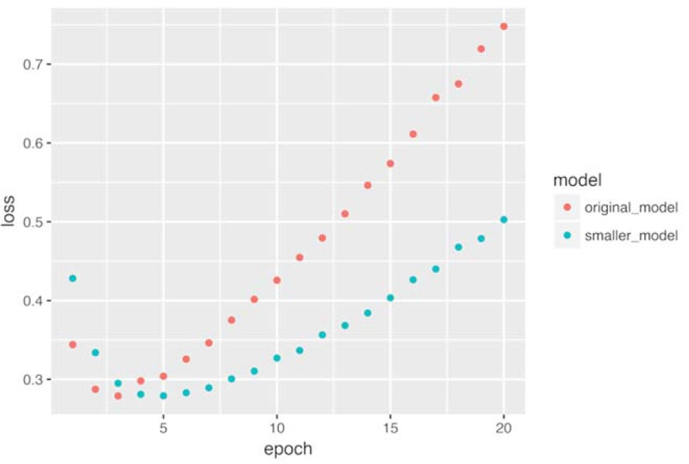
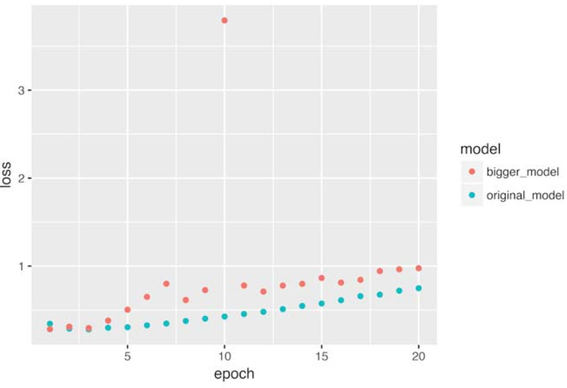
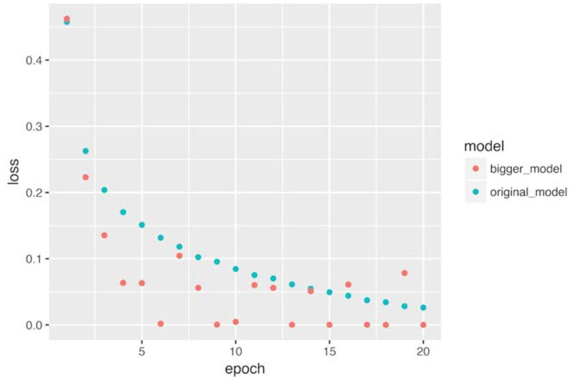
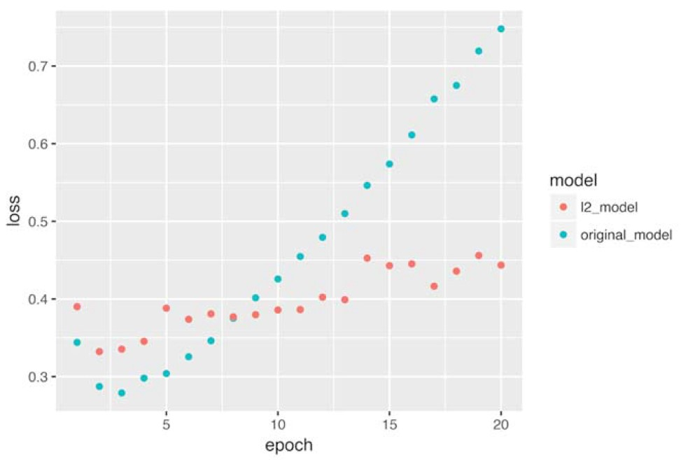
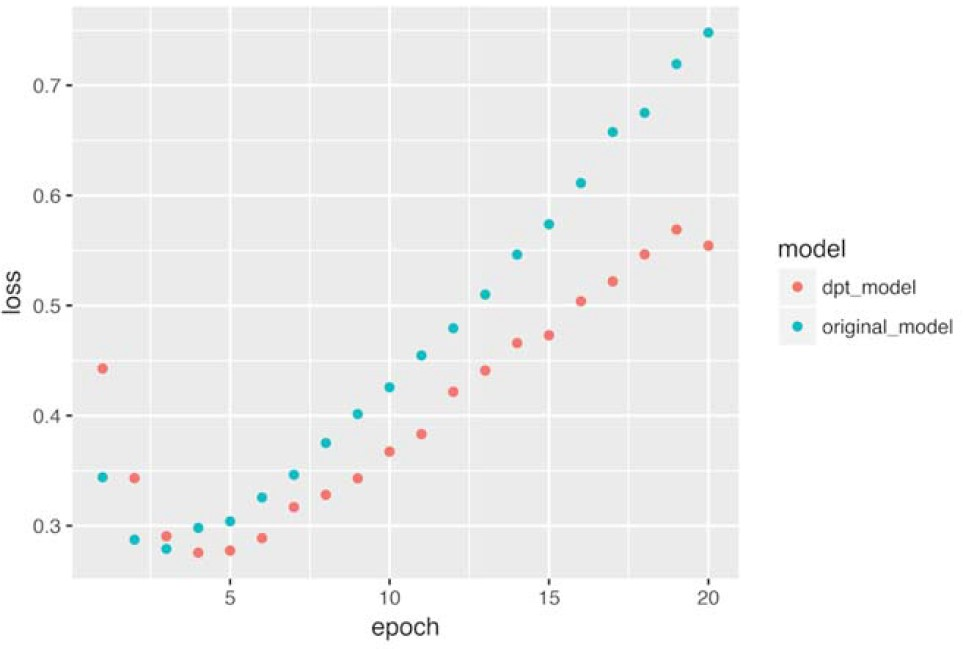
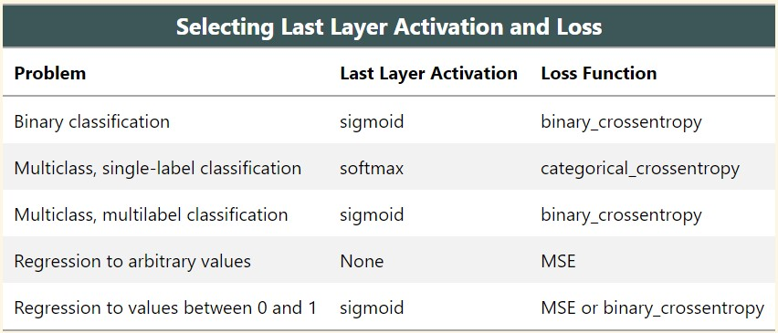

<style type="text/css">
p{ /* Normal  */
   font-size: 14px;
   line-height: 18px;}
body{ /* Normal  */
   font-size: 14px;}
td {  /* Table  */
   font-size: 12px;}
h1 { /* Header 1 */
 font-size: 26px;
 color: #4294ce;}
h2 { /* Header 2 */
 font-size: 22px;}
h3 { /* Header 3 */
 font-size: 18px;}
code.r{ /* Code block */
  font-size: 12px;}
pre { /* Code block */
  font-size: 12px}
#table-of-contents h2 {
background-color: #4294ce;}
#table-of-contents{
background: #688FAD;}
#nav-top span.glyphicon{
color: #4294ce;}
#postamble{
background: #4294ce;
border-top: ;}
</style>

```{r echo=FALSE}
rm(list = ls())
```

```{r setup, include=FALSE}
knitr::opts_knit$set(root.dir = 'C:/Users/czwea/Documents/GitHub/DeepLearning/DeepLearningWithR/FinalDocs')
knitr::opts_chunk$set(eval=FALSE)
```
```{r echo=FALSE, warning=FALSE, message=FALSE, eval=FALSE}
#remotes::install_github("rstudio/gt")

if(!require(easypackages)){install.packages("easypackages")}
library(easypackages)
packages("tidyverse", "keras", "gt", "here", "stringr", prompt = TRUE)
setwd("~/GitHub/DeepLearning/DeepLearningWithR/FinalDocs/")
```

# Review and Links

## Web Links

[Keras RStudio](https://keras.rstudio.com/)
[Book Code](https://github.com/jjallaire/deep-learning-with-r-notebooks)
[Live Book](https://www.manning.com/books/deep-learning-with-r)

Anatomy of a neural network:

Training a neural network revolves around the following objects:

1. Layers, which are combined into a network (or model) 
2. The input data and corresponding targets
3. The loss function, which defines the feedback signal used for learning 
4. The optimizer which determines how learning proceeds 

## Previous Lessons

* You usually need to do quite a bit of preprocessing on your raw data in order to be able to feed it -- as tensors -- into a neural network. Sequences of words can be encoded as binary vectors, but there are other encoding options, too.
* Stacks of dense layers with `relu` activations can solve a wide range of problems (including sentiment classification), and you'll likely use them frequently.
* In a binary classification problem (two output classes), your network should end with a dense layer with one unit and a `sigmoid` activation. That is, the output of your network should be a scalar between 0 and 1, encoding a probability.
* With such a scalar sigmoid output on a binary classification problem, the loss function you should use is `binary_crossentropy`.
* The `rmsprop` optimizer is generally a good enough choice, whatever your problem. That's one less thing for you to worry about.
* As they get better on their training data, neural networks eventually start _overfitting_ and end up obtaining increasingly worse results on data they've never seen before. Be sure to always monitor performance on data that is outside of the training set.


* If you are trying to classify data points between N classes, your network should end with a dense layer of size N.
* In a single-label, multi-class classification problem, your network should end with a `softmax` activation, so that it will output a probability distribution over the N output classes.
* _Categorical crossentropy_ is almost always the loss function you should use for such problems. It minimizes the distance between the probability distributions output by the network, and the true distribution of the targets.
* There are two ways to handle labels in multi-class classification:
    * Encoding the labels via "categorical encoding" (also known as "one-hot encoding") and using `categorical_crossentropy` as your loss function.
    * Encoding the labels as integers and using the `sparse_categorical_crossentropy` loss function.
* If you need to classify data into a large number of categories, then you should avoid creating information bottlenecks in your network by having intermediate layers that are too small.

* Regression is done using different loss functions from classification; `Mean Squared Error (MSE)` is a commonly used loss function for regression.
* Evaluation metrics to be used for regression differ from those used for classification; naturally the concept of "accuracy" does not apply for regression. A common regression metric is `Mean Absolute Error (MAE)`.
* When features in the input data have values in different ranges, each feature should be scaled independently as a preprocessing step.
* When there is little data available, using K-Fold validation is a great way to reliably evaluate a model.
* When little training data is available, it is preferable to use a small network with very few hidden layers (typically only one or two) in order to avoid severe overfitting.

# K-Fold Validation

Split your data into K partitions of equal size. For each partition `i`, train a model on the remaining `K – 1` partitions, and evaluate it on partition `i`. Your final score is then the averages of the K scores obtained. This method is helpful when the performance of your model shows significant variance based on your train-test split. Like hold-out validation, this method does not  exempt you from using a distinct validation set for model calibration.

```{r}
k <- 4
indices <- sample(1:nrow(data))
folds <- cut(indices, breaks = k, labels = FALSE)

validation_scores <- c()

for (i in 1:k) {
     validation_indices <- which(folds == i, arr.ind = TRUE)
     validation_data <- data[validation_indices,]             # Selects the validation data partition
     training_data <- data[-validation_indices,]              # Uses the remainder of the data as training data
     
     model <- get_model()                                     # Creates a brand-new instance of the model (untrained)      
     model %>% train(training_data)
     results <- model %>% evaluate(validation_data)
     validation_scores <- c(validation_scores, results$accuracy)
}

validation_score <- mean(validation_scores)                   # Validation score: average of the validation scores of the K-folds

# Trains the final model on all non-test data available
model <- get_model()
model %>% train(data)
results <- model %>% evaluate(test_data)
```

## Iterated K-Fold with Shuffling

This one is for situations in which you have relatively little data available and you need to evaluate your model as precisely as possible. It has been extremely helpful in Kaggle competitions. It consists of applying K-fold validation multiple times, shuffling the data every time before splitting it K ways. The final score is the average of the scores obtained at each run of K-fold validation. Note that you end up training and
evaluating P × K models (where P is the number of iterations you use), which can very expensive.

# Over/Under Fitting

```{r echo=FALSE}
rm(list = ls())
```

Above, the performance of the models on the held-out validation data would always peak after a few epochs and would then start degrading, i.e. our model would quickly start to _overfit_ to the training data. Overfitting happens in every single machine learning problem. Learning how to deal with overfitting is essential to mastering machine learning.

The fundamental issue in machine learning is the tension between optimization and generalization. _Optimization_ refers to the process of adjusting a model to get the best performance possible on the training data (the _learning_ in _machine learning_), while "generalization" refers to how well the trained model would perform on data it has never seen before. The goal of the game is to get good generalization, of course, but you do not control generalization; you can only adjust the model based on its training data.

At the beginning of training, optimization and generalization are correlated: the lower your loss on training data, the lower your loss on test data. While this is happening, your model is said to be _under-fit_: there is still progress to be made; the network hasn't yet modeled all relevant patterns in the training data. But after a certain number of iterations on the training data, generalization stops improving, validation metrics stall then start degrading: the model is then starting to over-fit, i.e. is it starting to learn patterns that are specific to the training data but that are misleading or irrelevant when it comes to new data.

To prevent a model from learning misleading or irrelevant patterns found in the training data, _the best solution is of course to get more training data_. A model trained on more data will naturally generalize better. When that is no longer possible, the next best solution is to modulate the quantity of information that your model is allowed to store, or to add constraints on what information it is allowed to store. If a network can only afford to memorize a small number of patterns, the optimization process will force it to focus on the most prominent patterns, which have a better chance of generalizing well.

The processing of fighting overfitting in this way is called _regularization_. Review some of the most common regularization techniques and  apply them to improve our movie classification model.

## Reducing Network Size

The simplest way to prevent overfitting is to reduce the size of the model: the number of learnable parameters in the model (which is determined by the number of layers and the number of units per layer). In deep learning, the number of learnable parameters in a model is often referred to as the model’s capacity. Intuitively, a model with more parameters has more memorization capacity and therefore can easily learn a perfect dictionary-like mapping between training samples and their targets—a mapping without any generalization power. For instance, a model with 500,000 binary parameters
could easily be made to learn the class of every digit in the MNIST training set: we’d need only 10 binary parameters for each of the 50,000 digits. But such a model would be useless for classifying new digit samples. Always keep this in mind: deeplearning models tend to be good at fitting to the training data, but the real challenge is generalization, not fitting.

On the other hand, if the network has limited memorization resources, it will not be able to learn this mapping as easily; thus, in order to minimize its loss, it will have to resort to learning compressed representations that have predictive power regarding the targets—precisely the type of representations we’re interested in. At the same time, keep in mind that you should use models that have enough parameters that they don’t underfit: your model shouldn’t be starved for memorization resources. There is a compromise to be found between _too much capacity_ and _not enough capacity_.

Unfortunately, there is no magical formula to determine the right number of layers or the right size for each layer. You must evaluate an array of different architectures (on your validation set, not on your test set) in order to find the correct model size for your data. The general workflow to find an appropriate model size is to start with relatively few layers and parameters, and increase the size of the layers or add new layers until you see diminishing returns with regard to validation loss.

```{r neededToRerun, echo=FALSE}
imdb <- dataset_imdb(num_words = 10000)
c(c(train_data, train_labels), c(test_data, test_labels)) %<-% imdb

vectorize_sequences <- function(sequences, dimension = 10000) {
  # Create an all-zero matrix of shape (len(sequences), dimension)
  results <- matrix(0, nrow = length(sequences), ncol = dimension)
  for (i in 1:length(sequences))
    # Sets specific indices of results[i] to 1s
    results[i, sequences[[i]]] <- 1
  results}

# Our vectorized training data
x_train <- vectorize_sequences(train_data)
# Our vectorized test data
x_test <- vectorize_sequences(test_data)

# Our vectorized labels
y_train <- as.numeric(train_labels)
y_test <- as.numeric(test_labels)
```

Try this on the movie review classification network. The original network was:

```{r originalModel}
original_model <- keras_model_sequential() %>% 
  layer_dense(units = 16, activation = "relu", input_shape = c(10000)) %>% 
  layer_dense(units = 16, activation = "relu") %>% 
  layer_dense(units = 1, activation = "sigmoid")

original_model %>% compile(optimizer = "rmsprop", loss = "binary_crossentropy", metrics = c("accuracy"))
```

Try to replace it with this smaller network:

```{r smallerModel}
smaller_model <- keras_model_sequential() %>% 
  layer_dense(units = 4, activation = "relu", input_shape = c(10000)) %>% 
  layer_dense(units = 4, activation = "relu") %>% 
  layer_dense(units = 1, activation = "sigmoid")

smaller_model %>% compile(optimizer = "rmsprop", loss = "binary_crossentropy", metrics = c("accuracy"))
```

Train both the original and smaller network:

```{r, results='hide'}
original_hist <- original_model %>% fit(x_train, y_train, epochs = 20, batch_size = 512, validation_data = list(x_test, y_test))
```
```{}
2019-03-15 14:29:32.926451: I T:\src\github\tensorflow\tensorflow\core\platform\cpu_feature_guard.cc:141] Your CPU supports instructions that this TensorFlow binary was not compiled to use: AVX2
Train on 25000 samples, validate on 25000 samples
Epoch 1/20
25000/25000 [==============================] - 7s 263us/step - loss: 0.4475 - acc: 0.8255 - val_loss: 0.3314 - val_acc: 0.8829
Epoch 2/20
25000/25000 [==============================] - 4s 164us/step - loss: 0.2600 - acc: 0.9086 - val_loss: 0.2841 - val_acc: 0.8898
Epoch 3/20
25000/25000 [==============================] - 4s 140us/step - loss: 0.2008 - acc: 0.9293 - val_loss: 0.2813 - val_acc: 0.8881
Epoch 4/20
25000/25000 [==============================] - 3s 132us/step - loss: 0.1688 - acc: 0.9404 - val_loss: 0.2919 - val_acc: 0.8839
Epoch 5/20
25000/25000 [==============================] - 3s 134us/step - loss: 0.1455 - acc: 0.9498 - val_loss: 0.3089 - val_acc: 0.8808
Epoch 6/20
25000/25000 [==============================] - 3s 133us/step - loss: 0.1291 - acc: 0.9545 - val_loss: 0.3427 - val_acc: 0.8738
Epoch 7/20
25000/25000 [==============================] - 3s 135us/step - loss: 0.1163 - acc: 0.9590 - val_loss: 0.3577 - val_acc: 0.8740
.
.
.
```
```{r, results='hide'}
smaller_model_hist <- smaller_model %>% fit(x_train, y_train, epochs = 20, batch_size = 512, validation_data = list(x_test, y_test))
```

```{}
Train on 25000 samples, validate on 25000 samples
Epoch 1/20
25000/25000 [==============================] - 11s 420us/step - loss: 0.5810 - acc: 0.6989 - val_loss: 0.5308 - val_acc: 0.7626
Epoch 2/20
25000/25000 [==============================] - 5s 215us/step - loss: 0.4846 - acc: 0.8462 - val_loss: 0.4867 - val_acc: 0.8334
Epoch 3/20
25000/25000 [==============================] - 4s 170us/step - loss: 0.4392 - acc: 0.8916 - val_loss: 0.4645 - val_acc: 0.8586
Epoch 4/20
25000/25000 [==============================] - 4s 145us/step - loss: 0.4082 - acc: 0.9155 - val_loss: 0.4501 - val_acc: 0.8718
Epoch 5/20
25000/25000 [==============================] - 4s 167us/step - loss: 0.3834 - acc: 0.9302 - val_loss: 0.4482 - val_acc: 0.8664
Epoch 6/20
25000/25000 [==============================] - 5s 195us/step - loss: 0.3621 - acc: 0.9402 - val_loss: 0.4430 - val_acc: 0.8708
Epoch 7/20
25000/25000 [==============================] - 4s 153us/step - loss: 0.3428 - acc: 0.9500 - val_loss: 0.4611 - val_acc: 0.8608
Epoch 8/20
25000/25000 [==============================] - 4s 178us/step - loss: 0.3265 - acc: 0.9564 - val_loss: 0.4476 - val_acc: 0.8687
.
.
.
```
To compare the losses, write an R function that takes a named list of loss series and plots it:

```{r}
plot_training_losses <- function(losses) {
  loss_names <- names(losses)
  losses <- as.data.frame(losses)
  losses$epoch <- seq_len(nrow(losses))
  losses %>% gather(model, loss, loss_names[[1]], loss_names[[2]]) %>% 
    ggplot(aes(x = epoch, y = loss, colour = model)) + geom_point()}
```

Compare the validation losses of the original network and the smaller network:

```{r}
plot_training_losses(losses = list(original_model = original_hist$metrics$val_loss,
                                   smaller_model = smaller_model_hist$metrics$val_loss))
```

```{r, out.width = "400px", echo=FALSE}

```

The smaller network starts overfitting later than the reference one and its performance degrades much more slowly once it starts overfitting.

Add to this benchmark a network that has much more capacity, far more than the problem would warrant:

```{r}
bigger_model <- keras_model_sequential() %>% 
  layer_dense(units = 512, activation = "relu", input_shape = c(10000)) %>% 
  layer_dense(units = 512, activation = "relu") %>% 
  layer_dense(units = 1, activation = "sigmoid")

bigger_model %>% compile(optimizer = "rmsprop", loss = "binary_crossentropy", metrics = c('acc'))
```

```{r, echo=FALSE, results='hide'}
bigger_model_hist <- bigger_model %>% fit(x_train, y_train, epochs = 20, batch_size = 512, validation_data = list(x_test, y_test))
```

```{}
Train on 25000 samples, validate on 25000 samples
Epoch 1/20
25000/25000 [==============================] - 22s 879us/step - loss: 0.4616 - acc: 0.7962 - val_loss: 0.3041 - val_acc: 0.8817
Epoch 2/20
25000/25000 [==============================] - 19s 743us/step - loss: 0.2201 - acc: 0.9140 - val_loss: 0.2734 - val_acc: 0.8896
Epoch 3/20
25000/25000 [==============================] - 18s 711us/step - loss: 0.1274 - acc: 0.9540 - val_loss: 0.6157 - val_acc: 0.8089
Epoch 4/20
25000/25000 [==============================] - 18s 734us/step - loss: 0.0751 - acc: 0.9773 - val_loss: 0.4263 - val_acc: 0.8835
Epoch 5/20
25000/25000 [==============================] - 18s 713us/step - loss: 0.0534 - acc: 0.9876 - val_loss: 0.4512 - val_acc: 0.8812
Epoch 6/20
25000/25000 [==============================] - 18s 723us/step - loss: 0.0577 - acc: 0.9892 - val_loss: 0.5080 - val_acc: 0.8621
Epoch 7/20
25000/25000 [==============================] - 18s 737us/step - loss: 0.0019 - acc: 0.9999 - val_loss: 0.6550 - val_acc: 0.8826
Epoch 8/20
25000/25000 [==============================] - 18s 722us/step - loss: 2.1113e-04 - acc: 1.0000 - val_loss: 0.7814 - val_acc: 0.8809
.
.
.
```

Here is how the bigger network fares compared to the reference one:

```{r}
plot_training_losses(losses = list(original_model = original_hist$metrics$val_loss,
                                   bigger_model = bigger_model_hist$metrics$val_loss))
```

```{r, out.width = "400px", echo=FALSE}

```

The bigger network starts overfitting almost right away, after just one epoch, and overfits much more severely. Its validation loss is also more noisy.

Meanwhile, here are the training losses for our two networks:

```{r}
plot_training_losses(losses = list(original_model = original_hist$metrics$loss,bigger_model = bigger_model_hist$metrics$loss))
```

```{r, out.width = "400px", echo=FALSE}

```

As you can see, the bigger network gets its training loss near zero very quickly. The more capacity the network has, the quicker it will be able to model the training data (resulting in a low training loss), but the more susceptible it is to overfitting (resulting in a large difference between the training and validation loss).

## Weight Regularization

You may be familiar with _Occam's Razor_ principle: given two explanations for something, the explanation most likely to be correct is the "simplest" one, the one that makes the least amount of assumptions. This also applies to the models learned by neural networks: given some training data and a network architecture, there are multiple sets of weights values (multiple _models_) that could explain the data, and simpler models are less likely to overfit than complex ones.

A "simple model" in this context is a model where the distribution of parameter values has less entropy (or a model with fewer parameters altogether, as we saw in the section above). Thus a common way to mitigate overfitting is to put constraints on the complexity of a network by forcing its weights to only take small values, which makes the distribution of weight values more "regular". This is called *weight regularization* and it is done by adding to the loss function of the network a _cost_ associated with having large weights. This cost comes in two flavors:

- L1 regularization, where the cost added is proportional to the _absolute value of the weights coefficients_ (i.e. to what is called the "L1 norm" of the weights).
- L2 regularization, where the cost added is proportional to the _square of the value of the weights coefficients_ (i.e. to what is called the "L2 norm" of the weights). L2 regularization is also called _weight decay_ in the context of neural networks. Don't let the different name confuse you: weight decay is mathematically the exact same as L2 regularization.

In Keras, weight regularization is added by passing _weight regularizer instances_ to layers as keyword arguments. Let's add L2 weight regularization to our movie review classification network:

```{r}
l2_model <- keras_model_sequential() %>% 
  layer_dense(units = 16, kernel_regularizer = regularizer_l2(0.001), activation = "relu", input_shape = c(10000)) %>% 
  layer_dense(units = 16, kernel_regularizer = regularizer_l2(0.001), activation = "relu") %>% 
  layer_dense(units = 1, activation = "sigmoid")

l2_model %>% compile(optimizer = "rmsprop", loss = "binary_crossentropy", metrics = c("acc"))
```

`regularizer_l2(0.001)` means every coefficient in the weight matrix of the layer will add `0.001 * weight_coefficient_value` to the total loss of the network. Note that because this penalty is _only added at training time_, the loss for this network will be much higher at training than at test time. 
Here's the impact of our L2 regularization penalty:

```{r, echo=FALSE, results='hide'}
l2_model_hist <- l2_model %>% fit(x_train, y_train, epochs = 20, batch_size = 512, validation_data = list(x_test, y_test))
```

```{}
Train on 25000 samples, validate on 25000 samples
Epoch 1/20
25000/25000 [==============================] - 8s 300us/step - loss: 0.4878 - acc: 0.8163 - val_loss: 0.4035 - val_acc: 0.8548
Epoch 2/20
25000/25000 [==============================] - 5s 200us/step - loss: 0.3112 - acc: 0.9053 - val_loss: 0.3326 - val_acc: 0.8891
Epoch 3/20
25000/25000 [==============================] - 4s 143us/step - loss: 0.2665 - acc: 0.9206 - val_loss: 0.3367 - val_acc: 0.8851
Epoch 4/20
25000/25000 [==============================] - 4s 143us/step - loss: 0.2484 - acc: 0.9274 - val_loss: 0.3462 - val_acc: 0.8820
Epoch 5/20
25000/25000 [==============================] - 3s 139us/step - loss: 0.2355 - acc: 0.9345 - val_loss: 0.3880 - val_acc: 0.8676
Epoch 6/20
25000/25000 [==============================] - 3s 140us/step - loss: 0.2280 - acc: 0.9374 - val_loss: 0.3733 - val_acc: 0.8741
Epoch 7/20
25000/25000 [==============================] - 4s 144us/step - loss: 0.2218 - acc: 0.9400 - val_loss: 0.3795 - val_acc: 0.8731
.
.
.
```

```{r}
plot_training_losses(losses = list(original_model = original_hist$metrics$val_loss,
                                   l2_model = l2_model_hist$metrics$val_loss))
```

```{r, out.width = "400px", echo=FALSE}

```

As you can see, the model with L2 regularization has become much more resistant to overfitting than the reference model, even though both models have the same number of parameters.

As alternatives to L2 regularization, you could use one of the following Keras weight regularizers:

```{r, echo=TRUE, eval=FALSE}
# L1 regularization
regularizer_l1(0.001)

# L1 and L2 regularization at the same time
regularizer_l1_l2(l1 = 0.001, l2 = 0.001)
```

## Adding Dropout

```{r, eval=FALSE}
# At training time: we drop out 50% of the units in the output
layer_output <- layer_output * sample(0:1, length(layer_output), replace = TRUE)  
```

At test time, we would be scaling the output down by the dropout rate. Here we scale by 0.5 (because we were previous dropping half the units):

```{r, eval=FALSE}
# At test time:
layer_output <- layer_output * 0.5 
```

Note that this process can be implemented by doing both operations at training time and leaving the output unchanged at test time which is often the way it is implemented in practice:

```{r, eval=FALSE}
# At training time:
layer_output <- layer_output * sample(0:1, length(layer_output), replace = TRUE) 

# Note that we are scaling *up* rather scaling *down* in this case
layer_output <- layer_output / 0.5
```

This technique may seem strange and arbitrary. Why would this help reduce overfitting? Geoff Hinton has said that he was inspired, among other things, by a fraud prevention mechanism used by banks -- in his own words: _"I went to my bank. The tellers kept changing and I asked one of them why. He said he did not know but they got moved around a lot. I figured it must be because it would require cooperation between employees to successfully defraud the bank. This made me realize that randomly removing a different subset of neurons on each example would prevent conspiracies and thus reduce overfitting"_.

The core idea is that introducing noise in the output values of a layer can break up happenstance patterns that are not significant (what Hinton refers to as "conspiracies"), which the network would start memorizing if no noise was present. 

In Keras, you can introduce dropout in a network via `layer_dropout()`, which is applied to the output of layer right before it:

```{r, echo=TRUE, eval=FALSE}
layer_dropout(rate = 0.5)
```

Add two dropout layers in the IMDB network to see how well they do at reducing overfitting:

```{r}
dpt_model <- keras_model_sequential() %>% 
     layer_dense(units = 16, activation = "relu", input_shape = c(10000)) %>% 
     layer_dropout(rate = 0.5) %>% 
     layer_dense(units = 16, activation = "relu") %>% 
     layer_dropout(rate = 0.5) %>% 
     layer_dense(units = 1, activation = "sigmoid")

dpt_model %>% compile(optimizer = "rmsprop", loss = "binary_crossentropy", metrics = c("acc"))
```

```{r, echo=TRUE, results='hide'}
dpt_model_hist <- dpt_model %>% fit(x_train, y_train, epochs = 20, batch_size = 512, validation_data = list(x_test, y_test))
```


```{}
Train on 25000 samples, validate on 25000 samples
Epoch 1/20
25000/25000 [==============================] - 8s 326us/step - loss: 0.5981 - acc: 0.6724 - val_loss: 0.4392 - val_acc: 0.8605
Epoch 2/20
25000/25000 [==============================] - 4s 167us/step - loss: 0.4432 - acc: 0.8145 - val_loss: 0.3441 - val_acc: 0.8744
Epoch 3/20
25000/25000 [==============================] - 4s 144us/step - loss: 0.3513 - acc: 0.8686 - val_loss: 0.2919 - val_acc: 0.8859
Epoch 4/20
25000/25000 [==============================] - 4s 141us/step - loss: 0.2936 - acc: 0.8940 - val_loss: 0.2755 - val_acc: 0.8893
Epoch 5/20
25000/25000 [==============================] - 3s 137us/step - loss: 0.2582 - acc: 0.9108 - val_loss: 0.2779 - val_acc: 0.8894
Epoch 6/20
25000/25000 [==============================] - 3s 133us/step - loss: 0.2290 - acc: 0.9234 - val_loss: 0.2871 - val_acc: 0.8881
.
.
.
```

Plot the results:

```{r}
plot_training_losses(losses = list(original_model = original_hist$metrics$val_loss,
                                   dpt_model = dpt_model_hist$metrics$val_loss))
```

```{r, out.width = "400px", echo=FALSE}

```

Improvement over the reference network.

* Getting more training data.
* Reducing the capacity of the network.
* Adding weight regularization.
* Adding dropout.

# Universal ML Workflow

## Problem Definition

1. Defining the problem and assembling a dataset 
2. Choosing a measure of success
3. Deciding on an evaluation protocol
4. Preparing your data
5. Developing a model that does better than a baseline
6. Scaling up: developing a model that overfits
7. Regularizing your model and tuning your hyperparameters

## Data Availability

What type of problem?  Binary Classification? Multiclass Classification? Scaler Regression? Vector Regression? Multilabel Classification?

> Vector Regression A task where the target is a set of continuous values: for example, a continuous vector. If you are doing regression against multiple values (such as the coordinates of a bounding box in an image), then you are doing vector regression

Something else, like clustering, generation, or reinforcement learning? Identifying the problem type will guide your choice of model architecture, loss function, etc.

You cannot move to the next stage until you know what your inputs and outputs are, and what data you will use. Be aware of the hypotheses you make at this stage:

- You hypothesize that your outputs can be predicted given your inputs.
- You hypothesize that your available data is sufficiently informative to learn the relationship between inputs and outputs.

Until you have a working model, these are merely hypotheses, waiting to be validated or invalidated. Not all problems can be solved; just because you assembled examples of inputs X and targets Y does not mean X contains enough information to predict Y. For instance, if you are trying to predict the movements of a stock on the stock market given its recent price history, you are unlikely to succeed, because price history does not contain much predictive information.

One class of unsolvable problems you should be aware of is nonstationary problems. Suppose you are trying to build a recommendation engine for clothing, you are training it on one month of data (August), and you want to start generating recommendations in the winter. One big issue is that the kinds of clothes people buy change from season to season: clothes buying is a nonstationary phenomenon over the scale of a few months. What you are trying to model changes over time. In this case, the right move is to constantly retrain your model on data from the recent past, or gather data at a timescale where the problem is stationary. For a cyclical problem like clothes buying, a few years worth of data will suffice to capture seasonal variations but remember to make the time of the year an input of your model!

Keep in mind that machine learning can only be used to memorize patterns that are present in your training data. You can only recognize what you have seen before. Using machine learning trained on past data to predict the future is making the assumption that the future will behave like the past. That often is not the case. 

## Measure of Success

To control something, you need to be able to observe it. To achieve success, you must define what you mean by success accuracy? Precision and recall? Customer-retention rate? Your metric for success will guide the choice of a loss function: what your model will optimize. It should directly align with your higher-level goals, such as the success of your business.

For _balanced-classification problems_, where every class is equally likely, _accuracy_ and _area under the receiver operating characteristic curve (ROC AUC)_ are common metrics. For _class-imbalanced problems_, you can use _precision_ and _recall_. For _ranking_ problems or _multilabel classification,_ you can use _mean average precision_. 

## Evaluation Protocol

Once you know what you are aiming for, you must establish how you will measure your current progress. We have previously reviewed three common evaluation protocols:

- Maintaining a hold-out validation sets. The way to go when you have plenty of data
- Doing K-fold cross-validation. The right choice when you have too few samples for hold-out validation to be reliable
- Doing iterated K-fold validation. For performing highly accurate model evaluation when little data is available

Just pick one of these. In most cases, the first will work well enough. 

## Preparing Data

Once you know what you are training on, what you are optimizing for, and how to evaluate your approach, you are almost ready to begin training models. But first, you should format your data in a way that can be fed into a machine-learning models here, assume a deep neural network:

- Data should be formatted as tensors.
- The values taken by these tensors should usually be scaled to small values: for example, in the [-1, 1] range or [0, 1] range.
- If different features take values in different ranges (heterogeneous data), then the data should be normalized.
- You may want to do some feature engineering, especially for small-data problems.

Once your tensors of input data and target data are ready, you can begin to train models. 

## Better than Baseline

Your goal at this stage is to achieve *statistical power*: that is, to develop a small model that is capable of beating a dumb baseline. In the MNIST digit-classification example, anything that achieves an accuracy greater than 0.1 can be said to have statistical power; in the IMDB example, it is anything with an accuracy greater than 0.5.

 Note that it is not always possible to achieve statistical power. If you cannot beat a random baseline after trying multiple reasonable architectures, it may be that the answer to the question you are asking is not  present in the input data. Remember that you make two hypotheses:

1. You hypothesize that your outputs can be predicted given your inputs.
2. You hypothesize that the available data is sufficiently informative to learn the relationships between inputs and outputs.

It may well be that these hypotheses are false, in which case you must go back to the drawing board.

Assuming things go well, you need to make three key choices to build your first working model:

1. _Last-layer activation_ - This establishes useful constraints on the networks output. For instance, the IMDB classification example used `sigmoid` in the last layer; the regression example did not use any last-layer activation.
2. _Loss function_ - This should match the type of problem you are trying to solve. For instance, the IMDB example used `binary_crossentropy`, the regression example used `mse`, and so on.
3. _Optimization configuration_ - What optimizer will you use? What will its learning rate be? In most cases, it is safe to go with `rmsprop` and its default learning rate.

Regarding the choice of a loss function, note that it is not always possible to directly optimize for the metric that measures success on a problem. Sometimes there is no easy way to turn a metric into a loss function; loss functions, after all, need to be computable given only a mini-batch of data (ideally, a loss function should be computable for as little as a single data point) and must be differentiable (otherwise, you cannot use backpropagation to train your network). For instance, the widely used classification metric `ROC AUC` cannot be directly optimized. Hence, in classification tasks, it is common to optimize for a proxy metric of `ROC AUC`, such as `crossentropy.` In general, you can hope that the lower the `crossentropy` gets, the higher the `ROC AUC` will be.

The table below can help you choose a last-layer activation and a loss function for a few common problem types.

```{r}
#Note below when creating tibble must use  = not <-
gt_tbl <- dplyr::tibble(
     problem = c("Binary classification", "Multiclass, single-label classification",
                  "Multiclass, multilabel classification", "Regression to arbitrary values",
                  "Regression to values between 0 and 1"),
     last = c("sigmoid", "softmax", "sigmoid", "None", "sigmoid"),
     loss = c("binary_crossentropy", "categorical_crossentropy", "binary_crossentropy",
               "MSE", "MSE or binary_crossentropy")) %>% 
     gt() %>% cols_label(
          problem = md("**Problem**"), 
          last = md("**Last Layer Activation**"), 
          loss = md("**Loss Function**")) %>% 
     tab_header(md("**Selecting Last Layer Activation and Loss**")) %>% 
     tab_options(heading.background.color = "#3d5657")
gt_tbl
```

```{r, out.width = "400px", echo=FALSE}

```

# Scaling Up

Once you have obtained a model that has statistical power, the question becomes, i_s it sufficiently powerful_? Does it have enough layers and parameters to properly model the problem at hand? For instance, a network with a single hidden layer with two units would have statistical power on MNIST but would not be sufficient to solve the problem well. Remember that the universal tension in machine learning is between optimization and generalization; the ideal model is one that stands right at the border between underfitting and overfitting, between under-capacity and overcapacity. To figure out where this border lies, first you must cross it.

To figure out how big a model you will need, you must develop a model that overfits. This is fairly easy:

1. Add layers.
2. Make the layers bigger.
3. Train for more epochs.

Always monitor the training loss and validation loss, as well as the training and validation values for any metrics you care about. __When you see that the models performance on the validation data begins to degrade, you have achieved overfitting__.

The next stage is to start regularizing and tuning the model, to get as close as possible to the ideal model that neither under fits nor overfits. 

## Regularizing & Hyperparameters

This step will take the most time: you will repeatedly modify your model, train it, evaluate on your validation data, modify it again and repeat, until the model is as good as it can get.

These are some things you should try:

- Add dropout.
- Try different architectures: add or remove layers.
- Add L1 and/or L2 regularization.
- Try different hyperparameters (such as the number of units per layer or the learning rate of the optimizer) to find the optimal configuration.
- Optionally, iterate on feature engineering: add new features, or remove features that do not seem to be informative.

Be mindful of the following: _every time you use feedback from your validation process to tune your model, you leak information about the validation process into the model_. Repeated just a few times, this is innocuous; but done systematically over many iterations, it will eventually cause your model to overfit to the validation process (even though no model is directly trained on any of the validation data). This makes the evaluation process less reliable.

Once you have developed a satisfactory model configuration, you can train your final production model on all the available data (training and validation) and evaluate it one last time on the test set. If it turns out that the performance on the test set is significantly worse than the performance measured on the validation data, this may mean either that your validation procedure was not reliable after all, or that you began overfitting to the validation data while tuning the parameters of the model. In this case, _you may want to switch to a more reliable evaluation protocol (such as iterated K-fold validation)_. 

## Summary

- Define the problem at hand and the data on which you will train. Collect this data, or annotate it with labels if need be.
- Choose how you will measure success on your problem. Which metrics will you monitor on your validation data?
- Determine your evaluation protocol: Hold-out validation? K-fold validation? Which portion of the data should you use for validation?
- Develop a first model that does better than a basic baseline: a model with statistical power.
- Develop a model that overfits.
- Regularize your model and tune its hyperparameters, based on performance on the validation data. A lot of machine-learning research tends to focus only on this step but keep the big picture in mind.
