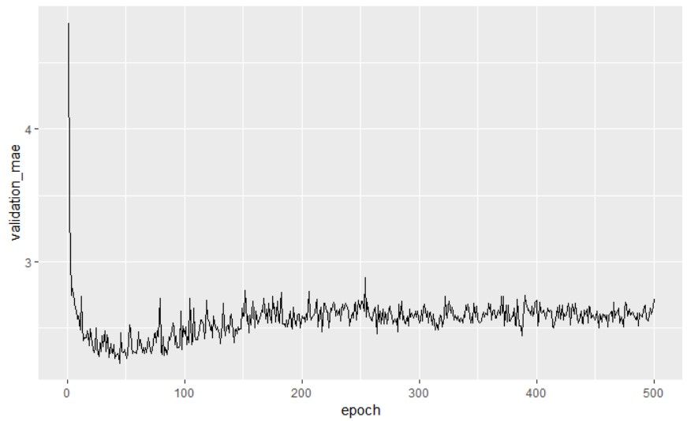
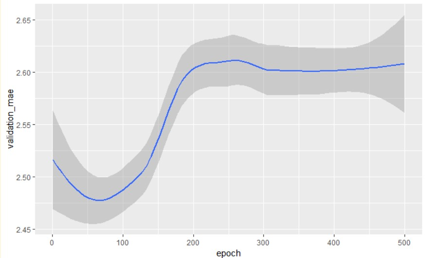

<style type="text/css">
p{ /* Normal  */
   font-size: 14px;
   line-height: 18px;}
body{ /* Normal  */
   font-size: 14px;}
td {  /* Table  */
   font-size: 12px;}
h1 { /* Header 1 */
 font-size: 26px;
 color: #4294ce;}
h2 { /* Header 2 */
 font-size: 22px;}
h3 { /* Header 3 */
 font-size: 18px;}
code.r{ /* Code block */
  font-size: 12px;}
pre { /* Code block */
  font-size: 12px}
#table-of-contents h2 {
background-color: #4294ce;}
#table-of-contents{
background: #688FAD;}
#nav-top span.glyphicon{
color: #4294ce;}
#postamble{
background: #4294ce;
border-top: ;}
</style>


```{r echo=FALSE}
rm(list = ls())
```

```{r setup, include=FALSE}
knitr::opts_knit$set(root.dir = 'C:/Users/czwea/Documents/GitHub/DeepLearning/DeepLearningWithR/FinalDocs')
```
```{r echo=FALSE, warning=FALSE, message=FALSE, eval=FALSE}
#remotes::install_github("rstudio/gt")

if(!require(easypackages)){install.packages("easypackages")}
library(easypackages)
packages("tidyverse", "keras", "gt", "here", "stringr", prompt = TRUE)
setwd("~/GitHub/DeepLearning/DeepLearningWithR/FinalDocs/")
```

# Review and Links

## Web Links

[Keras RStudio](https://keras.rstudio.com/)
[Book Code](https://github.com/jjallaire/deep-learning-with-r-notebooks)
[Live Book](https://www.manning.com/books/deep-learning-with-r)

Anatomy of a neural network:

Training a neural network revolves around the following objects:

1. Layers, which are combined into a network (or model) 
2. The input data and corresponding targets
3. The loss function, which defines the feedback signal used for learning 
4. The optimizer which determines how learning proceeds 

## Previous Lessons

* You usually need to do quite a bit of preprocessing on your raw data in order to be able to feed it -- as tensors -- into a neural network. Sequences of words can be encoded as binary vectors, but there are other encoding options, too.
* Stacks of dense layers with `relu` activations can solve a wide range of problems (including sentiment classification), and you'll likely use them frequently.
* In a binary classification problem (two output classes), your network should end with a dense layer with one unit and a `sigmoid` activation. That is, the output of your network should be a scalar between 0 and 1, encoding a probability.
* With such a scalar sigmoid output on a binary classification problem, the loss function you should use is `binary_crossentropy`.
* The `rmsprop` optimizer is generally a good enough choice, whatever your problem. That's one less thing for you to worry about.
* As they get better on their training data, neural networks eventually start _overfitting_ and end up obtaining increasingly worse results on data they've never seen before. Be sure to always monitor performance on data that is outside of the training set.


* If you are trying to classify data points between N classes, your network should end with a dense layer of size N.
* In a single-label, multi-class classification problem, your network should end with a `softmax` activation, so that it will output a probability distribution over the N output classes.
* _Categorical crossentropy_ is almost always the loss function you should use for such problems. It minimizes the distance between the probability distributions output by the network, and the true distribution of the targets.
* There are two ways to handle labels in multi-class classification:
    * Encoding the labels via "categorical encoding" (also known as "one-hot encoding") and using `categorical_crossentropy` as your loss function.
    * Encoding the labels as integers and using the `sparse_categorical_crossentropy` loss function.
* If you need to classify data into a large number of categories, then you should avoid creating information bottlenecks in your network by having intermediate layers that are too small.


# Part 1 Regression

A common type of machine learning problem is "regression", which consists of predicting a continuous value instead of a discrete label. For instance, predicting the temperature tomorrow, given meteorological data, or predicting the time that a software project will take to complete, given its specifications.

## Boston Housing Price Data

Predict the median price of homes in a given Boston suburb in the mid-1970s, given a few data points about the suburb at the time, such as the crime rate, the local property tax rate, etc.

The dataset we will be using has another interesting difference from our two previous examples: it has very few data points, only 506 in total, split between 404 training samples and 102 test samples, and each "feature" in the input data (e.g. the crime rate is a feature) has a different scale. For instance some values are proportions, which take a values between 0 and 1, others take values between 1 and 12, others between 0 and 100...

Let's take a look at the data:

```{r eval=FALSE}
dataset <- dataset_boston_housing()
c(c(train_data, train_targets), c(test_data, test_targets)) %<-% dataset
```

```{r eval=FALSE}
str(train_data)
```

num [1:404, 1:13] 1.2325 0.0218 4.8982 0.0396 3.6931 ...

```{r eval=FALSE}
str(test_data)
```

 num [1:102, 1:13] 18.0846 0.1233 0.055 1.2735 0.0715 ...

As you can see, we have 404 training samples and 102 test samples. The data comprises 13 features. The 13 features in the input data are as 
follow:

1. Per capita crime rate.
2. Proportion of residential land zoned for lots over 25,000 square feet.
3. Proportion of non-retail business acres per town.
4. Charles River dummy variable (= 1 if tract bounds river; 0 otherwise).
5. Nitric oxides concentration (parts per 10 million).
6. Average number of rooms per dwelling.
7. Proportion of owner-occupied units built prior to 1940.
8. Weighted distances to five Boston employment centers.
9. Index of accessibility to radial highways.
10. Full-value property-tax rate per $10,000.
11. Pupil-teacher ratio by town.
12. 1000 * (Bk - 0.63) ** 2 where Bk is the proportion of Black people by town.
13. % lower status of the population.

The targets are the median values of owner-occupied homes, in thousands of dollars:

```{r eval=FALSE}
str(train_targets)
```

 num [1:404(1d)] 15.2 42.3 50 21.1 17.7 18.5 11.3 15.6 15.6 14.4 ...

The prices are typically between \$10,000 and \$50,000. If that sounds cheap, remember this was the mid-1970s and these prices are not inflation-adjusted.

## Preparing the data

It would be problematic to feed into a neural network values that all take wildly different ranges. The network might be able to automatically adapt to such heterogeneous data, but it would definitely make learning more difficult. _A widespread best practice to deal with such data is to do feature-wise normalization_: for each feature in the input data, you subtract the mean of the feature and divide by the standard deviation, so that the feature is centered around 0 and has a unit standard deviation. This is easily done using  `scale()`.

```{r eval=FALSE}
mean <- apply(train_data, 2, mean)
std <- apply(train_data, 2, sd)
train_data <- scale(train_data, center = mean, scale = std)
test_data <- scale(test_data, center = mean, scale = std)
```

> I like the simplicity of the basic code above

> Note that the quantities used for normalizing the test data have been computed using the training data. **Never use any quantity computed on the test data, even for something as simple as data normalization**.

### Building the Network

Because so few samples are available, we will be using a very small network with two hidden layers, each with 64 units. In general, the less training data you have, the worse overfitting will be, and using a small network is one way to mitigate overfitting.

```{r eval=FALSE}
# Need to instantiate the same model multiple times, use a function to construct it.
build_model <- function() {
  model <- keras_model_sequential() %>% 
    layer_dense(units = 64, activation = "relu", input_shape = dim(train_data)[[2]]) %>% 
    layer_dense(units = 64, activation = "relu") %>% 
    layer_dense(units = 1) 
    
  model %>% compile(optimizer = "rmsprop", loss = "mse", metrics = c("mae"))}
```

> IMPORTANT BELOW

The network ends with a single unit and no activation (i.e. it will be linear layer). This is a typical setup for scalar regression. _Applying an activation function would constrain the range that the output can take_.  If a `sigmoid` activation function were applied, to the last layer, the network could only learn to predict values between 0 and 1. Here, because the last layer is purely linear, the network is free to learn to predict values in any range.

Compiling the network with the `mse` loss function -- Mean Squared Error, the square of the difference between the predictions and the targets, a widely used loss function for regression problems.

Are also monitoring a new metric during training: `mae`. This stands for Mean Absolute Error. It is simply the absolute value of the difference between the predictions and the targets. For instance, a MAE of 0.5 on this problem would mean that our predictions are off by \$500 on average.

## Validating our approach using K-fold validation

To evaluate the network while adjusting its parameters (such as the number of epochs used for training), simply splitting the data into a training set and a validation set is not appropriate. Because there are few data points, the validation set would end up being very small (e.g. about 100 examples). A consequence is that the validation scores may change a lot depending on _which_ data points are selected to use for validation and training, i.e. the validation scores may have a high _variance_ with regard to the validation split. This would prevent reliably evaluating our model.

The best practice in such situations is to use K-fold cross-validation. It consists of splitting the available data into K partitions (typically K=4 or 5), then instantiating K identical models, and training each one on K-1 partitions while evaluating on the remaining partition. The validation score for the model used would then be the average of the K validation scores obtained.

In terms of code, this is straightforward:

```{r, echo=TRUE, results='hide', eval=FALSE}
k <- 4
indices <- sample(1:nrow(train_data))
folds <- cut(1:length(indices), breaks = k, labels = FALSE) 

num_epochs <- 100
all_scores <- c()
for (i in 1:k) {
  cat("processing fold #", i, "\n")
  # Prepare the validation data: data from partition # k
  val_indices <- which(folds == i, arr.ind = TRUE) 
  val_data <- train_data[val_indices,]
  val_targets <- train_targets[val_indices]
  
  # Prepare the training data: data from all other partitions
  partial_train_data <- train_data[-val_indices,]
  partial_train_targets <- train_targets[-val_indices]
  
  # Build the Keras model (already compiled)
  model <- build_model()
  
  # Train the model (in silent mode, verbose=0)
  model %>% fit(partial_train_data, partial_train_targets,
                epochs = num_epochs, batch_size = 1, verbose = 0)
                
  # Evaluate the model on the validation data
  results <- model %>% evaluate(val_data, val_targets, verbose = 0)
  all_scores <- c(all_scores, results$mean_absolute_error)
}  
```

processing fold # 1 
processing fold # 2 
processing fold # 3 
processing fold # 4 

---
Recall `which` parameters`

**Usage**

which(x, arr.ind = FALSE, useNames = TRUE)

**Arguments**

- x:  a logical vector or array. NAs are allowed and omitted (treated as if FALSE).
- arr.ind	:  logical; should **arr**ay **ind**ices be returned when x is an array?
- ind: integer-valued index vector, as resulting from which(x).
- .dim:  dim(.) integer vector
- .dimnames:  optional list of character dimnames(.). If useNames is true, to be used for constructing dimnames for arrayInd() (and hence, which(*, arr.ind=TRUE)). If names(.dimnames) is not empty, these are used as column names. .dimnames[[1]] is used as row names.
- useNames:  logical indicating if the value of arrayInd() should have (non-null) dimnames at all.

**Value**

If `arr.ind == FALSE` (the default), an integer vector with length equal to sum(x), i.e., to the number of TRUEs in x; Basically, the result is `(1:length(x))[x]`.

If `arr.ind == TRUE` and x is an array (has a dim attribute), the result is `arrayInd(which(x)`, `dim(x)`, `dimnames(x))`, namely a matrix whose rows each are the indices of one element of x.

```{r eval=FALSE}
all_scores
```

[1] 2.067182 2.085127 2.904951 2.329833

```{r eval=FALSE}
mean(all_scores)
```

[1] 2.346773

As you can notice, the different runs do indeed show rather different validation scores, from 2.1 to 2.9. Their average (2.35) is a much more reliable metric than any single of these scores -- that's the entire point of K-fold cross-validation. In this case, we are off by \$`2347 on average, which is still significant considering that the prices range from \$10,000 to \$50,000. 

Try training the network for a bit longer: 500 epochs. To keep a record of how well the model did at each epoch, modify the training loop to save the per-epoch validation score log:

```{r eval=FALSE}
# Some memory clean-up - a Keras function to avoid clutter from old models / layers.
k_clear_session()
```

```{r, echo=TRUE, results='hide', eval=FALSE}
# These lines are repeated so the code block below is self-sufficient
k <- 4
indices <- sample(1:nrow(train_data))
folds <- cut(1:length(indices), breaks = k, labels = FALSE)

num_epochs <- 500
all_mae_histories <- NULL
for (i in 1:k) {
  cat("processing fold #", i, "\n")
  
  # Prepare the validation data: data from partition # k
  val_indices <- which(folds == i, arr.ind = TRUE)
  val_data <- train_data[val_indices,]
  val_targets <- train_targets[val_indices]
  
  # Prepare the training data: data from all other partitions
  partial_train_data <- train_data[-val_indices,]
  partial_train_targets <- train_targets[-val_indices]
  
  # Build the Keras model (already compiled)
  model <- build_model()
  
  # Train the model (in silent mode, verbose=0)
  history <- model %>% fit(
    partial_train_data, partial_train_targets,
    validation_data = list(val_data, val_targets),
    epochs = num_epochs, batch_size = 1, verbose = 0
  )
  mae_history <- history$metrics$val_mean_absolute_error
  all_mae_histories <- rbind(all_mae_histories, mae_history)
}
```

processing fold # 1 
processing fold # 2 
processing fold # 3 
processing fold # 4 

We can then compute the average of the per-epoch MAE scores for all folds:

```{r eval=FALSE}
average_mae_history <- data.frame(epoch = seq(1:ncol(all_mae_histories)),
  validation_mae = apply(all_mae_histories, 2, mean))
```

Let's plot this:

```{r eval=FALSE}
library(ggplot2)
ggplot(average_mae_history, aes(x = epoch, y = validation_mae)) + geom_line()
```

```{r, out.width = "400px", echo=FALSE}

```

It is hard to see the plot due to scaling issues and relatively high variance. Use `geom_smooth()` to try to get a clearer picture:

```{r warning=FALSE, eval=FALSE}
ggplot(average_mae_history, aes(x = epoch, y = validation_mae)) + geom_smooth()
```

```{r, out.width = "400px", echo=FALSE}

```

According to this plot, it appears the validation MAE stops improving significantly after 70 epochs. Past that point, overfitting is a problem.

Train a final "production" model on all of the training data, with the best parameters, then look at its performance on the test data:

```{r, echo=FALSE, results='hide', eval=FALSE}
# Get a fresh, compiled model.
model <- build_model()

# Train it on the entirety of the data.
model %>% fit(train_data, train_targets, epochs = 80, batch_size = 16, verbose = 0)

result <- model %>% evaluate(test_data, test_targets)
```

```{r eval=FALSE}
result
```

$loss
[1] 17.95066

$mean_absolute_error
[1] 2.673774

Still off by about \$2,680.

# Wrapping up

* Regression is done using different loss functions from classification; `Mean Squared Error (MSE)` is a commonly used loss function for regression.
* Evaluation metrics to be used for regression differ from those used for classification; naturally the concept of "accuracy" does not apply for regression. A common regression metric is `Mean Absolute Error (MAE)`.
* When features in the input data have values in different ranges, each feature should be scaled independently as a preprocessing step.
* When there is little data available, using K-Fold validation is a great way to reliably evaluate a model.
* When little training data is available, it is preferable to use a small network with very few hidden layers (typically only one or two) in order to avoid severe overfitting.
