<style type="text/css">
p{ /* Normal  */
   font-size: 14px;
   line-height: 18px;}
body{ /* Normal  */
   font-size: 14px;}
td {  /* Table  */
   font-size: 12px;}
h1 { /* Header 1 */
 font-size: 26px;
 color: #4294ce;}
h2 { /* Header 2 */
 font-size: 22px;}
h3 { /* Header 3 */
 font-size: 18px;}
code.r{ /* Code block */
  font-size: 12px;}
pre { /* Code block */
  font-size: 12px}
#table-of-contents h2 {
background-color: #4294ce;}
#table-of-contents{
background: #688FAD;}
#nav-top span.glyphicon{
color: #4294ce;}
#postamble{
background: #4294ce;
border-top: ;}
</style>

```{r setup, include=FALSE}
knitr::opts_knit$set(
     root.dir = 'C:/Users/czwea/Documents/GitHub/DeepLearning/DeepLearningWithR/FinalDocs/')
knitr::opts_chunk$set(eval=FALSE)
```
```{r echo=FALSE, warning=FALSE, message=FALSE}
#remotes::install_github("rstudio/gt")

if(!require(easypackages)){install.packages("easypackages")}
library(easypackages)
packages("tidyverse", "keras", "gt", "here", "stringr", prompt = TRUE)
setwd("~/GitHub/DeepLearning/DeepLearningWithR/FinalDocs/")
```

# Notes from *Deep Learning with R*

## Web Links

[Keras RStudio](https://keras.rstudio.com/)
[Book Code](https://github.com/jjallaire/deep-learning-with-r-notebooks)
[Live Book](https://www.manning.com/books/deep-learning-with-r)

> Install Anaconda with Python 6, update conda, then `install_keras`

- Anaconda2-4.3.1-Windows-x86_64
      - installed defaults including path and default Python
- conda update conda in Anaconda prompt (used admin rights by right clicking)
- `install_keras`

# Part 2:  Deep Learning in Practice

```{r echo=FALSE}
rm(list = ls())
```

## Convnets

Convnets is a type of deep-learning model almost universally used in computer vision applications.

Get started by examining a simple convnet.  The following lines of code show you what a basic convnet looks like. It is a stack of `layer_conv_2d` and `layer_max_pooling_2d` layers. 
```{r}
model <- keras_model_sequential() %>% 
     layer_conv_2d(filters = 32, kernel_size = c(3, 3), activation = "relu", 
                   input_shape = c(28, 28, 1)) %>%
     layer_max_pooling_2d(pool_size = c(2, 2)) %>% 
     layer_conv_2d(filters = 64, kernel_size = c(3, 3), activation = "relu") %>%
     layer_max_pooling_2d(pool_size = c(2, 2)) %>%
     layer_conv_2d(filters = 64, kernel_size = c(3, 3), activation = "relu")
```

Importantly, a convnet takes as input tensors of shape (image_height, image_width, image_channels) (not including the batch dimension). In this case,  configure the convnet to process inputs of size (28, 28, 1), which is the format of MNIST images. We will do this by passing the argument `input_shape = c(28, 28, 1)` to the first layer.

Display the architecture of the convnet so far:

```{r echo=FALSE}
model
```
```{}

Model
____________________________________________________________________________________________________________________________________
Layer (type)                                               Output Shape                                         Param #             
====================================================================================================================================
conv2d_4 (Conv2D)                                          (None, 26, 26, 32)                                   320                 
____________________________________________________________________________________________________________________________________
max_pooling2d_3 (MaxPooling2D)                             (None, 13, 13, 32)                                   0                   
____________________________________________________________________________________________________________________________________
conv2d_5 (Conv2D)                                          (None, 11, 11, 64)                                   18496               
____________________________________________________________________________________________________________________________________
max_pooling2d_4 (MaxPooling2D)                             (None, 5, 5, 64)                                     0                   
____________________________________________________________________________________________________________________________________
conv2d_6 (Conv2D)                                          (None, 3, 3, 64)                                     36928               
====================================================================================================================================
Total params: 55,744
Trainable params: 55,744
Non-trainable params: 0
____________________________________________________________________________________________________________________________________
```

The output of every `layer_conv_2d` and `layer_max_pooling_2d` is a 3D tensor of shape (height, width, channels). The width and height dimensions tend to shrink as you go deeper in the network. The number of channels is controlled by the first argument passed to `layer_conv_2d` (32 or 64).

The next step is to feed the last output tensor (of shape (3, 3, 64)) into a densely connected classifier network: a stack of dense layers. These classifiers process vectors, which are 1D, whereas the current output is a 3D tensor. First we have to flatten the 3D outputs to 1D, and then add a few dense layers on top. Do 10-way classification using a final layer with 10 outputs and a softmax activation.

```{r}
model <- model %>% layer_flatten() %>% layer_dense(units = 64, activation = "relu") %>% 
     layer_dense(units = 10, activation = "softmax")
```

```{r echo=FALSE}
model
```

```{}
Model
____________________________________________________________________________________________________________________________________
Layer (type)                                               Output Shape                                         Param #             
====================================================================================================================================
conv2d_4 (Conv2D)                                          (None, 26, 26, 32)                                   320                 
____________________________________________________________________________________________________________________________________
max_pooling2d_3 (MaxPooling2D)                             (None, 13, 13, 32)                                   0                   
____________________________________________________________________________________________________________________________________
conv2d_5 (Conv2D)                                          (None, 11, 11, 64)                                   18496               
____________________________________________________________________________________________________________________________________
max_pooling2d_4 (MaxPooling2D)                             (None, 5, 5, 64)                                     0                   
____________________________________________________________________________________________________________________________________
conv2d_6 (Conv2D)                                          (None, 3, 3, 64)                                     36928               
____________________________________________________________________________________________________________________________________
flatten_1 (Flatten)                                        (None, 576)                                          0                   
____________________________________________________________________________________________________________________________________
dense_1 (Dense)                                            (None, 64)                                           36928               
____________________________________________________________________________________________________________________________________
dense_2 (Dense)                                            (None, 10)                                           650                 
====================================================================================================================================
Total params: 93,322
Trainable params: 93,322
Non-trainable params: 0
____________________________________________________________________________________________________________________________________

```

The (3, 3, 64) outputs are flattened into vectors of shape (576 = 3 x 3 x 64) before going through two dense layers.

Train the convnet on the MNIST digits. 

```{r eval=FALSE}
mnist <- dataset_mnist() 
c(c(train_images, train_labels), c(test_images, test_labels)) %<-% mnist

train_images <- array_reshape(train_images, c(60000, 28, 28, 1)) 
train_images <- train_images / 255
test_images <- array_reshape(test_images, c(10000, 28, 28, 1)) 
test_images <- test_images / 255
train_labels <- to_categorical(train_labels) 
test_labels <- to_categorical(test_labels)

model %>% compile(optimizer = "rmsprop", loss = "categorical_crossentropy", 
                                    metrics = c("accuracy"))

model %>% fit(train_images, train_labels, epochs = 5, batch_size=64)

results <- model %>% evaluate(test_images, test_labels)
results

save.image("convnet1.RData")
```

```{r convnet1, echo=FALSE}
load("convnet1.RData")
results
```

```{}
$loss
[1] 0.1262133

$acc
[1] 0.975
```

### Convolution Operation

The fundamental difference between a densely connected layer and a convolution layer is  _dense layers learn global patterns in their input feature space (for example, for an MNIST digit, patterns involving all pixels), whereas convolution layers learn local patterns_: in the case of images, patterns found in small 2D windows of the inputs. In the previous example, these windows were all 3 x 3.

This key characteristic gives convnets two interesting properties:

1. _The patterns they learn are translation invariant_. After learning a certain pattern in the lower-right corner of a picture, a convnet can recognize it anywhere: for example, in the upper-left corner. A densely connected network would have to learn the pattern anew if it appeared at a new location. This makes convnets data efficient when processing images (because _the visual world is fundamentally translation invariant_): they need fewer training samples to learn representations that have generalization power.
2. _They can learn spatial hierarchies of patterns_. A first convolution layer will learn small local patterns such as edges, a second convolution layer will learn larger patterns made of the features of the first layers, and so on. This allows convnets to efficiently learn increasingly complex and abstract visual concepts (_because the visual world is fundamentally spatially hierarchical_).

Convolutions operate over 3D tensors, called _feature maps_, with two spatial axes (height and width) as well as a depth axis (also called the channels axis). For an RGB image, the dimension of the depth axis is 3, because the image has three color channels: red, green, and blue. For a black-and-white picture, like the MNIST digits, the depth is 1 (levels of gray). The convolution operation extracts patches from its input feature map and applies the same transformation to all of these patches, producing an output feature map. This output _feature map is still a 3D tensor: it has a width and a height. Its depth can be arbitrary, because the output depth is a parameter of the layer, and the different channels in that depth axis no longer stand for specific colors as in RGB input_; rather, they stand for filters. Filters encode specific aspects of the input data: at a high level.

```{r, out.width = "400px", echo=FALSE}
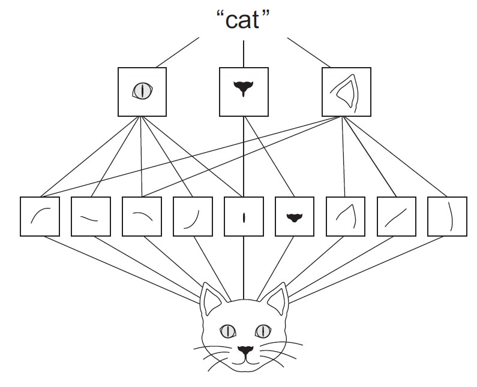
```

In the MNIST example, the first convolution layer takes a feature map of size (28, 28, 1) and outputs a feature map of size (26, 26, 32): it computes 32 filters over its input. Each of these 32 output channels contains a 26 x 26 grid of values, which is a response map of the filter over the input, indicating the response of that filter pattern at different locations in the input. That is what the term feature map means: every dimension in the depth axis is a feature (or filter), and the 2D tensor output`[:, :, n]` is the 2D spatial map of the response of this filter over the input.

```{r, out.width = "400px", echo=FALSE}
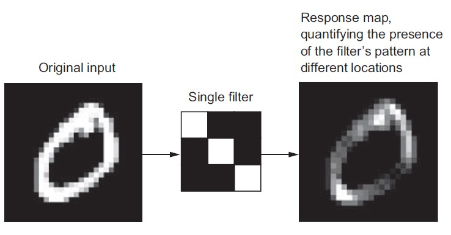
```

Convolutions are defined by two key parameters:

1. _Size of the patches extracted from the inputs_ - These are typically 3 x 3 or 5 x 5. In the example, they were 3 x 3, which is a common choice.
2. _Depth of the output feature map_ - The number of filters computed by the convolution. The example started with a depth of 32 and ended with a depth of 64.

In Keras, these parameters are the first arguments passed to the layer: `layer_conv_2d`

`(output_depth, c(window_height, window_width))`.

A convolution works by sliding these windows of size 3 x 3 or 5 x 5 over the 3D input feature map, stopping at every possible location, and extracting the 3D patch of surrounding features (shape (window_height, window_width, input_depth)). Each such 3D patch is then transformed (via a tensor product with the same learned weight matrix, called the convolution kernel) into a 1D vector of shape (output_depth). All of these vectors are then spatially reassembled into a 3D output map of shape (height, width, output_depth). Every spatial location in the output feature map corresponds to the same location in the input feature map (for example, the lower-right corner of the output contains information about the lower-right corner of the input). For instance, with 3 x 3 windows, the vector `output[i, j, ]` comes from the 3D patch `input[i-1:i+1, j-1:j+1, ]`.

Note that the output width and height may differ from the input width and height. They may differ for two reasons:

1. _Border effects_s_, which can be countered by padding the input feature map
2. The use of strides

#### Understanding Border Effects/Padding

Consider a 5 x 5 feature map (25 tiles total). There are only 9 tiles around which you can center a 3 x 3 window, forming a 3 x 3 grid. Hence, the output feature map will be 3 x 3. It shrinks a little: by exactly two tiles alongside each dimension, in this case. You can see this border effect in action in the earlier example: you start with 28 x 28 inputs, which become 26 x 26 after the first convolution layer.

If you want to get an output feature map with the same spatial dimensions as the input, you can use padding. Padding consists of adding an appropriate number of rows and columns on each side of the input feature map to make it possible to fit center convolution windows around every input tile. For a 3 x 3 window, you add one column on the right, one column on the left, one row at the top, and one row at the bottom. For a 5 x 5 window, you add two rows.

In `layer_conv_2d` layers, padding is configurable via the `padding` argument, which takes two values: `"valid"`, which means no padding (only valid window locations will be used); and `"same"`, which means pad in such a way as to have an output with the same width and height as the input. The padding argument defaults to `"valid"`. 

#### Understanding Convolution Strides

The other factor that can influence output size is the notion of strides. The description of convolution so far has assumed that the center tiles of the convolution windows are all contiguous. But the distance between two successive windows is a parameter of the convolution, called its _stride_, which defaults to 1. it is possible to have strided convolutions: convolutions with a stride higher than 1. 

Using stride 2 means the width and height of the feature map are downsampled by a factor of 2 (in addition to any changes induced by border effects). _strided convolutions are rarely used in practice_, although they can come in handy for some types of models; it is good to be familiar with the concept.

To downsample feature maps, instead of _strides_, we tend to use the _max-pooling_ operation, which you saw in action in the first convnet example. 

### Max-Pooling

In the convnet example, you may have noticed that the size of the feature maps is halved after every `layer_max_pooling_2d`. For instance, before the first `layer_max_` pooling_2d, the feature map is 26 x 26, but the max-pooling operation halves it to 13 x 13. __Thats the role of max pooling: to aggressively downsample feature maps__, much like strided convolutions.

Max pooling consists of extracting windows from the input feature maps and outputting the max value of each channel. it is conceptually similar to convolution, except that instead of transforming local patches via a learned linear transformation (the convolution kernel), they are transformed via a hardcoded max tensor operation. A big difference from convolution is that max pooling is usually done with 2 x 2 windows and stride 2, in order to downsample the feature maps by a factor of 2. On the other hand, convolution is typically done with 3 x 3 windows and no stride (stride 1).

Why downsample feature maps this way? Why not remove the max-pooling layers and keep fairly large feature maps all the way up? Look at this option. The convolutional base of the model would then look like this:

```{r}
model_no_max_pool <- keras_model_sequential() %>% 
     layer_conv_2d(filters = 32, kernel_size = c(3, 3), activation = "relu", 
                   input_shape = c(28, 28, 1)) %>%
     layer_conv_2d(filters = 64, kernel_size = c(3, 3), activation = "relu") %>% 
     layer_conv_2d(filters = 64, kernel_size = c(3, 3), activation = "relu")
model_no_max_pool
```

```{}
Model
____________________________________________________________________________________________________________________________________
Layer (type)                                               Output Shape                                         Param #             
====================================================================================================================================
conv2d_7 (Conv2D)                                          (None, 26, 26, 32)                                   320                 
____________________________________________________________________________________________________________________________________
conv2d_8 (Conv2D)                                          (None, 24, 24, 64)                                   18496               
____________________________________________________________________________________________________________________________________
conv2d_9 (Conv2D)                                          (None, 22, 22, 64)                                   36928               
====================================================================================================================================
Total params: 55,744
Trainable params: 55,744
Non-trainable params: 0
____________________________________________________________________________________________________________________________________
```

Whats wrong with this setup? Two things:

1. It is not conducive to learning a spatial hierarchy of features. The high-level patterns learned by the convnet will be very small with regard to the initial input, which may not be enough to learn to classify digits (try recognizing a digit by only looking at it through windows that are 7 x 7 pixels!). We need the features from the last convolution layer to contain information about the totality of the input.
2. The final feature map has 22 x 22 x 64 = 30,976 total coefficients per sample. This is huge. If you were to flatten it to stick a dense layer of size 512 on top, that layer would have 15.8 million parameters. This is far too large for such a small model and would result in intense overfitting.

In short, __the reason to use down sampling is to reduce the number of feature-map coefficients to process, as well as to induce spatial-filter hierarchies by making successive convolution layers look at increasingly large windows__ (in terms of the fraction of the original input they cover).

Note that max pooling is not the only way you can achieve such down sampling. As you already know, you can also use strides in the prior convolution layer. And you can use average pooling instead of max pooling, where each local input patch is transformed by taking the average value of each channel over the patch, rather than the max. But max pooling tends to work better than these alternative solutions. In a nutshell, the reason is __features tend to encode the spatial presence of some pattern or concept over the different tiles of the feature map (hence, the term feature map), and it is more informative to look at the maximal presence of different features than at their average presence__. So the most reasonable sub-sampling strategy is to first produce dense maps of features (via unstrided convolutions) and then look at the maximal activation of the features over small patches, rather than looking at sparser windows of the inputs (via strided convolutions) or averaging input patches, which could cause you to miss or dilute feature-presence information.

## Training a Convnet from Scratch

```{r echo=FALSE}
rm(list= ls())
```

Having to train an image-classification model using very little data is a common situation, which you will likely encounter in practice if you ever do computer vision in a professional context. A _few_ samples can mean anywhere from a few hundred to a few tens of thousands of images. As a practical example, We will focus on classifying images as dogs or cats, in a dataset containing 4,000 pictures of cats and dogs (2,000 cats, 2,000 dogs). We will use 2,000 pictures for training, 1,000 for validation and 1,000 for testing.

Review one basic strategy to tackle this problem: training a new model from scratch using what little data you have. you will start by naively training a small convnet on the 2,000 training samples, without any regularization, to set a baseline for what can be achieved. This will get you to a classification accuracy of 71%. At that point, the main issue will be overfitting. Then We will introduce __data augmentation__, a powerful technique for mitigating overfitting in computer vision. By using data augmentation, you will improve the network to reach an accuracy of 82%.

Review two more essential techniques for applying deep learning to small datasets: 

- feature extraction with a pretrained network (which will get you to an accuracy of 90% - 96%) 
- fine-tuning a pretrained network (this will get you to a final accuracy of 97%). 

Together, these three strategies:

1. training a small model from scratch
2. feature extraction using a pretrained model
3. fine-tuning a pretrained model

will constitute your future toolbox for tackling the problem of performing image classification with small datasets.
 
### Small-data Problems

You will sometimes hear that deep learning only works when lots of data is available. This is valid in part: one fundamental characteristic of deep learning is that it can find interesting features in the training data on its own, without any need for manual feature engineering, and this can only be achieved when lots of training examples are available. This is especially true for problems where the input samples are very high dimensional, like images.

But what constitutes lots of samples is relative to the size and depth of the network you are trying to train. It is not possible to train a convnet to solve a complex problem with just a few tens of samples, but a few hundred can potentially suffice if the model is small and well regularized and the task is simple. Because convnets learn local, translation-invariant features, they are highly data efficient on perceptual problems. Training a convnet from scratch on a very small image dataset will still yield reasonable results despite a relative lack of data, without the need for any custom feature engineering. 

Deep-learning models are by nature highly repurposable: you can take, say, an image-classification or speech-to-text model trained on a large-scale dataset and reuse it on a significantly different problem with only minor changes. Specifically, in the case of computer vision, many pretrained models (usually trained on the ImageNet dataset) are now publicly available for download and can be used to bootstrap powerful vision models out of very little data. 

### Download Data

The Dogs vs. Cats dataset is made available by Kaggle as part of a computer-vision competition in late 2013, back when convnets were not mainstream. You can download the original dataset from www.kaggle.com/c/dogs-vs-cats/data.

The pictures are medium-resolution color JPEGs. Unsurprisingly, the dogs-versus-cats Kaggle competition in 2013 was won by entrants who used convnets. The best entries achieved up to 95% accuracy. In this example, you will get fairly close to this accuracy (in the next section), even though you will train your models on less than 10% of the data that was available to the competitors.

This dataset contains 25,000 images of dogs and cats (12,500 from each class) and is 543 MB (compressed). After downloading and uncompressing it, you will create a new dataset containing three subsets: a training set with 1,000 samples of each class, a validation set with 500 samples of each class, and a test set with 500 samples of each class.  This was done offline from this transcript.

As a sanity check, count how many pictures are in each training split (train/validation/test):

```{r}
cat("total training cat images:", length(list.files("../../LargeDataFiles/CatsDogs/sample/train/cat/")), "\n")
cat("total training dog images:", length(list.files("../../LargeDataFiles/CatsDogs/sample/train/dog/")), "\n")
```

```{r}
cat("total validation cat images:", length(list.files("../../LargeDataFiles/CatsDogs/sample/validation/cat/")), "\n")
cat("total validation dog images:", length(list.files("../../LargeDataFiles/CatsDogs/sample/validation/dog/")), "\n")
```

```{r}
cat("total test cat images:", length(list.files("../../LargeDataFiles/CatsDogs/sample/test/cat/")), "\n")
cat("total test dog images:", length(list.files("../../LargeDataFiles/CatsDogs/sample/test/dog/")), "\n")
```

### Building the Network

Reuse the same general structure as before: the convnet will be a stack of alternated `layer_conv_2d` (with relu activation) and `layer_max_pooling_2d` stages.

Because you are dealing with bigger images and a more complex problem, make your network larger, accordingly: it will have one more `layer_conv_2d` + `layer_max_pooling_2d` stage. This serves both to augment the capacity of the network and to further reduce the size of the feature maps so they are not overly large when you reach `layer_flatten.` 

Because you start from inputs of size 150 x 150 (an arbitrary choice), you end up with feature maps of size 7 x 7 just before `layer_flatten.`

> The depth of the feature maps progressively increases in the network (from 32 to 128), whereas the size of the feature maps decreases (from 148 x 148 to 7 x 7). This is a pattern you will see in almost all convnets.

Because you are attacking a binary-classification problem, you will end the network with a single unit (a layer_dense of size 1) and a sigmoid activation. This unit will encode the probability that the network is looking at one class or the other.

```{r}
model <- keras_model_sequential() %>%
     layer_conv_2d(filters = 32, kernel_size = c(3, 3), 
                   activation = "relu", input_shape = c(150, 150, 3)) %>%
     layer_max_pooling_2d(pool_size = c(2, 2)) %>% 
     layer_conv_2d(filters = 64, kernel_size = c(3, 3), activation = "relu") %>% 
     layer_max_pooling_2d(pool_size = c(2, 2)) %>% 
     layer_conv_2d(filters = 128, kernel_size = c(3, 3), activation = "relu") %>%
     layer_max_pooling_2d(pool_size = c(2, 2)) %>% 
     layer_conv_2d(filters = 128, kernel_size = c(3, 3), activation = "relu") %>%
     layer_max_pooling_2d(pool_size = c(2, 2)) %>% 
     layer_flatten() %>% 
     layer_dense(units = 512, activation = "relu") %>% 
     layer_dense(units = 1, activation = "sigmoid")
summary(model)
```

```{}
____________________________________________________________________________________________________________________________________
Layer (type)                                               Output Shape                                         Param #             
====================================================================================================================================
conv2d_10 (Conv2D)                                         (None, 148, 148, 32)                                 896                 
____________________________________________________________________________________________________________________________________
max_pooling2d_5 (MaxPooling2D)                             (None, 74, 74, 32)                                   0                   
____________________________________________________________________________________________________________________________________
conv2d_11 (Conv2D)                                         (None, 72, 72, 64)                                   18496               
____________________________________________________________________________________________________________________________________
max_pooling2d_6 (MaxPooling2D)                             (None, 36, 36, 64)                                   0                   
____________________________________________________________________________________________________________________________________
conv2d_12 (Conv2D)                                         (None, 34, 34, 128)                                  73856               
____________________________________________________________________________________________________________________________________
max_pooling2d_7 (MaxPooling2D)                             (None, 17, 17, 128)                                  0                   
____________________________________________________________________________________________________________________________________
conv2d_13 (Conv2D)                                         (None, 15, 15, 128)                                  147584              
____________________________________________________________________________________________________________________________________
max_pooling2d_8 (MaxPooling2D)                             (None, 7, 7, 128)                                    0                   
____________________________________________________________________________________________________________________________________
flatten_2 (Flatten)                                        (None, 6272)                                         0                   
____________________________________________________________________________________________________________________________________
dense_3 (Dense)                                            (None, 512)                                          3211776             
____________________________________________________________________________________________________________________________________
dense_4 (Dense)                                            (None, 1)                                            513                 
====================================================================================================================================
Total params: 3,453,121
Trainable params: 3,453,121
Non-trainable params: 0
____________________________________________________________________________________________________________________________________
```

For the compilation step, use `RMSprop` optimizer as usual. Because you ended the network with a single sigmoid unit, you will use `binary crossentropy` as the loss.

```{r}
model %>% compile(loss = "binary_crossentropy", optimizer = optimizer_rmsprop(lr = 1e-4), metrics = c("acc") )
```

### Data Preprocessing

As you know, data should be formatted into appropriately preprocessed floating point tensors before being fed into the network. Currently, the data are JPEG files, so the steps for getting it into the network are roughly as follows:

1. Read the picture files.
2. Decode the JPEG content to RGB grids of pixels.
3. Convert these into floating-point tensors.
4. Rescale the pixel values (between 0 and 255) to the [0, 1] interval.

It may seem a bit daunting, but thankfully Keras has utilities to take care of these steps automatically. Keras includes a number of image-processing helper tools. In particular, it includes the `image_data_generator()` function, which can automatically turn image files on disk into batches of preprocessed tensors. 

```{r}
train_datagen <- image_data_generator(rescale = 1/255)	
validation_datagen <- image_data_generator(rescale = 1/255) 

train_generator <- flow_images_from_directory("../../../LargeDataFiles/CatsDogs/sample/train/", train_datagen, 
                                              target_size = c(150, 150), batch_size = 20, class_mode = "binary")

validation_generator <- flow_images_from_directory("../../../LargeDataFiles/CatsDogs/sample/validation/", 
                                                   validation_datagen, target_size = c(150, 150), batch_size = 20, 
                                                   class_mode = "binary")
```

Look at the output of one of these generators: it yields batches of 150 x 150 RGB images (shape (20, 150, 150, 3)) and binary labels (shape (20)). There are 20 samples in each batch (the batch size). Note that the generator yields these batches indefinitely - it loops endlessly over the images in the target folder:

```{r}
batch <- generator_next(train_generator)
str(batch)
```

```{}
List of 2
 $ : num [1:20, 1:150, 1:150, 1:3] 0.4392 0.0824 0.0824 0.9882 0.5765 ...
 $ : num [1:20(1d)] 0 1 1 0 0 0 1 0 0 1 ...
```

Fit the model to the data using the generator. You do so using the `fit_generator`, the equivalent of fit for data generators like this one. It expects as its first argument a generator that will yield batches of inputs and targets indefinitely, like this one does. Because the data is being generated endlessly, the fitting process needs to know how many samples to draw from the generator before declaring an epoch over.

This is the role of the `steps_per_epoch` argument: after having drawn `steps_per_epoch` batches from the generator after having run for `steps_per_epoch` gradient descent steps the fitting process will go to the next epoch. In this case, batches are 20 samples, so it will take 100 batches until you see your target of 2,000 samples.

When using `fit_generator`, you can pass a `validation_data` argument, much as with the `fit` function. it is important to note that this argument is allowed to be a data generator, but it could also be a list of arrays. If you pass a generator as `validation_data`, then this generator is expected to yield batches of validation data endlessly; thus you should also specify the `validation_steps` argument, which tells the process how many batches to draw from the validation generator for evaluation.

```{r eval=FALSE}
history <- model %>% fit_generator(train_generator, steps_per_epoch = 100, epochs = 30, 
                                   validation_data = validation_generator, validation_steps = 50)

model %>% save_model_hdf5("./Deep_Learning_with_R/models/cats_and_dogs_small_1.h5")
save.image("./RData/5-8-ConvnetScratch.RData")
plot(history)
```

```{r echo=FALSE}
load("./RData/5-8-ConvnetScratch.RData")
plot(history)
```

```{r, out.width = "400px", echo=FALSE}
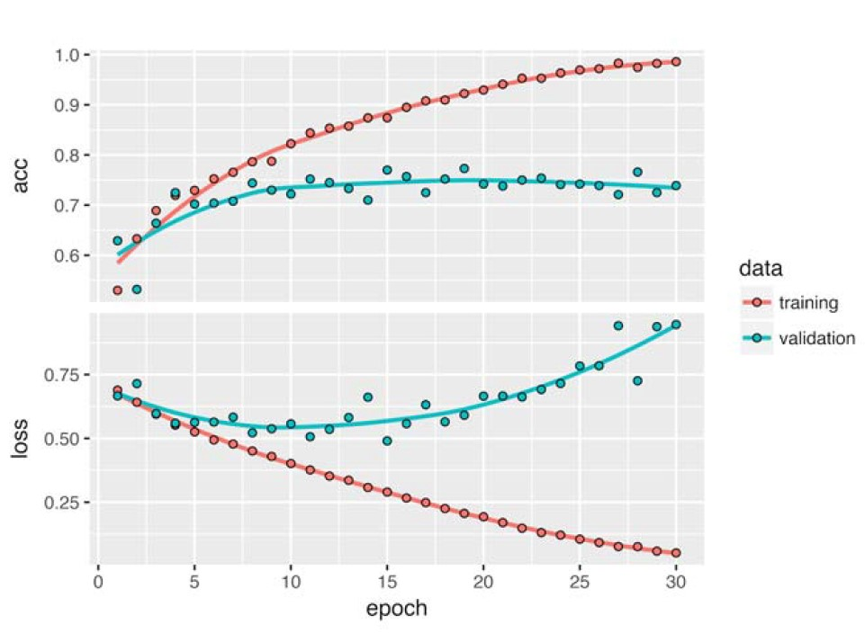
```

Plot the loss and accuracy of the model over the training and validation data during training. These plots are characteristic of overfitting. The training accuracy increases linearly over time, until it reaches nearly 100%, whereas the validation accuracy stalls at 71% - 75%. The validation loss reaches its minimum after only five epochs and then stalls, whereas the training loss keeps decreasing linearly until it reaches nearly 0.

Because you have relatively few training samples (2,000), overfitting will be your number-one concern. *You already know about a number of techniques that can help mitigate overfitting, such as dropout and weight decay (L2 regularization). Now going to work with a new one, specific to computer vision and used almost universally when processing images with deep-learning models: __data augmentation__*. 

### Using Data Augmentation

Overfitting is caused by having too few samples to learn from, rendering you unable to train a model that can generalize to new data. Given infinite data, your model would be exposed to every possible aspect of the data distribution at hand: you would never overfit. *Data augmentation takes the approach of generating more training data from existing training samples, by augmenting the samples via a number of random transformations that yield believable-looking images*. The goal is that at training time, your model will never see the exact same picture twice. This helps expose the model to more aspects of the data and generalize better.

In Keras, this can be done by configuring a number of random transformations to be performed on the images read by an `image_data_generator.`

```{r}
datagen <- image_data_generator(rescale = 1/255, rotation_range = 40, width_shift_range = 0.2, 
                                height_shift_range = 0.2, shear_range = 0.2, zoom_range = 0.2, 
                                horizontal_flip = TRUE, fill_mode = "nearest")
```

These are just a few of the options available (for more, see the Keras documentation). 

- _rotation_range_ is a value in degrees (0-180), a range within which to randomly rotate pictures.
- _width_shift_ and _height_shift_ are ranges (as a fraction of total width or height) within which to randomly translate pictures vertically or horizontally.
- _shear_range_ is for randomly applying shearing transformations.
- _zoom_range_ is for randomly zooming inside pictures.
- _horizontal_flip_ is for randomly flipping half the images horizontally are relevant when there are no assumptions of horizontal asymmetry (for example, real-world pictures).
- _fill_mode_ is the strategy used for filling in newly created pixels, which can appear after a rotation or a width/height shift.

```{r}
fnames <- list.files("../../../LargeDataFiles/CatsDogs/sample/train/dog/", full.names = TRUE)
img_path <- fnames[[7]]
img <- image_load(img_path, target_size = c(150, 150))	
img_array <- image_to_array(img)
img_array <- array_reshape(img_array, c(1, 150, 150, 3))

augmentation_generator <- flow_images_from_data(img_array, generator = datagen, batch_size = 1)

op <- par(mfrow = c(2, 2), pty = "s", mar = c(1, 0, 1, 0)) 

for (i in 1:4) {
batch <- generator_next(augmentation_generator) 
plot(as.raster(batch[1,,,]))} 

par(op)
```

```{r, out.width = "400px", echo=FALSE}
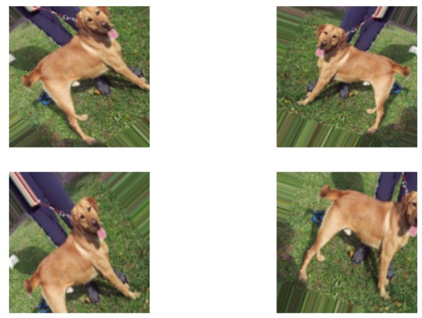
```

If you train a new network using this data-augmentation configuration, the network will never see the same input twice. But the inputs it sees are still heavily intercorrelated, because they come from a small number of original images you cannot produce new information, you can only remix existing information. As such, this may not be enough to completely get rid of overfitting. To further fight overfitting, you will also add a dropout layer to your model, right before the densely connected classifier.

```{r}
model <- keras_model_sequential() %>%
     layer_conv_2d(filters = 32, kernel_size = c(3, 3), activation = "relu", 
                   input_shape = c(150, 150, 3)) %>%
     layer_max_pooling_2d(pool_size = c(2, 2)) %>%
     layer_conv_2d(filters = 64, kernel_size = c(3, 3), activation = "relu") %>%
     layer_max_pooling_2d(pool_size = c(2, 2)) %>% 
     layer_conv_2d(filters = 128, kernel_size = c(3, 3), activation = "relu") %>%
     layer_max_pooling_2d(pool_size = c(2, 2)) %>% 
     layer_conv_2d(filters = 128, kernel_size = c(3, 3), activation = "relu") %>%
     layer_max_pooling_2d(pool_size = c(2, 2)) %>% 
     layer_flatten() %>% 
     layer_dropout(rate = 0.5) %>% 
     layer_dense(units = 512, activation = "relu") %>% 
     layer_dense(units = 1, activation = "sigmoid")

model %>% compile(loss = "binary_crossentropy", optimizer = optimizer_rmsprop(lr = 1e-4), metrics = c("acc"))
```

Train the network using data augmentation and dropout.

```{r eval=FALSE}
datagen <- image_data_generator(rescale = 1/255, rotation_range = 40, width_shift_range = 0.2, 
                                height_shift_range = 0.2, shear_range = 0.2, zoom_range = 0.2, horizontal_flip = TRUE)

test_datagen <- image_data_generator(rescale = 1/255)

# Note that the validation data shouldn’t be augmented
train_generator <- flow_images_from_directory("../../LargeDataFiles/CatsDogs/sample/train/", datagen, 
                                              target_size = c(150, 150), batch_size = 32, class_mode = "binary")
 
validation_generator <- flow_images_from_directory("../../LargeDataFiles/CatsDogs/sample/validation/",
                                                   test_datagen, target_size = c(150, 150), batch_size = 32, 
                                                   class_mode = "binary") 
# Because you use binary_crossentropy loss, you need binary labels.

history <- model %>% fit_generator(train_generator, steps_per_epoch = 100, epochs = 100, 
                                   validation_data = validation_generator, validation_steps = 50)

model %>% save_model_hdf5("./models/cats_and_dogs_small_2.h5")
save.image("./RData/convnet53.RData")
```

```{r echo=FALSE}
rm(list=ls())
#load_model_hdf5("Deep_Learning_with_R/models/cats_and_dogs_small_2.h5")
load("../RData/convnet53.RData")
```

Thanks to data augmentation and dropout, you are no longer overfitting: the training curves are closely tracking the validation curves. You can now reach an accuracy of 82%, a 15% relative improvement over the non-regularized model.

```{r}
plot(history)
```

```{r, out.width = "400px", echo=FALSE}
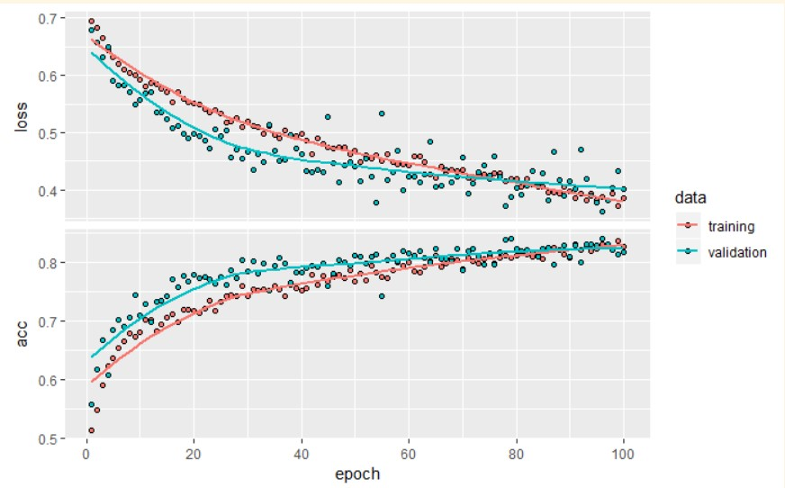
```

By using regularization techniques even further, and by tuning the networks parameters (such as the number of filters per convolution layer, or the number of layers in the network), you may be able to get an even better accuracy, likely up to 86% or 87%. But it would prove difficult to go any higher just by training your own convnet from scratch, because you have so little data to work with. As a next step to improve your accuracy on this problem, you will have to use a pretrained model, which is the focus of the next two sections. 

## Pretrained Convnet

A common and highly effective approach to deep learning on small image datasets is to use a pretrained network. A pretrained network is a saved network that was previously trained on a large dataset, typically on a large-scale image-classification task. If this original dataset is large enough and general enough, then the spatial hierarchy of features learned by the pretrained network can effectively act as a generic model of the visual world, and hence its features can prove useful for many different computervision problems, even though these new problems may involve completely different classes than those of the original task. For instance, you might train a network on ImageNet (where classes are mostly animals and everyday objects) and then repurpose this trained network for something as remote as identifying furniture items in images. Such portability of learned features across different problems is a key advantage of deep learning compared to many older, shallow-learning approaches, and it makes deep learning very effective for small-data problems.

Consider a large convnet trained on the ImageNet dataset (1.4 million labeled images and 1,000 different classes). ImageNet contains many animal classes, including different species of cats and dogs, and you can thus expect to perform well on the dogs-versus-cats classification problem.

you will use the `VGG16` architecture; it is a simple and widely used convnet architecture for ImageNet. Although it is an older model, far from the current state of the art and somewhat heavier than many other recent models, it is selected because its architecture is similar to what you are already familiar with and is easy to understand without introducing any new concepts. This may be your first encounter with one of these model names -`VGG`, `ResNet`, `Inception`, `Inception-ResNet`, `Xception`, and so on; you will get used to them, because they will come up frequently if you keep doing deep learning for computer vision.

There are two ways to use a pretrained network: 

- feature extraction
- fine-tuning

### Feature Extraction

```{r echo=FALSE}
rm(list=ls())
```

Feature extraction consists of using the representations learned by a previous network to extract interesting features from new samples. These features are then run through a new classifier which is trained from scratch.

As you saw previously, convnets used for image classification comprise two parts: 

- start with a series of pooling and convolution layers
- end with a densely connected classifier

The first part is called the `convolutional base of the model`. In the case of convnets, feature extraction consists of taking the convolutional base of a previously trained network, running the new data through it, and training a new classifier on top of the output.

Why only reuse the convolutional base? Could you reuse the densely connected classifier as well? In general, doing so should be avoided. The reason is  the representations learned by the convolutional base are likely to be more generic and therefore more reusable: the feature maps of a convnet are presence maps of generic concepts over a picture, which is likely to be useful regardless of the computer-vision problem at hand. 

- The representations learned by the classifier will necessarily be specific to the set of classes on which the model was trained they will only contain information about the presence probability of this or that class in the entire picture. 
- The representations found in densely connected layers no longer contain any information about where objects are located in the input image: these layers get rid of the notion of space, whereas the object location is still described by convolutional feature maps. For problems where object location matters, densely connected features are largely useless.

Note that the level of generality (and therefore reusability) of the representations extracted by specific convolution layers depends on the depth of the layer in the model. Layers that come earlier in the model extract local, highly generic feature maps (such as visual edges, colors, and textures), whereas layers that are higher up extract more-abstract concepts (such as a cat ear or a dog eye). So if your new dataset differs a lot from the dataset on which the original model was trained, you may be better off using only the first few layers of the model to do feature extraction, rather than using the entire convolutional base.

In this case, because the ImageNet class set contains multiple dog and cat classes, it is likely to be beneficial to reuse the information contained in the densely connected layers of the original model. But We will choose not to, in order to cover the more general case where the class set of the new problem does not overlap the class set of the original model. Put this in practice by using the convolutional base of the `VGG16` network, trained on ImageNet, to extract interesting features from cat and dog images, and then train a dogs-versus-cats classifier on top of these features.

The `VGG16` model, among others, comes prepackaged with Keras. Heres the list of image-classification models (all pretrained on the ImageNet dataset) that are available as part of Keras:

- Xception
- Inception V3
- ResNet50
- VGG16
- VGG19
- MobileNet

Instantiate the VGG16 model.

```{r message=FALSE}
conv_base <- application_vgg16(weights = "imagenet", include_top = FALSE, input_shape = c(150, 150, 3))
```

You pass three arguments to the function:

1. `weights` specifies the weight checkpoint from which to initialize the model.
2. `include_top` refers to including (or not) the densely connected classifier on top of the network. By default, this densely connected classifier corresponds to the 1,000 classes from ImageNet. Because you intend to use your own densely connected classifier (with only two classes: cat and dog), you do not need to include it.
3. `input_shape` is the shape of the image tensors that you will feed to the network. This argument is purely optional: if you do not pass it, the network will be able to process inputs of any size.

Here is the detail of the architecture of the VGG16 convolutional base. it is similar to the simple convnets you are already familiar with:

```{r}
conv_base
```

```{}
Model
____________________________________________________________________________________________________________________________________
Layer (type)                                               Output Shape                                         Param #             
====================================================================================================================================
input_1 (InputLayer)                                       (None, 150, 150, 3)                                  0                   
____________________________________________________________________________________________________________________________________
block1_conv1 (Conv2D)                                      (None, 150, 150, 64)                                 1792                
____________________________________________________________________________________________________________________________________
block1_conv2 (Conv2D)                                      (None, 150, 150, 64)                                 36928               
____________________________________________________________________________________________________________________________________
block1_pool (MaxPooling2D)                                 (None, 75, 75, 64)                                   0                   
____________________________________________________________________________________________________________________________________
block2_conv1 (Conv2D)                                      (None, 75, 75, 128)                                  73856               
____________________________________________________________________________________________________________________________________
block2_conv2 (Conv2D)                                      (None, 75, 75, 128)                                  147584              
____________________________________________________________________________________________________________________________________
block2_pool (MaxPooling2D)                                 (None, 37, 37, 128)                                  0                   
____________________________________________________________________________________________________________________________________
block3_conv1 (Conv2D)                                      (None, 37, 37, 256)                                  295168              
____________________________________________________________________________________________________________________________________
block3_conv2 (Conv2D)                                      (None, 37, 37, 256)                                  590080              
____________________________________________________________________________________________________________________________________
block3_conv3 (Conv2D)                                      (None, 37, 37, 256)                                  590080              
____________________________________________________________________________________________________________________________________
block3_pool (MaxPooling2D)                                 (None, 18, 18, 256)                                  0                   
____________________________________________________________________________________________________________________________________
block4_conv1 (Conv2D)                                      (None, 18, 18, 512)                                  1180160             
____________________________________________________________________________________________________________________________________
block4_conv2 (Conv2D)                                      (None, 18, 18, 512)                                  2359808             
____________________________________________________________________________________________________________________________________
block4_conv3 (Conv2D)                                      (None, 18, 18, 512)                                  2359808             
____________________________________________________________________________________________________________________________________
block4_pool (MaxPooling2D)                                 (None, 9, 9, 512)                                    0                   
____________________________________________________________________________________________________________________________________
block5_conv1 (Conv2D)                                      (None, 9, 9, 512)                                    2359808             
____________________________________________________________________________________________________________________________________
block5_conv2 (Conv2D)                                      (None, 9, 9, 512)                                    2359808             
____________________________________________________________________________________________________________________________________
block5_conv3 (Conv2D)                                      (None, 9, 9, 512)                                    2359808             
____________________________________________________________________________________________________________________________________
block5_pool (MaxPooling2D)                                 (None, 4, 4, 512)                                    0                   
====================================================================================================================================
Total params: 14,714,688
Trainable params: 14,714,688
Non-trainable params: 0
____________________________________________________________________________________________________________________________________

```


The final feature map has shape (4, 4, 512). That is the feature on top of which you will stick a densely connected classifier.

There are two ways you could proceed:

1. Running the convolutional base over your dataset, recording its output to an array on disk, and then using this data as input to a standalone, densely connected classifier similar to those you saw in part 1 of this book. This solution is fast and cheap to run because it only requires running the convolutional base once for every input image, and the convolutional base is by far the most expensive part of the pipeline. But for the same reason, this technique will not allow you to use data augmentation.
2. Extending the model you have (conv_base) by adding dense layers on top, and running the whole thing end to end on the input data. This will allow you to use data augmentation, because every input image goes through the convolutional base every time it is seen by the model. But for the same reason, this technique is far more expensive than the first.

We will cover both techniques. Walk through the code required to set up the first one: __recording the output of conv_base__ on your data and using these outputs as inputs to a new model.

#### Fast Feature Extraction w/o Data Augmentation

Start by running instances of the previously introduced `image_data_generator` to extract images as arrays as well as their labels. you will extract features from these images by calling the predict method on the model.

```{r eval=FALSE}
base_dir <- "../../LargeDataFiles/CatsDogs/sample" 
train_dir <- file.path(base_dir, "train") 
validation_dir <- file.path(base_dir, "validation") 
test_dir <- file.path(base_dir, "test")

datagenFE <- image_data_generator(rescale = 1/255) 
batch_size <- 20 

extract_features <- function(directory, sample_count) {
     features <- array(0, dim = c(sample_count, 4, 4, 512)) 
     labels <- array(0, dim = c(sample_count))
     
generatorFE <- flow_images_from_directory(directory = directory, generator = datagenFE, target_size = c(150, 150), 
                                          batch_size = batch_size, class_mode = "binary")

i <- 0
while(TRUE) {
     batch <- generator_next(generatorFE) 
     inputs_batch <- batch[[1]] 
     labels_batch <- batch[[2]] 
     features_batch <- conv_base %>% predict(inputs_batch)
     
     index_range <- ((i * batch_size)+1):((i + 1) * batch_size) 
     features[index_range,,,] <- features_batch 
     labels[index_range] <- labels_batch
     
     i <- i + 1
     if (i * batch_size >= sample_count) 
          break 
     #Note that because generators yield data indefinitely in a loop, 
     #you must break after every image has been seen once.
     }
     list(features = features, labels = labels) 
}

train <- extract_features(train_dir, 2000) 
validation <- extract_features(validation_dir, 1000) 
test <- extract_features(test_dir, 1000)

#The extracted features are currently of shape (samples, 4, 4, 512). you will feed them to a densely connected classifier, so first you must flatten them to (samples, 8192):

reshape_features <- function(features) {array_reshape(features, dim = c(nrow(features), 4 * 4 * 512))} 

train$features <- reshape_features(train$features) 
validation$features <- reshape_features(validation$features) 
test$features <- reshape_features(test$features)

#At this point, you can define your densely connected classifier (note the use of dropout for regularization) and train it on the data and labels that you just recorded.

modelFE <- keras_model_sequential() %>% layer_dense(units = 256, activation = "relu", input_shape = 4 * 4 * 512) %>%
     layer_dropout(rate = 0.5) %>% layer_dense(units = 1, activation = "sigmoid")


modelFE %>% compile(optimizer = optimizer_rmsprop(lr = 2e-5), loss = "binary_crossentropy", metrics = c("accuracy"))

historyFE <- modelFE %>% fit(train$features, train$labels, epochs = 30, batch_size = 20, 
                             validation_data = list(validation$features, validation$labels))
plot(historyFE)

save.image("./ConvnetFE.RData")
```

```{r echo=FALSE}
load("./RData/ConvnetFE.RData")
plot(historyFE)
```

```{r, out.width = "400px", echo=FALSE}
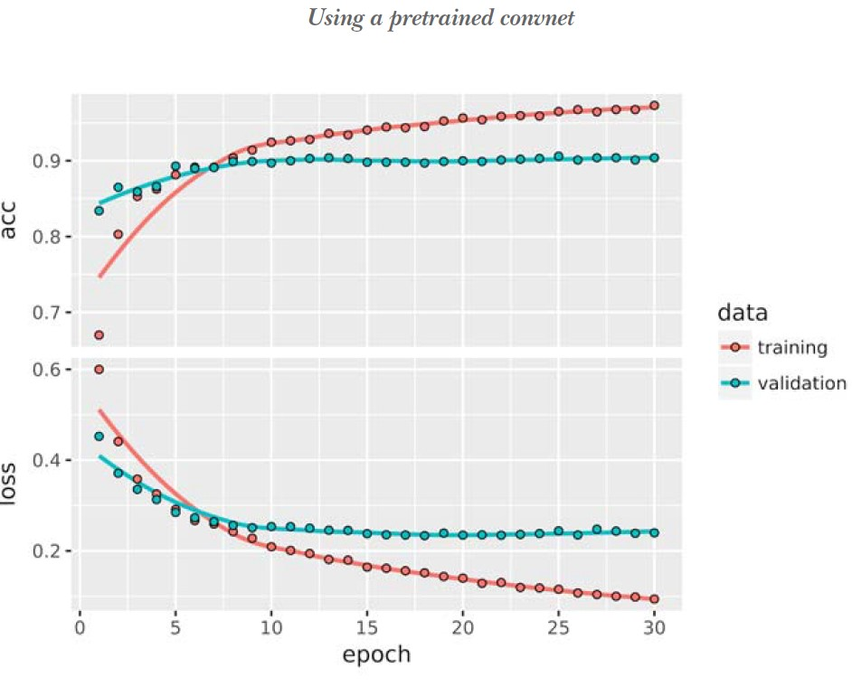
```

Training is very fast, because you only have to deal with two dense layers and epoch takes less than one second even on CPU. 
You reach a validation accuracy of about 90%  much better than you achieved in the previous section with the small model trained from scratch. But the plots also indicate that you are overfitting almost from the start  despite using dropout with a fairly large rate. That is because this technique does not use data augmentation, which is essential for preventing overfitting with small image datasets. 

#### Feature Extraction with Data Augmentation

```{r echo=FALSE}
rm(list=ls())
conv_base <- application_vgg16(weights = "imagenet", include_top = FALSE, input_shape = c(150, 150, 3))
```

The second technique is much slower and more expensive, but which allows you to use data augmentation during training: extending the `conv_base` model and running it end to end on the inputs.

> NOTE This technique is so expensive that you should only attempt it if you have access to a GPU it is absolutely intractable on a CPU. If you cannot run your code on a GPU, then the previous technique is the way to go.

Because models behave just like layers, you can add a model (like `conv_base`) to a sequential model just like you would add a layer.

```{r}
modelFE2 <- keras_model_sequential() %>% conv_base %>% layer_flatten() %>% 
     layer_dense(units = 256, activation = "relu") %>% layer_dense(units = 1, activation = "sigmoid")
modelFE2
```

```{}
Model
____________________________________________________________________________________________________________________________________
Layer (type)                                               Output Shape                                         Param #             
====================================================================================================================================
vgg16 (Model)                                              (None, 4, 4, 512)                                    14714688            
____________________________________________________________________________________________________________________________________
flatten_3 (Flatten)                                        (None, 8192)                                         0                   
____________________________________________________________________________________________________________________________________
dense_5 (Dense)                                            (None, 256)                                          2097408             
____________________________________________________________________________________________________________________________________
dense_6 (Dense)                                            (None, 1)                                            257                 
====================================================================================================================================
Total params: 16,812,353
Trainable params: 16,812,353
Non-trainable params: 0
____________________________________________________________________________________________________________________________________
```

As you can see, the convolutional base of `VGG16` has 14,714,688 parameters, which is very large. The classifier you are adding on top has 2 million parameters.

Before you compile and train the model, it is very important to freeze the convolutional base. Freezing a layer or set of layers means preventing their weights from being updated during training. If you do not do this, then the representations that were previously learned by the convolutional base will be modified during training. Because the dense layers on top are randomly initialized, very large weight updates would be propagated through the network, effectively destroying the representations previously learned.

In Keras, you freeze a network using the `freeze_weights()`:

```{r}
cat("This is the number of trainable weights before freezing",
    "the conv base:", length(modelFE2$trainable_weights), "\n")
#This is the number of trainable weights before freezing the conv base: 30

freeze_weights(conv_base)
cat("This is the number of trainable weights after freezing",
    "the conv base:", length(modelFE2$trainable_weights), "\n") 
#This is the number of trainable weights before freezing the conv base: 4
```

```{}
This is the number of trainable weights before freezing the conv base: 30 
This is the number of trainable weights after freezing the conv base: 4 
```

With this setup, only the weights from the two dense layers that you added will be trained. That is a total of four weight tensors: two per layer (the main weight matrix and the bias vector). Note that in order for these changes to take effect, you must first compile the model. If you ever modify weight trainability after compilation, you should then recompile the model, or these changes will be ignored.

Now you can start training your model, with the same data-augmentation configuration that you used in the previous example.

```{r eval=FALSE}
train_datagenFE3 = image_data_generator(rescale = 1/255, rotation_range = 40, width_shift_range = 0.2, 
                                        height_shift_range = 0.2, shear_range = 0.2, zoom_range = 0.2, 
                                        horizontal_flip = TRUE, fill_mode = "nearest") 

test_datagenFE3 <- image_data_generator(rescale = 1/255)

train_generatorFE3 <- flow_images_from_directory("../../LargeDataFiles/CatsDogs/train/", train_datagenFE3,
                                                 target_size = c(150, 150), batch_size = 20, class_mode = "binary")

validation_generatorFE3 <- flow_images_from_directory("../../LargeDataFiles/CatsDogs/validation/", test_datagenFE3, 
                                                      target_size = c(150, 150), batch_size = 20, class_mode = "binary")

modelFE2 %>% compile(loss = "binary_crossentropy", optimizer = optimizer_rmsprop(lr = 2e-5), metrics = c("accuracy"))

historyFE3 <- modelFE2 %>% fit_generator(train_generatorFE3, steps_per_epoch = 100, epochs = 30, 
                                         validation_data = validation_generatorFE3, validation_steps = 50)
```

A validation accuracy of about 90%. This is much better than you achieved with the small convnet trained from scratch.

```{r eval=FALSE}
plot(historyFE3)
```

```{r, out.width = "400px", echo=FALSE}
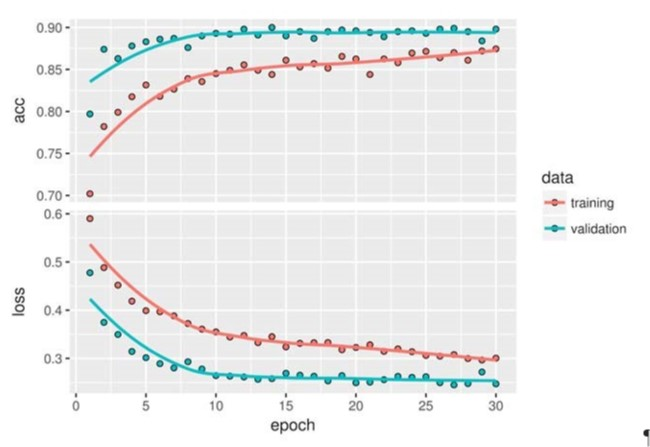
```

#### Fine-tuning

Another widely used technique for model reuse, complementary to feature extraction, is fine-tuning. Fine-tuning consists of unfreezing a few of the top layers of a frozen model base used for feature extraction, and jointly training both the newly added part of the model (in this case, the fully connected classifier) and these top layers. This is called fine-tuning because it slightly adjusts the more abstract representations of the model being reused, in order to make them more relevant for the problem at hand.

It was stated earlier that it is necessary to freeze the convolution base of `VGG16` in order to be able to train a randomly initialized classifier on top. For the same reason, it is only possible to fine-tune the top layers of the convolutional base once the classifier on top has already been trained. If the classifier is not already trained, then the error signal propagating through the network during training will be too large, and the representations previously learned by the layers being fine-tuned will be destroyed. Thus the steps for fine-tuning a network are as follows:

1. Add your custom network on top of an already-trained base network.
2. Freeze the base network.
3. Train the part you added.
4. Unfreeze some layers in the base network.
5. Jointly train both these layers and the part you added.

You already completed the first three steps when doing feature extraction. Proceed with step 4: you will unfreeze your `conv_base` and then freeze individual layers inside it.

```{r, out.width = "300px", echo=FALSE}
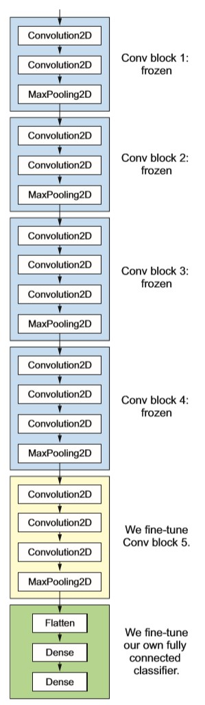
```

You fine-tune all of the layers from `block3_conv1` on. Why not fine-tune more layers? Why not fine-tune the entire convolutional base? You could. But you need to consider the following:

- Earlier layers in the convolutional base encode more-generic, reusable features, whereas layers higher up encode more-specialized features. it is more useful to fine-tune the more specialized features, because these are the ones that need to be re-purposed on your new problem. There would be fast-decreasing returns in fine-tuning lower layers.
- The more parameters you are training, the more you are at risk of overfitting. The convolutional base has 15 million parameters, so it would be risky to attempt to train it on your small dataset.

Thus, in this situation, it is a good strategy to fine-tune only some of the layers in the convolutional base. Set this up, starting from where you left off in the previous example.

```{r eval=FALSE}
unfreeze_weights(conv_base, from = "block3_conv1")
```

Now you can begin fine-tuning the network. Do this with the `RMSProp` optimizer, _using a very low learning rate_. The reason for using a low learning rate is that you want to limit the magnitude of the modifications you make to the representations of the three layers you are fine-tuning. Updates that are too large may harm these representations.

```{r eval=FALSE}
model %>% compile(loss = "binary_crossentropy", optimizer = optimizer_rmsprop(lr = 1e-5), metrics = c("accuracy"))

history <- model %>% fit_generator(train_generator, steps_per_epoch = 100, epochs = 100, 
                                   validation_data = validation_generator, validation_steps = 50)
```

Plot the results. you are seeing a nice 6% absolute improvement in accuracy, from about 90% to greater than 96%.

Note that the loss curve does not show any real improvement (in fact, it is deteriorating). You may wonder, how can accuracy stay stable or improve if the loss is not decreasing? The answer is simple: what you display is an average of pointwise loss values; but what matters for accuracy is the distribution of the loss values, not their average, because accuracy is the result of a binary thresholding of the class probability predicted by the model. The model may still be improving even if this is not reflected in the average loss.

```{r, out.width = "400px", echo=FALSE}
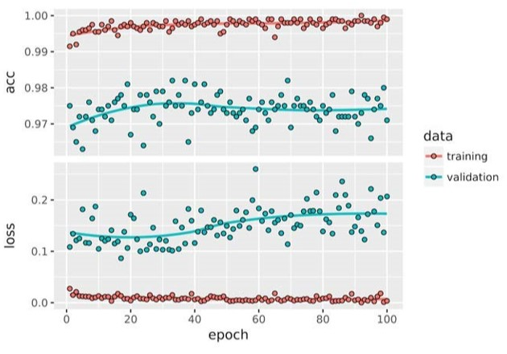
```
 
You can now finally evaluate this model on the test data:

```{r eval=FALSE}
test_generator <- flow_images_from_directory(test_dir, test_datagen, target_size = c(150, 150), 
                                             batch_size = 20, class_mode = "binary")
model %>% evaluate_generator(test_generator, steps = 50)
```

```{}
>$loss
[1] 0.2158171
$acc
[1] 0.965
```

Here you get a test accuracy of 96.5%. In the original Kaggle competition around this dataset, this would have been one of the top results. But using modern deep-learning techniques, you managed to reach this result using only a small fraction of the training data available (about 10%). There is a huge difference between being able to train on 20,000 samples compared to 2,000 samples!
 
### Wrapping up

Here is what you should take away regarding convnets:

- Convnets are the best type of machine-learning models for computer-vision tasks. it is possible to train one from scratch even on a very small dataset, with decent results.
- On a small dataset, overfitting will be the main issue. Data augmentation is a powerful way to fight overfitting when you are working with image data.
- it is easy to reuse an existing convnet on a new dataset via feature extraction. This is a valuable technique for working with small image datasets.
- As a complement to feature extraction, you can use fine-tuning, which adapts to a new problem some of the representations previously learned by an existing model. This pushes performance a bit further.

Now you have a solid set of tools for dealing with image-classification problems in particular with small datasets. 

## Visualizing what convnets learn

it is often said that deep-learning models are a black boxes: learning representations that are difficult to extract and present in a human-readable form. Although this is partially true for certain types of deep-learning models, it is definitely not true for convnets. The representations learned by convnets are highly amenable to visualization, in large part because they are representations of visual concepts. Since 2013, a wide array of techniques have been developed for visualizing and interpreting these representations. We will not survey all of them, but We will cover three of the most accessible and useful ones:

1. *Visualizing intermediate convnet outputs (intermediate activations)*  Useful for understanding how successive convnet layers transform their input, and for getting a first idea of the meaning of individual convnet filters.
2. *Visualizing convnets filters*  Useful for understanding precisely what visual pattern or concept each filter in a convnet is receptive to.
3. *Visualizing heatmaps of class activation in an image*  Useful for understanding which parts of an image were identified as belonging to a given class, thus allowing you to localize objects in images.

For the first method  activation visualization  use the small convnet that you trained from scratch on the dogs-versus-cats classification problem earlier. For the next two methods, you will use the `VGG16` model introduced previously.

### Visualizing Intermediate Activations

Visualizing intermediate activations consists of displaying the feature maps that are output by various convolution and pooling layers in a network, given a certain input (the output of a layer is often called its activation, the output of the activation function). This gives a view into how an input is decomposed into the different filters learned by the network. You want to visualize feature maps with three dimensions: width, height, and depth (channels). Each channel encodes relatively independent features, so the proper way to visualize these feature maps is by independently plotting the contents of every channel as a 2D image. Start by loading the model you saved earlier:

```{r echo=FALSE}
rm(list=ls())
```

```{r}
model <- load_model_hdf5("../models/cats_and_dogs_small_2.h5")
model
```

```{}
Model
____________________________________________________________________________________________________________________________________
Layer (type)                                               Output Shape                                         Param #             
====================================================================================================================================
conv2d_5 (Conv2D)                                          (None, 148, 148, 32)                                 896                 
____________________________________________________________________________________________________________________________________
max_pooling2d_5 (MaxPooling2D)                             (None, 74, 74, 32)                                   0                   
____________________________________________________________________________________________________________________________________
conv2d_6 (Conv2D)                                          (None, 72, 72, 64)                                   18496               
____________________________________________________________________________________________________________________________________
max_pooling2d_6 (MaxPooling2D)                             (None, 36, 36, 64)                                   0                   
____________________________________________________________________________________________________________________________________
conv2d_7 (Conv2D)                                          (None, 34, 34, 128)                                  73856               
____________________________________________________________________________________________________________________________________
max_pooling2d_7 (MaxPooling2D)                             (None, 17, 17, 128)                                  0                   
____________________________________________________________________________________________________________________________________
conv2d_8 (Conv2D)                                          (None, 15, 15, 128)                                  147584              
____________________________________________________________________________________________________________________________________
max_pooling2d_8 (MaxPooling2D)                             (None, 7, 7, 128)                                    0                   
____________________________________________________________________________________________________________________________________
flatten_2 (Flatten)                                        (None, 6272)                                         0                   
____________________________________________________________________________________________________________________________________
dropout_1 (Dropout)                                        (None, 6272)                                         0                   
____________________________________________________________________________________________________________________________________
dense_3 (Dense)                                            (None, 512)                                          3211776             
____________________________________________________________________________________________________________________________________
dense_4 (Dense)                                            (None, 1)                                            513                 
====================================================================================================================================
Total params: 3,453,121
Trainable params: 3,453,121
Non-trainable params: 0
____________________________________________________________________________________________________________________________________
```

Get an input image  a picture of a cat, not part of the images the network was trained on.

```{r}
# Preprocesses the image intoa 4D tensor
img <- image_load("../../../LargeDataFiles/CatsDogs/sample/test/cat/cat.9518.jpg", target_size = c(150, 150))

img_tensor <- image_to_array(img)
img_tensor <- array_reshape(img_tensor, c(1, 150, 150, 3))
 
# Remember that the model was trained on inputs that were preprocessed this way.
img_tensor <- img_tensor / 255 
dim(img_tensor)  # Its shape is (1, 150, 150, 3).
```

```{}
[1]   1 150 150   3
```

```{r}
plot(as.raster(img_tensor[1,,,]))
```

```{r, out.width = "300px", echo=FALSE}

```

In order to extract the feature maps you want to look at, create a Keras model that takes batches of images as input, and outputs the activations of all convolution and pooling layers. To do this, you will use the `keras_model` function, which takes two arguments: an `input tensor` (or list of input tensors) and an `output tensor` (or list of output tensors). The resulting class is a Keras model, just like the ones created by the `keras_sequential_model()` function mapping the specified inputs to the specified outputs. What sets this type of model apart is that it allows for models with multiple outputs (unlike `keras_sequential_model`). 

```{r}
#Extract the outputs of the top 8 layers
layer_outputs <- lapply(model$layers[1:8], function(layer) layer$output)

#Create a model that will return the outputs given the model input
activation_model <- keras_model(inputs = model$input, outputs = layer_outputs)
```

When fed an image input, this model returns the values of the layer activations in the original model. This is the first time you have encountered a multi-output model so far: until now, the models you have seen have had exactly one input and one output. In the general case, a model can have any number of inputs and outputs. This one has one input and eight outputs: one output per layer activation.

```{r}
# Returns a list of 5 arrays, one array per activation
activations <- activation_model %>% predict(img_tensor)
```

For instance, this is the activation of the first convolution layer for the cat image input:

```{r}
first_layer_activation <- activations[[1]]
dim(first_layer_activation)
```

```{}
[1] 1 148 148 32
```

It is a 148 x 148 feature map with 32 channels. Visualize some of them. First you define an R function that will plot a channel.

```{r plotChannel}
plot_channel <- function(channel) {
     rotate <- function(x) t(apply(x, 2, rev))
     image(rotate(channel), axes = FALSE, asp = 1, col = terrain.colors(12))}
```

Try visualizing the second channel of the activation of the first layer of the original model. It appears to be picking up the edges.

```{r}
plot_channel(first_layer_activation[1,,,3])
```

```{r, out.width = "300px", echo=FALSE}
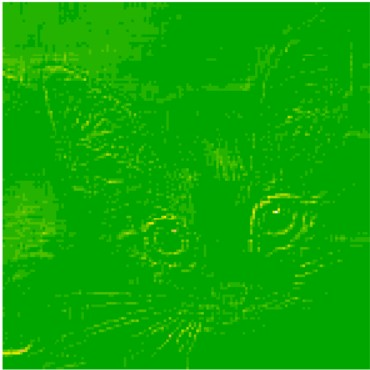
```

Try the seventh channel  but note channels may vary because the specific filters learned by convolution layers are not deterministic.

```{r}
plot_channel(first_layer_activation[1,,,7])
```

```{r, out.width = "300px", echo=FALSE}
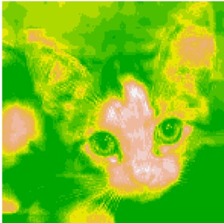
```

Cycle through all the channels not working - puzzled:

```{r}
image_size <- 58 
images_per_row <- 16

for (i in 1:8) {
     
     layer_activation <- activations[[i]] 
     layer_name <- model$layers[[i]]$name
     
     n_features <- dim(layer_activation)[[4]] 
     n_cols <- n_features %/% images_per_row
     
     png(paste0("cat_activations_", i, "_", layer_name, ".png"), 
         width = image_size * images_per_row, 
         height = image_size * n_cols)
     op <- par(mfrow = c(n_cols, images_per_row), mai = rep_len(0.02, 4))
     
     for (col in 0:(n_cols-1)) {
          for (row in 0:(images_per_row-1)) {
               channel_image <- layer_activation[1,,,(col*images_per_row) + row + 1]
               plot_channel(channel_image)} }
par(op) 
dev.off()
}
```

The code above should output something like this:

```{r, out.width = "4000px", echo=FALSE}
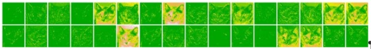
```
```{r, out.width = "4000px", echo=FALSE}
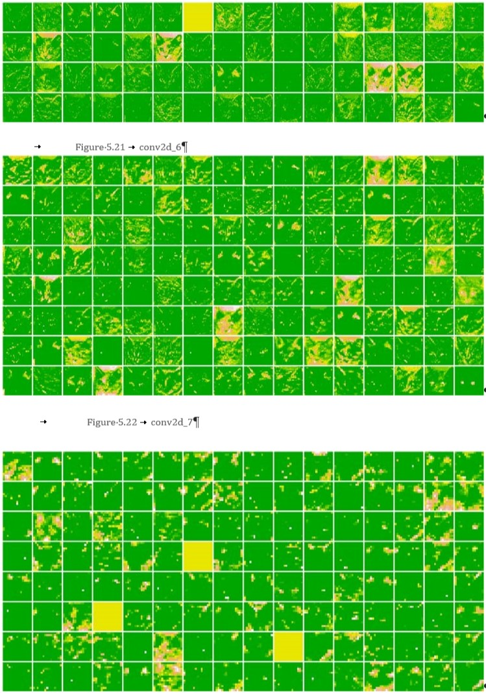
```

There are a few things to note here:

- The first layer acts as a collection of various edge detectors. At that stage, the activations retain almost all of the information present in the initial picture.
- As you go higher, the activations become increasingly abstract and less visually interpretable. They begin to encode higher-level concepts such as a cat ear and a cat eye. Higher presentations carry increasingly less information about the visual contents of the image, and increasingly more information related to the class of the image.
- The sparsity of the activations is increasing with the depth of the layer: in the first layer, all filters are activated by the input image, but in the following layers some filters are blank. This means that the pattern encoded by the filter is not found in the input image.

We have just evidenced an important universal characteristic of the representations learned by deep neural networks: *the features extracted by a layer become increasingly abstract with the depth of the layer*. The activations of higher layers carry less and less information about the specific input being seen, and more and more information about the target (in this case, the class of the image: cat or dog). *A deep neural network effectively acts as an information distillation pipeline*, with raw data going in (in this case, RGB pictures) and being repeatedly transformed so that irrelevant information is filtered out (for example, the specific visual appearance of the image), and useful information is magnified and refined (for example, the class of the image).

This is analogous to the way humans and animals perceive the world: after observing a scene for a few seconds, a human can remember which abstract objects were present in it (bicycle, tree) but cannot remember the specific appearance of these objects. In fact, if you tried to draw a generic bicycle from memory, chances are you could not get it even remotely right, even though you have seen thousands of bicycles in your lifetime. Your brain has learned to completely abstract its visual input to transform it into high-level visual concepts while filtering out irrelevant visual details making it tremendously difficult to remember how things around you look. 

### Visualizing convnet filters

Skipped this - did not find this content useful

### Visualizing Heatmaps of Class Activation

There is a 3rd visualization technique: one that is useful for understanding which parts of a given image led a convnet to its final classification decision. This is helpful for debugging the decision process of a convnet, particularly in the case of a classification mistake. It also allows you to locate specific objects in an image.

This general category of techniques is called `class activation map (CAM)` visualization and it consists of producing heatmaps of class activation over input images. A class activation heatmap is a 2D grid of scores associated with a specific output class, computed for every location in any input image, indicating how important each location is with respect to the class under consideration. For instance, given an image fed into a dogs-versus-cats convnet, CAM visualization allows you to generate a heatmap for the class cat, indicating how cat-like different parts of the image are, and also a heatmap for the class dog, indicating how dog-like parts of the image are.

The specific implementation you will use is the one described in *rad-CAM: Visual Explanations from Deep Networks via Gradient-based Localization.*  it is very simple: it consists of taking the output feature map of a convolution layer, given an input image, and weighing every channel in that feature map by the gradient of the class with respect to the channel. Intuitively, one way to understand this trick is that you are weighting a spatial map of *how intensely the input image activates different channels* by *how important each channel is with regard to the class,* resulting in a spatial map of *how intensely the input image activates the class.*

Demonstrate this technique using the pretrained `VGG16` network again.

```{r}
rm(list=ls())
model <- application_vgg16(weights = "imagenet")
```

Consider the image of two African elephants shown below (under a Creative Commons license), possibly a mother and her calf, strolling on the savanna.

```{r, out.width = "400px", echo=FALSE}
knitr::include_graphics("../images/elephant1.jpg")
```

Convert this image into something the `VGG16` model can read: the model was trained on images of size 224 x 244, preprocessed according to a few rules that are packaged in the utility function `imagenet_preprocess_input()`. You need to load the image, resize it to 224 x 224, convert it to an array, and apply these preprocessing rules.

```{r}
img_path <- "../images/elephant1.jpg" 
img <- image_load(img_path, target_size = c(224, 224)) %>% image_to_array() %>%
     array_reshape(dim = c(1, 224, 224, 3)) %>% imagenet_preprocess_input()
```

Now run the pretrained network on the image and decode its prediction vector back to a human-readable format:

```{r}
preds <- model %>% predict(img)
imagenet_decode_predictions(preds, top = 3)[[1]] 
```

```{}
     class_name     class_description   score
1    n02504458      African_elephant    0.909420729
2    n01871265      tusker              0.086183183
3    n02504013      Indian_elephant     0.004354581
```

The top three classes predicted for this image are as follows:

- African elephant (with 90.9% probability)
- Tusker (with 8.6% probability)
- Indian elephant (with 0.4% probability)

The network has recognized the image as containing an undetermined quantity of African elephants. The entry in the prediction vector that was maximally activated is the one corresponding to the African elephant class, at index 387:

```{r}
which.max(preds[1,]) [1] 
```

```{}
[1] 387
```

To visualize which parts of the image are the most African elephant like, set up the `Grad-CAM` process.

```{r eval=FALSE}
#African elephant entry in the prediction vector
african_elephant_output <- model$output[, 387]

# Output feature map od block5_conv3 layer, the last convolution layer in VGG16
last_conv_layer <- model %>% get_layer("block5_conv3") 

#Gradient of "African Elephant" class
grads <- k_gradients(african_elephant_output, last_conv_layer$output)[[1]] 

#Vector of shape 512 where each entry is th emean intensity of the gradient over s specific feature map channel
pooled_grads <- k_mean(grads, axis = c(1, 2, 3))

#Access the vlaues of quantities just defined
iterate <- k_function(list(model$input), 
                      list(pooled_grads, last_conv_layer$output[1,,,]))

#values of the 2 quantities given the sample images of 2 elephants
c(pooled_grads_value, conv_layer_output_value) %<-% iterate(list(img))

#Multiplies each channel in the feature map array by how important each channel is  with regrad to elephant class
for (i in 1:512) {
     conv_layer_output_value[,,i] <- 
          conv_layer_output_value[,,i] * pooled_grads_value[[i]]}

#Channel-wise mean of the resulting feature map is the heatmap of the class activation
heatmap <- apply(conv_layer_output_value, c(1,2), mean)
```

For visualization purposes, normalize the heatmap between 0 and 1.

```{r eval=FALSE}
heatmap <- pmax(heatmap, 0)
heatmap <- heatmap/max(heatmap)

# Function to write a heatmap to PNG

write_heatmap <- function(heatmap, filename, width = 224, height = 224, 
                          bg = "white", col = terrain.colors(12)) {
     png(filename, width = width, height = height, bg = bg) 
     op = par(mar = c(0,0,0,0)) 
     on.exit({par(op); dev.off()}, add = TRUE) 
     rotate <- function(x) t(apply(x, 2, rev)) 
     image(rotate(heatmap), axes = FALSE, asp = 1, col = col)}

write_heatmap(heatmap, "elephant_heatmap.png")
```

```{r, out.width = "400px", echo=FALSE}
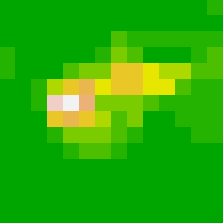
```

Use `magick` package to generate an image that superimposes the original image with the heatmap above.

```{r elephantOverlay}
library(magick)
library(viridis)

image <- image_read(img_path)
info <- image_info(image)
	
geometry <- sprintf("%dx%d!", info$width, info$height)

pal <- col2rgb(viridis(20), alpha = TRUE)
alpha <- floor(seq(0, 255, length = ncol(pal))) 
pal_col <- rgb(t(pal), alpha = alpha, maxColorValue = 255) 
write_heatmap(heatmap, "elephant_overlay.png", width = 14, height = 14, bg = NA, col = pal_col)
 
image_read("elephant_overlay.png") %>% image_resize(geometry, filter = "quadratic") %>% 
     image_composite(image, operator = "blend", compose_args = "20") %>% 
     plot()
```

```{r, out.width = "400px", echo=FALSE}

```

This visualization technique answers two important questions:

- Why did the network think this image contained an African elephant? 
- Where is the African elephant located in the picture?

it is interesting to note that the ears of the elephant calf are strongly activated: this is probably how the network can tell the difference between African and Indian elephants. 

##	Summary

- Convnets are the best tool for attacking visual-classification problems.
- Convnets work by learning a hierarchy of modular patterns and concepts to represent the visual world.
- The representations they learn are easy to inspect convnets are the opposite of black boxes!
- You now capable of training your own convnet from scratch to solve an image-classification problem.
- You understand how to use visual data augmentation to fight overfitting.
- You know how to use a pretrained convnet to do feature extraction and fine-tuning.
- You can generate visualizations of the filters learned by your convnets, as well as heatmaps of class activity.
