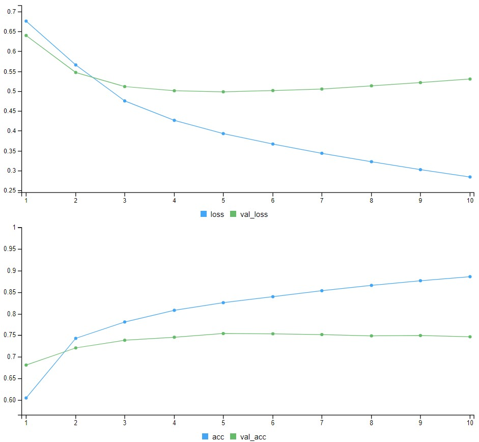
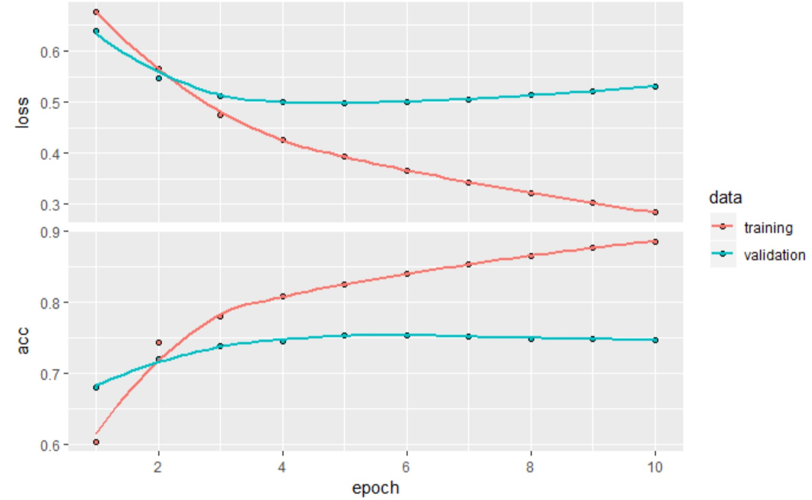
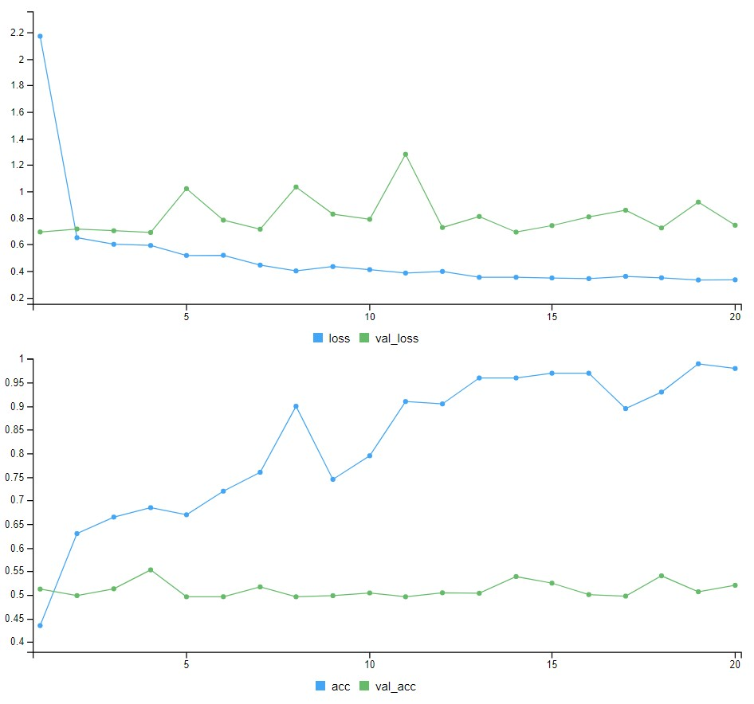
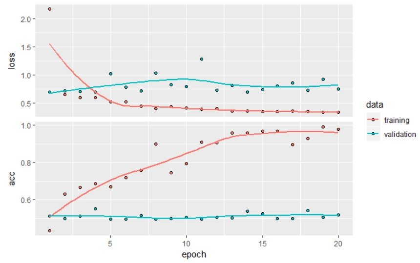
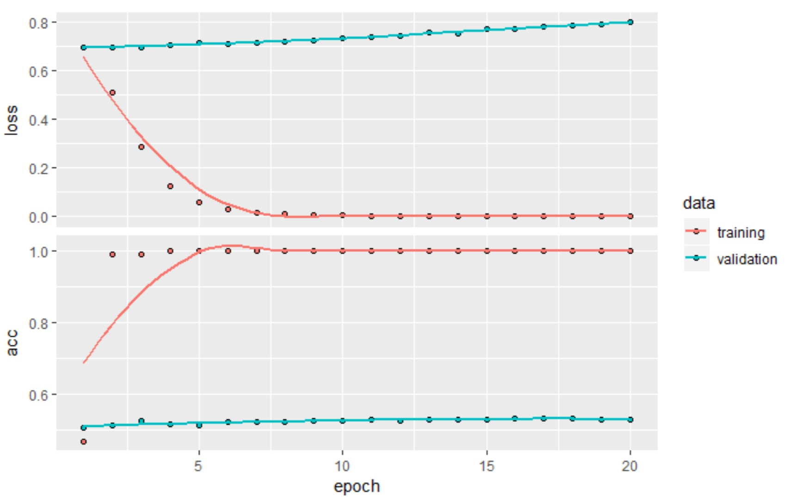
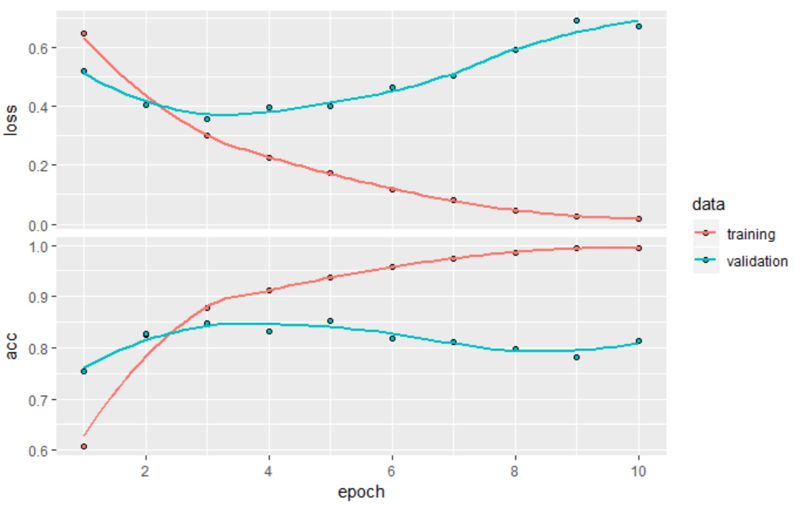
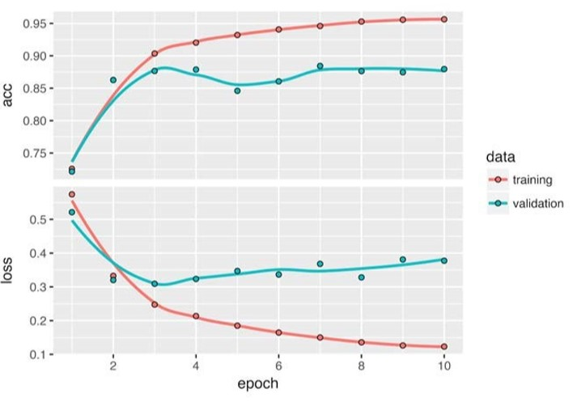

<style type="text/css">
p{ /* Normal  */
   font-size: 14px;
   line-height: 18px;}
body{ /* Normal  */
   font-size: 14px;}
td {  /* Table  */
   font-size: 12px;}
h1 { /* Header 1 */
 font-size: 26px;
 color: #4294ce;}
h2 { /* Header 2 */
 font-size: 22px;}
h3 { /* Header 3 */
 font-size: 18px;}
code.r{ /* Code block */
  font-size: 12px;}
pre { /* Code block */
  font-size: 12px}
#table-of-contents h2 {
background-color: #4294ce;}
#table-of-contents{
background: #688FAD;}
#nav-top span.glyphicon{
color: #4294ce;}
#postamble{
background: #4294ce;
border-top: ;}
</style>

```{r setup, include=FALSE}
knitr::opts_knit$set(
     root.dir = 'C:/Users/czwea/Documents/GitHub/DeepLearning/DeepLearningWithR/FinalDocs/')
knitr::opts_chunk$set(eval=FALSE)
```
```{r echo=FALSE, warning=FALSE, message=FALSE}
#remotes::install_github("rstudio/gt")
rm(list = ls())
if(!require(easypackages)){install.packages("easypackages")}
library(easypackages)
packages("tidyverse", "keras", "gt", "here", "stringr", prompt = TRUE)
setwd("~/GitHub/DeepLearning/DeepLearningWithR/FinalDocs/")
```

# Notes from *Deep Learning with R*

## Web Links

[Keras RStudio](https://keras.rstudio.com/)
[Book Code](https://github.com/jjallaire/deep-learning-with-r-notebooks)
[Live Book](https://www.manning.com/books/deep-learning-with-r)

> Install Anaconda with Python 6, update conda, then `install_keras`

- Anaconda2-4.3.1-Windows-x86_64
      - installed defaults including path and default Python
- conda update conda in Anaconda prompt (used admin rights by right clicking)
- `install_keras`

# Previous Lessons Learned

- Convnets are the best tool for attacking visual-classification problems.
- Convnets work by learning a hierarchy of modular patterns and concepts to represent the visual world.
- The representations they learn are easy to inspect convnets are the opposite of black boxes!
- You now capable of training your own convnet from scratch to solve an image-classification problem.
- You understand how to use visual data augmentation to fight overfitting.
- You know how to use a pretrained convnet to do feature extraction and fine-tuning.
- You can generate visualizations of the filters learned by your convnets, as well as heatmaps of class activity.

# Deep Learning for Text & Sequences

Now explore deep-learning models that can process text (understood as sequences of words or sequences of characters), timeseries, and sequence data in general. The two fundamental deep-learning algorithms for sequence processing are recurrent neural networks and 1D convnets, the one-dimensional version of the 2D convnets covered previously. 
 
Applications of these algorithms include the following:

- Document classification and timeseries classification, such as identifying the topic of an article or the author of a book
- Timeseries comparisons, such as estimating how closely related two documents or two stock tickers are
- Sequence-to-sequence learning, such as decoding an English sentence into French
- Sentiment analysis, such as classifying the sentiment of tweets or movie reviews as positive or negative
- Timeseries forecasting, such as predicting the future weather at a certain location, given recent weather data

Examples focus on two narrow tasks: sentiment analysis on the IMDB dataset and temperature forecasting.  The techniques demonstrated for these two tasks are relevant to all the applications just listed and many more.

## Text Data

Text is one of the most widespread forms of sequence data. It can be understood as either a sequence of characters or a sequence of words, but it is most common to work at the level of words. The deep-learning sequence-processing models can use text to produce a basic form of natural-language understanding, sufficient for applications including document classification, sentiment analysis, author identification, and even question answering (QA) in a constrained context. None of these deep-learning models truly understand text in a human sense; rather, these models can map the statistical structure of written language, which is sufficient to solve many simple textual tasks. Deep learning for natural-language processing is pattern recognition applied to words, sentences, and paragraphs, in much the same way that computer vision is pattern recognition applied to pixels.

Like all other neural networks, deep-learning models do not take as input raw text: they only work with numeric tensors. Vectorizing text is the process of transforming text into numeric tensors. This can be done in multiple ways:

- Segment text into words and transform each word into a vector.
- Segment text into characters and transform each character into a vector.
- Extract n-grams of words or characters and transform each n-gram into a vector.
 
Collectively, the different units into which you can break down text (words, characters, or n-grams) are called tokens and breaking text into such tokens is called tokenization. All text-vectorization processes consist of applying some tokenization scheme and then associating numeric vectors with the generated tokens. These vectors, packed into sequence tensors, are fed into deep neural networks. There are multiple ways to associate a vector with a token: 

- one-hot encoding of tokens
- token embedding (typically used exclusively for words called _word embedding_). 

----

**Understanding n-grams and bag-of-words**

Word n-grams are groups of N (or fewer) consecutive words that you can extract from a sentence. The same concept may also be applied to characters instead of words.

Here is a simple example. Consider the sentence _The cat sat on the mat_. It may be decomposed into the following set of 2-grams:

{"The", "The cat", "cat", "cat sat", "sat",
"sat on", "on", "on the", "the", "the mat", "mat"}

It may also be decomposed into the following set of 3-grams:

{"The", "The cat", "cat", "cat sat", "The cat sat",
"sat", "sat on", "on", "cat sat on", "on the", "the",
"sat on the", "the mat", "mat", "on the mat"}

Such a set is called a bag-of-2-grams or bag-of-3-grams, respectively. The term bag here refers to the fact that you are dealing with a set of tokens rather than a list or sequence: the tokens have no specific order. This family of tokenization methods is called bag-of-words.

Because bag-of-words is not an order-preserving tokenization method (the tokens generated are understood as a set, not a sequence, and the general structure of the sentences is lost), _it tends to be used in shallow language-processing models rather than in deep-learning models_.

_Extracting n-grams is a form of feature engineering and deep learning does away with this kind of rigid, brittle approach, replacing it with hierarchical feature learning_. One-dimensional convnets and recurrent neural networks are capable of learning representations for groups of words and characters without being explicitly told about the existence of such groups, by looking at continuous word or character sequences. For this reason, _n-grams are not covered herein. Keep in mind that they are a powerful, unavoidable feature-engineering tool when using lightweight, shallow, text-processing models such as logistic regression and random forests_.

----

### One-hot Encoding

One-hot encoding is the most common, most basic way to turn a token into a vector. It consists of associating a unique integer index with every word and then turning this integer index `i` into a binary vector of size N (the size of the vocabulary); the vector is all zeros except for the `i` th entry, which is 1.

Keras has built-in utilities for doing one-hot encoding of text at the word level or character level, starting from raw text data. You should use these utilities because they perform a number of important features such as stripping special characters from strings and only taking into account the N most common words in your dataset (a common restriction, to avoid dealing with very large input vector spaces).

```{r}
samples <- c("The cat sat on the mat.", "The dog ate my homework.")

tokenizer <- text_tokenizer(num_words = 1000) %>% #Creates tokenizer for 1000 most common words
     fit_text_tokenizer(samples) #Builds the word index

sequences <- texts_to_sequences(tokenizer, samples) 
# Strings into lists of integer indicies

one_hot_results <- texts_to_matrix(tokenizer, samples, mode = "binary") 
#Could also get directly get one hot binary represemntations
#Vectorization models other than one hot are supported

#FYI - subset matrix 
#one_hot_results[one_hot_results[,] ==1]

word_index <- tokenizer$word_index 
# How you can recover the word from the indicies

cat("Found", length(word_index), "unique tokens.\n")
```

```{}
Found 9 unique tokens.
```

A variant of one-hot encoding is the `one-hot hashing trick`, which you use when _the number of unique tokens in your vocabulary is too large to handle explicitly_. Instead of explicitly assigning an index to each word and keeping a reference of these indices in a dictionary, you can hash words into vectors of fixed size. This is typically done with a very lightweight hashing function. *The main advantage of this method is that it does away with maintaining an explicit word index, which saves memory and allows online encoding of the data* (you can generate token vectors right away, before you have seen all of the available data). The one drawback of this approach is that *it is susceptible to hash collisions*: two different words may end up with the same hash, and subsequently any machine-learning model looking at these hashes will not be able to tell the difference between these words. The likelihood of hash collisions decreases when the dimensionality of the hashing space is much larger than the total number of unique tokens being hashed.

```{r}
library(hashFunction)


samples <- c("The cat sat on the mat.", "The dog ate my homework.")

dimensionality <- 1000
#Stores the words as vectors of size 1,000. If you have close to 1,000 words (or more), you will see many hash collisions, which will decrease the accuracy of this encoding method.

max_length <- 10 

results <- array(0, dim = c(length(samples), max_length, dimensionality))

for (i in 1:length(samples)) {
     sample <- samples[[i]] 
     words <- head(strsplit(sample, " ")[[1]], n = max_length) 
     for (j in 1:length(words)) { 
          index <- abs(spooky.32(words[[i]])) %% dimensionality 
          #hashes word into a random integer index between 0 and 1000
          results[[i, j, index]] <- 1}
	}
```

### Using Word Bmbeddings

Another popular and powerful way to associate a vector with a word is the use of dense word vectors, also called `word embeddings`. Whereas the vectors obtained through one-hot encoding are binary, sparse (mostly made of zeros), and very high-dimensional (same dimensionality as the number of words in the vocabulary), word embeddings are low dimensional floating-point vectors (that is, dense vectors, as opposed to sparse vectors). Unlike the word vectors obtained via one-hot encoding, word embeddings are learned from data. It is common to see word embeddings that are 256-dimensional, 512-dimensional, or 1,024-dimensional, when dealing with very large vocabularies. One-hot encoding words generally leads to vectors that are 20,000-dimensional or greater (capturing a vocabulary of 20,000 tokens, in this case). So, word embeddings pack more information into far fewer dimensions.

There are two ways to obtain word embeddings:

- Learn word embeddings jointly with the main task you care about (such as document classification or sentiment prediction). In this setup, you start with random word vectors and then learn word vectors in the same way you learn the weights of a neural network.
- Load into your model word embeddings that were precomputed using a different machine-learning task than the one you are trying to solve. These are called `pretrained word embeddings`.

The simplest way to associate a dense vector with a word is to choose the vector at random. The problem with this approach is that the resulting embedding space has no structure: for instance, the words `accurate` and `exact` may end up with completely different embeddings, even though they are interchangeable in most sentences. It is difficult for a deep neural network to make sense of such a noisy, unstructured embedding space.

To get a bit more abstract, the geometric relationships between word vectors should reflect the semantic relationships between these words. *Word embeddings are meant to map human language into a geometric space*. You would expect synonyms to be embedded into similar word vectors; and in general, you would expect the geometric distance (such as L2 distance) between any two word vectors to relate to the semantic distance between the associated words (words meaning different things are embedded at points far away from each other, whereas related words are closer). In addition to distance, you may want specific directions in the embedding space to be meaningful. To make this clearer, consider a example.

Imagine four words are embedded on a 2D plane: cat, dog, wolf, and tiger. With the vector representations we chose here, some semantic relationships between these words can be encoded as geometric transformations. For instance, the same vector allows us to go from cat to tiger and from dog  to wolf: this vector could be interpreted as a from pet to wild animal vector. Similarly, another vector lets us go from dog to cat and from wolf to tiger, which could be interpreted as a from canine to feline vector.

In real-world word-embedding spaces, common examples of meaningful geometric transformations are _gender_ vectors and _plural_ vectors. For instance, by adding a _female_ vector to the vector _king_, we obtain the vector _queen._ By adding a _plural_ vector, we obtain _kings._ Word-embedding spaces typically feature thousands of such interpretable and potentially useful vectors.

What makes a good word-embedding space depends heavily on your task: the perfect word-embedding space for an English-language movie-review sentiment analysis model may look different from the perfect embedding space for an English language legal-document-classification model because the importance of certain semantic relationships varies from task to task.  _It is reasonable then to learn a new embedding space with every new task. Fortunately, backpropagation makes this easy, and Keras makes it even easier_. It is about learning the weights of a layer using `layer_embedding.`

```{r eval=FALSE}
embedding_layer <- layer_embedding(input_dim = 1000, output_dim = 64)
```

The embedding layer takes at least two arguments: 

- the number of possible tokens (here, 1,000) 
- the dimensionality of the embeddings (here, 64)

`layer_embedding` is best understood as a dictionary that maps integer indices (which stand for specific words) to dense vectors. It takes integers as input, it looks up these integers in an internal dictionary, and it returns the associated vectors. it is effectively a dictionary lookup.

An embedding layer takes as input a 2D tensor of integers, of shape (samples, sequence_length), where each entry is a sequence of integers. It can embed sequences of variable lengths: for instance, you could feed into the embedding layer batches with shapes (32, 10) (batch of 32 sequences of length 10) or (64, 15) (batch of 64 sequences of length 15). _All sequences in a batch must have the same length, though (because you need to pack them into a single tensor), so sequences that are shorter than others should be padded with zeros, and sequences that are longer should be truncated_.

This layer returns a 3D floating-point tensor of shape (samples, sequence_ length, embedding_dimensionality). Such a 3D tensor can then be processed by an RNN layer or a 1D convolution layer.

When you instantiate an embedding layer, its weights (its internal dictionary of token vectors) are initially random, just as with any other layer. During training, these word vectors are gradually adjusted via backpropagation, structuring the space into something the downstream model can exploit. Once fully trained, the embedding space will show a lot of structure a kind of structure specialized for the specific problem for which you are training your model.

Apply this idea to the IMDB movie-review sentiment-prediction task that you are already familiar with. 

- prepare the data
- restrict the movie reviews to the top 10,000 most common words 
- cut off the reviews after 20 words
- the network will learn 8-dimensional embeddings for each of the 10,000 words
- turn the input integer sequences (2D integer tensor) into embedded sequences (3D float tensor)
- flatten the tensor to 2D
- train a single dense layer on top for classification

```{r eval=FALSE}
rm(list=ls())         
max_features <- 10000 # Number of words to consider as features
maxlen <- 20          # Cuts off the text after this number of words (among the max_features most common words)

imdb <- dataset_imdb(num_words = max_features)
c(c(x_train, y_train), c(x_test, y_test)) %<-% imdb
# loads data as lists of integers

x_train <- pad_sequences(x_train, maxlen = maxlen)
# Turns the lists of integers into a 2D integer tensor of shape(samples, maxlen)

x_test <- pad_sequences(x_test, maxlen = maxlen)
####

model_Embedding <- keras_model_sequential() %>%
     
     # Specifies the maximum input length to the embedding layer so you can later flatten the embedded inputs. After the embedding layer, the activations have shape (samples, maxlen, 8).
     layer_embedding(input_dim = 10000, output_dim = 8, input_length = maxlen) %>%
     
     # Flattens the 3D tensor of embeddings into a 2D tensor of shape (samples, maxlen * 8)
     layer_flatten() %>% layer_dense(units = 1, activation = "sigmoid")

model_Embedding %>% compile(optimizer = "rmsprop", loss = "binary_crossentropy", metrics = c("acc")) 

#summary(model_Embedding)
```
```{r eval=FALSE}
history_Embedding <- model_Embedding %>% fit(x_train, y_train, epochs = 10, batch_size = 32, 
                                             validation_split = 0.2 )
plot(history_Embedding)
```
```{}
Train on 20000 samples, validate on 5000 samples
Epoch 1/10
20000/20000 [==============================] - 3s 141us/step - loss: 0.6759 - acc: 0.6044 - val_loss: 0.6398 - val_acc: 0.6808
Epoch 2/10
20000/20000 [==============================] - 2s 119us/step - loss: 0.5657 - acc: 0.7428 - val_loss: 0.5467 - val_acc: 0.7206
Epoch 3/10
20000/20000 [==============================] - 2s 123us/step - loss: 0.4752 - acc: 0.7808 - val_loss: 0.5113 - val_acc: 0.7384
.
.
.
```

```{r, out.width = "400px", echo=FALSE}

```

```{r, out.width = "400px", echo=FALSE}

```

You get to a validation accuracy of ~76%, which is pretty good considering that you are only looking at 20 words from each review. But note that merely flattening the embedded sequences and training a single dense layer on top leads to a model that treats each word in the input sequence separately, without considering inter-word relationships and sentence structure (for example, this model would likely treat both _this movie is a bomb_ and _this movie is the bomb_ as being negative reviews). it is much better to add recurrent layers or 1D convolutional layers on top of the embedded sequences *to learn features that take into account each sequence as a whole*.

#### Pretrained Word Embeddings

Sometimes you have so little training data available that you cannot use your data alone to learn an appropriate task-specific embedding of your vocabulary.

Instead of learning word embeddings jointly with the problem you want to solve, you can load embedding vectors from a precomputed embedding space that you know is highly structured and exhibits useful properties that captures generic aspects of language structure. The rationale behind using pretrained word embeddings in natural-language processing is much the same as for using pretrained convnets in image classification: you do not have enough data available to learn truly powerful features on your own, but you expect the features that you need to be fairly generic that is, common visual features or semantic features. In this case, it makes sense to reuse features learned on a different problem.

Such word embeddings are generally computed using word-occurrence statistics (observations about what words co-occur in sentences or documents), using a variety of techniques, some involving neural networks, others not. 

There are various precomputed databases of word embeddings you can download and use in a Keras embedding layer. `Word2vec` is one of them. Another popular one is called `Global Vectors for Word Representation` (_GloVe_, https://nlp.stanford .edu/projects/glove), which was developed by Stanford researchers in 2014. This embedding technique is based on factorizing a matrix of word co-occurrence statistics. Its developers have made available precomputed embeddings for millions of English tokens, obtained from Wikipedia data and Common Crawl data.

Look at how you can get started using `GloVe` embeddings in a Keras model. (The same method is valid for `Word2vec` embeddings or any other word-embedding database.) 

#### Raw Text to Word Embeddings

First, download the raw IMDB dataset from http://mng.bz/0tIo. Uncompress it.  Collect the individual training reviews into a list of strings, one string per review. Also collect the review labels (positive/negative) into a labels list. 

__I like the code below!__
```{r eval=FALSE}
rm(list=ls())
imdb_dir <- "../../../LargeDataFiles/IMDB" 
train_dir <- file.path(imdb_dir, "train")
labels <- c() 
texts <- c()
for (label_type in c("neg", "pos")) {
     label <- switch(label_type, neg = 0, pos = 1) 
     dir_name <- file.path(train_dir, label_type) 
     for (fname in list.files(dir_name, pattern = glob2rx("*.txt"), full.names = TRUE)) {
          texts <- c(texts, readChar(fname, file.info(fname)$size)) 
          labels <- c(labels, label)}
}
```

#### Tokenize the Data

Vectorize the text and prepare a training and validation split. Because pretrained word embeddings are meant to be particularly useful on problems where little training data is available (otherwise, task-specific embeddings are likely to outperform them), add the following twist: restricting the training data to the first 200 samples. So you will learn to classify movie reviews after looking at just 200 examples.

```{r eval=FALSE}
maxlen <- 100 
training_samples <- 200 
validation_samples <- 10000 
max_words <- 10000

tokenizer <- text_tokenizer(num_words = max_words) %>% fit_text_tokenizer(texts)
 
sequences <- texts_to_sequences(tokenizer, texts)

word_index = tokenizer$word_index 
cat("Found", length(word_index), "unique tokens.\n") 

data <- pad_sequences(sequences, maxlen = maxlen)

labels <- as.array(labels) 
cat("Shape of data tensor:", dim(data), "\n") 
cat('Shape of label tensor:', dim(labels), "\n")

indices <- sample(1:nrow(data)) #shuffle data- samples are ordered (neg come first in raw data)
training_indices <- indices[1:training_samples] 
validation_indices <- indices[(training_samples + 1):
                                   (training_samples + validation_samples)]

x_train <- data[training_indices,] 
y_train <- labels[training_indices]

x_val <- data[validation_indices,] 
y_val <- labels[validation_indices]
```

```{}
Found 88584 unique tokens.
Shape of data tensor: 25000 100
Shape of label tensor: 25000 
```

#### Download Glove Word Embeddings

Go to https://nlp.stanford.edu/projects/glove, and download the precomputed embeddings from 2014 English Wikipedia. it is an 822 MB zip file called glove.6B.zip, containing 100-dimensional embedding vectors for 400,000 words (or nonword tokens). Unzip it. 

#### Preprocess Embeddings

Parse the unzipped file (a .txt file) to build an index that maps words (as strings) to their vector representation (as number vectors).

```{r gloceEmbedding, eval=FALSE}
glove_dir = "../../../LargeDataFiles/Glove" 
lines <- readLines(file.path(glove_dir, "glove.6B.100d.txt")) 
embeddings_index <- new.env(hash = TRUE, parent = emptyenv()) 

for (i in 1:length(lines)) {
     line <- lines[[i]] 
     values <- strsplit(line, " ")[[1]] 
     word <- values[[1]] 
     embeddings_index[[word]] <- as.double(values[-1])} 

cat("Found", length(embeddings_index), "word vectors.\n")
```

`Found 40000 word vectors.`

Build an embedding matrix that you can load into an embedding layer. It must be a matrix of shape (max_words, embedding_dim), where each entry `i` contains the `embedding_dim-dimensional` vector for the word of index `i` in the reference word index (built during tokenization). Note that index 1 is a placeholder.
 
```{r eval=FALSE}
embedding_dim <- 100 
embedding_matrix <- array(0, c(max_words, embedding_dim))

for (word in names(word_index)) {
     index <- word_index[[word]] 
     if (index < max_words) {
          embedding_vector <- embeddings_index[[word]]
          if (!is.null(embedding_vector))
               embedding_matrix[index+1,] <- embedding_vector}
}
```

#### Define Model

```{r eval=FALSE}
model_Glove <- keras_model_sequential() %>%
     layer_embedding(input_dim = max_words, output_dim = embedding_dim, input_length = maxlen) %>%
     layer_flatten() %>% layer_dense(units = 32, activation = "relu") %>% 
     layer_dense(units = 1, activation = "sigmoid") 
summary(model_Glove)
```

```{}
Layer (type)                            Output Shape                       Param #       
=========================================================================================
embedding_3 (Embedding)                 (None, 100, 100)                   1000000       
_________________________________________________________________________________________
flatten_2 (Flatten)                     (None, 10000)                      0             
_________________________________________________________________________________________
dense_2 (Dense)                         (None, 32)                         320032        
_________________________________________________________________________________________
dense_3 (Dense)                         (None, 1)                          33            
=========================================================================================
Total params: 1,320,065
Trainable params: 320,065
Non-trainable params: 1,000,000
_________________________________________________________________________________________
```

#### Load Glove in Model

The embedding layer has a single weight matrix: a 2D float matrix where each entry `i` is the word vector meant to be associated with index `i`. Load the GloVe matrix you prepared into the embedding layer, the first layer in the model.

```{r eval=FALSE}
get_layer(model_Glove, index = 1) %>% set_weights(list(embedding_matrix)) %>% freeze_weights()
```

Additionally, freeze the weights of the embedding layer, following the same rationale you are already familiar with in the context of pretrained convnet features: when parts of a model are pretrained (like your embedding layer) and parts are randomly initialized (like your classifier), the pretrained parts should not be updated during training, to avoid forgetting what they already know. The large gradient updates triggered by the randomly initialized layers would be disruptive to the already-learned features. 

#### Train & Evaluate

```{r eval=FALSE}
model_Glove %>% compile(optimizer = "rmsprop", loss = "binary_crossentropy", metrics = c("acc"))

history_Glove <- model_Glove %>% fit(x_train, y_train, epochs = 20, batch_size = 32, 
                                     validation_data = list(x_val, y_val)) 

#save_model_weights_hdf5(model_Glove, "./models/pre_trained_glove_model.h5") 
plot(history_Glove)
```

```{}
Train on 200 samples, validate on 10000 samples
Epoch 1/20
200/200 [==============================] - 1s 7ms/step - loss: 2.1689 - acc: 0.4350 - val_loss: 0.6930 - val_acc: 0.5124
Epoch 2/20
200/200 [==============================] - 1s 5ms/step - loss: 0.6503 - acc: 0.6300 - val_loss: 0.7156 - val_acc: 0.4985
Epoch 3/20
200/200 [==============================] - 1s 5ms/step - loss: 0.6005 - acc: 0.6650 - val_loss: 0.7025 - val_acc: 0.5130
Epoch 4/20
200/200 [==============================] - 1s 5ms/step - loss: 0.5916 - acc: 0.6850 - val_loss: 0.6894 - val_acc: 0.5531
```

```{r, out.width = "400px", echo=FALSE}

```

```{r, out.width = "400px", echo=FALSE}

```

The model quickly starts overfitting, which is  not surprising given the small number of training samples. Validation accuracy has high variance for the same reason, but it seems to reach the high 50s.

Note that your mileage may vary: because you have so few training samples, performance is heavily dependent on exactly which 200 samples you choose and you are choosing them at random. 

If this works poorly for you, try choosing a different random set of 200 samples, for the sake of the exercise (in real life, you do not get to choose your training data).

You can also train the same model without loading the pretrained word embeddings and without freezing the embedding layer. In that case, you will learn a task-specific embedding of the input tokens, which is generally more powerful than pretrained word embeddings when lots of data is available. But in this case, you have only 200 training samples. 

```{r eval=FALSE}
model_NoEmbed <- keras_model_sequential() %>%
     layer_embedding(input_dim = max_words, 
                     output_dim = embedding_dim, input_length = maxlen) %>%
     layer_flatten() %>% 
     layer_dense(units = 32, activation = "relu") %>% 
     layer_dense(units = 1, activation = "sigmoid") 

model_NoEmbed %>% compile(
     optimizer = "rmsprop", 
     loss = "binary_crossentropy", 
     metrics = c("acc"))

history_NoEmbed <- model_NoEmbed %>% fit(
     x_train, 
     y_train, 
     epochs = 20, 
     batch_size = 32,
     validation_data = list(x_val, y_val))

plot(history_NoEmbed)
```

```{r, out.width = "400px", echo=FALSE}

```

Validation accuracy stalls in the mid 50s. So in this case, pretrained word embeddings outperform jointly learned embeddings. If you increase the number of training samples, this will quickly stop being the case.

Finally, evaluate the model on the test data. First, tokenize the test data.
 
```{r eval=FALSE}
test_dir <- file.path(imdb_dir, "test")
labels <- c() 
texts <- c()

for (label_type in c("neg", "pos")) {
     label <- switch(label_type, neg = 0, pos = 1) 
     dir_name <- file.path(test_dir, label_type) 
     for (fname in list.files(dir_name, pattern = glob2rx("*.txt"), full.names = TRUE)) {
          texts <- c(texts, readChar(fname, file.info(fname)$size)) 
          labels <- c(labels, label)} 
}

sequences <- texts_to_sequences(tokenizer, texts) 
x_test <- pad_sequences(sequences, maxlen = maxlen) 
y_test <- as.array(labels)

model_NoEmbed %>% 
     load_model_weights_hdf5("./models/pre_trained_glove_model.h5") %>% evaluate(x_test, y_test)
```

`25000/25000 [==============================] - 3s 105us/step`
`$loss`
`[1] 1.424911`

`$acc`
`[1] 0.57176`

You get an poor test accuracy of 58%. Working with just a handful of training samples is difficult!

### Wrapping up

Now you are able to do the following:

- Turn raw text into something a neural network can process
- Use an embedding layer in a Keras model to learn task-specific token embeddings
- Use pretrained word embeddings to get an extra boost on small natural language-processing problems 

## Understanding RNN

A characteristic of all neural networks such as densely connected networks and convnets, is that they have no memory. Each input shown to them is processed independently, with no state kept in between inputs. With such networks, in order to process a sequence or a temporal series of data points, you have to show the entire sequence to the network at once: turn it into a single data point. For instance, this is what you did in the IMDB example: an entire movie review was transformed into a single large vector and processed in one go. Such networks are called `feed forward networks`.

In contrast, as you are reading the present sentence, you are processing it word by word while keeping memories of what came before; this gives you a fluid representation of the meaning conveyed by this sentence. Biological intelligence processes information incrementally while maintaining an internal model of what it is processing, built from past information and constantly updated as new information comes in.

A recurrent neural network (RNN) adopts the same principle, albeit in an extremely simplified version: it processes sequences by iterating through the sequence elements and maintaining a state containing information relative to what it has seen so far. In effect, an RNN is a type of neural network that has an internal loop. The state of the RNN is reset between processing two different, independent sequences (such as two different IMDB reviews), so you still consider one sequence a single data point: a single input to the network. What changes is that this data point is no longer processed in a single step; rather, the network internally loops over sequence elements.

An RNN is a for loop that reuses quantities computed during the previous iteration of the loop, nothing more. Of course, there are many different RNNs fitting this definition that you could build. RNNs are characterized by their step function.

### Recurrent layer in Keras

Like all recurrent layers in Keras, `layer_simple_rnn` can be run in two different modes: 

- it can return either the full sequences of successive outputs for each timestep (a
3D tensor of shape (batch_size, timesteps, output_features)) 
- only the last output for each input sequence (a 2D tensor of shape (batch_size, output_features))

These two modes are controlled by the `return_sequences` constructor argument. Look at an example that uses `layer_simple_rnn` and returns only the output at the last timestep:

```{r}
modelRNN <- keras_model_sequential() %>%
     layer_embedding(input_dim = 10000, output_dim = 32) %>% 
     layer_simple_rnn(units = 32)
summary(modelRNN)
```

```{}
___________________________________________________________________________________________________________________________________
Layer (type)                                              Output Shape                                         Param #             
===================================================================================================================================
embedding_4 (Embedding)                                   (None, None, 32)                                     320000              
___________________________________________________________________________________________________________________________________
simple_rnn_1 (SimpleRNN)                                  (None, 32)                                           2080                
===================================================================================================================================
Total params: 322,080
Trainable params: 322,080
Non-trainable params: 0
___________________________________________________________________________________________________________________________________
```

The following example returns the full state sequence:

```{r}
modelRRN2 <- keras_model_sequential() %>%
     layer_embedding(input_dim = 10000, output_dim = 32) %>% 
     layer_simple_rnn(units = 32, return_sequences = TRUE)
summary(modelRRN2)
```

```{}
___________________________________________________________________________________________________________________________________
Layer (type)                                              Output Shape                                         Param #             
===================================================================================================================================
embedding_5 (Embedding)                                   (None, None, 32)                                     320000              
___________________________________________________________________________________________________________________________________
simple_rnn_2 (SimpleRNN)                                  (None, None, 32)                                     2080                
===================================================================================================================================
Total params: 322,080
Trainable params: 322,080
Non-trainable params: 0
___________________________________________________________________________________________________________________________________
```

It is sometimes useful to stack several recurrent layers one after the other in order to increase the representational power of a network. In such a setup, _you have to get all of the intermediate layers to return full sequences_:

```{r}
modelRNN3 <- keras_model_sequential() %>%
     layer_embedding(input_dim = 10000, output_dim = 32) %>% 
     layer_simple_rnn(units = 32, return_sequences = TRUE) %>% 
     layer_simple_rnn(units = 32, return_sequences = TRUE) %>% 
     layer_simple_rnn(units = 32, return_sequences = TRUE) %>% 
     layer_simple_rnn(units = 32)
 
summary(modelRNN3)
```

```{}
___________________________________________________________________________________________________________________________________
Layer (type)                                              Output Shape                                         Param #             
===================================================================================================================================
embedding_6 (Embedding)                                   (None, None, 32)                                     320000              
___________________________________________________________________________________________________________________________________
simple_rnn_3 (SimpleRNN)                                  (None, None, 32)                                     2080                
___________________________________________________________________________________________________________________________________
simple_rnn_4 (SimpleRNN)                                  (None, None, 32)                                     2080                
___________________________________________________________________________________________________________________________________
simple_rnn_5 (SimpleRNN)                                  (None, None, 32)                                     2080                
___________________________________________________________________________________________________________________________________
simple_rnn_6 (SimpleRNN)                                  (None, 32)                                           2080                
===================================================================================================================================
Total params: 328,320
Trainable params: 328,320
Non-trainable params: 0
___________________________________________________________________________________________________________________________________
```

Use such a model on the IMDB movie-review-classification problem. First, preprocess the data.

```{r eval=FALSE}
rm(list = ls())
max_features <- 10000
maxlen <- 500
batch_size <- 32

cat("Loading data...\n") 
imdb <- dataset_imdb(num_words = max_features) 
c(c(input_train, y_train), c(input_test, y_test)) %<-% imdb 

cat(length(input_train), "train sequences\n") 
cat(length(input_test), "test sequences")
cat("Pad sequences (samples x time)\n") 

input_train <- pad_sequences(input_train, maxlen = maxlen) 
input_test <- pad_sequences(input_test, maxlen = maxlen) 
cat("input_train shape:", dim(input_train), "\n") 
cat("input_test shape:", dim(input_test), "\n")

modelRNN4 <- keras_model_sequential() %>%
     layer_embedding(input_dim = max_features, output_dim = 32) %>% 
     layer_simple_rnn(units = 32) %>% 
     layer_dense(units = 1, activation = "sigmoid")

modelRNN4 %>% compile(
     optimizer = "rmsprop", loss = "binary_crossentropy", metrics = c("acc"))

historyRNN4 <- modelRNN4 %>% fit(input_train, y_train, epochs = 10, batch_size = 128, 
                                 validation_split = 0.2)

plot(historyRNN4)
``` 

```{r, out.width = "400px", echo=FALSE}

```

As a reminder, in chapter 3, the first naive approach to this dataset got you to a test accuracy of 88%. Unfortunately, this small recurrent network does not perform well compared to this baseline. Part of the problem is that your inputs only consider the first 500 words, rather than full sequences hence, the RNN has access to less information than the earlier baseline model. The remainder of the problem is that `layer_simple_rnn` is not good at processing long sequences, such as text. Other types of recurrent layers perform much better. Look at some more-advanced layers. 

### LSTM and GRU Layers

Simple RNNs are not the only recurrent layers available in Keras. There are two others:

- layer_lstm 
- layer_gru

In practice, you will always use one of these, because `layer_simple_rnn` is generally too simplistic to be of real use. One major issue with `layer_simple_rnn` is that although it should theoretically be able to retain at time `t` information about inputs seen many timesteps before, in practice, such long-term dependencies are impossible to learn. This is due to the vanishing gradient problem, an effect that is similar to what is observed with non-recurrent networks (feedforward networks) that are many layers deep: as you keep adding layers to a network, the network eventually becomes untrainable. The LSTM and GRU layers are designed to solve this problem.

The Long Short-Term Memory (LSTM) is a variant of `layer_simple_rnn`; it adds a way to carry information across many timesteps. Imagine a conveyor belt running parallel to the sequence you are processing. Information from the sequence can jump onto the conveyor belt at any point, be transported to a later timestep, and jump off, intact, when you need it. This is essentially what LSTM does: it saves information for later, thus preventing older signals from gradually vanishing during processing.

### LSTM example in Keras

Set up a model using `layer_lstm` and train it on the IMDB data. The network is similar to the one with `layer_simple_rnn` that was just presented. You only specify the output dimensionality of `layer_lstm`; leave every other argument (there are many) at the Keras defaults. Keras has good defaults, and things will almost always just work without you having to spend time tuning parameters by hand.

```{r LSTM1, eval=FALSE}
model_LSTM1 <- keras_model_sequential() %>%
     layer_embedding(input_dim = max_features, output_dim = 32) %>% 
     layer_lstm(units = 32) %>%
     layer_dense(units = 1, activation = "sigmoid")

model_LSTM1 %>% compile(
     optimizer = "rmsprop", loss = "binary_crossentropy", metrics = c("acc"))

history_LSTM1 <- model_LSTM1 %>% fit(
     input_train, y_train, epochs = 10, batch_size = 128, validation_split = 0.2)
plot(history_LSTM1)
```

```{r, out.width = "400px", echo=FALSE}

```

This time, you achieve up to 88% validation accuracy. Not bad: certainly much better than the simple RNN network That is largely because LSTM suffers much less from the vanishing-gradient problem and slightly better than the fully connected approach earlier, even though you are looking at less data than you were then.

you are truncating sequences after 500 timesteps, whereas before you were considering full sequences.

But this result is not groundbreaking for such a computationally intensive approach. Why is not LSTM performing better? One reason is that you made no effort to tune hyperparameters such as the embeddings dimensionality or the LSTM output dimensionality. Another may be lack of regularization. But honestly, the primary reason is that analyzing the global, long-term structure of the reviews (what LSTM is good at) is not helpful for a sentiment-analysis problem. Such a basic problem is well solved by looking at what words occur in each review, and at what frequency. That is what the first fully connected approach looked at. But there are far more difficult natural language-processing problems out there, where the strength of LSTM will become apparent: in particular, question answering and machine translation.

### Wrapping up LSTM

Now you understand the following:
- What RNNs are and how they work
- What LSTM is, and why it works better on long sequences than a naive RNN
- How to use Keras RNN layers to process sequence data
