<style type="text/css">
p{ /* Normal  */
   font-size: 14px;
   line-height: 18px;}
body{ /* Normal  */
   font-size: 14px;}
td {  /* Table  */
   font-size: 12px;}
h1 { /* Header 1 */
 font-size: 26px;
 color: #4294ce;}
h2 { /* Header 2 */
 font-size: 22px;}
h3 { /* Header 3 */
 font-size: 18px;}
code.r{ /* Code block */
  font-size: 12px;}
pre { /* Code block */
  font-size: 12px}
#table-of-contents h2 {
background-color: #4294ce;}
#table-of-contents{
background: #688FAD;}
#nav-top span.glyphicon{
color: #4294ce;}
#postamble{
background: #4294ce;
border-top: ;}
</style>

```{r setup, include=FALSE}
knitr::opts_knit$set(
     root.dir = 'C:/Users/czwea/Documents/GitHub/DeepLearning/Deep_Learning_with_R')
```
```{r echo=FALSE, warning=FALSE, message=FALSE}
#remotes::install_github("rstudio/gt")

if(!require(easypackages)){install.packages("easypackages")}
library(easypackages)
packages("tidyverse", "keras", "gt", "here", prompt = TRUE)
```

# Notes from *Deep Learning with R*

## Web Links

[Keras RStudio](https://keras.rstudio.com/)
[Book Code](https://github.com/jjallaire/deep-learning-with-r-notebooks)
[Live Book](https://www.manning.com/books/deep-learning-with-r)

> Install Anaconda with Python 6, update conda, then install_keras

- Anaconda2-4.3.1-Windows-x86_64
      - installed defaults including path and default Python
- conda update conda in Anaconda prompt (used admin rights by right clicking)
- install_keras

# Part 1: Fundamentals of Deep Learning

Anatomy of a neural network:

Training a neural network revolves around the following objects:

1. Layers, which are combined into a network (or model) 
2. The input data and corresponding targets
3. The loss function, which defines the feedback signal used for learning 
4. The optimizer, which determines how learning proceeds 

1. The fundamental data structure in neural networks is the layer, to which you were introduced in chapter 2. A layer is a data-processing module that takes as input one or more tensors and that outputs one or more tensors. Some layers are stateless, but more frequently layers have a state: the layer’s weights, one or several tensors learned with stochastic gradient descent, which together contain the network’s knowledge. 

2. Different layers are appropriate for different tensor formats and different types of data processing. For instance, simple vector data, stored in 2D tensors of shape (samples, features), is often processed by densely connected layers, also called fully connected or dense layers (the layer_dense function in Keras). Sequence data, stored in 3D tensors of shape (samples, timesteps, features), is typically processed by recurrent layers such as layer_lstm. Image data, stored in 4D tensors, is usually processed by 2D convolution layers (layer_conv_2d). 

The notion of layer compatibility here refers specifically to the fact that every layer will only accept input tensors of a certain shape and will return output tensors of a certain shape. 

---
The topology of a network defines a hypothesis space. Machine learning is defined as *searching for useful representations of some input data, within a predefined space of possibilities, using guidance from a feedback signal.* By choosing a network topology, you constrain your space of possibilities (hypothesis space) to a specific series of tensor operations, mapping input data to output data. What you’ll then be searching for is a good set of values for the weight tensors involved in these tensor operations. 
---

```{r, out.width = "4000px", echo=FALSE}
knitr::include_graphics("./images/DLwR_p_11.JPG")
```

3. **Loss Function** (Objective Function):  The quantity that will be minimized during training.  It represents a measure of success for the task.
     - A neural network that has multiple outputs may has mutiple loss functions (one per output).  Gradient descent process must be based on a single scalar loss value.  For multiloss networks, all losses are combined and averaged into a single scalar quanitity.
     - Choosing the right loss function is extremely important
          - Two-Class Classifications use *binary crossentropy*
          - many-class classification uses *categorical crossentropy*
          - Regression uses mean squared error
          - Sequence learning taks use *connectioist temporal classification* (CTC)

4. **Optimizer**: Determines how the network will be updated based on the loss function.  It implements a specific varianat of stochastic gradient descent (SGD).  [stochastic simply means random]

## Developing with Keras

The typical Keras workflow looks just like that example:

1. Define your training data: input tensors and target tensors.
2. Define a network of layers (or model) that maps your inputs to your targets. 
3. Configure the learning process by choosing a loss function, an optimizer and some metrics to monitor.
4. Iterate on your training data by calling the fit() method of your model. 

**Vectorization**:  All inputs and targets in a neural network must be tensors of floating-point data (or, in specific cases, tensors of integers). Whatever data you need to process—sound, images, text—you must first turn into tensors, a step called data vectorization. For instance, in the two following text-classification examples, we started from text represented as lists of integers (standing for sequences of words), and we used one-hot encoding to turn them into a tensor of floating-point data. In the examples of classifying digits and predicting house prices, the data already came in vectorized form, so you were able to skip this step. 

**Value normalization**: In the digit-classification example below, you start from image data encoded as integers in the 0–255 range, encoding grayscale values. Before you fed this data into your network, you had to divide by 255 so you’d end up with floating-point values in the 0–1 range. Similarly, when predicting house prices, you start from features that took a variety of ranges—some features had small floating-point values, and others had fairly large integer values. Before you fed this data into your network, you had to normalize each feature independently so that it had a standard deviation of 1 and a mean of 0. 

In general, it isn’t safe to feed into a neural network data that takes relatively large values (for example, multidigit integers, which are much larger than the initial values taken by the weights of a network) or data that is heterogeneous (for example, data where one feature is in the range 0–1 and another is in the range 100–200). Doing so can trigger large gradient updates that will prevent the network from converging. 

To make learning easier for your network, your data should have the following characteristics: 
- Take small values—Typically, most values should be in the 0–1 range. 
- Be homogenous—That is, all features should take values in roughly the same range. 

Additionally, the following stricter normalization practice is common and can help, although it isn’t always necessary (for example, you didn’t do this in the digit-classification example): 

-Normalize each feature independently to have a mean of 0.
-Normalize each feature independently to have a standard deviation of 1.

This is easy to do with R using the scale() function: 

```{r eval=FALSE}
x <- scale(x)                         1
```
1 Assuming x is a 2D matrix of shape (samples, features)

Typically, you’ll normalize features in both training and test data. In this case, you want to compute the mean and standard deviation on the training data only and then apply them to both the training and test data. This is what we did in chapter 3 when normalizing features in the Boston housing dataset: 

```{}
1 mean <- apply(train_data, 2, mean) 
2 std <- apply(train_data, 2, sd)
3 train_data <- scale(train_data, center = mean, scale = std) 
4 test_data <- scale(test_data, center = mean, scale = std)
```

1 Calculates the mean and standard deviation on the training data
2 Scales the training and test data using the mean and standard deviation from the training data

The caret and recipes R packages both include many more high-level functions for data preprocessing and normalization. 

**Feature Engineering**:  Modern deep learning removes the need for most feature engineering, because neural networks are capable of automatically extracting useful features from raw data. Does this mean you don’t have to worry about feature engineering as long as you’re using deep neural networks? No, for two reasons: 

- Good features still allow you to solve problems more elegantly while using fewer resources. For instance, it would be ridiculous to solve the problem of reading a clock face using a convolutional neural network. 
- Good features let you solve a problem with far less data. The ability of deep-learning models to learn features on their own relies on having lots of training data available; if you have only a few samples, then the information value in their features becomes critical. 

**Overfitting**:  In all three examples below, chapter—predicting movie reviews, topic classification, and house-price regression—the performance of the model on the held-out validation data always peaked after a few epochs and then began to degrade: the model quickly started to overfit to the training data. Overfitting happens in every machine-learning problem. Learning how to deal with overfitting is essential to mastering machine learning. 

The fundamental issue in machine learning is the tension between optimization and generalization. Optimization refers to the process of adjusting a model to get the best performance possible on the training data (the learning in machine learning), whereas generalization refers to how well the trained model performs on data it has never seen before. The goal of the game is to get good generalization, of course, but you don’t control generalization; you can only adjust the model based on its training data. 

At the beginning of training, optimization and generalization are correlated: the lower the loss on training data, the lower the loss on test data. While this is happening, your model is said to be underfit: there is still progress to be made; the network hasn’t yet modeled all relevant patterns in the training data. But after a certain number of iterations on the training data, generalization stops improving, and validation metrics stall and then begin to degrade: the model is starting to overfit. It’s beginning to learn patterns that are specific to the training data but that are misleading or irrelevant when it comes to new data. 

To prevent a model from learning misleading or irrelevant patterns found in the training data, the best solution is to get more training data. A model trained on more data will naturally generalize better. When that isn’t possible, the next-best solution is to modulate the quantity of information that your model is allowed to store or to add constraints on what information it’s allowed to store. If a network can only afford to memorize a small number of patterns, the optimization process will force it to focus on the most prominent patterns, which have a better chance of generalizing well. 

The process of fighting overfitting this way is called regularization. Let’s review some of the most common regularization techniques and apply them in practice to improve the movie-classification model from section 3.4. 

1. Reducing the network’s size 

The simplest way to prevent overfitting is to reduce the size of the model: the number of learnable parameters in the model (which is determined by the number of layers and the number of units per layer). In deep learning, the number of learnable parameters in a model is often referred to as the model’s capacity. Intuitively, a model with more parameters has more memorization capacity and therefore can easily learn a perfect dictionary-like mapping between training samples and their targets—a mapping without any generalization power. For instance, a model with 500,000 binary parameters could easily be made to learn the class of every digit in the MNIST training set: we’d need only 10 binary parameters for each of the 50,000 digits. But such a model would be useless for classifying new digit samples. Always keep this in mind: deep-learning models tend to be good at fitting to the training data, but the real challenge is generalization, not fitting. 

On the other hand, if the network has limited memorization resources, it won’t be able to learn this mapping as easily; thus, in order to minimize its loss, it will have to resort to learning compressed representations that have predictive power regarding the targets—precisely the type of representations we’re interested in. At the same time, keep in mind that you should use models that have enough parameters that they don’t underfit: your model shouldn’t be starved for memorization resources. There is a compromise to be found between too much capacity and not enough capacity. 

Unfortunately, there is no magical formula to determine the right number of layers or the right size for each layer. You must evaluate an array of different architectures (on your validation set, not on your test set) in order to find the correct model size for your data. The general workflow to find an appropriate model size is to start with relatively few layers and parameters, and increase the size of the layers or add new layers until you see diminishing returns with regard to validation loss. 

Let’s try this on the movie-review classification network. The original network is shown next.

```{r eval=FALSE}
library(keras)

model <- keras_model_sequential() %>%
  layer_dense(units = 16, activation = "relu", input_shape = c(10000)) %>%
  layer_dense(units = 16, activation = "relu") %>%
  layer_dense(units = 1, activation = "sigmoid")
```

Now let’s try to replace it with this smaller network.

```{r eval=FALSE}
model <- keras_model_sequential() %>%
  layer_dense(units = 4, activation = "relu", input_shape = c(10000)) %>%
  layer_dense(units = 4, activation = "relu") %>%
  layer_dense(units = 1, activation = "sigmoid")
```

The figure below shows a comparison of the validation losses of the original network and the smaller network (remember, a lower validation loss signals a better model). As you can see, the smaller network starts overfitting later than the reference network, and its performance degrades more slowly once it begins to overfit. 

```{r, out.width = "4000px", echo=FALSE}
knitr::include_graphics("./images/network_size1.JPG")
```

Now, for kicks, let’s add to this benchmark a network that has much more capacity—far more than the problem warrants.

```{r eval=FALSE}
model <- keras_model_sequential() %>%
  layer_dense(units = 512, activation = "relu", input_shape = c(10000)) %>%
  layer_dense(units = 512, activation = "relu") %>%
  layer_dense(units = 1, activation = "sigmoid")
```

Figure below shows how the bigger network fares compared to the reference network. The bigger network starts overfitting almost immediately, after just one epoch, and it overfits much more severely. Its validation loss is also noisier. 

```{r, out.width = "4000px", echo=FALSE}
knitr::include_graphics("./images/network_size2.JPG")
```

Meanwhile, the figure below shows the training losses for the two networks. As you can see, the bigger network gets its training loss near zero very quickly. The more capacity the network has, the more quickly it can model the training data (resulting in a low training loss), but the more susceptible it is to overfitting (resulting in a large difference between the training and validation loss). 

```{r, out.width = "4000px", echo=FALSE}
knitr::include_graphics("./images/network_size3.JPG")
```

2. Adding weight regularization 

You may be familiar with the principle of Occam’s razor: given two explanations for something, the explanation most likely to be correct is the simplest one—the one that makes fewer assumptions. This idea also applies to the models learned by neural networks: given some training data and a network architecture, multiple sets of weight values (multiple models) could explain the data. Simpler models are less likely to overfit than complex ones. 

A simple model in this context is a model where the distribution of parameter values has less entropy (or a model with fewer parameters, as you saw in the previous section). Thus, a common way to mitigate overfitting is to put constraints on the complexity of a network by forcing its weights to take only small values, which makes the distribution of weight values more regular. This is called weight regularization, and it’s done by adding to the loss function of the network a cost associated with having large weights. This cost comes in two flavors: 

- L1 regularization—The cost added is proportional to the absolute value of the weight coefficients (the L1 norm of the weights). 
- L2 regularization—The cost added is proportional to the square of the value of the weight coefficients (the L2 norm of the weights). L2 regularization is also called weight decay in the context of neural networks. Don’t let the different name confuse you: weight decay is mathematically the same as L2 regularization. 

In Keras, weight regularization is added by passing weight regularizer instances to layers as keyword arguments. Let’s add L2 weight regularization to the movie-review classification network. 

```{r eval=FALSE}
model <- keras_model_sequential() %>%
  layer_dense(units = 16, kernel_regularizer = regularizer_l2(0.001),
              activation = "relu", input_shape = c(10000)) %>%
  layer_dense(units = 16, kernel_regularizer = regularizer_l2(0.001),
              activation = "relu") %>%
  layer_dense(units = 1, activation = "sigmoid")
```

`regularizer_l2(0.001)` means every coefficient in the weight matrix of the layer will add `0.001 * weight_coefficient_value` to the total loss of the network. Note that because this *penalty is only added at training time*, the loss for this network will be much higher at training time than at test time. 

The next fiure shows the impact of the L2 regularization penalty. As you can see, the model with L2 regularization has become much more resistant to overfitting than the reference model, even though both models have the same number of parameters. 

```{r, out.width = "4000px", echo=FALSE}
knitr::include_graphics("./images/network_size4.JPG")
```
 
As an alternative to L2 regularization, you can use one of the following Keras weight regularizers. 

```{r eval=FALSE}
regularizer_l1(0.001)
regularizer_l1_l2(l1 = 0.001, l2 = 0.001)
```

3. Adding dropout 

Dropout is one of the most effective and most commonly used regularization techniques for neural networks, developed by Geoff Hinton and his students at the University of Toronto. Dropout, applied to a layer, consists of randomly dropping out (setting to zero) a number of output features of the layer during training. Let’s say a given layer would normally return a vector `[0.2, 0.5, 1.3, 0.8, 1.1]` for a given input sample during training. After applying dropout, this vector will have a few zero entries distributed at random: for example, `[0, 0.5, 1.3, 0, 1.1]`. The dropout rate is the fraction of the features that are zeroed out; it’s usually set between 0.2 and 0.5. At test time, no units are dropped out; instead, the layer’s output values are scaled down by a factor equal to the dropout rate, to balance for the fact that more units are active than at training time. 

Consider a matrix containing the output of a layer, `layer_output`, of shape (`batch_size, features`). At training time, we zero out at random a fraction of the values in the matrix: 

```{r eval=FALSE}
layer_output <- layer_output * sample(0:1, length(layer_output), replace = TRUE)
```

At test time, we scale down the output by the dropout rate. Here, we scale by 0.5 (because we previously dropped half the units): 
```{r eval=FALSE}
layer_output <- layer_output * 0.5
```

Note that this process can be implemented by doing both operations at training time and leaving the output unchanged at test time, which is often the way it’s implemented in practice (see below): 

```{r, out.width = "4000px", echo=FALSE}
knitr::include_graphics("./images/network_size5.JPG")
```

```{r}
layer_output <- layer_output * sample(0:1, length(layer_output), replace = TRUE) # at training time
layer_output <- layer_output / 0.5  #scaling up rather scaling down in this case
```

This technique may seem strange and arbitrary. Why would this help reduce overfitting? Hinton says he was inspired by, among other things, a fraud-prevention mechanism used by banks. In his own words, “I went to my bank. The tellers kept changing and I asked one of them why. He said he didn’t know but they got moved around a lot. I figured it must be because it would require cooperation between employees to successfully defraud the bank. This made me realize that randomly removing a different subset of neurons on each example would prevent conspiracies and thus reduce overfitting.” The core idea is that introducing noise in the output values of a layer can break up happenstance patterns that aren’t significant (what Hinton refers to as conspiracies), which the network will start memorizing if no noise is present. 

In Keras, you can introduce dropout in a network via layer_dropout, which is applied to the output of the layer immediately before it: 

```{r}
layer_dropout(rate = 0.5)
```

Let’s add two dropout layers in the IMDB network to see how well they do at reducing overfitting.

```{r eval=FALSE}
model <- keras_model_sequential() %>%
  layer_dense(units = 16, activation = "relu", input_shape = c(10000)) %>%
  layer_dropout(rate = 0.5) %>%
  layer_dense(units = 16, activation = "relu") %>%
  layer_dropout(rate = 0.5) %>%
  layer_dense(units = 1, activation = "sigmoid")
```

The figure shows a plot of the results. Again, this is a clear improvement over the reference network. 

```{r, out.width = "4000px", echo=FALSE}
knitr::include_graphics("./images/network_size6.JPG")
```
 
To recap, these are the most common ways to prevent overfitting in neural networks:

- Get more training data
- Reduce the capacity of the network
- Add weight regularization
- Add dropout

## Binary Classification Example

Two-class classification, or binary classification, may be the most widely applied kind of machine learning problem. In this example, we will learn to classify movie reviews into "positive" reviews and "negative" reviews, just based on the text content of the reviews.

### The IMDB dataset

The IMDB dataset consists of 50,000 highly-polarized reviews from the Internet Movie Database. They are split into 25,000 reviews for training and 25,000 reviews for testing, each set consisting in 50% negative and 50% positive reviews.

Just like the MNIST dataset, the IMDB dataset comes packaged with Keras. It has already been preprocessed: the reviews (sequences of words) have been turned into sequences of integers, where each integer stands for a specific word in a dictionary.

The following code will load the dataset (when you run it for the first time, about 80MB of data will be downloaded):

```{r, results='hide'}
imdb <- dataset_imdb(num_words = 10000)

#c(c(train_data, train_labels), c(test_data, test_labels)) %<-% imdb

train_data <- imdb$train$x
train_labels <- imdb$train$y
test_data <- imdb$test$x
test_labels <- imdb$test$y
```

> multi-assignment operator (%<-%) from the `zeallot` package to unpack the list into a set of distinct variables

The argument `num_words = 10000` means that we keep the top 10,000 most frequently occurring words in the training data. Rare words will be discarded. 

The variables `train_data` and `test_data` are lists of reviews, each review being a list of word indices (encoding a sequence of words). `train_labels` and `test_labels` are lists of 0s and 1s, where 0 stands for "negative" and 1 stands for "positive":

```{r}
str(train_data[[1]])
```

```{r}
head(train_labels, 10)
```

### Preparing the data

You can't feed lists of integers into a neural network. You have to turn your lists into tensors. This can be done using One-hot-encoding your lists to turn them into vectors of 0s and 1s. This would mean, for instance, turning the sequence `[3, 5]` into a 10,000-dimensional vector that would be all zeros except for indices 3 and 5, which would be ones. Then you could use as the first layer in your network a dense layer, capable of handling floating-point vector data.

> Typical one-hot encoding will not work because there are a difference number of vlaues in each nexted branch

> Similarly, as.data.frame and as.matrix fail for the same reason.

Therefore a prepopulated matrix must be created and then filled by the loop.

```{r}
vectorize_sequences <- function(sequences, dimension = 10000) {
  # Create an all-zero matrix of shape (len(sequences), dimension)
  results <- matrix(0, nrow = length(sequences), ncol = dimension)
  for (i in 1:length(sequences))
    # Sets specific indices of results[i] to 1s
    results[i, sequences[[i]]] <- 1
  results}

# Our vectorized training data
x_train <- vectorize_sequences(train_data)
# Our vectorized test data
x_test <- vectorize_sequences(test_data)
```

Here's what our samples look like now:

```{r}
str(x_train[1,])
```

We should also vectorize our labels:

```{r}
# Our vectorized labels
y_train <- as.numeric(train_labels)
y_test <- as.numeric(test_labels)
```

Now our data is ready to be fed into a neural network.

### Building the network

The input data is vectors and the labels are scalars (1s and 0s): this is the easiest setup you'll  encounter. _A type of network that performs well on such a problem is a simple stack of fully connected ("dense") layers with `relu` activations_: `layer_dense(units = 16, activation = "relu")`.

The argument being passed to each dense layer (16) is the number of hidden units of the layer. A _hidden unit_ is a dimension in the representation space of the layer. You may remember that each such dense layer with a `relu` activation implements the following chain of tensor operations:

`output = relu(dot(W, input) + b)`

Having 16 hidden units means that the weight matrix `W` will have shape `(input_dimension, 16)`, i.e. the dot product with `W` will project the input data onto a 16-dimensional representation space (and then we would add the bias vector `b` and apply the `relu` operation). You can intuitively understand the dimensionality of your representation space as "how much freedom you are allowing the network to have when learning internal representations". Having more hidden units (a higher-dimensional representation space) allows your network to learn more complex representations, but it makes your network more computationally expensive and may lead to learning unwanted patterns (patterns that will improve performance on the training data but not on the test data).

> The dot product or scalar product is an algebraic operation that takes two equal-length sequences of numbers (usually coordinate vectors) and returns a single number.

There are two key architecture decisions to be made about such stack of dense layers:

* How many layers to use.
* How many "hidden units" to chose for each layer.

For the time being trust the following architecture choice: 

- two intermediate layers with 16 hidden units each
- a third layer which will output the scalar prediction regarding the sentiment of the current review. 

The intermediate layers will use `relu` as their "activation function" and the final layer will use a sigmoid activation  to output a probability (a score between 0 and 1, indicating how likely the sample is to have the target "1", i.e. how likely the review is to be positive). A `relu` (rectified linear unit) is a function meant to zero-out negative values, while a sigmoid "squashes" arbitrary values into the `[0, 1]` interval, thus outputting something that can be interpreted as a probability.

```{r, out.width = "4000px", echo=FALSE}
knitr::include_graphics("./images/relu.png")
```

Here's what our network looks like:

```{r, out.width = "200px", echo=FALSE}
knitr::include_graphics("./images/Keras_Sequential.png")
```

And here's the Keras implementation:

```{r}
model <- keras_model_sequential() %>% 
  layer_dense(units = 16, activation = "relu", input_shape = c(10000)) %>% 
  layer_dense(units = 16, activation = "relu") %>% 
  layer_dense(units = 1, activation = "sigmoid")
```

Lastly, pick a loss function and an optimizer. Since we are facing a binary classification problem and the output of our network is a probability (we end our network with a single-unit layer with a sigmoid activation), is it best to use the `binary_crossentropy` loss. It isn't the only viable choice: you could use, for instance, `mean_squared_error`. But _crossentropy is usually the best choice when you are dealing with models that output probabilities_. `Crossentropy` is a quantity from the field of Information Theory that measures the "distance" between probability distributions, or in our case, between the ground-truth distribution and our predictions.

---
Without an activation function like `relu` (also called a non-linearity), the dense layer would consist of 2 linear operations - a dot product and an addition"
$$output = dot(W, input) + b$$
So the layer could only learn linear transformations of the input data: the *hypothesis space* of the layer would be the set of all possible linear transformations of the input data intoa 16-dimension soace.  This is too restrictive and would not benefit from multiple payers or represenations because a deep stack of linerar layers would still implement a linear operation.  A non-linearity or activation function is needed to access a much richer *hypothesis space* that would benefit from deep represenations.
---

Configure the model with the `rmsprop` optimizer and the `binary_crossentropy` loss function. Note that we will also monitor accuracy during training.

```{r}
model %>% compile(optimizer = "rmsprop", loss = "binary_crossentropy", metrics = c("accuracy"))
```

You're passing your optimizer, loss function, and metrics as strings, which is possible because `rmsprop`, `binary_crossentropy`, and `accuracy` are packaged as part of Keras. Sometimes you may want to configure the parameters of your optimizer or pass a custom loss function or metric function. The former can be done by passing an optimizer instance as the `optimizer` argument: 

```{r}
model %>% compile(optimizer = optimizer_rmsprop(lr=0.001), loss = "binary_crossentropy", metrics = c("accuracy")) 
```

The latter can be done by passing function objects as the `loss` or `metrics` arguments:

```{r}
model %>% compile(optimizer = optimizer_rmsprop(lr = 0.001), loss = loss_binary_crossentropy,
                  metrics = metric_binary_accuracy) 
```

### Validating Approach

In order to monitor during training the accuracy of the model on data that it has never seen before, create a "validation set" by setting apart 10,000 samples from the original training data:

```{r}
val_indices <- 1:10000

x_val <- x_train[val_indices,]
partial_x_train <- x_train[-val_indices,]

y_val <- y_train[val_indices]
partial_y_train <- y_train[-val_indices]
```

Now train the model for 20 epochs (20 iterations over all samples in the `x_train` and `y_train` tensors), in mini-batches of 512 samples. At this same time  monitor loss and accuracy on the 10,000 samples that we set apart. This is done by passing the validation data as the `validation_data` argument:

```{r, echo=TRUE, results='hide'}
model %>% compile(optimizer = "rmsprop", loss = "binary_crossentropy", metrics = c("accuracy"))

history <- model %>% fit(partial_x_train, partial_y_train, epochs = 20, batch_size = 512,
                         validation_data = list(x_val, y_val))
```

Note that the call to `fit()` returns a `history` object:

```{r}
str(history)
```

The `history` object includes various parameters used to fit the model (`history$params`) as well as data for each of the metrics being monitored (`history$metrics`).

The `history` object has a `plot()` method that enables us to visualize the training and validation metrics by epoch:

```{r}
plot(history)
```

The accuracy is plotted on the top panel and the loss on the bottom panel. Note results may vary slightly due to a different random initialization of your network.

The dots are the training loss and accuracy, while the solid lines are the validation loss and accuracy. Note that your own results may vary slightly due to a different random initialization of your network.

The training loss decreases with every epoch and the training accuracy increases with every epoch. That's what you would expect when running a gradient-descent optimization - the quantity you're trying to minimize should be less with every iteration. But that isn't the case for the validation loss and accuracy: they seem to peak at the fourth epoch. This is an example of what we warned against earlier: a model that performs better on the training data isn't necessarily a model that will do better on data it has never seen before. In precise terms, what you're seeing is _overfitting_: after the second epoch, you're over-optimizing on the training data, and you end up learning representations that are specific to the training data and don't generalize to data outside of the training set.

---
`plot` used above uses `ggplot2`.  To create a custom plot, use `as.data.frame` to produce a data frame with factors for each metric as well as validation.

```{r}
history_df <- as.data.frame(history)
str(history_df)
```

In this case, to prevent overfitting, you could stop training after three epochs. 

Train a new network from scratch for four epochs and then evaluate it on the test data.

```{r, echo=TRUE, results='hide'}
model <- keras_model_sequential() %>% 
  layer_dense(units = 16, activation = "relu", input_shape = c(10000)) %>% 
  layer_dense(units = 16, activation = "relu") %>% 
  layer_dense(units = 1, activation = "sigmoid")

model %>% compile(optimizer = "rmsprop",loss = "binary_crossentropy", metrics = c("accuracy"))

model %>% fit(x_train, y_train, epochs = 4, batch_size = 512)
results <- model %>% evaluate(x_test, y_test)
```

```{r}
results
```

Our fairly naive approach achieves an accuracy of 88%. With state-of-the-art approaches, one should be able to get close to 95%.

### Predictions on new data

After having trained a network, you'll want to use it in a practical setting. You can generate the likelihood of reviews being positive by using the `predict` method:

```{r}
model %>% predict(x_test[1:10,])
```

The network is very confident for some samples but less confident for others. 

### Further experiments

* We were using 2 hidden layers. Try to use 1 or 3 hidden layers and see how it affects validation and test accuracy.
* Try to use layers with more hidden units or less hidden units: 32 units, 64 units...
* Try to use the `mse` loss function instead of `binary_crossentropy`.
* Try to use the `tanh` activation (an activation that was popular in the early days of neural networks) instead of `relu`.

These experiments will help convince you that the architecture choices we have made are all fairly reasonable, although they can still be improved!

### Conclusions

Here's what you should take away from this example:

* You usually need to do quite a bit of preprocessing on your raw data in order to be able to feed it -- as tensors -- into a neural network. Sequences of words can be encoded as binary vectors, but there are other encoding options, too.
* Stacks of dense layers with `relu` activations can solve a wide range of problems (including sentiment classification), and you'll likely use them frequently.
* In a binary classification problem (two output classes), your network should end with a dense layer with one unit and a `sigmoid` activation. That is, the output of your network should be a scalar between 0 and 1, encoding a probability.
* With such a scalar sigmoid output on a binary classification problem, the loss function you should use is `binary_crossentropy`.
* The `rmsprop` optimizer is generally a good enough choice, whatever your problem. That's one less thing for you to worry about.
* As they get better on their training data, neural networks eventually start _overfitting_ and end up obtaining increasingly worse results on data they've never seen before. Be sure to always monitor performance on data that is outside of the training set.

## Multiclass Classification

```{r echo=FALSE}
rm(list = ls())
```

Build a network to classify Reuters newswires into 46 different mutually-exclusive topics. Since there are many classes, this problem is an instance of *multi-class classification* and since each data point should be classified into only one category, the problem is more specifically an instance of *single-label, multi-class classification*. If each data point could have belonged to multiple categories then it would be a *multi-label, multi-class classification* problem.

### The Reuters dataset

The _Reuters dataset_ is a set of short newswires and their topics, published by Reuters in 1986. It's a very simple, widely used toy dataset for text classification. There are 46 different topics; some topics are more represented than others, but each topic has at least 10 examples in the training set.

Like IMDB and MNIST, the Reuters dataset comes packaged as part of Keras. 

```{r}
library(keras)
reuters <- dataset_reuters(num_words = 10000)
summary(reuters)
```
```{r}
summary(reuters$train)
```
```{r}
summary(reuters$train$x[1:10])
```

```{r}
c(c(train_data, train_labels), c(test_data, test_labels)) %<-% reuters
```

The argument `num_words = 10000` restricts the data to the 10,000 most frequently occurring words found in the data.

We have 8,982 training examples and 2,246 test examples:

```{r}
length(train_data)
```

```{r}
length(test_data)
```

Each example is a list of integers (word indices):

```{r}
train_data[[1]]
```

```{r}
train_labels[[1]]
```

### Preparing Data

We can vectorize the data with the exact same code as before:

```{r}
vectorize_sequences <- function(sequences, dimension = 10000) {
  results <- matrix(0, nrow = length(sequences), ncol = dimension)
  for (i in 1:length(sequences))
    results[i, sequences[[i]]] <- 1
  results}

x_train <- vectorize_sequences(train_data)
x_test <- vectorize_sequences(test_data)
```

To vectorize the labels, there are two possibilities: we could just cast the label list as an integer tensor, or we could use a "one-hot" encoding. One-hot encoding is a widely used format for categorical data, also called "categorical encoding". For a more detailed explanation of one-hot encoding, you can refer to Chapter 6, Section 1. In our case, one-hot encoding of our labels consists in embedding each label as an all-zero vector with a 1 in the place of the label index, e.g.:

```{r}
to_one_hot <- function(labels, dimension = 46) {
  results <- matrix(0, nrow = length(labels), ncol = dimension)
  for (i in 1:length(labels))
    results[i, labels[[i]] + 1] <- 1
  results}

one_hot_train_labels <- to_one_hot(train_labels)
one_hot_test_labels <- to_one_hot(test_labels)
```

Note that there is a _built-in way to do this in Keras_ using `to_categorical`:

```{r}
one_hot_train_labels <- to_categorical(train_labels)
one_hot_test_labels <- to_categorical(test_labels)
```

Below is what was used in the binary classification. 
```{r eval=FALSE}
y_train <- as.numeric(train_labels)
y_test <- as.numeric(test_labels)
```

---

__A different way to handle the labels and the loss__

Another way to encode the labels would be to preserve their integer values. The only thing this approach would change is the choice of the loss function. The loss function currently used, `categorical_crossentropy`, expects the labels to follow a categorical encoding. With integer labels, you should use s`parse_categorical_crossentropy`: 

```{r eval=FALSE}
model %>% compile(optimizer = "rmsprop", loss = "sparse_categorical_crossentropy", metrics = c("accuracy"))
```

### Building Network

This classification problem looks very similar to the previous one: in both cases, classify short snippets of text. There is however a new constraint here: the number of output classes has gone from 2 to 46, i.e. the dimensionality of the output space is much larger. 

In a stack of dense layers like what we were using, each layer can only access information present in the output of the previous layer. If one layer drops some information relevant to the classification problem, this information can never be recovered by later layers: each layer can potentially become an "*information bottleneck*. In the previous example, a 16-dimensional intermediate layers,were used but a 16-dimensional space may be too limited to learn to separate 46 different classes: such small layers may act as information bottlenecks, permanently dropping relevant information.

For this reason use larger layers - 64 units:

```{r}
model <- keras_model_sequential() %>% 
  layer_dense(units = 64, activation = "relu", input_shape = c(10000)) %>% 
  layer_dense(units = 64, activation = "relu") %>% 
  layer_dense(units = 46, activation = "softmax")
```

There are two other things to note about this architecture:

* End the network with a dense layer of size 46. This means for each input sample, the network will output a 46-dimensional vector. Each entry in this vector (each dimension) will encode a different output class.

* The last layer uses a `softmax` activation. It means the network will output a _probability distribution_ over the 46 different output classes: for every input sample, the network will produce a 46-dimensional output vector, where `output[[i]]` is the probability that the sample belongs to class `i`. The 46 scores will sum to 1.

The best loss function to use is `categorical_crossentropy`. It measures the distance between two probability distributions: By minimizing the distance between these two distributions, train the network to output something as close as possible to the true labels.

```{r}
model %>% compile(optimizer = "rmsprop", loss = "categorical_crossentropy", metrics = c("accuracy"))
```

> Recall `rmsprop` optimizer is generally a good enough choice, whatever your problem!

### Validating Approach

Set aside 1,000 samples in our training data to use as a validation set:

```{r}
val_indices <- 1:1000

x_val <- x_train[val_indices,]
partial_x_train <- x_train[-val_indices,]

y_val <- one_hot_train_labels[val_indices,]
partial_y_train = one_hot_train_labels[-val_indices,]
```

Train the network for 20 epochs:

```{r echo=TRUE, results='hide'}
history <- model %>% fit(partial_x_train, partial_y_train, epochs = 20, batch_size = 512, validation_data = list(x_val, y_val))
```

Display the loss and accuracy curves:

```{r}
plot(history)
```

The network begins to overfit after a 9 epochs. Train a new network from scratch for nine epochs and then evaluate it on the test set.

```{r, echo=TRUE, results='hide'}
model <- keras_model_sequential() %>% 
  layer_dense(units = 64, activation = "relu", input_shape = c(10000)) %>% 
  layer_dense(units = 64, activation = "relu") %>% 
  layer_dense(units = 46, activation = "softmax")
  
model %>% compile(optimizer = "rmsprop", loss = "categorical_crossentropy", metrics = c("accuracy"))

history <- model %>% fit(partial_x_train, partial_y_train, epochs = 9, batch_size = 512, validation_data = list(x_val, y_val))

results <- model %>% evaluate(x_test, one_hot_test_labels)
```

```{r}
results
```

The approach reaches an accuracy of ~78%. With a balanced binary classification problem, the accuracy reached by a purely random classifier would be 50%, but in this case it is closer to 19%, so the results seem pretty good, at least when compared to a random baseline:

```{r}
test_labels_copy <- test_labels
test_labels_copy <- sample(test_labels_copy)
length(which(test_labels == test_labels_copy)) / length(test_labels)
```

> The code directly above is immensely useful - never thought of it before and it is so easy!

### Predictions

Verify that the `predict` method of the model instance returns a probability distribution over all 46 topics. Generate topic predictions for all of the test data:

```{r}
predictions <- model %>% predict(x_test)
head(predictions, 1)
```

Each entry in `predictions` is a vector of length 46:

```{r}
dim(predictions)
```

The coefficients in this vector sum to 1:

```{r}
sum(predictions[1,])
```

The largest entry is the predicted class, i.e. the class with the highest probability - `r max(predictions[1,])`:

```{r}
which.max(predictions[1,])
```

### Labels and the Loss

Another way to encode the labels would be to preserve their integer values. The only thing this approach would change is the choice of the loss function. The previous loss, `categorical_crossentropy`, expects the labels to follow a categorical encoding. With integer labels,  should use `sparse_categorical_crossentropy`:

```{r}
model %>% compile(optimizer = "rmsprop", loss = "sparse_categorical_crossentropy", metrics = c("accuracy"))
```

This new loss function is still mathematically the same as `categorical_crossentropy`; it just has a different interface.

### Large Intermediate Layers

Since the final outputs were 46-dimensional, avoid intermediate layers with much less than 46 hidden units. See what happens when a different dimension is used to for an information bottleneck by having intermediate layers significantly less than 46-dimensional, e.g. 4-dimensional.

```{r, echo=TRUE, results='hide'}
model <- keras_model_sequential() %>% 
  layer_dense(units = 64, activation = "relu", input_shape = c(10000)) %>% 
  layer_dense(units = 4, activation = "relu") %>% 
  layer_dense(units = 46, activation = "softmax")
  
model %>% compile(optimizer = "rmsprop", loss = "categorical_crossentropy", metrics = c("accuracy"))

model %>% fit(partial_x_train, partial_y_train, epochs = 20, batch_size = 128, validation_data = list(x_val, y_val))
```

The network peaks at ~71% test accuracy, a 8% absolute drop. This drop is mostly due to the fact that the model is trying to compress a lot of information (enough information to recover the separation hyperplanes of 46 classes) into an intermediate space that is too low-dimensional. The network is able to cram _most_ of the necessary information into these 8-dimensional representations, but not all of it.

### Further Experiments

* Try using larger or smaller layers: 32 units, 128 units...
* We were using two hidden layers. Now try to use a single hidden layer, or three hidden layers.

### Wrapping-up

Here's what you should take away from this example:

* If you are trying to classify data points between N classes, your network should end with a dense layer of size N.
* In a single-label, multi-class classification problem, your network should end with a `softmax` activation, so that it will output a probability distribution over the N output classes.
* _Categorical crossentropy_ is almost always the loss function you should use for such problems. It minimizes the distance between the probability distributions output by the network, and the true distribution of the targets.
* There are two ways to handle labels in multi-class classification:
    * Encoding the labels via "categorical encoding" (also known as "one-hot encoding") and using `categorical_crossentropy` as your loss function.
    * Encoding the labels as integers and using the `sparse_categorical_crossentropy` loss function.
* If you need to classify data into a large number of categories, then you should avoid creating information bottlenecks in your network by having intermediate layers that are too small.

## Regression Example

```{r echo=FALSE}
rm(list = ls())
```

A common type of machine learning problem is "regression", which consists of predicting a continuous value instead of a discrete label. For instance, predicting the temperature tomorrow, given meteorological data, or predicting the time that a software project will take to complete, given its specifications.

### Boston Housing Price Data

Predict the median price of homes in a given Boston suburb in the mid-1970s, given a few data points about the suburb at the time, such as the crime rate, the local property tax rate, etc.

The dataset we will be using has another interesting difference from our two previous examples: it has very few data points, only 506 in total, split between 404 training samples and 102 test samples, and each "feature" in the input data (e.g. the crime rate is a feature) has a different scale. For instance some values are proportions, which take a values between 0 and 1, others take values between 1 and 12, others between 0 and 100...

Let's take a look at the data:

```{r}
library(keras)
dataset <- dataset_boston_housing()
c(c(train_data, train_targets), c(test_data, test_targets)) %<-% dataset
```

```{r}
str(train_data)
```

```{r}
str(test_data)
```

As you can see, we have 404 training samples and 102 test samples. The data comprises 13 features. The 13 features in the input data are as 
follow:

1. Per capita crime rate.
2. Proportion of residential land zoned for lots over 25,000 square feet.
3. Proportion of non-retail business acres per town.
4. Charles River dummy variable (= 1 if tract bounds river; 0 otherwise).
5. Nitric oxides concentration (parts per 10 million).
6. Average number of rooms per dwelling.
7. Proportion of owner-occupied units built prior to 1940.
8. Weighted distances to five Boston employment centers.
9. Index of accessibility to radial highways.
10. Full-value property-tax rate per $10,000.
11. Pupil-teacher ratio by town.
12. 1000 * (Bk - 0.63) ** 2 where Bk is the proportion of Black people by town.
13. % lower status of the population.

The targets are the median values of owner-occupied homes, in thousands of dollars:

```{r}
str(train_targets)
```

The prices are typically between \$10,000 and \$50,000. If that sounds cheap, remember this was the mid-1970s and these prices are not inflation-adjusted.

### Preparing the data

It would be problematic to feed into a neural network values that all take wildly different ranges. The network might be able to automatically adapt to such heterogeneous data, but it would definitely make learning more difficult. _A widespread best practice to deal with such data is to do feature-wise normalization_: for each feature in the input data, you subtract the mean of the feature and divide by the standard deviation, so that the feature is centered around 0 and has a unit standard deviation. This is easily done using  `scale()`.

```{r}
mean <- apply(train_data, 2, mean)
std <- apply(train_data, 2, sd)
train_data <- scale(train_data, center = mean, scale = std)
test_data <- scale(test_data, center = mean, scale = std)
```

> I like the simplicity of the basic code above

> Note that the quantities used for normalizing the test data have been computed using the training data. **Never use any quantity computed on the test data, even for something as simple as data normalization**.

### Building the Network

Because so few samples are available, we will be using a very small network with two hidden layers, each with 64 units. In general, the less training data you have, the worse overfitting will be, and using a small network is one way to mitigate overfitting.

```{r}
# Need to instantiate the same model multiple times, use a function to construct it.
build_model <- function() {
  model <- keras_model_sequential() %>% 
    layer_dense(units = 64, activation = "relu", input_shape = dim(train_data)[[2]]) %>% 
    layer_dense(units = 64, activation = "relu") %>% 
    layer_dense(units = 1) 
    
  model %>% compile(optimizer = "rmsprop", loss = "mse", metrics = c("mae"))}
```

> IMPORTANT BELOW

The network ends with a single unit and no activation (i.e. it will be linear layer). This is a typical setup for scalar regression. _Applying an activation function would constrain the range that the output can take_.  If a `sigmoid` activation function were applied, to the last layer, the network could only learn to predict values between 0 and 1. Here, because the last layer is purely linear, the network is free to learn to predict values in any range.

Compiling the network with the `mse` loss function -- Mean Squared Error, the square of the difference between the predictions and the targets, a widely used loss function for regression problems.

Are also monitoring a new metric during training: `mae`. This stands for Mean Absolute Error. It is simply the absolute value of the difference between the predictions and the targets. For instance, a MAE of 0.5 on this problem would mean that our predictions are off by \$500 on average.

### Validating our approach using K-fold validation

To evaluate the network while adjusting its parameters (such as the number of epochs used for training), simply spliting the data into a training set and a validation set is not appropriate. Because there are few data points, the validation set would end up being very small (e.g. about 100 examples). A consequence is that the validation scores may change a lot depending on _which_ data points are selected to use for validation and training, i.e. the validation scores may have a high _variance_ with regard to the validation split. This would prevent reliably evaluating our model.

The best practice in such situations is to use K-fold cross-validation. It consists of splitting the available data into K partitions (typically K=4 or 5), then instantiating K identical models, and training each one on K-1 partitions while evaluating on the remaining partition. The validation score for the model used would then be the average of the K validation scores obtained.

In terms of code, this is straightforward:

```{r, echo=TRUE, results='hide'}
k <- 4
indices <- sample(1:nrow(train_data))
folds <- cut(1:length(indices), breaks = k, labels = FALSE) 

num_epochs <- 100
all_scores <- c()
for (i in 1:k) {
  cat("processing fold #", i, "\n")
  # Prepare the validation data: data from partition # k
  val_indices <- which(folds == i, arr.ind = TRUE) 
  val_data <- train_data[val_indices,]
  val_targets <- train_targets[val_indices]
  
  # Prepare the training data: data from all other partitions
  partial_train_data <- train_data[-val_indices,]
  partial_train_targets <- train_targets[-val_indices]
  
  # Build the Keras model (already compiled)
  model <- build_model()
  
  # Train the model (in silent mode, verbose=0)
  model %>% fit(partial_train_data, partial_train_targets,
                epochs = num_epochs, batch_size = 1, verbose = 0)
                
  # Evaluate the model on the validation data
  results <- model %>% evaluate(val_data, val_targets, verbose = 0)
  all_scores <- c(all_scores, results$mean_absolute_error)
}  
```

---
Recall `which` paremters`

**Usage**

which(x, arr.ind = FALSE, useNames = TRUE)

**Arguments**

- x:  a logical vector or array. NAs are allowed and omitted (treated as if FALSE).
- arr.ind	:  logical; should **arr**ay **ind**ices be returned when x is an array?
- ind: integer-valued index vector, as resulting from which(x).
- .dim:  dim(.) integer vector
- .dimnames:  optional list of character dimnames(.). If useNames is true, to be used for constructing dimnames for arrayInd() (and hence, which(*, arr.ind=TRUE)). If names(.dimnames) is not empty, these are used as column names. .dimnames[[1]] is used as row names.
- useNames:  logical indicating if the value of arrayInd() should have (non-null) dimnames at all.

**Value**

If `arr.ind == FALSE` (the default), an integer vector with length equal to sum(x), i.e., to the number of TRUEs in x; Basically, the result is `(1:length(x))[x]`.

If `arr.ind == TRUE` and x is an array (has a dim attribute), the result is `arrayInd(which(x)`, `dim(x)`, `dimnames(x))`, namely a matrix whose rows each are the indices of one element of x.

```{r}
all_scores
```

```{r}
mean(all_scores)
```

As you can notice, the different runs do indeed show rather different validation scores, from `r round(min(all_scores), 1)` to `r round(max(all_scores), 1)`. Their average (`r mean(all_scores)`) is a much more reliable metric than any single of these scores -- that's the entire point of K-fold cross-validation. In this case, we are off by \$`r round(mean(all_scores*1000),0)` on average, which is still significant considering that the prices range from \$10,000 to \$50,000. 

Try training the network for a bit longer: 500 epochs. To keep a record of how well the model did at each epoch, modify the training loop to save the per-epoch validation score log:

```{r}
# Some memory clean-up - a Keras function to avoid clutter from old models / layers.
k_clear_session()
```

```{r, echo=TRUE, results='hide'}
# These lines are repeated so the code block below is self-sufficient
k <- 4
indices <- sample(1:nrow(train_data))
folds <- cut(1:length(indices), breaks = k, labels = FALSE)

num_epochs <- 500
all_mae_histories <- NULL
for (i in 1:k) {
  cat("processing fold #", i, "\n")
  
  # Prepare the validation data: data from partition # k
  val_indices <- which(folds == i, arr.ind = TRUE)
  val_data <- train_data[val_indices,]
  val_targets <- train_targets[val_indices]
  
  # Prepare the training data: data from all other partitions
  partial_train_data <- train_data[-val_indices,]
  partial_train_targets <- train_targets[-val_indices]
  
  # Build the Keras model (already compiled)
  model <- build_model()
  
  # Train the model (in silent mode, verbose=0)
  history <- model %>% fit(
    partial_train_data, partial_train_targets,
    validation_data = list(val_data, val_targets),
    epochs = num_epochs, batch_size = 1, verbose = 0
  )
  mae_history <- history$metrics$val_mean_absolute_error
  all_mae_histories <- rbind(all_mae_histories, mae_history)
}
```

We can then compute the average of the per-epoch MAE scores for all folds:

```{r}
average_mae_history <- data.frame(epoch = seq(1:ncol(all_mae_histories)),
  validation_mae = apply(all_mae_histories, 2, mean))
```

Let's plot this:

```{r}
library(ggplot2)
ggplot(average_mae_history, aes(x = epoch, y = validation_mae)) + geom_line()
```

It is hard to see the plot due to scaling issues and relatively high variance. Use `geom_smooth()` to try to get a clearer picture:

```{r warning=FALSE}
ggplot(average_mae_history, aes(x = epoch, y = validation_mae)) + geom_smooth()
```

According to this plot, it appears the validation MAE stops improving significantly after 70 epochs. Past that point, overfitting is a problem.

Train a final "production" model on all of the training data, with the best parameters, then look at its performance on the test data:

```{r, echo=FALSE, results='hide'}
# Get a fresh, compiled model.
model <- build_model()

# Train it on the entirety of the data.
model %>% fit(train_data, train_targets, epochs = 80, batch_size = 16, verbose = 0)

result <- model %>% evaluate(test_data, test_targets)
```

```{r}
result
```

Still off by about \$2,680.

### Wrapping up

* Regression is done using different loss functions from classification; `Mean Squared Error (MSE)` is a commonly used loss function for regression.
* Evaluation metrics to be used for regression differ from those used for classification; naturally the concept of "accuracy" does not apply for regression. A common regression metric is `Mean Absolute Error (MAE)`.
* When features in the input data have values in different ranges, each feature should be scaled independently as a preprocessing step.
* When there is little data available, using K-Fold validation is a great way to reliably evaluate a model.
* When little training data is available, it is preferable to use a small network with very few hidden layers (typically only one or two) in order to avoid severe overfitting.

## Over/Under Fitting

```{r echo=FALSE}
rm(list = ls())
```

Above, the performance of the models on the held-out validation data would always peak after a few epochs and would then start degrading, i.e. our model would quickly start to _overfit_ to the training data. Overfitting happens in every single machine learning problem. Learning how to deal with overfitting is essential to mastering machine learning.

The fundamental issue in machine learning is the tension between optimization and generalization. "Optimization" refers to the process of adjusting a model to get the best performance possible on the training data (the "learning" in "machine learning"), while "generalization" refers to how well the trained model would perform on data it has never seen before. The goal of the game is to get good generalization, of course, but you do not control generalization; you can only adjust the model based on its training data.

At the beginning of training, optimization and generalization are correlated: the lower your loss on training data, the lower your loss on test data. While this is happening, your model is said to be _under-fit_: there is still progress to be made; the network hasn't yet modeled all relevant patterns in the training data. But after a certain number of iterations on the training data, generalization stops improving, validation metrics stall then start degrading: the model is then starting to over-fit, i.e. is it starting to learn patterns that are specific to the training data but that are misleading or irrelevant when it comes to new data.

To prevent a model from learning misleading or irrelevant patterns found in the training data, _the best solution is of course to get more training data_. A model trained on more data will naturally generalize better. When that is no longer possible, the next best solution is to modulate the quantity of information that your model is allowed to store, or to add constraints on what information it is allowed to store. If a network can only afford to memorize a small number of patterns, the optimization process will force it to focus on the most prominent patterns, which have a better chance of generalizing well.

The processing of fighting overfitting in this way is called _regularization_. Review some of the most common regularization techniques and  apply them to improve our movie classification model.

Prepare by re-running some of the IMDB Movie Review code above.

```{r}
library(keras)

imdb <- dataset_imdb(num_words = 10000)
c(c(train_data, train_labels), c(test_data, test_labels)) %<-% imdb

vectorize_sequences <- function(sequences, dimension = 10000) {
  # Create an all-zero matrix of shape (len(sequences), dimension)
  results <- matrix(0, nrow = length(sequences), ncol = dimension)
  for (i in 1:length(sequences))
    # Sets specific indices of results[i] to 1s
    results[i, sequences[[i]]] <- 1
  results}

# Our vectorized training data
x_train <- vectorize_sequences(train_data)
# Our vectorized test data
x_test <- vectorize_sequences(test_data)

# Our vectorized labels
y_train <- as.numeric(train_labels)
y_test <- as.numeric(test_labels)
```

### Fighting overfitting

#### Reducing the network size

The simplest way to prevent overfitting is to reduce the size of the model, i.e. the number of learnable parameters in the model (which is determined by the number of layers and the number of units per layer). In deep learning, the number of learnable parameters in a model is often referred to as the model's *capacity*. Intuitively, a model with more parameters will have more "memorization capacity" and therefore will be able to easily learn a perfect dictionary-like mapping between training samples and their targets, a mapping without any generalization power. For instance, a model with 500,000 binary parameters could easily be made to learn the class of every digits in the MNIST training set: would only need 10 binary parameters for each of the 50,000 digits. Such a model would be useless for classifying new digit samples. Always keep this in mind: **deep learning models tend to be good at fitting to the training data, but the real challenge is generalization, not fitting**.

On the other hand, if the network has limited memorization resources, it will not be able to learn this mapping as easily, and thus, in order to minimize its loss, it will have to resort to learning compressed representations that have predictive power regarding the targets - precisely the type of representations that are interesting. At the same time, using models that have enough parameters that they won't be underfitting: your model shouldn't be starved for memorization resources. There is a compromise to be found between "too much capacity" and "not enough capacity".

Unfortunately, there is no magical formula to determine what the right number of layers is, or what the right size for each layer is. Must  evaluate an array of different architectures (on your validation set, not on your test set) in order to find the right model size for your data. The general workflow to find an appropriate model size is to start with relatively few layers and parameters and start increasing the size of the layers or adding new layers until you see diminishing returns with regard to the validation loss.

Try this on the movie review classification network. The original network was:

```{r}
original_model <- keras_model_sequential() %>% 
  layer_dense(units = 16, activation = "relu", input_shape = c(10000)) %>% 
  layer_dense(units = 16, activation = "relu") %>% 
  layer_dense(units = 1, activation = "sigmoid")

original_model %>% compile(optimizer = "rmsprop", loss = "binary_crossentropy", metrics = c("accuracy"))
```

Try to replace it with this smaller network:

```{r}
smaller_model <- keras_model_sequential() %>% 
  layer_dense(units = 4, activation = "relu", input_shape = c(10000)) %>% 
  layer_dense(units = 4, activation = "relu") %>% 
  layer_dense(units = 1, activation = "sigmoid")

smaller_model %>% compile(optimizer = "rmsprop", loss = "binary_crossentropy", metrics = c("accuracy"))
```

Train both the original and smaller network:

```{r, echo=FALSE, results='hide'}
original_hist <- original_model %>% fit(x_train, y_train, epochs = 20, batch_size = 512, validation_data = list(x_test, y_test))
```

```{r, echo=FALSE, results='hide'}
smaller_model_hist <- smaller_model %>% fit(x_train, y_train, epochs = 20, batch_size = 512, validation_data = list(x_test, y_test))
```

To compare the losses we'll write an R function that takes a named list of loss series and plots it:

```{r}
library(ggplot2)
library(tidyr)
plot_training_losses <- function(losses) {
  loss_names <- names(losses)
  losses <- as.data.frame(losses)
  losses$epoch <- seq_len(nrow(losses))
  losses %>% gather(model, loss, loss_names[[1]], loss_names[[2]]) %>% 
    ggplot(aes(x = epoch, y = loss, colour = model)) + geom_point()}
```

Compare the validation losses of the original network and the smaller network:

```{r}
plot_training_losses(losses = list(
  original_model = original_hist$metrics$val_loss,
  smaller_model = smaller_model_hist$metrics$val_loss))
```

The smaller network starts overfitting later than the reference one and its performance degrades much more slowly once it starts overfitting.

Add to this benchmark a network that has much more capacity, far more than the problem would warrant:

```{r}
bigger_model <- keras_model_sequential() %>% 
  layer_dense(units = 512, activation = "relu", input_shape = c(10000)) %>% 
  layer_dense(units = 512, activation = "relu") %>% 
  layer_dense(units = 1, activation = "sigmoid")

bigger_model %>% compile(
  optimizer = "rmsprop",
  loss = "binary_crossentropy",
  metrics = c('acc'))
```

```{r, echo=FALSE, results='hide'}
bigger_model_hist <- bigger_model %>% fit(
  x_train, y_train,
  epochs = 20,
  batch_size = 512,
  validation_data = list(x_test, y_test))
```

Here's how the bigger network fares compared to the reference one:

```{r}
plot_training_losses(losses = list(
  original_model = original_hist$metrics$val_loss,
  bigger_model = bigger_model_hist$metrics$val_loss))
```

The bigger network starts overfitting almost right away, after just one epoch, and overfits much more severely. Its validation loss is also more noisy.

Meanwhile, here are the training losses for our two networks:

```{r}
plot_training_losses(losses = list(
  original_model = original_hist$metrics$loss,
  bigger_model = bigger_model_hist$metrics$loss))
```

As you can see, the bigger network gets its training loss near zero very quickly. The more capacity the network has, the quicker it will be able to model the training data (resulting in a low training loss), but the more susceptible it is to overfitting (resulting in a large difference between the training and validation loss).

#### Adding weight regularization

You may be familiar with _Occam's Razor_ principle: given two explanations for something, the explanation most likely to be correct is the "simplest" one, the one that makes the least amount of assumptions. This also applies to the models learned by neural networks: given some training data and a network architecture, there are multiple sets of weights values (multiple _models_) that could explain the data, and simpler models are less likely to overfit than complex ones.

A "simple model" in this context is a model where the distribution of parameter values has less entropy (or a model with fewer parameters altogether, as we saw in the section above). Thus a common way to mitigate overfitting is to put constraints on the complexity of a network by forcing its weights to only take small values, which makes the distribution of weight values more "regular". This is called *weight regularization* and it is done by adding to the loss function of the network a _cost_ associated with having large weights. This cost comes in two flavors:

- L1 regularization, where the cost added is proportional to the _absolute value of the weights coefficients_ (i.e. to what is called the "L1 norm" of the weights).
- L2 regularization, where the cost added is proportional to the _square of the value of the weights coefficients_ (i.e. to what is called the "L2 norm" of the weights). L2 regularization is also called _weight decay_ in the context of neural networks. Don't let the different name confuse you: weight decay is mathematically the exact same as L2 regularization.

In Keras, weight regularization is added by passing _weight regularizer instances_ to layers as keyword arguments. Let's add L2 weight regularization to our movie review classification network:

```{r}
l2_model <- keras_model_sequential() %>% 
  layer_dense(units = 16, kernel_regularizer = regularizer_l2(0.001),
              activation = "relu", input_shape = c(10000)) %>% 
  layer_dense(units = 16, kernel_regularizer = regularizer_l2(0.001),
              activation = "relu") %>% 
  layer_dense(units = 1, activation = "sigmoid")

l2_model %>% compile(
  optimizer = "rmsprop",
  loss = "binary_crossentropy",
  metrics = c("acc"))
```

`regularizer_l2(0.001)` means every coefficient in the weight matrix of the layer will add `0.001 * weight_coefficient_value` to the total loss of the network. Note that because this penalty is _only added at training time_, the loss for this network will be much higher at training than at test time. 

Here's the impact of our L2 regularization penalty:

```{r, echo=FALSE, results='hide'}
l2_model_hist <- l2_model %>% fit(
  x_train, y_train,
  epochs = 20,
  batch_size = 512,
  validation_data = list(x_test, y_test))
```

```{r}
plot_training_losses(losses = list(
  original_model = original_hist$metrics$val_loss,
  l2_model = l2_model_hist$metrics$val_loss))
```

As you can see, the model with L2 regularization has become much more resistant to overfitting than the reference model, even though both models have the same number of parameters.

As alternatives to L2 regularization, you could use one of the following Keras weight regularizers:

```{r, echo=TRUE, eval=FALSE}
# L1 regularization
regularizer_l1(0.001)

# L1 and L2 regularization at the same time
regularizer_l1_l2(l1 = 0.001, l2 = 0.001)
```

#### Adding dropout

```{r, eval=FALSE}
# At training time: we drop out 50% of the units in the output
layer_output <- layer_output * sample(0:1, length(layer_output), replace = TRUE)  
```

At test time, we would be scaling the output down by the dropout rate. Here we scale by 0.5 (because we were previous dropping half the units):

```{r, eval=FALSE}
# At test time:
layer_output <- layer_output * 0.5 
```

Note that this process can be implemented by doing both operations at training time and leaving the output unchanged at test time which is often the way it is implemented in practice:

```{r, eval=FALSE}
# At training time:
layer_output <- layer_output * sample(0:1, length(layer_output),
                                      replace = TRUE) 

# Note that we are scaling *up* rather scaling *down* in this case
layer_output <- layer_output / 0.5
```

This technique may seem strange and arbitrary. Why would this help reduce overfitting? Geoff Hinton has said that he was inspired, among other things, by a fraud prevention mechanism used by banks -- in his own words: _"I went to my bank. The tellers kept changing and I asked one of them why. He said he didn’t know but they got moved around a lot. I figured it must be because it would require cooperation between employees to successfully defraud the bank. This made me realize that randomly removing a different subset of neurons on each example would prevent conspiracies and thus reduce overfitting"_.

The core idea is that introducing noise in the output values of a layer can break up happenstance patterns that are not significant (what Hinton refers to as "conspiracies"), which the network would start memorizing if no noise was present. 

In Keras, you can introduce dropout in a network via `layer_dropout()`, which is applied to the output of layer right before it:

```{r, echo=TRUE, eval=FALSE}
layer_dropout(rate = 0.5)
```

Let's add two dropout layers in our IMDB network to see how well they do at reducing overfitting:

```{r}
dpt_model <- keras_model_sequential() %>% 
  layer_dense(units = 16, activation = "relu", input_shape = c(10000)) %>% 
  layer_dropout(rate = 0.5) %>% 
  layer_dense(units = 16, activation = "relu") %>% 
  layer_dropout(rate = 0.5) %>% 
  layer_dense(units = 1, activation = "sigmoid")

dpt_model %>% compile(
  optimizer = "rmsprop",
  loss = "binary_crossentropy",
  metrics = c("acc"))
```

```{r, echo=TRUE, results='hide'}
dpt_model_hist <- dpt_model %>% fit(
  x_train, y_train,
  epochs = 20,
  batch_size = 512,
  validation_data = list(x_test, y_test))
```

Let's plot the results:

```{r}
plot_training_losses(losses = list(
  original_model = original_hist$metrics$val_loss,
  dpt_model = dpt_model_hist$metrics$val_loss))
```

Improvement over the reference network.

* Getting more training data.
* Reducing the capacity of the network.
* Adding weight regularization.
* Adding dropout.

## Universal ML Workflow

### Problem Defintion

1. Defining the problem and assembling a dataset 
2. Choosing a measure of success
3. Deciding on an evaluation protocol
4. Preparing your data
5. Developing a model that does better than a baseline
6. Scaling up: developing a model that overfits
7. Regularizing your model and tuning your hyperparameters

### Data availability is often the the problem.

What type of problem?  Binary Classification? Multiclass Classification? Scaler Regression? Vector Regression? Multilabel Classifciation?

> Vector Regression A task where the target is a set of continuous values: for example, a continuous vector. If you’re doing regression against multiple values (such as the coordinates of a bounding box in an image), then you’re doing vector regression

Something else, like clustering, generation, or reinforcement learning? Identifying the problem type will guide your choice of model architecture, loss function, etc.

You can’t move to the next stage until you know what your inputs and outputs are, and what data you’ll use. Be aware of the hypotheses you make at this stage:

- You hypothesize that your outputs can be predicted given your inputs.
- You hypothesize that your available data is sufficiently informative to learn the relationship between inputs and outputs.

Until you have a working model, these are merely hypotheses, waiting to be validated or invalidated. Not all problems can be solved; just because you’ve assembled examples of inputs X and targets Y doesn’t mean X contains enough information to predict Y. For instance, if you’re trying to predict the movements of a stock on the stock market given its recent price history, you’re unlikely to succeed, because price history doesn’t contain much predictive information.

One class of unsolvable problems you should be aware of is nonstationary problems. Suppose you’re trying to build a recommendation engine for clothing, you’re training it on one month of data (August), and you want to start generating recommendations in the winter. One big issue is that the kinds of clothes people buy change from season to season: clothes buying is a nonstationary phenomenon over the scale of a few months. What you’re trying to model changes over time. In this case, the right move is to constantly retrain your model on data from the recent past, or gather data at a timescale where the problem is stationary. For a cyclical problem like clothes buying, a few years’ worth of data will suffice to capture seasonal variation—but remember to make the time of the year an input of your model!

Keep in mind that machine learning can only be used to memorize patterns that are present in your training data. You can only recognize what you’ve seen before. Using machine learning trained on past data to predict the future is making the assumption that the future will behave like the past. That often isn’t the case. 

### Choosing a measure of success

To control something, you need to be able to observe it. To achieve success, you must define what you mean by success—accuracy? Precision and recall? Customer-retention rate? Your metric for success will guide the choice of a loss function: what your model will optimize. It should directly align with your higher-level goals, such as the success of your business.

For _balanced-classification problems_, where every class is equally likely, _accuracy_ and _area under the receiver operating characteristic curve (ROC AUC)_ are common metrics. For _class-imbalanced problems_, you can use _precision_ and _recall_. For _ranking_ problems or _multilabel classification,_ you can use _mean average precision_. 

### Deciding on an evaluation protocol

Once you know what you’re aiming for, you must establish how you’ll measure your current progress. We’ve previously reviewed three common evaluation protocols:

- Maintaining a hold-out validation set—The way to go when you have plenty of data
- Doing K-fold cross-validation—The right choice when you have too few samples for hold-out validation to be reliable
- Doing iterated K-fold validation—For performing highly accurate model evaluation when little data is available

Just pick one of these. In most cases, the first will work well enough. 

### Preparing your data

Once you know what you’re training on, what you’re optimizing for, and how to evaluate your approach, you’re almost ready to begin training models. But first, you should format your data in a way that can be fed into a machine-learning model—here, we’ll assume a deep neural network:

- Data should be formatted as tensors.
- The values taken by these tensors should usually be scaled to small values: for example, in the [-1, 1] range or [0, 1] range.
- If different features take values in different ranges (heterogeneous data), then the data should be normalized.
- You may want to do some feature engineering, especially for small-data problems.

Once your tensors of input data and target data are ready, you can begin to train models. 

### Developing a model that does better than a baseline

Your goal at this stage is to achieve *statistical power*: that is, to develop a small model that is capable of beating a dumb baseline. In the MNIST digit-classification example, anything that achieves an accuracy greater than 0.1 can be said to have statistical power; in the IMDB example, it’s anything with an accuracy greater than 0.5.

 Note that it’s not always possible to achieve statistical power. If you can’t beat a random baseline after trying multiple reasonable architectures, it may be that the answer to the question you’re asking isn’t present in the input data. Remember that you make two hypotheses:

1. You hypothesize that your outputs can be predicted given your inputs.
2. You hypothesize that the available data is sufficiently informative to learn the relationships between inputs and outputs.

It may well be that these hypotheses are false, in which case you must go back to the drawing board.

Assuming things go well, you need to make three key choices to build your first working model:

1. _Last-layer activation_ - This establishes useful constraints on the network’s output. For instance, the IMDB classification example used `sigmoid` in the last layer; the regression example didn’t use any last-layer activation.
2. _Loss function_ — This should match the type of problem you’re trying to solve. For instance, the IMDB example used `binary_crossentropy`, the regression example used `mse`, and so on.
3. _Optimization configuration_ — What optimizer will you use? What will its learning rate be? In most cases, it’s safe to go with `rmsprop` and its default learning rate.

Regarding the choice of a loss function, note that it isn’t always possible to directly optimize for the metric that measures success on a problem. Sometimes there is no easy way to turn a metric into a loss function; loss functions, after all, need to be computable given only a mini-batch of data (ideally, a loss function should be computable for as little as a single data point) and must be differentiable (otherwise, you can’t use backpropagation to train your network). For instance, the widely used classification metric `ROC AUC` can’t be directly optimized. Hence, in classification tasks, it’s common to optimize for a proxy metric of `ROC AUC`, such as `crossentropy.` In general, you can hope that the lower the `crossentropy` gets, the higher the `ROC AUC` will be.

The table below can help you choose a last-layer activation and a loss function for a few common problem types.

```{r}
#Note below when creating tibble must use  = not <-
gt_tbl <- dplyr::tibble(
     problem = c("Binary classification", "Multiclass, single-label classification",
                  "Multiclass, multilabel classification", "Regression to arbitrary values",
                  "Regression to values between 0 and 1"),
     last = c("sigmoid", "softmax", "sigmoid", "None", "sigmoid"),
     loss = c("binary_crossentropy", "categorical_crossentropy", "binary_crossentropy",
               "MSE", "MSE or binary_crossentropy")) %>% 
     gt() %>% cols_label(
          problem = md("**Problem**"), 
          last = md("**Last Layer Activation**"), 
          loss = md("**Loss Function**")) %>% 
     tab_header(md("**Selecting Last Layer Activation and Loss**")) %>% 
     tab_options(heading.background.color = "#3d5657")
gt_tbl
```

### Scaling up: developing a model that overfits

Once you’ve obtained a model that has statistical power, the question becomes, i_s it sufficiently powerful_? Does it have enough layers and parameters to properly model the problem at hand? For instance, a network with a single hidden layer with two units would have statistical power on MNIST but wouldn’t be sufficient to solve the problem well. Remember that the universal tension in machine learning is between optimization and generalization; the ideal model is one that stands right at the border between underfitting and overfitting, between undercapacity and overcapacity. To figure out where this border lies, first you must cross it.

To figure out how big a model you’ll need, you must develop a model that overfits. This is fairly easy:

1. Add layers.
2. Make the layers bigger.
3. Train for more epochs.

Always monitor the training loss and validation loss, as well as the training and validation values for any metrics you care about. __When you see that the model’s performance on the validation data begins to degrade, you’ve achieved overfitting__.

The next stage is to start regularizing and tuning the model, to get as close as possible to the ideal model that neither underfits nor overfits. 

### Regularizing the model & tuning  hyperparameters

This step will take the most time: you’ll repeatedly modify your model, train it, evaluate on your validation data, modify it again and repeat, until the model is as good as it can get.

These are some things you should try:

- Add dropout.
- Try different architectures: add or remove layers.
- Add L1 and/or L2 regularization.
- Try different hyperparameters (such as the number of units per layer or the learning rate of the optimizer) to find the optimal configuration.
- Optionally, iterate on feature engineering: add new features, or remove features that don’t seem to be informative.

Be mindful of the following: _every time you use feedback from your validation process to tune your model, you leak information about the validation process into the model_. Repeated just a few times, this is innocuous; but done systematically over many iterations, it will eventually cause your model to overfit to the validation process (even though no model is directly trained on any of the validation data). This makes the evaluation process less reliable.

Once you’ve developed a satisfactory model configuration, you can train your final production model on all the available data (training and validation) and evaluate it one last time on the test set. If it turns out that the performance on the test set is significantly worse than the performance measured on the validation data, this may mean either that your validation procedure wasn’t reliable after all, or that you began overfitting to the validation data while tuning the parameters of the model. In this case, _you may want to switch to a more reliable evaluation protocol (such as iterated K-fold validation)_. 

### Summary

- Define the problem at hand and the data on which you’ll train. Collect this data, or annotate it with labels if need be.
- Choose how you’ll measure success on your problem. Which metrics will you monitor on your validation data?
- Determine your evaluation protocol: Hold-out validation? K-fold validation? Which portion of the data should you use for validation?
- Develop a first model that does better than a basic baseline: a model with statistical power.
- Develop a model that overfits.
- Regularize your model and tune its hyperparameters, based on performance on the validation data. A lot of machine-learning research tends to focus only on this step—but keep the big picture in mind.

# Part 2:  Deep Learning in Practice

```{r echo=FALSE}
rm(list = ls())
```

## Convnets

Convnets is a type of deep-learnning model almost universally used in computer vision applications.

Get started by examining a simple convnet.  The following lines of code show you what a basic convnet looks like. It’s a stack of `layer_conv_2d` and `layer_max_pooling_2d` layers. 
```{r}
model <- keras_model_sequential() %>% 
     layer_conv_2d(filters = 32, kernel_size = c(3, 3), activation = "relu", 
                   input_shape = c(28, 28, 1)) %>%
     layer_max_pooling_2d(pool_size = c(2, 2)) %>% 
     layer_conv_2d(filters = 64, kernel_size = c(3, 3), activation = "relu") %>%
     layer_max_pooling_2d(pool_size = c(2, 2)) %>%
     layer_conv_2d(filters = 64, kernel_size = c(3, 3), activation = "relu")
```

Importantly, a convnet takes as input tensors of shape (image_height, image_width, image_channels) (not including the batch dimension). In this case,  configure the convnet to process inputs of size (28, 28, 1), which is the format of MNIST images. We’ll do this by passing the argument `input_shape = c(28, 28, 1)` to the first layer.

Display the architecture of the convnet so far:

```{r echo=FALSE}
model
```

The output of every `layer_conv_2d` and `layer_max_pooling_2d` is a 3D tensor of shape (height, width, channels). The width and height dimensions tend to shrink as you go deeper in the network. The number of channels is controlled by the first argument passed to `layer_conv_2d` (32 or 64).

The next step is to feed the last output tensor (of shape (3, 3, 64)) into a densely connected classifier network: a stack of dense layers. These classifiers process vectors, which are 1D, whereas the current output is a 3D tensor. First we have to flatten the 3D outputs to 1D, and then add a few dense layers on top. Do 10-way classification using a final layer with 10 outputs and a softmax activation.

```{r}
model <- model %>%
     layer_flatten() %>% 
     layer_dense(units = 64, activation = "relu") %>% 
     layer_dense(units = 10, activation = "softmax")
```

```{r echo=FALSE}
model
```
The (3, 3, 64) outputs are flattened into vectors of shape (576 = 3 x 3 x 64) before going through two dense layers.

Train the convnet on the MNIST digits. 

```{r eval=FALSE}
mnist <- dataset_mnist() 
c(c(train_images, train_labels), c(test_images, test_labels)) %<-% mnist

train_images <- array_reshape(train_images, c(60000, 28, 28, 1)) 
train_images <- train_images / 255
test_images <- array_reshape(test_images, c(10000, 28, 28, 1)) 
test_images <- test_images / 255
train_labels <- to_categorical(train_labels) 
test_labels <- to_categorical(test_labels)

model %>% compile(optimizer = "rmsprop", loss = "categorical_crossentropy", 
                                    metrics = c("accuracy"))

model %>% fit(train_images, train_labels, epochs = 5, batch_size=64)

results <- model %>% evaluate(test_images, test_labels)
results

save.image("convnet1.RData")
```

```{r convnet1, echo=FALSE}
load("convnet1.RData")
results
```

### Convolution Operation

The fundamental difference between a densely connected layer and a convolution layer is  _dense layers learn global patterns in their input feature space (for example, for an MNIST digit, patterns involving all pixels), whereas convolution layers learn local patterns_: in the case of images, patterns found in small 2D windows of the inputs. In the previous example, these windows were all 3 × 3.

This key characteristic gives convnets two interesting properties:

1. _The patterns they learn are translation invariant_. After learning a certain pattern in the lower-right corner of a picture, a convnet can recognize it anywhere: for example, in the upper-left corner. A densely connected network would have to learn the pattern anew if it appeared at a new location. This makes convnets data efficient when processing images (because _the visual world is fundamentally translation invariant_): they need fewer training samples to learn representations that have generalization power.
2. _They can learn spatial hierarchies of patterns_. A first convolution layer will learn small local patterns such as edges, a second convolution layer will learn larger patterns made of the features of the first layers, and so on. This allows convnets to efficiently learn increasingly complex and abstract visual concepts (_because the visual world is fundamentally spatially hierarchical_).

Convolutions operate over 3D tensors, called _feature maps_, with two spatial axes (height and width) as well as a depth axis (also called the channels axis). For an RGB image, the dimension of the depth axis is 3, because the image has three color channels: red, green, and blue. For a black-and-white picture, like the MNIST digits, the depth is 1 (levels of gray). The convolution operation extracts patches from its input feature map and applies the same transformation to all of these patches, producing an output feature map. This output _feature map is still a 3D tensor: it has a width and a height. Its depth can be arbitrary, because the output depth is a parameter of the layer, and the different channels in that depth axis no longer stand for specific colors as in RGB input_; rather, they stand for filters. Filters encode specific aspects of the input data: at a high level.

In the MNIST example, the first convolution layer takes a feature map of size (28, 28, 1) and outputs a feature map of size (26, 26, 32): it computes 32 filters over its input. Each of these 32 output channels contains a 26 × 26 grid of values, which is a response map of the filter over the input, indicating the response of that filter pattern at different locations in the input. That is what the term feature map means: every dimension in the depth axis is a feature (or filter), and the 2D tensor output`[:, :, n]` is the 2D spatial map of the response of this filter over the input.

```{r, out.width = "500px", echo=FALSE}
knitr::include_graphics("./images/convnet1.jpg")
```

Convolutions are defined by two key parameters:

1. _Size of the patches extracted from the inputs_ — These are typically 3 × 3 or 5 × 5. In the example, they were 3 × 3, which is a common choice.
2. _Depth of the output feature map_ — The number of filters computed by the convolution. The example started with a depth of 32 and ended with a depth of 64.

In Keras, these parameters are the first arguments passed to the layer: `layer_conv_2d`

`(output_depth, c(window_height, window_width))`.

A convolution works by sliding these windows of size 3 × 3 or 5 × 5 over the 3D input feature map, stopping at every possible location, and extracting the 3D patch of surrounding features (shape (window_height, window_width, input_depth)). Each such 3D patch is then transformed (via a tensor product with the same learned weight matrix, called the convolution kernel) into a 1D vector of shape (output_depth). All of these vectors are then spatially reassembled into a 3D output map of shape (height, width, output_depth). Every spatial location in the output feature map corresponds to the same location in the input feature map (for example, the lower-right corner of the output contains information about the lower-right corner of the input). For instance, with 3 × 3 windows, the vector `output[i, j, ]` comes from the 3D patch `input[i-1:i+1, j-1:j+1, ]`.

Note that the output width and height may differ from the input width and height. They may differ for two reasons:

1. _Border effects_s_, which can be countered by padding the input feature map
2. The use of strides

#### Understanding Border Effects/Padding

Consider a 5 × 5 feature map (25 tiles total). There are only 9 tiles around which you can center a 3 × 3 window, forming a 3 × 3 grid. Hence, the output feature map will be 3 × 3. It shrinks a little: by exactly two tiles alongside each dimension, in this case. You can see this border effect in action in the earlier example: you start with 28 × 28 inputs, which become 26 × 26 after the first convolution layer.

If you want to get an output feature map with the same spatial dimensions as the input, you can use padding. Padding consists of adding an appropriate number of rows and columns on each side of the input feature map to make it possible to fit center convolution windows around every input tile. For a 3 × 3 window, you add one column on the right, one column on the left, one row at the top, and one row at the bottom. For a 5 × 5 window, you add two rows.

In `layer_conv_2d` layers, padding is configurable via the `padding` argument, which takes two values: `"valid"`, which means no padding (only valid window locations will be used); and `"same"`, which means “pad in such a way as to have an output with the same width and height as the input.” The padding argument defaults to `"valid"`. 

#### Understanding Convolution Strides

The other factor that can influence output size is the notion of strides. The description of convolution so far has assumed that the center tiles of the convolution windows are all contiguous. But the distance between two successive windows is a parameter of the convolution, called its _stride_, which defaults to 1. It’s possible to have strided convolutions: convolutions with a stride higher than 1. 

Using stride 2 means the width and height of the feature map are downsampled by a factor of 2 (in addition to any changes induced by border effects). _strided convolutions are rarely used in practice_, although they can come in handy for some types of models; it’s good to be familiar with the concept.

To downsample feature maps, instead of _strides_, we tend to use the _max-pooling_ operation, which you saw in action in the first convnet example. 

### Max-Pooling

In the convnet example, you may have noticed that the size of the feature maps is halved after every `layer_max_pooling_2d`. For instance, before the first `layer_max_` pooling_2d, the feature map is 26 × 26, but the max-pooling operation halves it to 13 × 13. __That’s the role of max pooling: to aggressively downsample feature maps__, much like strided convolutions.

Max pooling consists of extracting windows from the input feature maps and outputting the max value of each channel. It’s conceptually similar to convolution, except that instead of transforming local patches via a learned linear transformation (the convolution kernel), they’re transformed via a hardcoded max tensor operation. A big difference from convolution is that max pooling is usually done with 2 × 2 windows and stride 2, in order to downsample the feature maps by a factor of 2. On the other hand, convolution is typically done with 3 × 3 windows and no stride (stride 1).

Why downsample feature maps this way? Why not remove the max-pooling layers and keep fairly large feature maps all the way up? Let’s look at this option. The convolutional base of the model would then look like this:

```{r}
model_no_max_pool <- keras_model_sequential() %>% 
     layer_conv_2d(filters = 32, kernel_size = c(3, 3), activation = "relu", 
                   input_shape = c(28, 28, 1)) %>%
     layer_conv_2d(filters = 64, kernel_size = c(3, 3), activation = "relu") %>% 
     layer_conv_2d(filters = 64, kernel_size = c(3, 3), activation = "relu")
model_no_max_pool
```

What’s wrong with this setup? Two things:

1. It isn’t conducive to learning a spatial hierarchy of features. The high-level patterns learned by the convnet will be very small with regard to the initial input, which may not be enough to learn to classify digits (try recognizing a digit by only looking at it through windows that are 7 × 7 pixels!). We need the features from the last convolution layer to contain information about the totality of the input.
2. The final feature map has 22 × 22 × 64 = 30,976 total coefficients per sample. This is huge. If you were to flatten it to stick a dense layer of size 512 on top, that layer would have 15.8 million parameters. This is far too large for such a small model and would result in intense overfitting.

In short, __the reason to use downsampling is to reduce the number of feature-map coefficients to process, as well as to induce spatial-filter hierarchies by making successive convolution layers look at increasingly large windows__ (in terms of the fraction of the original input they cover).

Note that max pooling isn’t the only way you can achieve such downsampling. As you already know, you can also use strides in the prior convolution layer. And you can use average pooling instead of max pooling, where each local input patch is transformed by taking the average value of each channel over the patch, rather than the max. But max pooling tends to work better than these alternative solutions. In a nutshell, the reason is __features tend to encode the spatial presence of some pattern or concept over the different tiles of the feature map (hence, the term feature map), and it’s more informative to look at the maximal presence of different features than at their average presence__. So the most reasonable subsampling strategy is to first produce dense maps of features (via unstrided convolutions) and then look at the maximal activation of the features over small patches, rather than looking at sparser windows of the inputs (via strided convolutions) or averaging input patches, which could cause you to miss or dilute feature-presence information.

## Training a Convnet from Scratch

```{r echo=FALSE}
rm(list= ls())
```

Having to train an image-classification model using very little data is a common situation, which you’ll likely encounter in practice if you ever do computer vision in a professional context. A _few_ samples can mean anywhere from a few hundred to a few tens of thousands of images. As a practical example, we’ll focus on classifying images as dogs or cats, in a dataset containing 4,000 pictures of cats and dogs (2,000 cats, 2,000 dogs). We’ll use 2,000 pictures for training, 1,000 for validation and 1,000 for testing.

Review one basic strategy to tackle this problem: training a new model from scratch using what little data you have. You’ll start by naively training a small convnet on the 2,000 training samples, without any regularization, to set a baseline for what can be achieved. This will get you to a classification accuracy of 71%. At that point, the main issue will be overfitting. Then we’ll introduce __data augmentation__, a powerful technique for mitigating overfitting in computer vision. By using data augmentation, you’ll improve the network to reach an accuracy of 82%.

Review two more essential techniques for applying deep learning to small datasets: 

- feature extraction with a pretrained network (which will get you to an accuracy of 90%–96%) 
- fine-tuning a pretrained network (this will get you to a final accuracy of 97%). 

Together, these three strategies:

1. training a small model from scratch
2. feature extraction using a pretrained model
3. fine-tuning a pretrained model

will constitute your future toolbox for tackling the problem of performing image classification with small datasets.
 
### Relevance of Deep Learning for Small-data Problems

You’ll sometimes hear that deep learning only works when lots of data is available. This is valid in part: one fundamental characteristic of deep learning is that it can find interesting features in the training data on its own, without any need for manual feature engineering, and this can only be achieved when lots of training examples are available. This is especially true for problems where the input samples are very high dimensional, like images.

But what constitutes lots of samples is relative—relative to the size and depth of the network you’re trying to train. It isn’t possible to train a convnet to solve a complex problem with just a few tens of samples, but a few hundred can potentially suffice if the model is small and well regularized and the task is simple. Because convnets learn local, translation-invariant features, they’re highly data efficient on perceptual problems. Training a convnet from scratch on a very small image dataset will still yield reasonable results despite a relative lack of data, without the need for any custom feature engineering. 

Deep-learning models are by nature highly repurposable: you can take, say, an image-classification or speech-to-text model trained on a large-scale dataset and reuse it on a significantly different problem with only minor changes. Specifically, in the case of computer vision, many pretrained models (usually trained on the ImageNet dataset) are now publicly available for download and can be used to bootstrap powerful vision models out of very little data. That’s what you’ll do in the next section. 

### Downloading the data

The Dogs vs. Cats dataset is made available by Kaggle as part of a computer-vision competition in late 2013, back when convnets weren’t mainstream. You can download the original dataset from www.kaggle.com/c/dogs-vs-cats/data.

The pictures are medium-resolution color JPEGs. Unsurprisingly, the dogs-versus-cats Kaggle competition in 2013 was won by entrants who used convnets. The best entries achieved up to 95% accuracy. In this example, you’ll get fairly close to this accuracy (in the next section), even though you’ll train your models on less than 10% of the data that was available to the competitors.

This dataset contains 25,000 images of dogs and cats (12,500 from each class) and is 543 MB (compressed). After downloading and uncompressing it, you’ll create a new dataset containing three subsets: a training set with 1,000 samples of each class, a validation set with 500 samples of each class, and a test set with 500 samples of each class.  This was done offline from this transcript.

As a sanity check, let’s count how many pictures are in each training split (train/validation/test):

```{r}
cat("total training cat images:", length(list.files("../../LargeDataFiles/CatsDogs/sample/train/cat/")), "\n")
cat("total training dog images:", length(list.files("../../LargeDataFiles/CatsDogs/sample/train/dog/")), "\n")
```

```{r}
cat("total validation cat images:", length(list.files("../../LargeDataFiles/CatsDogs/sample/validation/cat/")), "\n")
cat("total validation dog images:", length(list.files("../../LargeDataFiles/CatsDogs/sample/validation/dog/")), "\n")
```

```{r}
cat("total test cat images:", length(list.files("../../LargeDataFiles/CatsDogs/sample/test/cat/")), "\n")
cat("total test dog images:", length(list.files("../../LargeDataFiles/CatsDogs/sample/test/dog/")), "\n")
```

### Building the Network

Reuse the same general structure as before: the convnet will be a stack of alternated `layer_conv_2d` (with relu activation) and `layer_max_pooling_2d` stages.

Because you’re dealing with bigger images and a more complex problem, make your network larger, accordingly: it will have one more `layer_conv_2d` + `layer_max_pooling_2d` stage. This serves both to augment the capacity of the network and to further reduce the size of the feature maps so they aren’t overly large when you reach `layer_flatten.` 

Because you start from inputs of size 150 × 150 (an arbitrary choice), you end up with feature maps of size 7 × 7 just before `layer_flatten.`

> The depth of the feature maps progressively increases in the network (from 32 to 128), whereas the size of the feature maps decreases (from 148 × 148 to 7 × 7). This is a pattern you’ll see in almost all convnets.

Because you’re attacking a binary-classification problem, you’ll end the network with a single unit (a layer_dense of size 1) and a sigmoid activation. This unit will encode the probability that the network is looking at one class or the other.

```{r}
model <- keras_model_sequential() %>%
     layer_conv_2d(filters = 32, kernel_size = c(3, 3), 
                   activation = "relu", input_shape = c(150, 150, 3)) %>%
     layer_max_pooling_2d(pool_size = c(2, 2)) %>% 
     layer_conv_2d(filters = 64, kernel_size = c(3, 3), activation = "relu") %>% 
     layer_max_pooling_2d(pool_size = c(2, 2)) %>% 
     layer_conv_2d(filters = 128, kernel_size = c(3, 3), activation = "relu") %>%
     layer_max_pooling_2d(pool_size = c(2, 2)) %>% 
     layer_conv_2d(filters = 128, kernel_size = c(3, 3), activation = "relu") %>%
     layer_max_pooling_2d(pool_size = c(2, 2)) %>% 
     layer_flatten() %>% 
     layer_dense(units = 512, activation = "relu") %>% 
     layer_dense(units = 1, activation = "sigmoid")
summary(model)
```

For the compilation step, use `RMSprop` optimizer as usual. Because you ended the network with a single sigmoid unit, you’ll use `binary crossentropy` as the loss.

```{r}
model %>% compile(loss = "binary_crossentropy", optimizer = optimizer_rmsprop(lr = 1e-4),
                  metrics = c("acc") )
```

### Data preprocessing

As you know, data should be formatted into appropriately preprocessed floating point tensors before being fed into the network. Currently, the data are JPEG files, so the steps for getting it into the network are roughly as follows:

1. Read the picture files.
2. Decode the JPEG content to RGB grids of pixels.
3. Convert these into floating-point tensors.
4. Rescale the pixel values (between 0 and 255) to the [0, 1] interval.

It may seem a bit daunting, but thankfully Keras has utilities to take care of these steps automatically. Keras includes a number of image-processing helper tools. In particular, it includes the `image_data_generator()` function, which can automatically turn image files on disk into batches of preprocessed tensors. 

```{r}
train_datagen <- image_data_generator(rescale = 1/255)	
validation_datagen <- image_data_generator(rescale = 1/255) 

train_generator <- flow_images_from_directory(
     "../../LargeDataFiles/CatsDogs/sample/train/", train_datagen, 
     target_size = c(150, 150), batch_size = 20, class_mode = "binary")

validation_generator <- flow_images_from_directory(
     "../../LargeDataFiles/CatsDogs/sample/validation/", 
     validation_datagen, target_size = c(150, 150), batch_size = 20, 
     class_mode = "binary")
```

Let’s look at the output of one of these generators: it yields batches of 150 × 150 RGB images (shape (20, 150, 150, 3)) and binary labels (shape (20)). There are 20 samples in each batch (the batch size). Note that the generator yields these batches indefinitely — it loops endlessly over the images in the target folder:

```{r}
batch <- generator_next(train_generator)
str(batch)
```

Fit the model to the data using the generator. You do so using the `fit_generator`, the equivalent of fit for data generators like this one. It expects as its first argument a generator that will yield batches of inputs and targets indefinitely, like this one does. Because the data is being generated endlessly, the fitting process needs to know how many samples to draw from the generator before declaring an epoch over.

This is the role of the `steps_per_epoch` argument: after having drawn `steps_per_epoch` batches from the generator — after having run for `steps_per_epoch` gradient descent steps — the fitting process will go to the next epoch. In this case, batches are 20 samples, so it will take 100 batches until you see your target of 2,000 samples.

When using `fit_generator`, you can pass a `validation_data` argument, much as with the `fit` function. It’s important to note that this argument is allowed to be a data generator, but it could also be a list of arrays. If you pass a generator as `validation_data`, then this generator is expected to yield batches of validation data endlessly; thus you should also specify the `validation_steps` argument, which tells the process how many batches to draw from the validation generator for evaluation.

```{r eval=FALSE}
history <- model %>% fit_generator(train_generator, 
                                   steps_per_epoch = 100, 
                                   epochs = 30, 
                                   validation_data = validation_generator,
                                   validation_steps = 50)

model %>% save_model_hdf5("./Deep_Learning_with_R/models/cats_and_dogs_small_1.h5")
save.image("./RData/5-8-ConvnetScratch.RData")
plot(history)
```

```{r echo=FALSE}
load("./RData/5-8-ConvnetScratch.RData")
plot(history)
```

Plot the loss and accuracy of the model over the training and validation data during training. These plots are characteristic of overfitting. The training accuracy increases linearly over time, until it reaches nearly 100%, whereas the validation accuracy stalls at 71%–75%. The validation loss reaches its minimum after only five epochs and then stalls, whereas the training loss keeps decreasing linearly until it reaches nearly 0.

Because you have relatively few training samples (2,000), overfitting will be your number-one concern. *You already know about a number of techniques that can help mitigate overfitting, such as dropout and weight decay (L2 regularization). We’re now going to work with a new one, specific to computer vision and used almost universally when processing images with deep-learning models: __data augmentation__*. 

### Using Data Augmentation

Overfitting is caused by having too few samples to learn from, rendering you unable to train a model that can generalize to new data. Given infinite data, your model would be exposed to every possible aspect of the data distribution at hand: you would never overfit. *Data augmentation takes the approach of generating more training data from existing training samples, by augmenting the samples via a number of random transformations that yield believable-looking images*. The goal is that at training time, your model will never see the exact same picture twice. This helps expose the model to more aspects of the data and generalize better.

In Keras, this can be done by configuring a number of random transformations to be performed on the images read by an `image_data_generator.`

```{r}
datagen <- image_data_generator(
     rescale = 1/255, rotation_range = 40, width_shift_range = 0.2, 
     height_shift_range = 0.2, shear_range = 0.2, zoom_range = 0.2, 
     horizontal_flip = TRUE, fill_mode = "nearest")
```

These are just a few of the options available (for more, see the Keras documentation). 

- _rotation_range_ is a value in degrees (0–180), a range within which to randomly rotate pictures.
- _width_shift_ and _height_shift_ are ranges (as a fraction of total width or height) within which to randomly translate pictures vertically or horizontally.
- _shear_range_ is for randomly applying shearing transformations.
- _zoom_range_ is for randomly zooming inside pictures.
- _horizontal_flip_ is for randomly flipping half the images horizontally—relevant when there are no assumptions of horizontal asymmetry (for example, real-world pictures).
- _fill_mode_ is the strategy used for filling in newly created pixels, which can appear after a rotation or a width/height shift.

```{r}
fnames <- list.files("../../LargeDataFiles/CatsDogs/sample/train/dog/", full.names = TRUE)
img_path <- fnames[[7]]
img <- image_load(img_path, target_size = c(150, 150))	
img_array <- image_to_array(img)
img_array <- array_reshape(img_array, c(1, 150, 150, 3))

augmentation_generator <- flow_images_from_data(img_array, generator = datagen, 
                                                batch_size = 1)

op <- par(mfrow = c(2, 2), pty = "s", mar = c(1, 0, 1, 0)) 

for (i in 1:4) {
batch <- generator_next(augmentation_generator) 
plot(as.raster(batch[1,,,]))} 

par(op)
```

If you train a new network using this data-augmentation configuration, the network will never see the same input twice. But the inputs it sees are still heavily intercorrelated, because they come from a small number of original images — you can’t produce new information, you can only remix existing information. As such, this may not be enough to completely get rid of overfitting. To further fight overfitting, you’ll also add a dropout layer to your model, right before the densely connected classifier.

```{r}
model <- keras_model_sequential() %>%
     layer_conv_2d(filters = 32, kernel_size = c(3, 3), activation = "relu", 
                   input_shape = c(150, 150, 3)) %>%
     layer_max_pooling_2d(pool_size = c(2, 2)) %>%
     layer_conv_2d(filters = 64, kernel_size = c(3, 3), activation = "relu") %>%
     layer_max_pooling_2d(pool_size = c(2, 2)) %>% 
     layer_conv_2d(filters = 128, kernel_size = c(3, 3), activation = "relu") %>%
     layer_max_pooling_2d(pool_size = c(2, 2)) %>% 
     layer_conv_2d(filters = 128, kernel_size = c(3, 3), activation = "relu") %>%
     layer_max_pooling_2d(pool_size = c(2, 2)) %>% 
     layer_flatten() %>% 
     layer_dropout(rate = 0.5) %>% 
     layer_dense(units = 512, activation = "relu") %>% 
     layer_dense(units = 1, activation = "sigmoid")

model %>% compile(loss = "binary_crossentropy", 
                  optimizer = optimizer_rmsprop(lr = 1e-4), metrics = c("acc"))
```

Train the network using data augmentation and dropout.

```{r eval=FALSE}
datagen <- image_data_generator(
     rescale = 1/255, rotation_range = 40, width_shift_range = 0.2, 
     height_shift_range = 0.2, shear_range = 0.2,
     zoom_range = 0.2, horizontal_flip = TRUE)

test_datagen <- image_data_generator(rescale = 1/255)

train_generator <- flow_images_from_directory(
     "../../LargeDataFiles/CatsDogs/sample/train/", datagen, 
     target_size = c(150, 150), batch_size = 32, class_mode = "binary")
 
validation_generator <- flow_images_from_directory(
     "../../LargeDataFiles/CatsDogs/sample/validation/",
     test_datagen,
     target_size = c(150, 150), 
     batch_size = 32, 
     class_mode = "binary")

history <- model %>% fit_generator(
     train_generator, 
     steps_per_epoch = 100, 
     epochs = 100, 
     validation_data = validation_generator, 
     validation_steps = 50)

model %>% save_model_hdf5("./models/cats_and_dogs_small_2.h5")
save.image("./RData/convnet53.RData")
```

```{r echo=FALSE}
rm(list=ls())
#load_model_hdf5("Deep_Learning_with_R/models/cats_and_dogs_small_2.h5")
load("./RData/convnet53.RData")
```

Thanks to data augmentation and dropout, you’re no longer overfitting: the training curves are closely tracking the validation curves. You can now reach an accuracy of 82%, a 15% relative improvement over the non-regularized model.

```{r}
plot(history)
```

By using regularization techniques even further, and by tuning the network’s parameters (such as the number of filters per convolution layer, or the number of layers in the network), you may be able to get an even better accuracy, likely up to 86% or 87%. But it would prove difficult to go any higher just by training your own convnet from scratch, because you have so little data to work with. As a next step to improve your accuracy on this problem, you’ll have to use a pretrained model, which is the focus of the next two sections. 

## Pretrained Convnet

A common and highly effective approach to deep learning on small image datasets is to use a pretrained network. A pretrained network is a saved network that was previously trained on a large dataset, typically on a large-scale image-classification task. If this original dataset is large enough and general enough, then the spatial hierarchy of features learned by the pretrained network can effectively act as a generic model of the visual world, and hence its features can prove useful for many different computervision problems, even though these new problems may involve completely different classes than those of the original task. For instance, you might train a network on ImageNet (where classes are mostly animals and everyday objects) and then repurpose this trained network for something as remote as identifying furniture items in images. Such portability of learned features across different problems is a key advantage of deep learning compared to many older, shallow-learning approaches, and it makes deep learning very effective for small-data problems.

Consider a large convnet trained on the ImageNet dataset (1.4 million labeled images and 1,000 different classes). ImageNet contains many animal classes, including different species of cats and dogs, and you can thus expect to perform well on the dogs-versus-cats classification problem.

You’ll use the `VGG16` architecture; it’s a simple and widely used convnet architecture for ImageNet. Although it’s an older model, far from the current state of the art and somewhat heavier than many other recent models, it is selected because its architecture is similar to what you’re already familiar with and is easy to understand without introducing any new concepts. This may be your first encounter with one of these model names —-`VGG`, `ResNet`, `Inception`, `Inception-ResNet`, `Xception`, and so on; you’ll get used to them, because they will come up frequently if you keep doing deep learning for computer vision.

There are two ways to use a pretrained network: 

- feature extraction
- fine-tuning

### Feature Extraction

```{r echo=FALSE}
rm(list=ls())
```

Feature extraction consists of using the representations learned by a previous network to extract interesting features from new samples. These features are then run through a new classifier which is trained from scratch.

As you saw previously, convnets used for image classification comprise two parts: 

- start with a series of pooling and convolution layers
- end with a densely connected classifier

The first part is called the `convolutional base of the model`. In the case of convnets, feature extraction consists of taking the convolutional base of a previously trained network, running the new data through it, and training a new classifier on top of the output.

Why only reuse the convolutional base? Could you reuse the densely connected classifier as well? In general, doing so should be avoided. The reason is  the representations learned by the convolutional base are likely to be more generic and therefore more reusable: the feature maps of a convnet are presence maps of generic concepts over a picture, which is likely to be useful regardless of the computer-vision problem at hand. 

- The representations learned by the classifier will necessarily be specific to the set of classes on which the model was trained—they will only contain information about the presence probability of this or that class in the entire picture. 
- The representations found in densely connected layers no longer contain any information about where objects are located in the input image: these layers get rid of the notion of space, whereas the object location is still described by convolutional feature maps. For problems where object location matters, densely connected features are largely useless.

Note that the level of generality (and therefore reusability) of the representations extracted by specific convolution layers depends on the depth of the layer in the model. Layers that come earlier in the model extract local, highly generic feature maps (such as visual edges, colors, and textures), whereas layers that are higher up extract more-abstract concepts (such as “cat ear” or “dog eye”). So if your new dataset differs a lot from the dataset on which the original model was trained, you may be better off using only the first few layers of the model to do feature extraction, rather than using the entire convolutional base.

In this case, because the ImageNet class set contains multiple dog and cat classes, it’s likely to be beneficial to reuse the information contained in the densely connected layers of the original model. But we’ll choose not to, in order to cover the more general case where the class set of the new problem doesn’t overlap the class set of the original model. Let’s put this in practice by using the convolutional base of the `VGG16` network, trained on ImageNet, to extract interesting features from cat and dog images, and then train a dogs-versus-cats classifier on top of these features.

The `VGG16` model, among others, comes prepackaged with Keras. Here’s the list of image-classification models (all pretrained on the ImageNet dataset) that are available as part of Keras:

- Xception
- Inception V3
- ResNet50
- VGG16
- VGG19
- MobileNet

Instantiate the VGG16 model.

```{r message=FALSE}
conv_base <- application_vgg16(weights = "imagenet", 
                               include_top = FALSE, 
                               input_shape = c(150, 150, 3))
```

You pass three arguments to the function:

1. `weights` specifies the weight checkpoint from which to initialize the model.
2. `include_top` refers to including (or not) the densely connected classifier on top of the network. By default, this densely connected classifier corresponds to the 1,000 classes from ImageNet. Because you intend to use your own densely connected classifier (with only two classes: cat and dog), you don’t need to include it.
3. `input_shape` is the shape of the image tensors that you’ll feed to the network. This argument is purely optional: if you don’t pass it, the network will be able to process inputs of any size.

Here’s the detail of the architecture of the VGG16 convolutional base. It’s similar to the simple convnets you’re already familiar with:

```{r}
conv_base
```

The final feature map has shape (4, 4, 512). That’s the feature on top of which you’ll stick a densely connected classifier.

There are two ways you could proceed:

1. Running the convolutional base over your dataset, recording its output to an array on disk, and then using this data as input to a standalone, densely connected classifier similar to those you saw in part 1 of this book. This solution is fast and cheap to run because it only requires running the convolutional base once for every input image, and the convolutional base is by far the most expensive part of the pipeline. But for the same reason, this technique won’t allow you to use data augmentation.
2. Extending the model you have (conv_base) by adding dense layers on top, and running the whole thing end to end on the input data. This will allow you to use data augmentation, because every input image goes through the convolutional base every time it’s seen by the model. But for the same reason, this technique is far more expensive than the first.

We’ll cover both techniques. Let’s walk through the code required to set up the first one: __recording the output of conv_base__ on your data and using these outputs as inputs to a new model.

#### Fast Feature Extraction w/o Data Augmentation

Start by running instances of the previously introduced `image_data_generator` to extract images as arrays as well as their labels. You’ll extract features from these images by calling the predict method on the model.

```{r eval=FALSE}
base_dir <- "../../LargeDataFiles/CatsDogs/sample" 
train_dir <- file.path(base_dir, "train") 
validation_dir <- file.path(base_dir, "validation") 
test_dir <- file.path(base_dir, "test")

datagenFE <- image_data_generator(rescale = 1/255) 
batch_size <- 20 

extract_features <- function(directory, sample_count) {
     features <- array(0, dim = c(sample_count, 4, 4, 512)) 
     labels <- array(0, dim = c(sample_count))
     
generatorFE <- flow_images_from_directory(
     directory = directory, 
     generator = datagenFE, 
     target_size = c(150, 150), 
     batch_size = batch_size, 
     class_mode = "binary")

i <- 0
while(TRUE) {
     batch <- generator_next(generatorFE) 
     inputs_batch <- batch[[1]] 
     labels_batch <- batch[[2]] 
     features_batch <- conv_base %>% predict(inputs_batch)
     
     index_range <- ((i * batch_size)+1):((i + 1) * batch_size) 
     features[index_range,,,] <- features_batch 
     labels[index_range] <- labels_batch
     
     i <- i + 1
     if (i * batch_size >= sample_count) 
          break 
     #Note that because generators yield data indefinitely in a loop, 
     #you must break after every image has been seen once.
     }
 
     list(features = features, labels = labels) 
}

train <- extract_features(train_dir, 2000) 
validation <- extract_features(validation_dir, 1000) 
test <- extract_features(test_dir, 1000)

#The extracted features are currently of shape (samples, 4, 4, 512). You’ll feed them to a densely connected classifier, so first you must flatten them to (samples, 8192):

reshape_features <- function(features) {
     array_reshape(features, dim = c(nrow(features), 4 * 4 * 512))} 

train$features <- reshape_features(train$features) 
validation$features <- reshape_features(validation$features) 
test$features <- reshape_features(test$features)

#At this point, you can define your densely connected classifier (note the use of dropout for regularization) and train it on the data and labels that you just recorded.

modelFE <- keras_model_sequential() %>%
     layer_dense(units = 256, activation = "relu", input_shape = 4 * 4 * 512) %>%
     layer_dropout(rate = 0.5) %>% 
     layer_dense(units = 1, activation = "sigmoid")


modelFE %>% compile(
     optimizer = optimizer_rmsprop(lr = 2e-5), 
     loss = "binary_crossentropy", 
     metrics = c("accuracy"))

historyFE <- modelFE %>% fit(
     train$features, 
     train$labels, 
     epochs = 30, 
     batch_size = 20, 
     validation_data = list(validation$features, validation$labels))
plot(historyFE)

save.image("./ConvnetFE.RData")
```

```{r echo=FALSE}
load("./RData/ConvnetFE.RData")
plot(historyFE)
```

Training is very fast, because you only have to deal with two dense layers—an epoch takes less than one second even on CPU. 

You reach a validation accuracy of about 90% — much better than you achieved in the previous section with the small model trained from scratch. But the plots also indicate that you’re overfitting almost from the start — despite using dropout with a fairly large rate. That’s because this technique doesn’t use data augmentation, which is essential for preventing overfitting with small image datasets. 

#### Feature Extraction with Data Augmentation

```{r echo=FALSE}
rm(list=ls())
conv_base <- application_vgg16(weights = "imagenet", 
                               include_top = FALSE, 
                               input_shape = c(150, 150, 3))
```

The second technique is much slower and more expensive, but which allows you to use data augmentation during training: extending the `conv_base` model and running it end to end on the inputs.

> NOTE This technique is so expensive that you should only attempt it if you have access to a GPU—it’s absolutely intractable on a CPU. If you can’t run your code on a GPU, then the previous technique is the way to go.

Because models behave just like layers, you can add a model (like `conv_base`) to a sequential model just like you would add a layer.

```{r}
modelFE2 <- keras_model_sequential() %>%
     conv_base %>% 
     layer_flatten() %>% 
     layer_dense(units = 256, activation = "relu") %>% 
     layer_dense(units = 1, activation = "sigmoid")
modelFE2
```

As you can see, the convolutional base of `VGG16` has 14,714,688 parameters, which is very large. The classifier you’re adding on top has 2 million parameters.

Before you compile and train the model, it’s very important to freeze the convolutional base. Freezing a layer or set of layers means preventing their weights from being updated during training. If you don’t do this, then the representations that were previously learned by the convolutional base will be modified during training. Because the dense layers on top are randomly initialized, very large weight updates would be propagated through the network, effectively destroying the representations previously learned.

In Keras, you freeze a network using the `freeze_weights()`:

```{r}
cat("This is the number of trainable weights before freezing",
    "the conv base:", length(modelFE2$trainable_weights), "\n")
#This is the number of trainable weights before freezing the conv base: 30

freeze_weights(conv_base)
cat("This is the number of trainable weights after freezing",
    "the conv base:", length(modelFE2$trainable_weights), "\n") 
#This is the number of trainable weights before freezing the conv base: 4
```

With this setup, only the weights from the two dense layers that you added will be trained. That’s a total of four weight tensors: two per layer (the main weight matrix and the bias vector). Note that in order for these changes to take effect, you must first compile the model. If you ever modify weight trainability after compilation, you should then recompile the model, or these changes will be ignored.

Now you can start training your model, with the same data-augmentation configuration that you used in the previous example.

```{r eval=FALSE}
train_datagenFE3 = image_data_generator(
     rescale = 1/255, 
     rotation_range = 40, 
     width_shift_range = 0.2, 
     height_shift_range = 0.2, 
     shear_range = 0.2, 
     zoom_range = 0.2, 
     horizontal_flip = TRUE, 
     fill_mode = "nearest") 

test_datagenFE3 <- image_data_generator(rescale = 1/255)

train_generatorFE3 <- flow_images_from_directory(
     "../LargeDataFiles/CatsDogs/train/",
     train_datagenFE3,	
     target_size = c(150, 150),
     batch_size = 20,
     class_mode = "binary"     )

validation_generatorFE3 <- flow_images_from_directory(
     "../LargeDataFiles/CatsDogs/validation/", 
     test_datagenFE3, 
     target_size = c(150, 150), 
     batch_size = 20, 
     class_mode = "binary")

modelFE2 %>% compile(
     loss = "binary_crossentropy", 
     optimizer = optimizer_rmsprop(lr = 2e-5), 
     metrics = c("accuracy"))

historyFE3 <- modelFE2 %>% fit_generator(
     train_generatorFE3, 
     steps_per_epoch = 100, 
     epochs = 30, 
     validation_data = validation_generatorFE3, 
     validation_steps = 50)
```

A validation accuracy of about 90%. This is much better than you achieved with the small convnet trained from scratch.

```{r eval=FALSE}
plot(historyFE3)
```

```{r, out.width = "4000px", echo=FALSE}
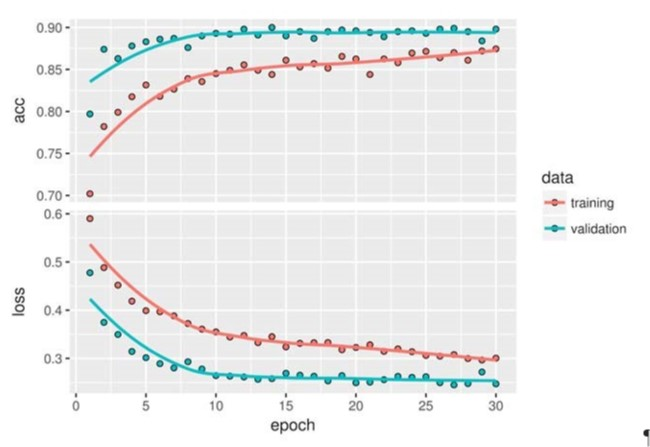
```

#### Fine-tuning

Another widely used technique for model reuse, complementary to feature extraction, is fine-tuning. Fine-tuning consists of unfreezing a few of the top layers of a frozen model base used for feature extraction, and jointly training both the newly added part of the model (in this case, the fully connected classifier) and these top layers. This is called fine-tuning because it slightly adjusts the more abstract representations of the model being reused, in order to make them more relevant for the problem at hand.

It was stated earlier that it’s necessary to freeze the convolution base of `VGG16` in order to be able to train a randomly initialized classifier on top. For the same reason, it’s only possible to fine-tune the top layers of the convolutional base once the classifier on top has already been trained. If the classifier isn’t already trained, then the error signal propagating through the network during training will be too large, and the representations previously learned by the layers being fine-tuned will be destroyed. Thus the steps for fine-tuning a network are as follows:

1. Add your custom network on top of an already-trained base network.
2. Freeze the base network.
3. Train the part you added.
4. Unfreeze some layers in the base network.
5. Jointly train both these layers and the part you added.

You already completed the first three steps when doing feature extraction. Let’s proceed with step 4: you’ll unfreeze your conv_base and then freeze individual layers inside it.

```{r, out.width = "4000px", echo=FALSE}
knitr::include_graphics("./Deep_Learning_with_R/images/finetuning.jpg")
```

You fine-tune all of the layers from `block3_conv1` on. Why not fine-tune more layers? Why not fine-tune the entire convolutional base? You could. But you need to consider the following:

- Earlier layers in the convolutional base encode more-generic, reusable features, whereas layers higher up encode more-specialized features. It’s more useful to fine-tune the more specialized features, because these are the ones that need to be repurposed on your new problem. There would be fast-decreasing returns in fine-tuning lower layers.
- The more parameters you’re training, the more you’re at risk of overfitting. The convolutional base has 15 million parameters, so it would be risky to attempt to train it on your small dataset.

Thus, in this situation, it’s a good strategy to fine-tune only some of the layers in the convolutional base. Let’s set this up, starting from where you left off in the previous example.

```{r eval=FALSE}
unfreeze_weights(conv_base, from = "block3_conv1")
```

Now you can begin fine-tuning the network. Do this with the `RMSProp` optimizer, _using a very low learning rate_. The reason for using a low learning rate is that you want to limit the magnitude of the modifications you make to the representations of the three layers you’re fine-tuning. Updates that are too large may harm these representations.

```{r eval=FALSE}
model %>% compile(loss = "binary_crossentropy", optimizer = optimizer_rmsprop(lr = 1e-5), 
                  metrics = c("accuracy"))

history <- model %>% fit_generator(
     train_generator, 
     steps_per_epoch = 100, 
     epochs = 100, 
     validation_data = validation_generator, 
     validation_steps = 50)
```

Plot the results. You’re seeing a nice 6% absolute improvement in accuracy, from about 90% to greater than 96%.

Note that the loss curve doesn’t show any real improvement (in fact, it’s deteriorating). You may wonder, how can accuracy stay stable or improve if the loss isn’t decreasing? The answer is simple: what you display is an average of pointwise loss values; but what matters for accuracy is the distribution of the loss values, not their average, because accuracy is the result of a binary thresholding of the class probability predicted by the model. The model may still be improving even if this isn’t reflected in the average loss.

```{r, out.width = "4000px", echo=FALSE}
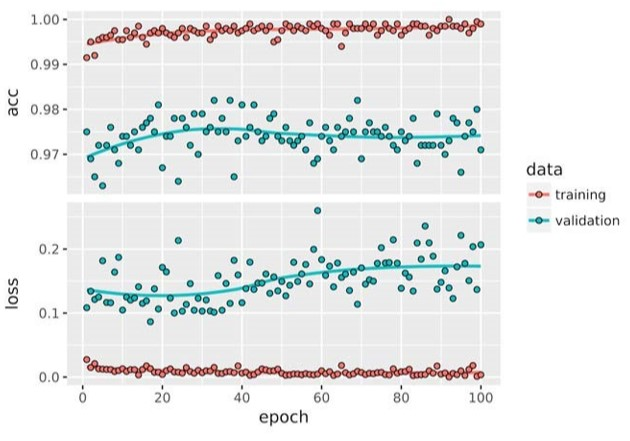
```
 
You can now finally evaluate this model on the test data:

```{r eval=FALSE}
test_generator <- flow_images_from_directory(
     test_dir, 
     test_datagen, 
     target_size = c(150, 150), 
     batch_size = 20, 
     class_mode = "binary")
model %>% evaluate_generator(test_generator, steps = 50)
```

>$loss
[1] 0.2158171
$acc
[1] 0.965

Here you get a test accuracy of 96.5%. In the original Kaggle competition around this dataset, this would have been one of the top results. But using modern deep-learning techniques, you managed to reach this result using only a small fraction of the training data available (about 10%). There is a huge difference between being able to train on 20,000 samples compared to 2,000 samples!
 
### Wrapping up

Here’s what you should take away regarding convnets:

- Convnets are the best type of machine-learning models for computer-vision tasks. It’s possible to train one from scratch even on a very small dataset, with decent results.
- On a small dataset, overfitting will be the main issue. Data augmentation is a powerful way to fight overfitting when you’re working with image data.
- It’s easy to reuse an existing convnet on a new dataset via feature extraction. This is a valuable technique for working with small image datasets.
- As a complement to feature extraction, you can use fine-tuning, which adapts to a new problem some of the representations previously learned by an existing model. This pushes performance a bit further.

Now you have a solid set of tools for dealing with image-classification problems—in particular with small datasets. 

## Visualizing what convnets learn

It’s often said that deep-learning models are “black boxes”: learning representations that are difficult to extract and present in a human-readable form. Although this is partially true for certain types of deep-learning models, it’s definitely not true for convnets. The representations learned by convnets are highly amenable to visualization, in large part because they’re representations of visual concepts. Since 2013, a wide array of techniques have been developed for visualizing and interpreting these representations. We won’t survey all of them, but we’ll cover three of the most accessible and useful ones:

1. *Visualizing intermediate convnet outputs (intermediate activations)* — Useful for understanding how successive convnet layers transform their input, and for getting a first idea of the meaning of individual convnet filters.
2. *Visualizing convnets filters* — Useful for understanding precisely what visual pattern or concept each filter in a convnet is receptive to.
3. *Visualizing heatmaps of class activation in an image* — Useful for understanding which parts of an image were identified as belonging to a given class, thus allowing you to localize objects in images.

For the first method — activation visualization — use the small convnet that you trained from scratch on the dogs-versus-cats classification problem earlier. For the next two methods, you’ll use the `VGG16` model introduced previously.

### Visualizing Intermediate Activations

Visualizing intermediate activations consists of displaying the feature maps that are output by various convolution and pooling layers in a network, given a certain input (the output of a layer is often called its activation, the output of the activation function). This gives a view into how an input is decomposed into the different filters learned by the network. You want to visualize feature maps with three dimensions: width, height, and depth (channels). Each channel encodes relatively independent features, so the proper way to visualize these feature maps is by independently plotting the contents of every channel as a 2D image. Let’s start by loading the model you saved earlier:

```{r echo=FALSE}
rm(list=ls())
```

```{r}
model <- load_model_hdf5("./models/cats_and_dogs_small_2.h5")
model
```

Get an input image — a picture of a cat, not part of the images the network was trained on.

```{r}
img <- image_load("../../LargeDataFiles/CatsDogs/sample/test/cat/cat.9518.jpg", target_size = c(150, 150))

img_tensor <- image_to_array(img)
img_tensor <- array_reshape(img_tensor, c(1, 150, 150, 3))
 
img_tensor <- img_tensor / 255 
dim(img_tensor)
```

```{r}
plot(as.raster(img_tensor[1,,,]))
```

In order to extract the feature maps you want to look at, create a Keras model that takes batches of images as input, and outputs the activations of all convolution and pooling layers. To do this, you’ll use the `keras_model` function, which takes two arguments: an `input tensor` (or list of input tensors) and an `output tensor` (or list of output tensors). The resulting class is a Keras model, just like the ones created by the `keras_sequential_model()` function mapping the specified inputs to the specified outputs. What sets this type of model apart is that it allows for models with multiple outputs (unlike `keras_sequential_model`). 

```{r}
#Extract the outputs of the top 8 layers
layer_outputs <- lapply(model$layers[1:8], function(layer) layer$output)

#Create a model that will return the outputs given the model input
activation_model <- keras_model(inputs = model$input, outputs = layer_outputs)
```

When fed an image input, this model returns the values of the layer activations in the original model. This is the first time you’ve encountered a multi-output model so far: until now, the models you’ve seen have had exactly one input and one output. In the general case, a model can have any number of inputs and outputs. This one has one input and eight outputs: one output per layer activation.

```{r}
# Returns a list of 5 arrays, one array per activation
activations <- activation_model %>% predict(img_tensor)
```

For instance, this is the activation of the first convolution layer for the cat image input:

```{r}
first_layer_activation <- activations[[1]]
dim(first_layer_activation)
```

It’s a 148 × 148 feature map with 32 channels. Let’s visualize some of them. First you define an R function that will plot a channel.

```{r plotChannel}
plot_channel <- function(channel) {
     rotate <- function(x) t(apply(x, 2, rev))
     image(rotate(channel), 
           axes = FALSE, 
           asp = 1, 
           col = terrain.colors(12))}
```

Try visualizing the second channel of the activation of the first layer of the original model. It appears to be picking up the edges.

```{r}
plot_channel(first_layer_activation[1,,,3])
```

Try the seventh channel — but note channels may vary because the specific filters learned by convolution layers aren’t deterministic.

```{r}
plot_channel(first_layer_activation[1,,,7])
```

Cycle through all the channels not working - puzzled:

```{r}
image_size <- 58 
images_per_row <- 16

for (i in 1:8) {
     
     layer_activation <- activations[[i]] 
     layer_name <- model$layers[[i]]$name
     
     n_features <- dim(layer_activation)[[4]] 
     n_cols <- n_features %/% images_per_row
     
     png(paste0("cat_activations_", i, "_", layer_name, ".png"), 
         width = image_size * images_per_row, 
         height = image_size * n_cols)
     op <- par(mfrow = c(n_cols, images_per_row), mai = rep_len(0.02, 4))
     
     for (col in 0:(n_cols-1)) {
          for (row in 0:(images_per_row-1)) {
               channel_image <- layer_activation[1,,,(col*images_per_row) + row + 1]
               plot_channel(channel_image)} }
par(op) 
dev.off()
}
```

The code above should output something like this"

```{r, out.width = "4000px", echo=FALSE}
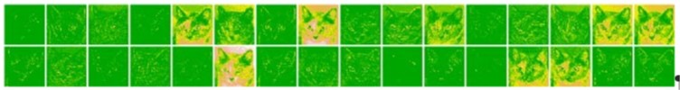
```
```{r, out.width = "4000px", echo=FALSE}
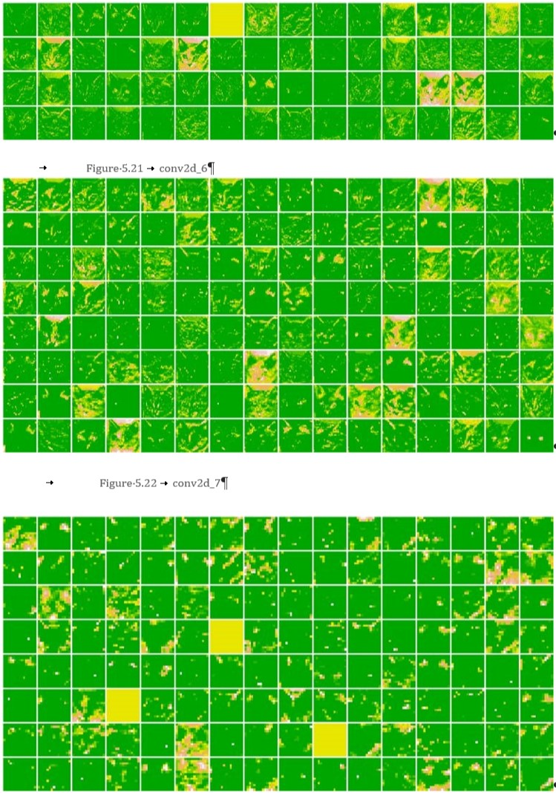
```

There are a few things to note here:

- The first layer acts as a collection of various edge detectors. At that stage, the activations retain almost all of the information present in the initial picture.
- As you go higher, the activations become increasingly abstract and less visually interpretable. They begin to encode higher-level concepts such as “cat ear” and “cat eye.” Higher presentations carry increasingly less information about the visual contents of the image, and increasingly more information related to the class of the image.
- The sparsity of the activations is increasing with the depth of the layer: in the first layer, all filters are activated by the input image, but in the following layers some filters are blank. This means that the pattern encoded by the filter isn’t found in the input image.

We have just evidenced an important universal characteristic of the representations learned by deep neural networks: *the features extracted by a layer become increasingly abstract with the depth of the layer*. The activations of higher layers carry less and less information about the specific input being seen, and more and more information about the target (in this case, the class of the image: cat or dog). *A deep neural network effectively acts as an information distillation pipeline*, with raw data going in (in this case, RGB pictures) and being repeatedly transformed so that irrelevant information is filtered out (for example, the specific visual appearance of the image), and useful information is magnified and refined (for example, the class of the image).

This is analogous to the way humans and animals perceive the world: after observing a scene for a few seconds, a human can remember which abstract objects were present in it (bicycle, tree) but can’t remember the specific appearance of these objects. In fact, if you tried to draw a generic bicycle from memory, chances are you couldn’t get it even remotely right, even though you’ve seen thousands of bicycles in your lifetime. Your brain has learned to completely abstract its visual input—to transform it into high-level visual concepts while filtering out irrelevant visual details—making it tremendously difficult to remember how things around you look. 

### Visualizing convnet filters

Skipped this - did not find this content useful

### Visualizing Heatmaps of Class Activation

There is a 3rd visualization technique: one that is useful for understanding which parts of a given image led a convnet to its final classification decision. This is helpful for debugging the decision process of a convnet, particularly in the case of a classification mistake. It also allows you to locate specific objects in an image.

This general category of techniques is called `class activation map (CAM)` visualization and it consists of producing heatmaps of class activation over input images. A class activation heatmap is a 2D grid of scores associated with a specific output class, computed for every location in any input image, indicating how important each location is with respect to the class under consideration. For instance, given an image fed into a dogs-versus-cats convnet, CAM visualization allows you to generate a heatmap for the class “cat,” indicating how cat-like different parts of the image are, and also a heatmap for the class “dog,” indicating how dog-like parts of the image are.

The specific implementation you’ll use is the one described in *rad-CAM: Visual Explanations from Deep Networks via Gradient-based Localization.*  It’s very simple: it consists of taking the output feature map of a convolution layer, given an input image, and weighing every channel in that feature map by the gradient of the class with respect to the channel. Intuitively, one way to understand this trick is that you’re weighting a spatial map of *how intensely the input image activates different channels* by *how important each channel is with regard to the class,* resulting in a spatial map of *how intensely the input image activates the class.*

Demonstrate this technique using the pretrained `VGG16` network again.

```{r}
rm(list=ls())
model <- application_vgg16(weights = "imagenet")
```

Consider the image of two African elephants shown below (under a Creative Commons license), possibly a mother and her calf, strolling on the savanna.

```{r, out.width = "4000px", echo=FALSE}
knitr::include_graphics("./Deep_Learning_with_R/images/elephant1.jpg")
```

Convert this image into something the `VGG16` model can read: the model was trained on images of size 224 × 244, preprocessed according to a few rules that are packaged in the utility function `imagenet_preprocess_input()`. You need to load the image, resize it to 224 × 224, convert it to an array, and apply these preprocessing rules.

```{r}
img_path <- "./images/elephant1.jpg" 
img <- image_load(img_path, target_size = c(224, 224)) %>%
     image_to_array() %>%
     array_reshape(dim = c(1, 224, 224, 3)) %>% 
     imagenet_preprocess_input()
```

Now run the pretrained network on the image and decode its prediction vector back to a human-readable format:

```{r}
preds <- model %>% predict(img)
imagenet_decode_predictions(preds, top = 3)[[1]] 
```

The network has recognized the image as containing an undetermined quantity of African elephants. The entry in the prediction vector that was maximally activated is the one corresponding to the “African elephant” class, at index 387:

```{r}
which.max(preds[1,]) [1] 
```

To visualize which parts of the image are the most African elephant–like, let’s set up the `Grad-CAM` process.

```{r eval=FALSE}
#African elephant entry in the prediction vector
african_elephant_output <- model$output[, 387]

# Output feature map od block5_conv3 layer, the last convolution layer in VGG16
last_conv_layer <- model %>% get_layer("block5_conv3") 

#Gradient of "African Elephant" class
grads <- k_gradients(african_elephant_output, last_conv_layer$output)[[1]] 

#Vector of shape 512 where each entry is th emean intensity of the gradient over s specific feature map channel
pooled_grads <- k_mean(grads, axis = c(1, 2, 3))

#Access the vlaues of quantities just defined
iterate <- k_function(list(model$input), 
                      list(pooled_grads, last_conv_layer$output[1,,,]))

#values of the 2 quantities given the sample images of 2 elephants
c(pooled_grads_value, conv_layer_output_value) %<-% iterate(list(img))

#Multiplies each channel in the feature map array by how important each channel is  with regrad to elephant class
for (i in 1:512) {
     conv_layer_output_value[,,i] <- 
          conv_layer_output_value[,,i] * pooled_grads_value[[i]]}

#Channel-wise mean of the resulting feature map is the heatmap of the class activation
heatmap <- apply(conv_layer_output_value, c(1,2), mean)
```

For visualization purposes, normalize the heatmap between 0 and 1.

```{r eval=FALSE}
heatmap <- pmax(heatmap, 0)
heatmap <- heatmap/max(heatmap)

# Function to write a heatmap to PNG

write_heatmap <- function(heatmap, filename, width = 224, height = 224, 
                          bg = "white", col = terrain.colors(12)) {
     png(filename, width = width, height = height, bg = bg) 
     op = par(mar = c(0,0,0,0)) 
     on.exit({par(op); dev.off()}, add = TRUE) 
     rotate <- function(x) t(apply(x, 2, rev)) 
     image(rotate(heatmap), axes = FALSE, asp = 1, col = col)}

write_heatmap(heatmap, "elephant_heatmap.png")
```

```{r, out.width = "4000px", echo=FALSE}
knitr::include_graphics("./images/elephant_heatmap.png")
```

Use `magick` package to generate an image that superimposes the original image with the heatmap above.

```{r elephantOverlay}
library(magick)
library(viridis)

image <- image_read(img_path)
info <- image_info(image)
	
geometry <- sprintf("%dx%d!", info$width, info$height)

pal <- col2rgb(viridis(20), alpha = TRUE)
alpha <- floor(seq(0, 255, length = ncol(pal))) 
pal_col <- rgb(t(pal), alpha = alpha, maxColorValue = 255) 
write_heatmap(heatmap, "elephant_overlay.png", width = 14, height = 14, 
              bg = NA, col = pal_col)
 
image_read("elephant_overlay.png") %>%
     image_resize(geometry, filter = "quadratic") %>% 
     image_composite(image, operator = "blend", compose_args = "20") %>% 
     plot()
```

This visualization technique answers two important questions:

- Why did the network think this image contained an African elephant? 
- Where is the African elephant located in the picture?

It’s interesting to note that the ears of the elephant calf are strongly activated: this is probably how the network can tell the difference between African and Indian elephants. 

##	Summary

- Convnets are the best tool for attacking visual-classification problems.
- Convnets work by learning a hierarchy of modular patterns and concepts to represent the visual world.
- The representations they learn are easy to inspect—convnets are the opposite of black boxes!
- You now capable of training your own convnet from scratch to solve an image-classification problem.
- You understand how to use visual data augmentation to fight overfitting.
- You know how to use a pretrained convnet to do feature extraction and fine-tuning.
- You can generate visualizations of the filters learned by your convnets, as well as heatmaps of class activity.

# Deep Learning for Text & Sequences
```{r echo=FALSE, message=FALSE}
rm(list = ls())

if(!require(easypackages)){install.packages("easypackages")}
library(easypackages)
packages("tidyverse", "keras", "gt", "here", prompt = TRUE)
```
```{r echo=FALSE}
#setwd("~/DeepLearning/Deep_Learning_with_R")
```

Now explore deep-learning models that can process text (understood as sequences of words or sequences of characters), timeseries, and sequence data in general. The two fundamental deep-learning algorithms for sequence processing are recurrent neural networks and 1D convnets, the one-dimensional version of the 2D convnets covered previously. 
 
Applications of these algorithms include the following:

- Document classification and timeseries classification, such as identifying the topic of an article or the author of a book
- Timeseries comparisons, such as estimating how closely related two documents or two stock tickers are
- Sequence-to-sequence learning, such as decoding an English sentence into French
- Sentiment analysis, such as classifying the sentiment of tweets or movie reviews as positive or negative
- Timeseries forecasting, such as predicting the future weather at a certain location, given recent weather data

Examples focus on two narrow tasks: sentiment analysis on the IMDB dataset, and temperature forecasting.  The techniques demonstrated for these two tasks are relevant to all the applications just listed, and many more.

## Text Data

Text is one of the most widespread forms of sequence data. It can be understood as either a sequence of characters or a sequence of words, but it’s most common to work at the level of words. The deep-learning sequence-processing models can use text to produce a basic form of natural-language understanding, sufficient for applications including document classification, sentiment analysis, author identification, and even question answering (QA) in a constrained context. None of these deep-learning models truly understand text in a human sense; rather, these models can map the statistical structure of written language, which is sufficient to solve many simple textual tasks. Deep learning for natural-language processing is pattern recognition applied to words, sentences, and paragraphs, in much the same way that computer vision is pattern recognition applied to pixels.

Like all other neural networks, deep-learning models don’t take as input raw text: they only work with numeric tensors. Vectorizing text is the process of transforming text into numeric tensors. This can be done in multiple ways:

- Segment text into words and transform each word into a vector.
- Segment text into characters and transform each character into a vector.
- Extract n-grams of words or characters and transform each n-gram into a vector.
 
Collectively, the different units into which you can break down text (words, characters, or n-grams) are called tokens and breaking text into such tokens is called tokenization. All text-vectorization processes consist of applying some tokenization scheme and then associating numeric vectors with the generated tokens. These vectors, packed into sequence tensors, are fed into deep neural networks. There are multiple ways to associate a vector with a token: one-hot encoding of tokens and token embedding (typically used exclusively for words called _word embedding_). 

----

**Understanding n-grams and bag-of-words**

Word n-grams are groups of N (or fewer) consecutive words that you can extract from a sentence. The same concept may also be applied to characters instead of words.

Here’s a simple example. Consider the sentence “The cat sat on the mat.” It may be decomposed into the following set of 2-grams:

{"The", "The cat", "cat", "cat sat", "sat",
"sat on", "on", "on the", "the", "the mat", "mat"}

It may also be decomposed into the following set of 3-grams:

{"The", "The cat", "cat", "cat sat", "The cat sat",
"sat", "sat on", "on", "cat sat on", "on the", "the",
"sat on the", "the mat", "mat", "on the mat"}

Such a set is called a bag-of-2-grams or bag-of-3-grams, respectively. The term bag here refers to the fact that you’re dealing with a set of tokens rather than a list or sequence: the tokens have no specific order. This family of tokenization methods is called bag-of-words.

Because bag-of-words isn’t an order-preserving tokenization method (the tokens generated are understood as a set, not a sequence, and the general structure of the sentences is lost), _it tends to be used in shallow language-processing models rather than in deep-learning models_.

_Extracting n-grams is a form of feature engineering and deep learning does away with this kind of rigid, brittle approach, replacing it with hierarchical feature learning_. One-dimensional convnets and recurrent neural networks are capable of learning representations for groups of words and characters without being explicitly told about the existence of such groups, by looking at continuous word or character sequences. For this reason, _n-grams are not covered herein. Keep in mind that they’re a powerful, unavoidable feature-engineering tool when using lightweight, shallow, text-processing models such as logistic regression and random forests_.

----

### One-hot Encoding

One-hot encoding is the most common, most basic way to turn a token into a vector. It consists of associating a unique integer index with every word and then turning this integer index `i` into a binary vector of size N (the size of the vocabulary); the vector is all zeros except for the `i` th entry, which is 1.

Keras has built-in utilities for doing one-hot encoding of text at the word level or character level, starting from raw text data. You should use these utilities because they perform a number of important features such as stripping special characters from strings and only taking into account the N most common words in your dataset (a common restriction, to avoid dealing with very large input vector spaces).

```{r}
samples <- c("The cat sat on the mat.", "The dog ate my homework.")

tokenizer <- text_tokenizer(num_words = 1000) %>% #Creates tokenizer for 1000 most common words
     fit_text_tokenizer(samples) #Builds the word index

sequences <- texts_to_sequences(tokenizer, samples) 
# Strings into lists of integer indicies

one_hot_results <- texts_to_matrix(tokenizer, samples, mode = "binary") 
#Could also get directly get one hot binary represemntations
#Vectorization models other than one hot are supported

#FYI - subset matrix 
#one_hot_results[one_hot_results[,] ==1]

word_index <- tokenizer$word_index 
# How you can recover the word from the indicies

cat("Found", length(word_index), "unique tokens.\n")
```

A variant of one-hot encoding is the `one-hot hashing trick`, which you use when the number of unique tokens in your vocabulary is too large to handle explicitly. Instead of explicitly assigning an index to each word and keeping a reference of these indices in a dictionary, you can hash words into vectors of fixed size. This is typically done with a very lightweight hashing function. *The main advantage of this method is that it does away with maintaining an explicit word index, which saves memory and allows online encoding of the data* (you can generate token vectors right away, before you’ve seen all of the available data). The one drawback of this approach is that *it’s susceptible to hash collisions*: two different words may end up with the same hash, and subsequently any machine-learning model looking at these hashes won’t be able to tell the difference between these words. The likelihood of hash collisions decreases when the dimensionality of the hashing space is much larger than the total number of unique tokens being hashed.

```{r}
library(hashFunction)

samples <- c("The cat sat on the mat.", "The dog ate my homework.")

dimensionality <- 1000
#Stores the words as vectors of size 1,000. If you have close to 1,000 words (or more), you’ll see many hash collisions, which will decrease the accuracy of this encoding method.

max_length <- 10 

results <- array(0, dim = c(length(samples), max_length, dimensionality))

for (i in 1:length(samples)) {
     sample <- samples[[i]] 
     words <- head(strsplit(sample, " ")[[1]], n = max_length) 
     for (j in 1:length(words)) { 
          index <- abs(spooky.32(words[[i]])) %% dimensionality 
          #hashes word into a random integer index between 0 and 1000
          results[[i, j, index]] <- 1}
	}
```

### Using word embeddings

Another popular and powerful way to associate a vector with a word is the use of dense word vectors, also called `word embeddings`. Whereas the vectors obtained through one-hot encoding are binary, sparse (mostly made of zeros), and very high-dimensional (same dimensionality as the number of words in the vocabulary), word embeddings are low dimensional floating-point vectors (that is, dense vectors, as opposed to sparse vectors). Unlike the word vectors obtained via one-hot encoding, word embeddings are learned from data. It’s common to see word embeddings that are 256-dimensional, 512-dimensional, or 1,024-dimensional, when dealing with very large vocabularies. One-hot encoding words generally leads to vectors that are 20,000-dimensional or greater (capturing a vocabulary of 20,000 tokens, in this case). So, word embeddings pack more information into far fewer dimensions.

There are two ways to obtain word embeddings:

- Learn word embeddings jointly with the main task you care about (such as document classification or sentiment prediction). In this setup, you start with random word vectors and then learn word vectors in the same way you learn the weights of a neural network.
- Load into your model word embeddings that were precomputed using a different machine-learning task than the one you’re trying to solve. These are called `pretrained word embeddings`.

The simplest way to associate a dense vector with a word is to choose the vector at random. The problem with this approach is that the resulting embedding space has no structure: for instance, the words `accurate` and `exact` may end up with completely different embeddings, even though they’re interchangeable in most sentences. It’s difficult for a deep neural network to make sense of such a noisy, unstructured embedding space.

To get a bit more abstract, the geometric relationships between word vectors should reflect the semantic relationships between these words. *Word embeddings are meant to map human language into a geometric space*. You would expect synonyms to be embedded into similar word vectors; and in general, you would expect the geometric distance (such as L2 distance) between any two word vectors to relate to the semantic distance between the associated words (words meaning different things are embedded at points far away from each other, whereas related words are closer). In addition to distance, you may want specific directions in the embedding space to be meaningful. To make this clearer, let’s consider a example.

Imagine four words are embedded on a 2D plane: cat, dog, wolf, and tiger. With the vector representations we chose here, some semantic relationships between these words can be encoded as geometric transformations. For instance, the same vector allows us to go from cat to tiger and from dog  to wolf: this vector could be interpreted as a “from pet to wild animal” vector. Similarly, another vector lets us go from dog to cat and from wolf to tiger, which could be interpreted as a “from canine to feline” vector.

In real-world word-embedding spaces, common examples of meaningful geometric transformations are _gender_ vectors and _plural_ vectors. For instance, by adding a _female_ vector to the vector _king_, we obtain the vector _queen._ By adding a _plural_ vector, we obtain _kings._ Word-embedding spaces typically feature thousands of such interpretable and potentially useful vectors.

What makes a good word-embedding space depends heavily on your task: the perfect word-embedding space for an English-language movie-review sentiment analysis model may look different from the perfect embedding space for an English language legal-document-classification model because the importance of certain semantic relationships varies from task to task.  It’s reasonable then to learn a new embedding space with every new task. Fortunately, backpropagation makes this easy, and Keras makes it even easier. It’s about learning the weights of a layer using `layer_embedding.`

```{r eval=FALSE}
embedding_layer <- layer_embedding(input_dim = 1000, output_dim = 64)
```

The embedding layer takes at least two arguments: 

- the number of possible tokens (here, 1,000) 
- the dimensionality of the embeddings (here, 64)

`layer_embedding` is best understood as a dictionary that maps integer indices (which stand for specific words) to dense vectors. It takes integers as input, it looks up these integers in an internal dictionary, and it returns the associated vectors. It’s effectively a dictionary lookup.

An embedding layer takes as input a 2D tensor of integers, of shape (samples, sequence_length), where each entry is a sequence of integers. It can embed sequences of variable lengths: for instance, you could feed into the embedding layer batches with shapes (32, 10) (batch of 32 sequences of length 10) or (64, 15) (batch of 64 sequences of length 15). _All sequences in a batch must have the same length, though (because you need to pack them into a single tensor), so sequences that are shorter than others should be padded with zeros, and sequences that are longer should be truncated_.

This layer returns a 3D floating-point tensor of shape (samples, sequence_ length, embedding_dimensionality). Such a 3D tensor can then be processed by an RNN layer or a 1D convolution layer.

When you instantiate an embedding layer, its weights (its internal dictionary of token vectors) are initially random, just as with any other layer. During training, these word vectors are gradually adjusted via backpropagation, structuring the space into something the downstream model can exploit. Once fully trained, the embedding space will show a lot of structure—a kind of structure specialized for the specific problem for which you’re training your model.

Let’s apply this idea to the IMDB movie-review sentiment-prediction task that you’re already familiar with. 

- prepare the data
- restrict the movie reviews to the top 10,000 most common words 
- cut off the reviews after 20 words
- the network will learn 8-dimensional embeddings for each of the 10,000 words
- turn the input integer sequences (2D integer tensor) into embedded sequences (3D float tensor)
- flatten the tensor to 2D
- train a single dense layer on top for classification

```{r eval=FALSE}
rm(list=ls())
max_features <- 10000
maxlen <- 20

imdb <- dataset_imdb(num_words = max_features)
c(c(x_train, y_train), c(x_test, y_test)) %<-% imdb
# loads data as lists of integers

x_train <- pad_sequences(x_train, maxlen = maxlen)
# Turns the lists of integers into a 2D integer tensor of shape(samples, maxlen)

x_test <- pad_sequences(x_test, maxlen = maxlen)
####

model_Embedding <- keras_model_sequential() %>%
     layer_embedding(input_dim = 10000, output_dim = 8, input_length = maxlen) %>%
     layer_flatten() %>% 
     layer_dense(units = 1, activation = "sigmoid")

model_Embedding %>% compile(
     optimizer = "rmsprop", loss = "binary_crossentropy", metrics = c("acc")) 

#summary(model_Embedding)
```
```{r eval=FALSE}
history_Embedding <- model_Embedding %>% fit(x_train, y_train, epochs = 10, batch_size = 32, 
                                             validation_split = 0.2 )
plot(history_Embedding)
```

```{r, out.width = "4000px", echo=FALSE}
knitr::include_graphics("./images/6-1-2-history_embedding.jpg")
```

You get to a validation accuracy of ~76%, which is pretty good considering that you’re only looking at 20 words from each review. But note that merely flattening the embedded sequences and training a single dense layer on top leads to a model that treats each word in the input sequence separately, without considering inter-word relationships and sentence structure (for example, this model would likely treat both _this movie is a bomb_ and _this movie is the bomb_ as being negative reviews). It’s much better to add recurrent layers or 1D convolutional layers on top of the embedded sequences *to learn features that take into account each sequence as a whole*.

#### Using Pretrained Word Embeddings

Sometimes, you have so little training data available that you can’t use your data alone to learn an appropriate task-specific embedding of your vocabulary.

Instead of learning word embeddings jointly with the problem you want to solve, you can load embedding vectors from a precomputed embedding space that you know is highly structured and exhibits useful properties — that captures generic aspects of language structure. The rationale behind using pretrained word embeddings in natural-language processing is much the same as for using pretrained convnets in image classification: you don’t have enough data available to learn truly powerful features on your own, but you expect the features that you need to be fairly generic — that is, common visual features or semantic features. In this case, it makes sense to reuse features learned on a different problem.

Such word embeddings are generally computed using word-occurrence statistics (observations about what words co-occur in sentences or documents), using a variety of techniques, some involving neural networks, others not. 

There are various precomputed databases of word embeddings you can download and use in a Keras embedding layer. `Word2vec` is one of them. Another popular one is called `Global Vectors for Word Representation` (_GloVe_, https://nlp.stanford .edu/projects/glove), which was developed by Stanford researchers in 2014. This embedding technique is based on factorizing a matrix of word co-occurrence statistics. Its developers have made available precomputed embeddings for millions of English tokens, obtained from Wikipedia data and Common Crawl data.

Let’s look at how you can get started using `GloVe` embeddings in a Keras model. (The same method is valid for `Word2vec` embeddings or any other word-embedding database.) 

### Raw Text to Word Embeddings

First, download the raw IMDB dataset from http://mng.bz/0tIo. Uncompress it.  Collect the individual training reviews into a list of strings, one string per review. Also collect the review labels (positive/negative) into a labels list. 

I like the code below!
```{r eval=FALSE}
rm(list=ls())
imdb_dir <- "../../LargeDataFiles/IMDB" 
train_dir <- file.path(imdb_dir, "train")
labels <- c() 
texts <- c()
for (label_type in c("neg", "pos")) {
     label <- switch(label_type, neg = 0, pos = 1) 
     dir_name <- file.path(train_dir, label_type) 
     for (fname in list.files(dir_name, pattern = glob2rx("*.txt"), full.names = TRUE)) {
          texts <- c(texts, readChar(fname, file.info(fname)$size)) 
          labels <- c(labels, label)}
}
```

#### Tokenize the Data

Vectorize the text and prepare a training and validation split. Because pretrained word embeddings are meant to be particularly useful on problems where little training data is available (otherwise, task-specific embeddings are likely to outperform them), add the following twist: restricting the training data to the first 200 samples. So you’ll learn to classify movie reviews after looking at just 200 examples.

```{r eval=FALSE}
maxlen <- 100 
training_samples <- 200 
validation_samples <- 10000 
max_words <- 10000

tokenizer <- text_tokenizer(num_words = max_words) %>% fit_text_tokenizer(texts)
 
sequences <- texts_to_sequences(tokenizer, texts)

word_index = tokenizer$word_index 
cat("Found", length(word_index), "unique tokens.\n") 

data <- pad_sequences(sequences, maxlen = maxlen)

labels <- as.array(labels) 
cat("Shape of data tensor:", dim(data), "\n") 
cat('Shape of label tensor:', dim(labels), "\n")

indices <- sample(1:nrow(data)) #shuffle data- samples are ordered (neg come first in raw data)
training_indices <- indices[1:training_samples] 
validation_indices <- indices[(training_samples + 1):
                                   (training_samples + validation_samples)]

x_train <- data[training_indices,] 
y_train <- labels[training_indices]

x_val <- data[validation_indices,] 
y_val <- labels[validation_indices]
```

`Found 88584 unique tokens.`
`Shape of data tensor: 25000 100` 
`Shape of label tensor: 25000 `

#### Download Glove Word Embeddings

Go to https://nlp.stanford.edu/projects/glove, and download the precomputed embeddings from 2014 English Wikipedia. It’s an 822 MB zip file called glove.6B.zip, containing 100-dimensional embedding vectors for 400,000 words (or nonword tokens). Unzip it. 

#### Preprocess Embeddings

Parse the unzipped file (a .txt file) to build an index that maps words (as strings) to their vector representation (as number vectors).

```{r gloceEmbedding, eval=FALSE}
rm(list = ls())
glove_dir = "../../LargeDataFiles/Glove" 
lines <- readLines(file.path(glove_dir, "glove.6B.100d.txt")) 
embeddings_index <- new.env(hash = TRUE, parent = emptyenv()) 

for (i in 1:length(lines)) {
     line <- lines[[i]] 
     values <- strsplit(line, " ")[[1]] 
     word <- values[[1]] 
     embeddings_index[[word]] <- as.double(values[-1])} 

cat("Found", length(embeddings_index), "word vectors.\n")
```

`Found 400000 word vectors.`

Build an embedding matrix that you can load into an embedding layer. It must be a matrix of shape (max_words, embedding_dim), where each entry `i` contains the `embedding_dim-dimensional` vector for the word of index `i` in the reference word index (built during tokenization). Note that index 1 is a placeholder.
 
```{r eval=FALSE}
embedding_dim <- 100 
embedding_matrix <- array(0, c(max_words, embedding_dim))

for (word in names(word_index)) {
     index <- word_index[[word]] 
     if (index < max_words) {
          embedding_vector <- embeddings_index[[word]]
          if (!is.null(embedding_vector))
               embedding_matrix[index+1,] <- embedding_vector}
}
```

#### Define Model

```{r eval=FALSE}
model_Glove <- keras_model_sequential() %>%
     layer_embedding(input_dim = max_words, output_dim = embedding_dim, 
                     input_length = maxlen) %>%
     layer_flatten() %>% layer_dense(units = 32, activation = "relu") %>% 
     layer_dense(units = 1, activation = "sigmoid") 
summary(model_Glove)
```

Layer (type)                            Output Shape                       Param #       
=========================================================================================
embedding_3 (Embedding)                 (None, 100, 100)                   1000000       
_________________________________________________________________________________________
flatten_2 (Flatten)                     (None, 10000)                      0             
_________________________________________________________________________________________
dense_2 (Dense)                         (None, 32)                         320032        
_________________________________________________________________________________________
dense_3 (Dense)                         (None, 1)                          33            
=========================================================================================
Total params: 1,320,065
Trainable params: 320,065
Non-trainable params: 1,000,000
_________________________________________________________________________________________

#### Load Glove in model

The embedding layer has a single weight matrix: a 2D float matrix where each entry `i` is the word vector meant to be associated with index `i`. Load the GloVe matrix you prepared into the embedding layer, the first layer in the model.

```{r eval=FALSE}
get_layer(model_Glove, index = 1) %>%
     set_weights(list(embedding_matrix)) %>% freeze_weights()
```

Additionally, freeze the weights of the embedding layer, following the same rationale you’re already familiar with in the context of pretrained convnet features: when parts of a model are pretrained (like your embedding layer) and parts are randomly initialized (like your classifier), the pretrained parts shouldn’t be updated during training, to avoid forgetting what they already know. The large gradient updates triggered by the randomly initialized layers would be disruptive to the already-learned features. 

#### Train & Evaluate

```{r eval=FALSE}
model_Glove %>% compile(
     optimizer = "rmsprop", loss = "binary_crossentropy", metrics = c("acc"))

history_Glove <- model_Glove %>% fit(
     x_train, 
     y_train, 
     epochs = 20, 
     batch_size = 32, 
     validation_data = list(x_val, y_val)) 

save_model_weights_hdf5(model_Glove, "./models/pre_trained_glove_model.h5") 
plot(history_Glove)
```
```{r echo=FALSE}
load_model_weights_hdf5(model_Glove, "./models/pre_trained_glove_model.h5")
plot(history_Glove)
```

The model quickly starts overfitting, which is  not surprising given the small number of training samples. Validation accuracy has high variance for the same reason, but it seems to reach the high 50s.

Note that your mileage may vary: because you have so few training samples, performance is heavily dependent on exactly which 200 samples you choose—and you’re choosing them at random. 

If this works poorly for you, try choosing a different random set of 200 samples, for the sake of the exercise (in real life, you don’t get to choose your training data).

You can also train the same model without loading the pretrained word embeddings and without freezing the embedding layer. In that case, you’ll learn a task-specific embedding of the input tokens, which is generally more powerful than pretrained word embeddings when lots of data is available. But in this case, you have only 200 training samples. 

```{r eval=FALSE}
model_NoEmbed <- keras_model_sequential() %>%
     layer_embedding(input_dim = max_words, 
                     output_dim = embedding_dim, input_length = maxlen) %>%
     layer_flatten() %>% 
     layer_dense(units = 32, activation = "relu") %>% 
     layer_dense(units = 1, activation = "sigmoid") 

model_NoEmbed %>% compile(
     optimizer = "rmsprop", 
     loss = "binary_crossentropy", 
     metrics = c("acc"))

history_NoEmbed <- model_NoEmbed %>% fit(
     x_train, 
     y_train, 
     epochs = 20, 
     batch_size = 32,
     validation_data = list(x_val, y_val))

plot(history_NoEmbed)
```

```{r, out.width = "4000px", echo=FALSE}
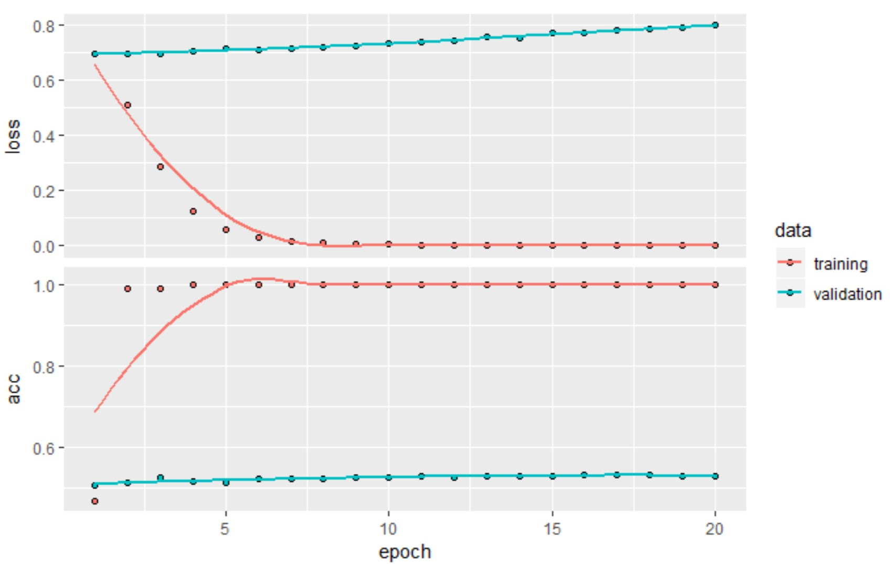
```

Validation accuracy stalls in the mid 50s. So in this case, pretrained word embeddings outperform jointly learned embeddings. If you increase the number of training samples, this will quickly stop being the case.

Finally, evaluate the model on the test data. First, tokenize the test data.
 
```{r eval=FALSE}
test_dir <- file.path(imdb_dir, "test")
labels <- c() 
texts <- c()

for (label_type in c("neg", "pos")) {
     label <- switch(label_type, neg = 0, pos = 1) 
     dir_name <- file.path(test_dir, label_type) 
     for (fname in list.files(dir_name, pattern = glob2rx("*.txt"), full.names = TRUE)) {
          texts <- c(texts, readChar(fname, file.info(fname)$size)) 
          labels <- c(labels, label)} 
}

sequences <- texts_to_sequences(tokenizer, texts) 
x_test <- pad_sequences(sequences, maxlen = maxlen) 
y_test <- as.array(labels)

model_NoEmbed %>% 
     load_model_weights_hdf5("./models/pre_trained_glove_model.h5") %>% evaluate(x_test, y_test)
```

`25000/25000 [==============================] - 3s 105us/step`
`$loss`
`[1] 1.424911`

`$acc`
`[1] 0.57176`

You get an poor test accuracy of 58%. Working with just a handful of training samples is difficult!

### Wrapping up

Now you’re able to do the following:

- Turn raw text into something a neural network can process
- Use an embedding layer in a Keras model to learn task-specific token embeddings
- Use pretrained word embeddings to get an extra boost on small natural language-processing problems 

## Understanding RNN

A characteristic of all neural networks such as densely connected networks and convnets, is that they have no memory. Each input shown to them is processed independently, with no state kept in between inputs. With such networks, in order to process a sequence or a temporal series of data points, you have to show the entire sequence to the network at once: turn it into a single data point. For instance, this is what you did in the IMDB example: an entire movie review was transformed into a single large vector and processed in one go. Such networks are called `feed forward networks`.

In contrast, as you’re reading the present sentence, you’re processing it word by word while keeping memories of what came before; this gives you a fluid representation of the meaning conveyed by this sentence. Biological intelligence processes information incrementally while maintaining an internal model of what it’s processing, built from past information and constantly updated as new information comes in.

A recurrent neural network (RNN) adopts the same principle, albeit in an extremely simplified version: it processes sequences by iterating through the sequence elements and maintaining a state containing information relative to what it has seen so far. In effect, an RNN is a type of neural network that has an internal loop. The state of the RNN is reset between processing two different, independent sequences (such as two different IMDB reviews), so you still consider one sequence a single data point: a single input to the network. What changes is that this data point is no longer processed in a single step; rather, the network internally loops over sequence elements.

An RNN is a for loop that reuses quantities computed during the previous iteration of the loop, nothing more. Of course, there are many different RNNs fitting this definition that you could build. RNNs are characterized by their step function.

### Recurrent layer in Keras

Like all recurrent layers in Keras, `layer_simple_rnn` can be run in two different modes: 

- it can return either the full sequences of successive outputs for each timestep (a
3D tensor of shape (batch_size, timesteps, output_features)) 
- only the last output for each input sequence (a 2D tensor of shape (batch_size, output_features))

These two modes are controlled by the `return_sequences` constructor argument. Look at an example that uses `layer_simple_rnn` and returns only the output at the last timestep:

```{r}
modelRNN <- keras_model_sequential() %>%
     layer_embedding(input_dim = 10000, output_dim = 32) %>% 
     layer_simple_rnn(units = 32)
summary(modelRNN)
```

The following example returns the full state sequence:

```{r}
modelRRN2 <- keras_model_sequential() %>%
     layer_embedding(input_dim = 10000, output_dim = 32) %>% 
     layer_simple_rnn(units = 32, return_sequences = TRUE)
summary(modelRRN2)
```

It’s sometimes useful to stack several recurrent layers one after the other in order to increase the representational power of a network. In such a setup, _you have to get all of the intermediate layers to return full sequences_:

```{r}
modelRNN3 <- keras_model_sequential() %>%
     layer_embedding(input_dim = 10000, output_dim = 32) %>% 
     layer_simple_rnn(units = 32, return_sequences = TRUE) %>% 
     layer_simple_rnn(units = 32, return_sequences = TRUE) %>% 
     layer_simple_rnn(units = 32, return_sequences = TRUE) %>% 
     layer_simple_rnn(units = 32)
 
summary(modelRNN3)
```

Now, let’s use such a model on the IMDB movie-review-classification problem. First, preprocess the data.

```{r eval=FALSE}
rm(list = ls())
max_features <- 10000
maxlen <- 500
batch_size <- 32

cat("Loading data...\n") 
imdb <- dataset_imdb(num_words = max_features) 
c(c(input_train, y_train), c(input_test, y_test)) %<-% imdb 

cat(length(input_train), "train sequences\n") 
cat(length(input_test), "test sequences")
cat("Pad sequences (samples x time)\n") 

input_train <- pad_sequences(input_train, maxlen = maxlen) 
input_test <- pad_sequences(input_test, maxlen = maxlen) 
cat("input_train shape:", dim(input_train), "\n") 
cat("input_test shape:", dim(input_test), "\n")

modelRNN4 <- keras_model_sequential() %>%
     layer_embedding(input_dim = max_features, output_dim = 32) %>% 
     layer_simple_rnn(units = 32) %>% 
     layer_dense(units = 1, activation = "sigmoid")

modelRNN4 %>% compile(
     optimizer = "rmsprop", loss = "binary_crossentropy", metrics = c("acc"))

historyRNN4 <- modelRNN4 %>% fit(input_train, y_train, epochs = 10, batch_size = 128, 
                                 validation_split = 0.2)

plot(historyRNN4)
``` 

```{r, out.width = "4000px", echo=FALSE}
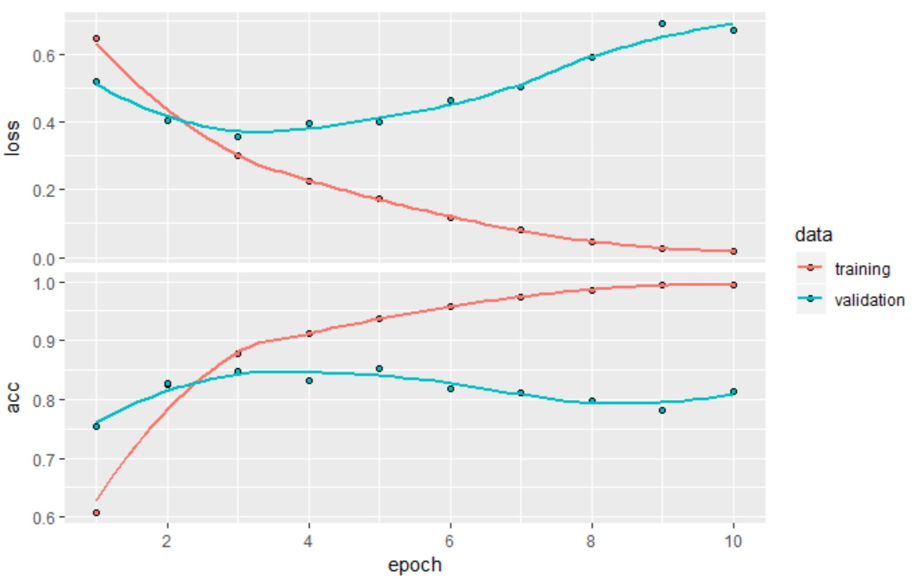
```

As a reminder, in chapter 3, the first naive approach to this dataset got you to a test accuracy of 88%. Unfortunately, this small recurrent network doesn’t perform well compared to this baseline. Part of the problem is that your inputs only consider the first 500 words, rather than full sequences—hence, the RNN has access to less information than the earlier baseline model. The remainder of the problem is that `layer_simple_rnn` isn’t good at processing long sequences, such as text. Other types of recurrent layers perform much better. Let’s look at some more-advanced layers. 

### LSTM and GRU Layers

Simple RNNs aren’t the only recurrent layers available in Keras. There are two others:

- layer_lstm 
- layer_gru

In practice, you’ll always use one of these, because `layer_simple_rnn` is generally too simplistic to be of real use. One major issue with `layer_simple_rnn` is that although it should theoretically be able to retain at time `t` information about inputs seen many timesteps before, in practice, such long-term dependencies are impossible to learn. This is due to the vanishing gradient problem, an effect that is similar to what is observed with non-recurrent networks (feedforward networks) that are many layers deep: as you keep adding layers to a network, the network eventually becomes untrainable. The LSTM and GRU layers are designed to solve this problem.

The Long Short-Term Memory (LSTM) is a variant of `layer_simple_rnn`; it adds a way to carry information across many timesteps. Imagine a conveyor belt running parallel to the sequence you’re processing. Information from the sequence can jump onto the conveyor belt at any point, be transported to a later timestep, and jump off, intact, when you need it. This is essentially what LSTM does: it saves information for later, thus preventing older signals from gradually vanishing during processing.

### LSTM example in Keras

Set up a model using `layer_lstm` and train it on the IMDB data. The network is similar to the one with `layer_simple_rnn` that was just presented. You only specify the output dimensionality of `layer_lstm`; leave every other argument (there are many) at the Keras defaults. Keras has good defaults, and things will almost always “just work” without you having to spend time tuning parameters by hand.

```{r LSTM1, eval=FALSE}
model_LSTM1 <- keras_model_sequential() %>%
     layer_embedding(input_dim = max_features, output_dim = 32) %>% 
     layer_lstm(units = 32) %>%
     layer_dense(units = 1, activation = "sigmoid")

model_LSTM1 %>% compile(
     optimizer = "rmsprop", loss = "binary_crossentropy", metrics = c("acc"))

history_LSTM1 <- model_LSTM1 %>% fit(
     input_train, y_train, epochs = 10, batch_size = 128, validation_split = 0.2)
plot(history_LSTM1)
```

```{r, out.width = "4000px", echo=FALSE}
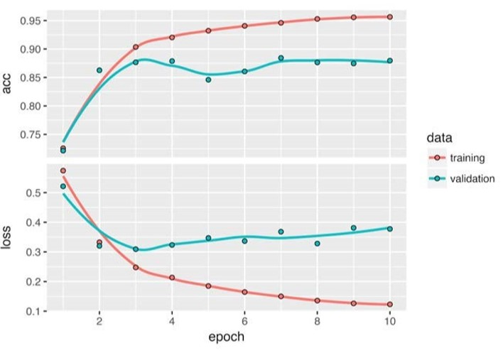
```

This time, you achieve up to 88% validation accuracy. Not bad: certainly much better than the simple RNN network—that’s largely because LSTM suffers much less from the vanishing-gradient problem—and slightly better than the fully connected approach earlier, even though you’re looking at less data than you were then.

You’re truncating sequences after 500 timesteps, whereas before you were considering full sequences.

But this result isn’t groundbreaking for such a computationally intensive approach. Why isn’t LSTM performing better? One reason is that you made no effort to tune hyperparameters such as the embeddings dimensionality or the LSTM output dimensionality. Another may be lack of regularization. But honestly, the primary reason is that analyzing the global, long-term structure of the reviews (what LSTM is good at) isn’t helpful for a sentiment-analysis problem. Such a basic problem is well solved by looking at what words occur in each review, and at what frequency. That’s what the first fully connected approach looked at. But there are far more difficult natural language-processing problems out there, where the strength of LSTM will become apparent: in particular, question answering and machine translation.

### Wrapping up LSTM

Now you understand the following:
- What RNNs are and how they work
- What LSTM is, and why it works better on long sequences than a naive RNN
- How to use Keras RNN layers to process sequence data

##	Advanced RNNs

```{r echo=FALSE}
rm(list = ls())
```

Review three advanced techniques for improving the performance and generalization power of recurrent neural networks. Demonstrate all three concepts on a temperature-forecasting problem, where you have access to a timeseries of data points coming from sensors installed on the roof of a building, such as temperature, air pressure, and humidity, which you use to predict what the temperature will be 24 hours after the last data point. This is a fairly challenging problem that exemplifies many common difficulties encountered when working with timeseries.

Cover the following techniques:

- `Recurrent dropout` — This is a specific, built-in way to use dropout to fight overfitting in recurrent layers.
- `Stacking recurrent layers` — This increases the representational power of the network (at the cost of higher computational loads).
- `Bidirectional recurrent layers` — These present the same information to a recurrent network in different ways, increasing accuracy and mitigating forgetting issues.
  
###	Temperature Forecasting Problem

14 different quantities (such air temperature, atmospheric pressure, humidity, wind direction, and so on) were recorded every 10 minutes, over several years. The original data goes back to 2003, but this example is limited to data from 2009–2016. This dataset is perfect for learning to work with numerical timeseries. Use it to build a model that takes as input some data from the recent past (a few days’ worth of data points) and predicts the air temperature 24 hours in the future.

Download and uncompress the [data](https://s3.amazonaws.com/keras-datasets/jena_climate_2009_2016.csv.zip):

```{r}
fname <- file.path("../../LargeDataFiles/jena_climate", "jena_climate_2009_2016.csv") 
data <- read_csv(fname)
glimpse(data)
```
```{r eval=FALSE}
ggplot(data, aes(x = 1:nrow(data), y = `T (degC)`)) + geom_line()
```

```{r, out.width = "4000px", echo=FALSE}
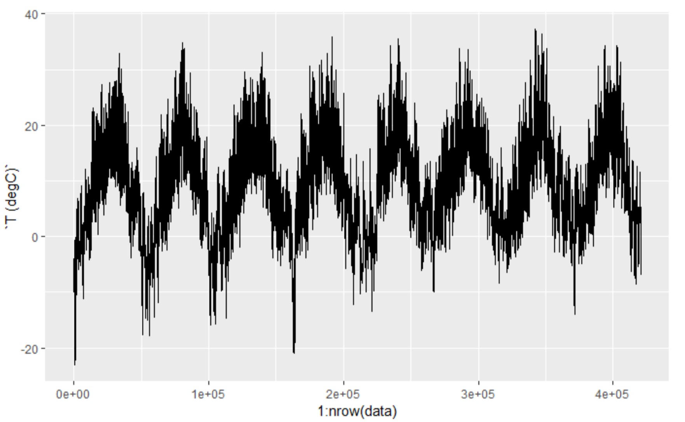
```

Look at a more narrow plot of the first 10 days of temperature data. Because the data is recorded every 10 minutes, you get 144 (6 x 24) data points per day.

```{r eval=FALSE}
ggplot(data[1:1440,], aes(x = 1:1440, y = `T (degC)`)) + geom_line()
```

```{r, out.width = "4000px", echo=FALSE}
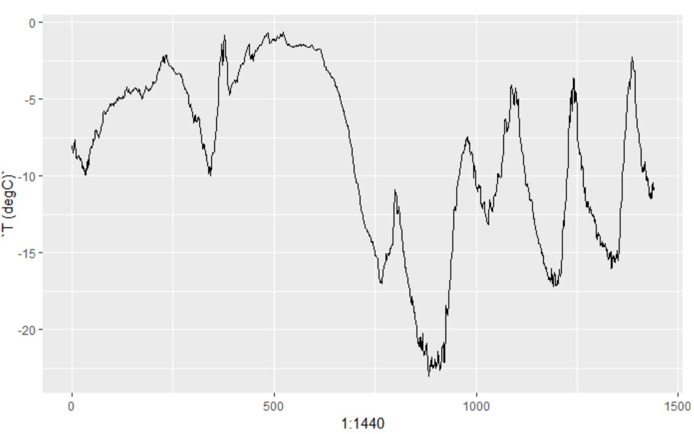
```


On this plot, you can see daily periodicity, especially evident for the last 4 days. Also note that this 10-day period must be coming from a fairly cold winter month.

If you were trying to predict average temperature for the next month given a few months of past data, the problem would be easy, due to the reliable year-scale periodicity of the data. But looking at the data over a scale of days, the temperature looks a lot more chaotic. Is this timeseries predictable at a daily scale? Let’s find out.

### Preparing the data

The exact formulation of the problem will be as follows: 

_Given data going as far back as `lookback` timesteps (a timestep is 10 minutes) and sampled every `steps` timesteps, can you predict the temperature in `delay` timesteps? _

Use the following parameter values:

- `lookback` = 1440 — Observations will go back 10 days
- `steps` = 6 — Observations will be sampled at one data point per hour
- `delay` = 144 — Targets will be 24 (6 x 24) hours in the future

To get started, do two things:

- Preprocess the data to a format a neural network can ingest. This is easy: the data is already numerical, so you don’t need to do any vectorization. But each timeseries in the data is on a different scale (for example, temperature is typically between -20 and +30, but atmospheric pressure, measured in mbar, is around 1,000). Normalize each timeseries independently so that they all take small values on a similar scale.
- Write a generator function that takes the current array of float data and yields batches of data from the recent past, along with a target temperature in the future. Because the samples in the dataset are highly redundant (sample N and sample N + 1 will have most of their timesteps in common), it would be wasteful to explicitly allocate every sample. Instead, generate the samples on the fly using the original data.

----

__Understanding Generator Functions__

A generator function is a special type of function you call repeatedly to obtain a sequence of values. Often, generators need to maintain internal state, so they’re typically constructed by calling another function that returns the generator function (the environment of the function that returns the generator is then used to track state).

For example, the following `sequence_generator()` function returns a generator function that yields an infinite sequence of numbers:

```{r eval=FALSE}
sequence_generator <- function(start) {
     value <- start - 1 
     function() {
          value <<- value + 1
          value}
}

gen <- sequence_generator(10)
gen()
```

[1] 10

```{r eval=FALSE}
gen()
```

[1] 11

The current state of the generator is the value variable that’s defined outside of the function. Note that superassignment (`<<-`) is used to update this state from within the function.

Generator functions can signal completion by returning the value NULL. But generator functions passed to Keras training methods (such as `fit_generator()`) should always return values infinitely (the number of calls to the generator function is controlled by the epochs and steps_per_epoch parameters).

-----------------

First, convert the R data frame read earlier into a matrix of floating point values (discarding the first column, which included a text timestamp).

> `data.matrix` - Return the matrix obtained by converting all the variables in a data frame to numeric mode and then binding them together as the columns of a matrix. Factors and ordered factors are replaced by their internal codes.

```{r}
names(data)
data <- data.matrix(data[,-1])
head(data)
```

Preprocess the data by subtracting the mean of each timeseries and dividing by the standard deviation. Use the first 200,000 timesteps as training data, so compute the mean and standard deviation for normalization only on this fraction of the data.
 
```{r}
train_data <- data[1:200000,] 
mean <- apply(train_data, 2, mean) 
std <- apply(train_data, 2, sd) 
data <- scale(data, center = mean, scale = std)
```

Below is the data generator to use. It yields a list `(samples, targets)`, where `samples` is one batch of input data and `targets` is the corresponding array of target temperatures. It takes the following arguments:

- `data` — The original array of floating-point data, which was normalized above
- `lookback` — How many timesteps back the input data should go. 
     -  `delay` — How many timesteps in the future the target should be
- `min_index` and `max_ index` — Indices in the data array that delimit which timesteps to draw from. This is useful for keeping a segment of the data for validation and another for testing
- `shuffle` — Whether to shuffle the samples or draw them in chronological order 
     - `batch_size` — The number of samples per batch
- `step` — The period, in timesteps, at which you sample data. You’ll set it to 6 in order to draw one data point every hour.

```{r generator_timeSeries}
generator <- function(
     data, lookback, delay, min_index, max_index, shuffle = FALSE, 
     batch_size = 128, step = 6) {
     
     if (is.null(max_index)) max_index <- nrow(data) - delay - 1 
     i <- min_index + lookback 
     function() {
          if (shuffle) {
               rows <- sample(c((min_index+lookback):max_index), size = batch_size)
          } else { 
               if (i + batch_size >= max_index)
                    i <<- min_index + lookback
               rows <- c(i:min(i + batch_size, max_index)) 
               i <<- i + length(rows)
          }
          samples <- array(0, dim = c(length(rows),
                                      lookback / step, 
                                      dim(data)[[-1]]))
          targets <- array(0, dim = c(length(rows)))
          
          for (j in 1:length(rows)) {
               indices <- seq(rows[[j]] - lookback, rows[[j]],
                              length.out = dim(samples)[[2]])
               samples[j,,] <- data[indices,] 
               targets[[j]] <- data[rows[[j]] + delay,2]
          }
          list(samples, targets)}
     }
```

The `i` variable contains the state that tracks the next window of data to return, so it’s updated using superassignment (`i <<- i + length(rows)`).

Use the abstract generator function to instantiate three generators:

- one for training
- one for validation
- one for testing

Each will look at different temporal segments of the original data: the training generator looks at the first 200,000 timesteps, the validation generator looks at the following 100,000, and the test generator looks at the remainder.

```{r}
lookback <- 1440 
step <- 6 
delay <- 144 
batch_size <- 128

train_gen <- generator(data, lookback = lookback, delay = delay, min_index = 1, 
                       max_index = 200000, shuffle = TRUE, step = step, 
                       batch_size = batch_size)

val_gen = generator(data, lookback = lookback, delay = delay, min_index = 200001, 
                    max_index = 300000, step = step, batch_size = batch_size)

test_gen <- generator(data, lookback = lookback, delay = delay, min_index = 300001,
                      max_index = NULL, step = step, batch_size = batch_size) 

val_steps <- (300000 - 200001 - lookback) / batch_size
#How many steps to draw from valt_gen in order to see the validation test set

test_steps <- (nrow(data) - 300001 - lookback) / batch_size
#How many steps to draw from test_gen in order to see the entire test set
```

###Common-sense Baseline

Before you start using black-box deep-learning models to solve the temperatureprediction problem, let’s try a simple, common-sense approach. It will serve as a sanity check, and it will establish a baseline that you’ll have to beat in order to demonstrate the usefulness of more-advanced machine-learning models. Such common-sense baselines can be useful when you’re approaching a new problem for which there is no known solution (yet). A classic example is that of unbalanced classification tasks, where some classes are much more common than others. If your dataset contains 90% instances of class A and 10% instances of class B, then a common-sense approach to the classification task is to always predict “A” when presented with a new sample. Such a classifier is 90% accurate overall, and any learning-based approach should therefore beat this 90% score in order to demonstrate usefulness. Sometimes, such elementary baselines can prove surprisingly hard to beat.

In this case, the temperature timeseries can safely be assumed to be continuous (the temperatures tomorrow are likely to be close to the temperatures today) as well as periodical with a daily period. Thus a common-sense approach is to always predict that the temperature 24 hours from now will be equal to the temperature right now.

Let’s evaluate this approach, using the mean absolute error (MAE) metric: `mean(abs(preds - targets))`. Here’s the evaluation loop.

```{r}
evaluate_naive_method <- function() {
     batch_maes <- c() 
     for (step in 1:val_steps) {
          c(samples, targets) %<-% val_gen() 
          preds <- samples[,dim(samples)[[2]],2] 
          mae <- mean(abs(preds - targets)) 
          batch_maes <- c(batch_maes, mae)}
     
     print(mean(batch_maes))
     } 
evaluate_naive_method()
```

This yields an MAE of 0.28. Because the temperature data has been normalized to be centered on 0 and have a standard deviation of 1, this number isn’t immediately interpretable. It translates to an average absolute error of 0.29 × `temperature_std` degrees Celsius: 2.57˚C.

```{r}
celsius_mae <- 0.28 * std[[2]]
celsius_mae
```

That’s a fairly large average absolute error. Now the game is to use your knowledge of deep learning to do better. 

### Basic ML Approach

In the same way that it’s useful to establish a common-sense baseline before trying machine-learning approaches, it’s useful to try simple, cheap machine-learning models (such as small, densely connected networks) before looking into complicated and computationally expensive models such as RNNs. This is the best way to make sure any further complexity you throw at the problem is legitimate and delivers real benefits.

The following listing shows a fully connected model that starts by flattening the data and then runs it through two dense layers. _Note the lack of activation function on the last dense layer, which is typical for a regression problem_. You use MAE as the loss. Because you evaluate on the exact same data and with the exact same metric you did with the common-sense approach, the results will be directly comparable.

```{r eval=FALSE}
library(keras)
model <- keras_model_sequential() %>%
     layer_flatten(input_shape = c(lookback / step, dim(data)[-1])) %>% 
     layer_dense(units = 32, activation = "relu") %>% 
     layer_dense(units = 1)

model %>% compile(optimizer = optimizer_rmsprop(), loss = "mae")

history <- model %>% fit_generator(
     train_gen, steps_per_epoch = 500, epochs = 20, 
     validation_data = val_gen, validation_steps = val_steps)
plot(history)
```

```{r, out.width = "4000px", echo=FALSE}
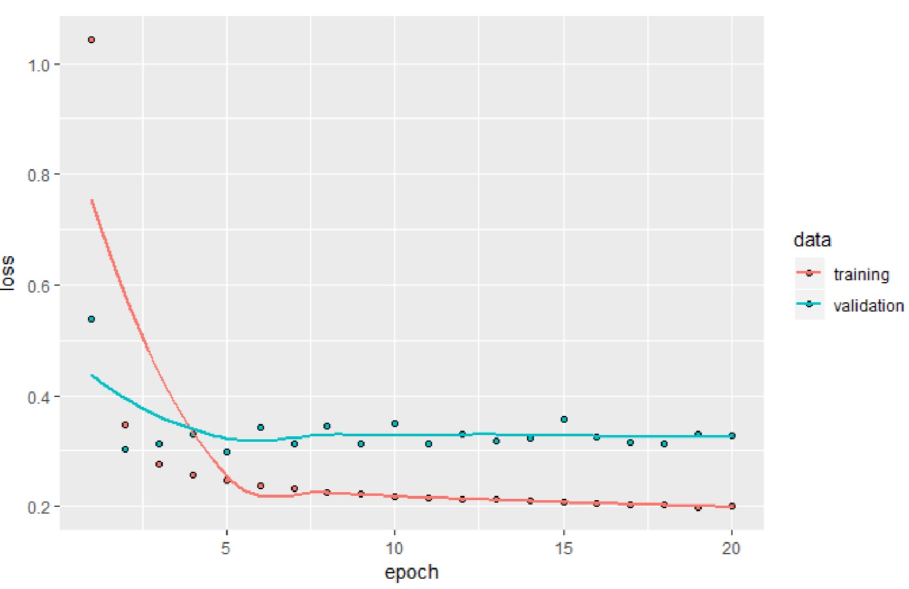
```

Some of the validation losses are close to the no-learning baseline, but not reliably. This goes to show the merit of having this baseline in the first place: it turns out to be not easy to outperform. Your common sense contains a lot of valuable information that a machine-learning model doesn’t have access to.

You may wonder, if a simple, well-performing model exists to go from the data to the targets (the common-sense baseline), why doesn’t the model you’re training find it and improve on it? Because this simple solution isn’t what your training setup is looking for. The space of models in which you’re searching for a solution — that is, your hypothesis space — is the space of all possible two-layer networks with the configuration you defined. These networks are already fairly complicated. When you’re looking for a solution with a space of complicated models, the simple, well-performing baseline may be unlearnable, even if it’s technically part of the hypothesis space. _That is a pretty significant limitation of machine learning in general: unless the learning algorithm is hardcoded to look for a specific kind of simple model, parameter learning can sometimes fail to find a simple solution to a simple problem_. 
	
### A First Recurrent Baseline

The first fully connected approach didn’t do well, but that doesn’t mean machine learning isn’t applicable to this problem. The previous approach first flattened the timeseries, which removed the notion of time from the input data. Let’s instead look at the data as what it is: a sequence, where causality and order matter. Try a recurrent - sequence processing model — it should be the perfect fit for such sequence data, precisely because it exploits the temporal ordering of data points, unlike the first approach.

Instead of the LSTM layer introduced in the previous section, you’ll use the GRU layer, developed by Chung et al. in 2014.  `Gated recurrent unit (GRU)` layers work using the same principle as LSTM, but they’re somewhat streamlined and thus cheaper to run (although they may not have as much representational power as LSTM). This trade-off between computational expensiveness and representational power is seen everywhere in machine learning.

```{r eval=FALSE}
model <- keras_model_sequential() %>%
     layer_gru(units = 32, input_shape = list(NULL, dim(data)[[-1]])) %>% 
     layer_dense(units = 1)

model %>% compile(optimizer = optimizer_rmsprop(), loss = "mae")

history <- model %>% fit_generator(
     train_gen, steps_per_epoch = 500, epochs = 20, 
     validation_data = val_gen, validation_steps = val_steps)

plot(history)
```

```{r, out.width = "4000px", echo=FALSE}
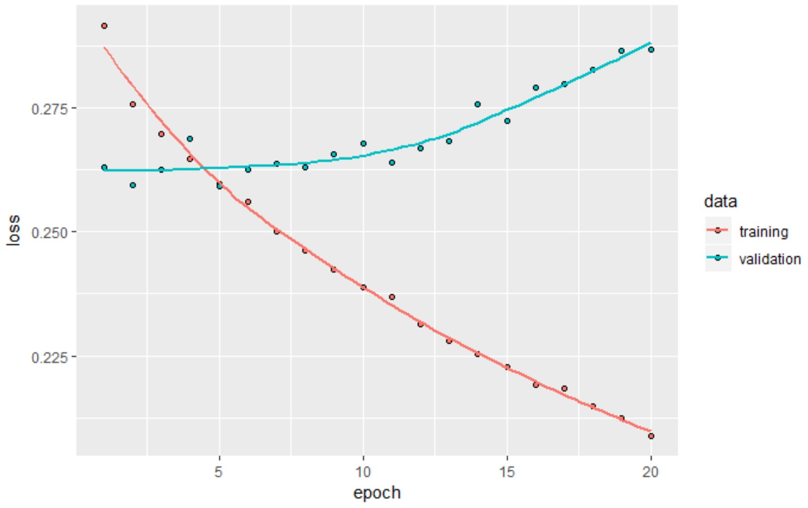
```

Much better! You can significantly beat the common-sense baseline, demonstrating the value of machine learning as well as the superiority of recurrent networks compared to sequence-flattening dense networks on this type of task.
 
The new validation MAE of ~0.265 (before you start significantly overfitting) translates to a mean absolute error of 2.35˚C after denormalization. That’s a solid gain on the initial error of 2.57˚C, but you probably still have a bit of a margin for improvement. 

### Recurrent Dropout to Fight Overfitting

It’s evident from the training and validation curves that the model is overfitting: the training and validation losses start to diverge considerably after a few epochs. You’re already familiar with a classic technique for fighting this phenomenon: dropout, which randomly zeros out input units of a layer in order to break happenstance correlations in the training data that the layer is exposed to. But how to correctly apply dropout in recurrent networks isn’t a trivial question. It has long been known that applying dropout before a recurrent layer hinders learning rather than helping with regularization. In 2015, Yarin Gal, as part of his PhD thesis on Bayesian deep learning,  determined the proper way to use dropout with a recurrent network: the same dropout mask (the same pattern of dropped units) should be applied at every timestep, instead of a dropout mask that varies randomly from timestep to timestep. What’s more, in order to regularize the representations formed by the recurrent gates of layers such as layer_gru and layer_lstm, a temporally constant dropout mask should be applied to the inner recurrent activations of the layer (a recurrent dropout mask). Using the same dropout mask at every timestep allows the network to properly propagate its learning error through time; a temporally random dropout mask would disrupt this error signal and be harmful to the learning process.
 
Yarin Gal did his research using Keras and helped build this mechanism directly into Keras recurrent layers. Every recurrent layer in Keras has two dropout-related arguments: `dropout`, a float specifying the dropout rate for input units of the layer, and `recurrent_dropout`, specifying the dropout rate of the recurrent units. Let’s add dropout and recurrent dropout to `layer_gru` and see how doing so impacts overfitting. Because networks being regularized with dropout always take longer to fully converge, train the networ

```{r eval=FALSE}
model <- keras_model_sequential() %>%
     layer_gru(units = 32, dropout = 0.2, recurrent_dropout = 0.2, input_shape = list(NULL,
                                                            dim(data)[[-1]])) %>% 
     layer_dense(units = 1)

model %>% compile(optimizer = optimizer_rmsprop(), loss = "mae")

history <- model %>% fit_generator(train_gen,
steps_per_epoch = 500, epochs = 40, validation_data = val_gen, 
validation_steps = val_steps)
```

```{r, out.width = "4000px", echo=FALSE}
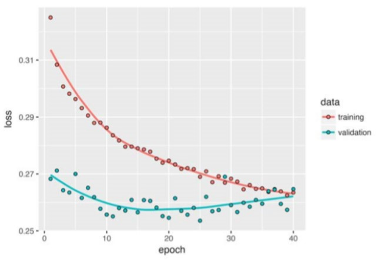
```

Success! You’re no longer overfitting during the first 20 epochs. But although you have more stable evaluation scores, your best scores aren’t much lower than they were previously. 

### Stacking Recurrent Layers

Because you’re no longer overfitting but seem to have hit a performance bottleneck, you should consider increasing the capacity of the network. Recall the description of _the universal machine-learning workflow: it’s generally a good idea to increase the capacity of your network until overfitting becomes the primary obstacle (assuming you’ve already taken basic steps to mitigate overfitting, such as using dropout). As long as you aren’t overfitting too badly, you’re likely under capacity_.

Increasing network capacity is typically done by increasing the number of units in the layers or adding more layers. Recurrent layer stacking is a classic way to build more-powerful recurrent networks: for instance, what currently powers the Google Translate algorithm is a stack of seven large LSTM layers—that’s huge.
 
To stack recurrent layers on top of each other in Keras, all intermediate layers should return their full sequence of outputs (a 3D tensor) rather than their output at the last timestep. This is done by specifying `return_sequences = TRUE`.

Adding layer may improve the results a bit, though not significantly. You can draw two conclusions:

- Because you’re still not overfitting too badly, you could safely increase the size of your layers in a quest for validation-loss improvement. This has a non-negligible computational cost, though.
-  Adding a layer will not help by a significant factor, so you may be seeing diminishing returns from increasing network capacity at this point.   
 
```{r eval=FALSE}
model <- keras_model_sequential() %>%
     layer_gru(units = 32, dropout = 0.1, recurrent_dropout = 0.5, 
               return_sequences = TRUE, input_shape = list(NULL, dim(data)[[-1]])) %>%
     layer_gru(units = 64, activation = "relu", dropout = 0.1, recurrent_dropout = 0.5) %>%
     layer_dense(units = 1)

model %>% compile(optimizer = optimizer_rmsprop(), loss = "mae")

history <- model %>% fit_generator(
     train_gen, steps_per_epoch = 500, epochs = 40, 
     validation_data = val_gen, validation_steps = val_steps)
```

```{r, out.width = "4000px", echo=FALSE}
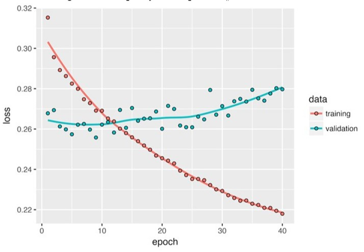
```

### Using Bdirectional RNNs

The last technique is called bidirectional RNNs. A bidirectional RNN is a common RNN variant that can offer greater performance than a regular RNN on certain tasks. It’s frequently used in natural-language processing—you could call it the Swiss Army knife of deep learning for natural-language processing.
 
RNNs are notably order dependent, or time dependent: they process the timesteps of their input sequences in order, and shuffling or reversing the timesteps can completely change the representations the RNN extracts from the sequence. This is precisely the reason they perform well on problems where order is meaningful, such as the temperature-forecasting problem. A bidirectional RNN exploits the order sensitivity of RNNs: it consists of using two regular RNNs, such as layer_gru and layer_lstm that you’re already familiar with, each of which processes the input sequence in one direction (chronologically and antichronologically), and then merging their representations. By processing a sequence both ways, a bidirectional RNN can catch patterns that may be overlooked by a unidirectional RNN.
 
Remarkably, the fact that the RNN layers in this section have processed sequences in chronological order (older timesteps first) may have been an arbitrary decision. At least, it’s a decision we made no attempt to question so far. Could the RNNs have performed well enough if they processed input sequences in antichronological order, for instance (newer timesteps first)? Let’s try this in practice and see what happens. All you need to do is write a variant of the data generator where the input sequences are reverted along the time dimension (replace the last line with `list(samples [, ncol(samples):1,], targets))`.  Training the same one-GRU-layer network that you used in the first experiment in this section, you get the results shown below????.

The reversed-order GRU underperforms even the common-sense baseline, indicating that in this case, chronological processing is important to the success of your approach. This makes perfect sense: the underlying GRU layer will typically be better at remembering the recent past than the distant past, and naturally the more recent weather data points are more predictive than older data points for the problem (that’s what makes the common-sense baseline fairly strong). Thus the chronological version of the layer is bound to outperform the reversed-order version. Importantly, this isn’t true for many other problems, including natural language: intuitively, the importance of a word in understanding a sentence isn’t usually dependent on its position in the
 
Try the same trick on the LSTM IMDB example from before.

```{r eval=FALSE}
library(keras)
max_features <- 10000
maxlen <- 500

imdb <- dataset_imdb(num_words = max_features)
c(c(x_train, y_train), c(x_test, y_test)) %<-% imdb

x_train <- lapply(x_train, rev)	  
x_test <- lapply(x_test, rev)

x_train <- pad_sequences(x_train, maxlen = maxlen)
x_test <- pad_sequences(x_test, maxlen = maxlen)

model <- keras_model_sequential() %>%
     layer_embedding(input_dim = max_features, output_dim = 128) %>% 
     layer_lstm(units = 32) %>%
     layer_dense(units = 1, activation = "sigmoid")

model %>% compile(optimizer = "rmsprop", loss = "binary_crossentropy", metrics = c("acc"))

history <- model %>% fit(
     x_train, y_train, epochs = 10, batch_size = 128, validation_split = 0.2)
```

```{r, out.width = "4000px", echo=FALSE}
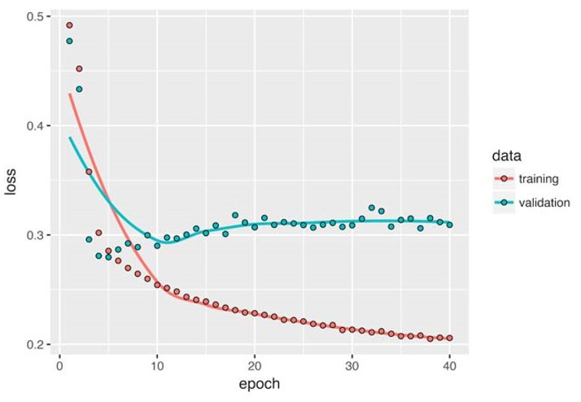
```

You get performance nearly identical to that of the chronological-order LSTM. Remarkably, on such a text dataset, reversed-order processing works just as well as chronological processing, confirming the hypothesis that, although word order does matter in understanding language, which order you use isn’t crucial. Importantly, an RNN trained on reversed sequences will learn different representations than one trained on the original sequences, much as you would have different mental models if time flowed backward in the real world—if you lived a life where you died on your first day and were born on your last day. In machine learning, representations that are different yet useful are always worth exploiting, and the more they differ, the better: they offer a new angle from which to look at your data, capturing aspects of the data that were missed by other approaches, and thus they can help boost performance on a task. 

A bidirectional RNN exploits this idea to improve on the performance of chronologicalorder RNNs. It looks at its input sequence both ways, obtaining potentially richer representations and capturing patterns that may have been missed by the chronological-order version alone.
 
To instantiate a bidirectional RNN in Keras, you use the `bidirectional()` function, which takes a recurrent layer instance as an argument. The `bidirectional()` function creates a second, separate instance of this recurrent layer and uses one instance for processing the input sequences in chronological order and the other instance for processing the input sequences in reversed order. Let’s try it on the 	IMDB sentiment-analysis task.	

```{r eval=FALSE}
model <- keras_model_sequential() %>%
     layer_embedding(input_dim = max_features, output_dim = 32) %>% 
     bidirectional(layer_lstm(units = 32)) %>% 
     layer_dense(units = 1, activation = "sigmoid")

model %>% compile(optimizer = "rmsprop", loss = "binary_crossentropy", metrics = c("acc"))

history <- model %>% fit(
     x_train, y_train, epochs = 10, batch_size = 128, validation_split = 0.2)
```

It performs slightly better than the regular LSTM you tried previously, achieving over 89% validation accuracy. It also seems to overfit more quickly, which is unsurprising because a bidirectional layer has twice as many parameters as a chronological LSTM. With some regularization, the bidirectional approach would likely be a strong performer on this task.

Now try the same approach on the temperature-prediction task.

```{r biDirectional, eval=FALSE}
model <- keras_model_sequential() %>%
     bidirectional(layer_gru(units = 32), input_shape = list(NULL, dim(data)[[-1]])) %>%
     layer_dense(units = 1)

model %>% compile(optimizer = optimizer_rmsprop(), loss = "mae")

history <- model %>% fit_generator(
     train_gen, steps_per_epoch = 500, epochs = 40, 
     validation_data = val_gen, validation_steps = val_steps)
plot(history)
```

```{r, out.width = "4000px", echo=FALSE}
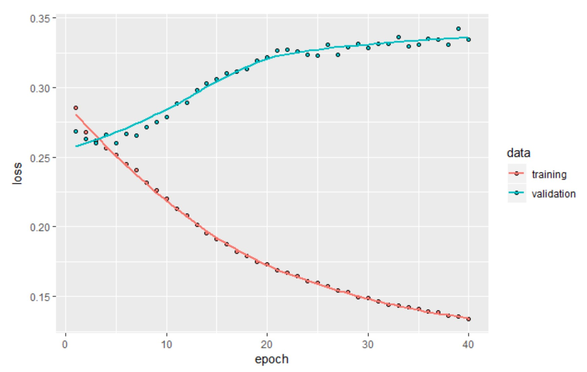
```

This performs about as well as the regular layer_gru. It’s easy to understand why: all the predictive capacity must come from the chronological half of the network, because the antichronological half is known to be severely underperforming on this task (again, because the recent past matters much more than the distant past in this case). 

### Going Further

There are many other things you could try, in order to improve performance on the temperature-forecasting problem:

- Adjust the number of units in each recurrent layer in the stacked setup. The current choices are largely arbitrary and thus probably suboptimal.
- Adjust the learning rate used by the RMSprop optimizer.
- Try using layer_lstm instead of layer_gru.
- Try using a bigger densely connected regressor on top of the recurrent layers: that is, a bigger dense layer or even a stack of dense layers.
- Don’t forget to eventually run the best-performing models (in terms of validation MAE) on the test set! Otherwise, you’ll develop architectures that are overfitting to the validation set.

As always, deep learning is more an art than a science. We can provide guidelines that suggest what is likely to work or not work on a given problem, but, ultimately, every problem is unique; you’ll have to evaluate different strategies empirically. There is currently no theory that will tell you in advance precisely what you should do to optimally solve a problem. You must iterate.

### Wrapping up

Here’s what you should take away from this section:

- When approaching a new problem, it’s good to first establish common-sense baselines for your metric of choice. If you don’t have a baseline to beat, you can’t tell whether you’re making real progress.
- Try simple models before expensive ones, to justify the additional expense. Sometimes a simple model will turn out to be your best option.
- When you have data where temporal ordering matters, recurrent networks are a great fit and easily outperform models that first flatten the temporal data.
- To use dropout with recurrent networks, you should use a time-constant dropout mask and recurrent dropout mask. These are built into Keras recurrent layers, so all you have to do is use the dropout and recurrent_dropout arguments of recurrent layers.
- Stacked RNNs provide more representational power than a single RNN layer. They’re also much more expensive and thus not always worth it. Although they offer clear gains on complex problems (such as machine translation), they may not always be relevant to smaller, simpler problems.
- Bidirectional RNNs, which look at a sequence both ways, are useful on natural language processing problems. But t_hey aren’t strong performers on sequence data where the recent past is much more informative than the beginning of the sequence_.

NOTE There are two important concepts we won’t cover: recurrent attention and sequence masking. Both tend to be especially relevant for natural-language processing.

## Sequence Processing with Convnets

```{r}
rm(list=ls())
```

Earlier you learned about convolutional neural networks (convnets) and how they perform particularly well on computer vision problems, due to their ability to operate convolutionally, extracting features from local input patches and allowing for representation modularity and data efficiency. The same properties that make convnets excel at computer vision also make them highly relevant to sequence processing. Time can be treated as a spatial dimension, like the height or width of a 2D image.

Such 1D convnets can be competitive with RNNs on certain sequence-processing problems, usually at a considerably cheaper computational cost. Recently, 1D convnets, typically used with dilated kernels, have been used with great success for audio generation and machine translation. In addition to these specific successes, it has long been known that _small 1D convnets can offer a fast alternative to RNNs for simple tasks such as text classification and timeseries forecasting_.

### Understanding 1D Convolution for Sequence Data

The convolution layers introduced previously were 2D convolutions, extracting 2D patches from image tensors and applying an identical transformation to every patch. In the same way, you can use 1D convolutions, extracting local 1D patches (subsequences) from sequences.
 
Such 1D convolution layers can recognize local patterns in a sequence. Because the same input transformation is performed on every patch, a pattern learned at a certain position in a sentence can later be recognized at a different position, making 1D convnets translation invariant (for temporal translations). For instance, a 1D convnet processing sequences of characters using convolution windows of size 5 should be able to learn words or word fragments of length 5 or less, and it should be able to recognize these words in any context in an input sequence. A character-level 1D convnet is thus able to learn about word morphology. 

### 1D pooling for sequence data

You’re already familiar with 2D pooling operations, such as 2D average pooling and max pooling, used in convnets to spatially downsample image tensors. The 2D pooling operation has a 1D equivalent: extracting 1D patches (subsequences) from an input and outputting the maximum value (max pooling) or average value (average pooling). Just as with 2D convnets, this is used for reducing the length of 1D inputs (subsampling). 

### Implementing a 1D convnet

In Keras, you use a 1D convnet via the `layer_conv_1d` function, which has an interface similar to `layer_conv_2d.` It takes as input 3D tensors with shape (samples, time, features) and returns similarly shaped 3D tensors. The convolution window is a 1D window on the temporal axis: the second axis in the input tensor.

Build a simple two-layer 1D convnet and apply it to the IMDB sentiment classification task. As a reminder, this is the code for obtaining and preprocessing the data.

```{r}
max_features <- 10000 
max_len <- 500

imdb <- dataset_imdb(num_words = max_features) 
c(c(x_train, y_train), c(x_test, y_test)) %<-% imdb 

x_train <- pad_sequences(x_train, maxlen = max_len) 
x_test <- pad_sequences(x_test, maxlen = max_len) 
```

1D convnets are structured in the same way as their 2D counterparts: they consist of a stack of `layer_conv_1d` and `layer_max_pooling_1d`, ending in either a global pooling layer or `layer_flatten`, that turn the 3D outputs into 2D outputs, allowing you to add one or more dense layers to the model for classification or regression.

> One difference, though, is the fact that you can afford to use larger convolution windows with 1D convnets. With a 2D convolution layer, a 3 × 3 convolution window contains 3 × 3 = 9 feature vectors; but with a 1D convolution layer, a convolution window of size 3 contains only 3 feature vectors. You can thus easily afford 1D convolution windows of size 7 or 9.

This is the example 1D convnet for the IMDB dataset.

```{r}
model <- keras_model_sequential() %>%
     layer_embedding(input_dim = max_features, output_dim = 128, input_length = max_len) %>%
     layer_conv_1d(filters = 32, kernel_size = 7, activation = "relu") %>%
     layer_max_pooling_1d(pool_size = 5) %>% 
     layer_conv_1d(filters = 32, kernel_size = 7, activation = "relu") %>%
     layer_global_max_pooling_1d() %>% 
     layer_dense(units = 1) 
summary(model)
```
```{r eval=FALSE}
model %>% compile(
     optimizer = optimizer_rmsprop(lr = 1e-4), loss = "binary_crossentropy", 
     metrics = c("acc"))

history <- model %>% fit(x_train, y_train, epochs = 10, batch_size = 128, validation_split = 0.2)
plot(history())
```
```{r echo=FALSE, eval=FALSE}
setwd("~/GitHub/DeepLearning/Deep_Learning_with_R")
load("./RData/1Dconvnet.RData")
```

Validation accuracy is somewhat less than that of the LSTM, but runtime is faster on both CPU and GPU (the exact increase in speed will vary greatly depending on your exact configuration). At this point, you could retrain this model for the right number of epochs (eight) and run it on the test set. This is a convincing demonstration that a 1D convnet can offer a fast, cheap alternative to a recurrent network on a word-level sentiment-classification task.

```{r, out.width = "4000px", echo=FALSE}
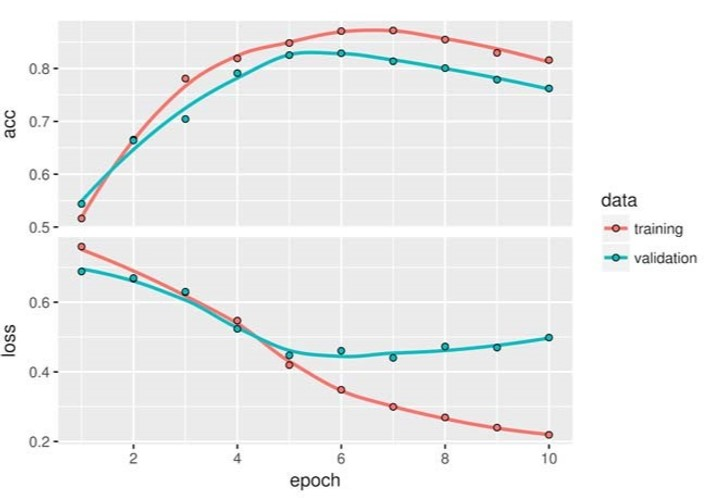
```

### Combining CNNs and RNNs for long Sequences

Because 1D convnets process input patches independently, they aren’t sensitive to the order of the timesteps (beyond a local scale, the size of the convolution windows), unlike RNNs. Of course, to recognize longer-term patterns, you can stack many convolution layers and pooling layers, resulting in upper layers that will see long chunks of the original inputs—but that’s still a fairly weak way to induce order sensitivity. One way to evidence this weakness is to try 1D convnets on the temperature-forecasting problem, where order sensitivity is key to producing good predictions. The following example reuses these previously defined variables: `float_data`, `train_gen`, `val_gen`, and `val_steps.`

```{r eval=FALSE}
model <- keras_model_sequential() %>%
     layer_conv_1d(filters = 32, kernel_size = 5, activation = "relu", 
                   input_shape = list(NULL, dim(data)[[-1]])) %>%
     layer_max_pooling_1d(pool_size = 3) %>% 
     layer_conv_1d(filters = 32, kernel_size = 5, activation = "relu") %>%
     layer_max_pooling_1d(pool_size = 3) %>% 
     layer_conv_1d(filters = 32, kernel_size = 5, activation = "relu") %>%
     layer_global_max_pooling_1d() %>% 
     layer_dense(units = 1)

model %>% compile(optimizer = optimizer_rmsprop(), loss = "mae"
                  )
history <- model %>% fit_generator(train_gen, steps_per_epoch = 500, epochs = 20,
                                   validation_data = val_gen, 
                                   validation_steps = val_steps)
```

```{r, out.width = "4000px", echo=FALSE}
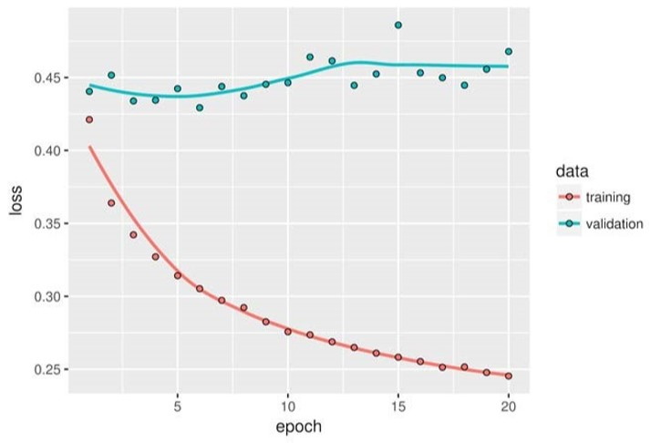
```

The validation MAE stays in the 0.40s:__ you can’t even beat the common-sense baseline__ using the small convnet. Again, this is because the convnet looks for patterns anywhere in the input timeseries and has no knowledge of the temporal position of a pattern it sees (toward the beginning, toward the end, and so on). Because more recent data points should be interpreted differently from older datapoints in the case of this specific forecasting problem, the convnet fails at producing meaningful results. This limitation of convnets isn’t an issue with the IMDB data, because patterns of keywords associated with a positive or negative sentiment are informative independently of where they’re found in the input sentences.

One strategy to combine the speed and lightness of convnets with the order sensitivity of RNNs is to use a 1D convnet as a preprocessing step before an RNN. This is especially beneficial when you’re dealing with sequences that are so long they can’t realistically be processed with RNNs, such as sequences with thousands of steps. The convnet will turn the long input sequence into much shorter (downsampled) sequences of higher-level features. This sequence of extracted features then becomes the input to the RNN part of the network.

This technique isn’t seen often in research papers and practical applications, possibly because it isn’t well known. __It’s effective and ought to be more common__. Let’s try it on the temperature-forecasting dataset. Because this strategy allows you to manipulate much longer sequences, you can either look at data from longer ago (by increasing the lookback parameter of the data genera-tor) or look at high-resolution timeseries (by decreasing the step parameter of the generator). Here, somewhat arbitrarily, you’ll use a step that’s half as large, resulting in a timeseries twice as long, where the temperature data is sampled at a rate of 1 point per 30 minutes. The example reuses the generator function defined earlier.

```{r, out.width = "4000px", echo=FALSE}

```

```{r}
step = 3
lookback = 720
delay = 144

train_gen <- generator( data, lookback = lookback, delay = delay, min_index = 1, 
                        max_index = 200000, shuffle = TRUE, step = step)

val_gen <- generator( data, lookback = lookback, delay = delay, min_index = 200001, 
                      max_index = 300000, step = step
                      )
test_gen <- generator( data, lookback = lookback, delay = delay, min_index = 300001, 
                       max_index = NULL, step = step)

val_steps <- (300000 - 200001 - lookback) / 128 
test_steps <- (nrow(data) - 300001 - lookback) / 128


```

Below is the model, starting with two layer_conv_1ds and following up with a layer_ gru. 

```{r, out.width = "4000px", echo=FALSE}
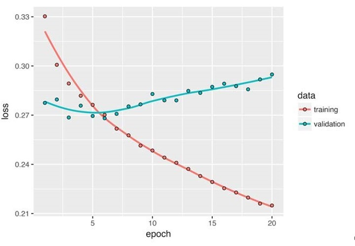
```

### Wrapping up
Here’s what you should take away from this section:

- In the same way that 2D convnets perform well for processing visual patterns in 2D space, 1D convnets perform well for processing temporal patterns. They offer a faster alternative to RNNs on some problems, in particular natural language processing tasks.
- Typically, 1D convnets are structured much like their 2D equivalents from the world of computer vision: they consist of stacks of `layer_conv_1ds` and layer_ `max_pooling_1ds`, ending in a global pooling operation or flattening operation.
- Because RNNs are extremely expensive for processing very long sequences, but 1D convnets are cheap, it can be a good idea to use a 1D convnet as a preprocessing step before an RNN, shortening the sequence and extracting useful representations for the RNN to process. 


## Summary

- In this chapter, you learned the following techniques, which are widely applicable to any dataset of sequence data, from text to timeseries:

     – How to tokenize text
     – What word embeddings are, and how to use them
     – What recurrent networks are, and how to use them
     – How to stack RNN layers and use bidirectional RNNs to build more-powerful sequence-processing models
     – How to use 1D convnets for sequence processing
     - How to combine 1D convnets and RNNs to process long sequences
- You can use RNNs for timeseries regression (“predicting the future”), timeseries classification, anomaly detection in timeseries, and sequence labeling (such as identifying names or dates in sentences).
-  Similarly, you can use 1D convnets for machine translation (sequence-to-sequence convolutional models, like SliceNet),  document classification, and spelling correction.
- If global order matters in your sequence data, then it’s preferable to use a recurrent network to process it. This is typically the case for timeseries, where the recent past is likely to be more informative than the distant past.
- If global ordering isn’t fundamentally meaningful, then 1D convnets will turn out to work at least as well and are cheaper. This is often the case for text data, where a keyword found at the beginning of a sentence is just as meaningful as a keyword found at the end.

# Advanced Deep Learning Best Practices

## Keras functional API
Until now, all neural networks introduced have been implemented using the sequential model (_keras_ model_sequential_). The sequential model makes the assumption that the network has exactly one input and exactly one output, and that it consists of a linear stack of layers. Some networks require several independent inputs, others require multiple outputs, and some networks have internal branching between layers that makes them look like graphs of layers rather than linear stacks of layers.
 
 Some tasks, for instance, require multimodal inputs: they merge data coming from different input sources, processing each type of data using different kinds of neural layers. Imagine a deep-learning model trying to predict the most likely market price of a second-hand piece of clothing, using the following inputs: user-provided metadata (such as the item’s brand, age, and so on), a user-provided text description, and a picture of the item. If you had only the metadata available, you could one-hot encode it and use a densely connected network to predict the price. If you had only the text description available, you could use an RNN or a 1D convnet. If you had only the picture, you could use a 2D convnet. But how can you use all three at the same time? A naive approach would be to train three separate models and then do a weighted average of their predictions. But this may be suboptimal, because the information extracted by the models may be redundant. A better way is to jointly learn a more accurate model of the data by using a model that can see all available input modalities simultaneously: a model with three input branches

Similarly, some tasks need to predict multiple target attributes of input data. Given the text of a novel or short story, you might want to automatically classify it by genre (such as romance or thriller) but also predict the approximate date it was written. Of course, you could train two separate models: one for the genre and one for the date. But because these attributes aren’t statistically independent, you could build a better model by learning to jointly predict both genre and date at the same time. Such a joint model would then have two outputs, or heads. Due to correlations between genre and date, knowing the date of a novel would help the model learn rich, accurate representations of the space of novel genres, and vice versa.

Additionally, many recently developed neural architectures require nonlinear network topology: networks structured as directed acyclic graphs. The Inception family of networks (developed by Szegedy et al. at Google),  for instance, relies on Inception modules, where the input is processed by several parallel convolutional branches whose outputs are then merged back into a single tensor:

```{r, out.width = "4000px", echo=FALSE}
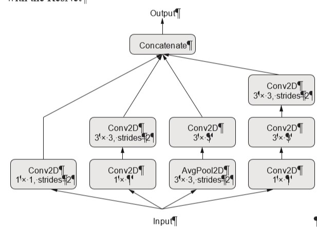
```

There’s also the recent trend of adding residual connections to a model, which started with the ResNet family of networks (developed by He et al. at Microsoft).  A residual connection consists of reinjecting previous representations into the downstream flow of data by adding a past output tensor to a later output tensor, which helps prevent information loss along the data-processing flow. There are many other examples of such graph-like networks.

```{r, out.width = "4000px", echo=FALSE}
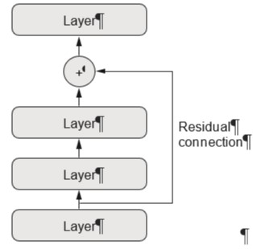
```

These three important use cases

- multi-input models
- multi-output models
- graph-like models

aren’t possible when defining a model with `keras_model_sequential.` But there’s another far more general and flexible way to use Keras: the functional API. This section explains in detail what it is, what it can do, and how to use it.

### Intro Functional API

In the functional API, you build your input and output layers and then pass them to the _keras_model_ function. This model can be trained just like Keras sequential models.

Start with a minimal example that shows side-by-side a simple sequential model and its equivalent in the functional API:

```{r}
seq_model <- keras_model_sequential() %>%
     layer_dense(units = 32, activation = "relu", input_shape = c(64)) %>% 
     layer_dense(units = 32, activation = "relu") %>% 
     layer_dense(units = 10, activation = "softmax")


input_tensor <- layer_input(shape = c(64))	 
output_tensor <- input_tensor %>% 
     layer_dense(units = 32, activation = "relu") %>% 
     layer_dense(units = 32, activation = "relu") %>% 
     layer_dense(units = 10, activation = "softmax")
model <- keras_model(input_tensor, output_tensor)

summary(model)
```

The only part that may seem a bit magical at this point is passing only an input tensor and an output tensor to the `keras_model` function. Behind the scenes, Keras retrieves every layer involved in going from `input_tensor` to `output_tensor`, bringing them together into a graph-like data structure—a model. Of course, the reason it works is that `output_tensor` was obtained by repeatedly transforming `input_tensor.` If you tried to build a model from inputs and outputs that weren’t related, you’d get an error.

When it comes to compiling, training, or evaluating a model built this way, the API is the same as that of sequential models:

```{r eval=FALSE}
model %>% compile(optimizer = "rmsprop", loss = "categorical_crossentropy")

x_train <- array(runif(1000 * 64), dim = c(1000, 64)) 
y_train <- array(runif(1000 * 10), dim = c(1000, 10)) 

model %>% fit(x_train, y_train, epochs = 10, batch_size = 128)

model %>% evaluate(x_train, y_train)
```

### Multi-Input Models

The functional API can be used to build models that have multiple inputs. Typically, such models at some point merge their different input branches using a layer that can combine several tensors: by adding them, concatenating them, and so on. This is usually done via a Keras merge operation such as `layer_add`, `layer_concatenate`, and so on. Examine at a  simple example of a multi-input model: a question-answering model.
 
A typical question-answering model has two inputs: 

1. a natural-language question 
2. text snippet (such as a news article) providing information to be used for answering the question. 

The model must then produce an answer: in the simplest possible setup, this is a one-word answer obtained via a softmax over some predefined vocabulary.

```{r, out.width = "4000px", echo=FALSE}
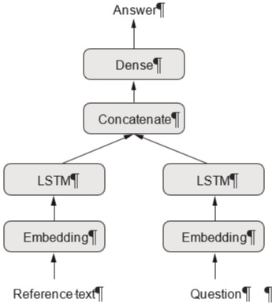
```

Following is an example of how you can build such a model with the functional API. You set up two independent branches, encoding the text input and the question input as representation vectors; then, concatenate these vectors; and finally, add a softmax classifier on top of the concatenated representations.

```{r mult_Inputs, eval=FALSE}
text_vocabulary_size <- 10000 
ques_vocabulary_size <- 10000 
answer_vocabulary_size <- 500 

text_input <- layer_input(shape = list(NULL), dtype = "int32", name = "text")
# The text input is a variable-length sequence of integers. Note that you can optionally name the inputs

encoded_text <- text_input %>%
     layer_embedding(input_dim = 64, output_dim = text_vocabulary_size) %>% layer_lstm(units = 32)
# Embeds the inputs into a sequence of vectors of size 64
# Encodes the vectors into a single vector via LSTM

question_input <- layer_input(shape = list(NULL), dtype = "int32", name = "question")

encoded_question <- question_input %>% 
     layer_embedding(input_dim = 32, output_dim = ques_vocabulary_size) %>% layer_lstm(units = 16) 

concatenated <- layer_concatenate(list(encoded_text, encoded_question))
# Concatenates the encoded question and encoded text

answer <- concatenated %>%
     layer_dense(units = answer_vocabulary_size, activation = "softmax")


model <- keras_model(list(text_input, question_input), answer)
# At model start specify the 2 inputs and the output

model %>% compile(optimizer = "rmsprop", loss = "categorical_crossentropy", metrics = c("acc"))
```

How do you train this two-input model? There are two possible APIs: 

1. you can feed the model a list of arrays as inputs
2. you can feed it a dictionary that maps input names to arrays. 

Naturally, the latter option is available only if you give names to your inputs.

```{r feedData}
num_samples <- 1000
max_length <- 100

random_matrix <- function(range, nrow, ncol) {
     matrix(sample(range, size = nrow * ncol, replace = TRUE), nrow = nrow, ncol = ncol)}
# Dummy Data

text <- random_matrix(1:text_vocabulary_size, num_samples, max_length) 
question <- random_matrix(1:ques_vocabulary_size, num_samples, max_length) 
answers <- random_matrix(0:1, num_samples, answer_vocabulary_size)
# Answers are one-hot encoded, not integers

model %>% fit(list(text, question), answers, epochs = 10, batch_size = 128)
# Fitting using a list on inputs

### OR

model %>% fit(list(text = text, question = question), answers, epochs = 10, batch_size = 128)
# Fitting using a named list of inputs
```

### Multi-Output Models

In the same way, you can use the functional API to build models with multiple outputs (or multiple heads). A simple example is a network that attempts to simultaneously predict different properties of the data, such as a network that takes as input a series of social media posts from a single anonymous person and tries to predict attributes of that person, such as age, gender, and income level

```{r, out.width = "4000px", echo=FALSE}
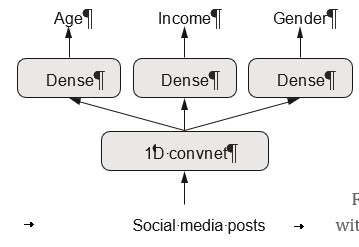
```

```{r}

vocabulary_size <- 50000 
num_income_groups <- 10

posts_input <- layer_input(shape = list(NULL), dtype = "int32", name = "posts")

embedded_posts <- posts_input %>% layer_embedding(input_dim = 256, output_dim = vocabulary_size)

base_model <- embedded_posts %>%
     layer_conv_1d(filters = 128, kernel_size = 5, activation = "relu") %>% 
     layer_max_pooling_1d(pool_size = 5) %>% 
     layer_conv_1d(filters = 256, kernel_size = 5, activation = "relu") %>% 
     layer_conv_1d(filters = 256, kernel_size = 5, activation = "relu") %>% 
     layer_max_pooling_1d(pool_size = 5) %>% 
     layer_conv_1d(filters = 256, kernel_size = 5, activation = "relu") %>% 
     layer_conv_1d(filters = 256, kernel_size = 5, activation = "relu") %>% 
     layer_global_max_pooling_1d() %>% 
     layer_dense(units = 128, activation = "relu") 

age_prediction <- base_model %>% layer_dense(units = 1, name = "age")
#Note the ouput layers are given names.

income_prediction <- base_model %>% 
     layer_dense(num_income_groups, activation = "softmax", name = "income")

gender_prediction <- base_model %>% layer_dense(units = 1, activation = "sigmoid", name = "gender")

model <- keras_model(posts_input, list(age_prediction, income_prediction, gender_prediction))
```

__Training such a model requires the ability to specify different loss functions for different heads of the network__: for instance, age prediction is a scalar regression task, but gender prediction is a binary classification task, requiring a different training procedure. But because gradient descent requires you to minimize a scalar, you must combine these losses into a single value in order to train the model. The simplest way to combine different losses is to sum them all. In Keras, you can use either a list or a named list of losses in compile to specify different objects for different outputs; the resulting loss values are summed into a global loss, which is minimized during training.

```{r eval = FALSE}
model %>% compile(optimizer = "rmsprop",
                  loss = c("mse", "categorical_crossentropy", "binary_crossentropy") )

#This is the same as above if you give names to output layers
model %>% compile(optimizer = "rmsprop",
                  loss = list(age = "mse",
                              income = "categorical_crossentropy",
                              gender = "binary_crossentropy") )
```

> Very imbalanced loss contributions will cause the model representations to be optimized preferentially for the task with the largest individual loss, at the expense of the other tasks. 

To remedy this, assign different levels of importance to the loss values in their contribution to the final loss. This is useful in particular if the losses’ values use different scales. For instance, the mean squared error (MSE) loss used for the age-regression task typically takes a value around 3–5, whereas the crossentropy loss used for the gender-classification task can be as low as 0.1. In such a situation, to balance the contribution of the different losses, you can assign a weight of 10 to the crossentropy loss and a weight of 0.25 to the MSE loss.

Similar to multi-input models, you can pass data to the model for training either via a plain list of arrays or via a named list of arrays.

Below is a multi-output with loss weighting example:
```{r}
model %>% compile(optimizer = "rmsprop", 
                  loss = c("mse", "categorical_crossentropy", "binary_crossentropy"), 
                  loss_weights = c(0.25, 1, 10))

####################### OR
#If you give names to output layers:

model %>% compile(optimizer = "rmsprop", loss = list(age = "mse", income = "categorical_crossentropy",
                                                     gender = "binary_crossentropy"), 
                  loss_weights = list(age = 0.25, income = 1, gender = 10))
```

Feeding data to a multi-output model
```{r}
# age_targets, income_targets, and gender_targets are assumed to be R arrays.
model %>% fit(posts, list(age_targets, income_targets, gender_targets), epochs = 10, batch_size = 64)

# Equivalent (possible only if you give names to the output layers)
model %>% fit(posts, list(age = age_targets, income = income_targets, gender = gender_targets),
              epochs = 10, batch_size = 64)
```

### Directed Acylic Graphs of Layers

With the functional API, you can implement networks with a complex internal topology. Neural networks in Keras are allowed to be arbitrary directed acyclic graphs of layers. The qualifier acyclic is important: these graphs can’t have cycles. It’s impossible for a tensor x to become the input of one of the layers that generated x. The only processing loops that are allowed (that is, recurrent connections) are those internal to recurrent layers.

Several common neural-network components are implemented as graphs. Two notable ones are `Inception` modules and `residual` connections. To better understand how the functional API can be used to build graphs of layers, let’s take a look at how you can implement both of them in Keras.

#### Inception Modules

Inception  is a popular type of network architecture for convolutional neural networks. It consists of a stack of modules that themselves look like small independent networks, split into several parallel branches. The most basic form of an Inception module has three to four branches starting with a 1 × 1 convolution, followed by a 3 × 3 convolution, and ending with the concatenation of the resulting features. This setup helps the network separately learn spatial features and channel-wise features, which is more efficient than learning them jointly. More-complex versions of an Inception module are also possible, typically involving pooling operations, different spatial convolution sizes (for example, 5 × 5 instead of 3 × 3 on some branches), and branches without a spatial convolution (only a 1 × 1 convolution). An example of such a module is shown below.
 
```{r, out.width = "4000px", echo=FALSE}
knitr::include_graphics("./images/inception.JPG")
```

----

__The purpose of 1 × 1 convolutions__

You already know convolutions extract spatial patches around every tile in an input tensor and apply the same transformation to each patch. An edge case is when the patches extracted consist of a single tile. The convolution operation then becomes equivalent to running each tile vector through a dense layer: it will compute features that mix together information from the channels of the input tensor, but it won’t mix information across space (because it’s looking at one tile at a time). __1 × 1 convolutions (also called pointwise convolutions) are featured in Inception modules, where they contribute to factoring out channel-wise feature learning and spacewise feature learning—a reasonable thing to do if you assume that each channel is highly autocorrelated across space, but different channels may not be highly correlated with each other.__

----

Here’s how to implement the module featured in the image above using the functional API. This example assumes the existence of a 4D input tensor input:

```{r}
branch_a <- input %>%
  layer_conv_2d(filters = 128, kernel_size = 1, activation = "relu", strides = 2)
#  Every branch has the same stride value (2), which is necessary to keep all branch outputs the same size so you can concatenate them.

branch_b <- input %>%
  layer_conv_2d(filters = 128, kernel_size = 1, activation = "relu") %>% 
  layer_conv_2d(filters = 128, kernel_size = 3, activation = "relu", strides = 2) 
# In this branch, the striding occurs in the spatial convolution layer.

branch_c <- input %>%
  layer_average_pooling_2d(pool_size = 3, strides = 2) %>% 
  layer_conv_2d(filters = 128, kernel_size = 3, activation = "relu")
# In this branch, the striding occurs in the average pooling layer.

branch_d <- input %>%	 
  layer_conv_2d(filters = 128, kernel_size = 1, activation = "relu") %>%
  layer_conv_2d(filters = 128, kernel_size = 3, activation = "relu") %>%
  layer_conv_2d(filters = 128, kernel_size = 3, activation = "relu", strides = 2)

output <- layer_concatenate(list(branch_a, branch_b, branch_c, branch_d)
)
## Concatenates the branch outputs to obtain the module output
```

The full _inception v3 architecture_ is available in Keras as `application_inception_v3`,
including weights pretrained on the ImageNet dataset. Another closely related model
available as part of the Keras applications module is `Xception`. `Xception`, which stands for
_extreme inception_, is a convnet architecture loosely inspired by `Inception.` It takes the idea
of separating the learning of channel-wise and space-wise features to its logical extreme,
and replaces `Inception` modules with depthwise separable convolutions consisting of a
depthwise convolution (a spatial convolution where every input channel is handled separately)
followed by a pointwise convolution (a 1 × 1 convolution) — effectively, an extreme
form of an `Inception` module, where spatial features and channel-wise features are fully
separated. `Xception` has roughly the same number of parameters as `Inception V3`, but it
shows better runtime performance and higher accuracy on ImageNet as well as other
large-scale datasets, due to a more efficient use of model parameters.

#### Residual Connections

`Residual connections` are a common graph-like network component found in many post-
2015 network architectures, including `Xception.` They tackle two common problems that plague any large-scale deep-learning model:

- vanishing gradients
- representational bottlenecks.

In general, adding residual connections to any model that has more than 10 layers is likely to be beneficial. A residual connection consists of making the output of an earlier layer available as
input to a later layer, effectively creating a shortcut in a sequential network. Rather than being concatenated to the later activation, the earlier output is summed with the later activation, which assumes that both activations are the same size. If they’re different sizes, you can use a linear transformation to reshape the earlier activation into the target shape (for example, a dense layer without an activation or, for convolutional feature maps, a 1 × 1 convolution without an activation).

Here’s how to implement a residual connection in Keras when the feature-map sizes are the same, using identity residual connections. This example assumes the existence of a 4D input tensor input:

```{r}
# This applies a transformation to the input
output <- input %>%
  layer_conv_2d(filters = 128, kernel_size = 3, activation = "relu", padding = "same") %>%
  layer_conv_2d(filters = 128, kernel_size = 3, activation = "relu", padding = "same") %>%
  layer_conv_2d(filters = 128, kernel_size = 3, activation = "relu", padding = "same")

# This adds teh original back to output
output <- layer_add(list(output, input))
```

And the following implements a residual connection when the feature-map sizes differ,
using a linear residual connection (again, assuming the existence of a 4D input
tensor input):

```{r}
output <- input %>%
  layer_conv_2d(filters = 128, kernel_size = 3, activation = "relu", padding = "same") %>%
  layer_conv_2d(filters = 128, kernel_size = 3, activation = "relu", padding = "same") %>%
  layer_max_pooling_2d(pool_size = 2, strides = 2)

residual <- input %>%
  layer_conv_2d(filters = 128, kernel_size = 1, strides = 2, padding = "same")
# Uses a 1 × 1 convolution to linearly down sample the original input tensor to the same shape as the output

output <- layer_add(list(output, residual))
# Adds the residual tensor back to the output features
```

----

__Representational Bottlenecks in Deep Learning__

In a sequential model, each successive representation layer is built on top of the previous one, which means it only has access to information contained in the activation of the previous layer. If one layer is too small (for example, it has features that are too low-dimensional), then the model will be constrained by how much information can be crammed into the activations of this layer.

You can grasp this concept with a signal-processing analogy: if you have an audio processing pipeline that consists of a series of operations, each of which takes as input the output of the previous operation, then if one operation crops your signal to a low-frequency range (for example, 0–15 kHz), the operations downstream will never be able to recover the dropped frequencies. Any loss of information is permanent. 

Residual connections, by reinjecting earlier information downstream, partially solve this issue for deep-learning models.

----

----

__Vanishing Gradients in Deep Learning__

Backpropagation, the master algorithm used to train deep neural networks, works by propagating a feedback signal from the output loss down to earlier layers. If this feedback signal has to be propagated through a deep stack of layers, the signal may become tenuous or even be lost entirely, rendering the network untrainable. 

This issue is known as vanishing gradients.

This problem occurs both with deep networks and with recurrent networks over very long sequences—in both cases, a feedback signal must be propagated through a long series of operations. You’re already familiar with the solution that the LSTM layer uses to address this problem in recurrent networks: it introduces a carry track that propagates information parallel to the main processing track. 

Residual connections work in a similar way in feedforward deep networks, but they’re even simpler: they introduce a purely linear information carry track parallel to the main layer stack,  thus helping to propagate gradients through arbitrarily deep stacks of layers.

----

### Layer Weight Sharing

One more important feature of the functional API is the ability to r_euse a layer instance several times_. When you call a layer instance twice, instead of instantiating a new layer for each call, you reuse the same weights with every call. This allows you to build models that have shared branches—several branches that all share the same knowledge and perform the same operations. They share the same representations and learn these representations simultaneously for different sets of inputs.

For example, consider a model that attempts to assess the semantic similarity between two sentences. The model has two inputs (the two sentences to compare) and outputs a score between 0 and 1, where 0 means unrelated sentences and 1 means sentences that are either identical or reformulations of each other. Such a model could be useful in many applications, including deduplicating natural-language queries in a dialog system.

In this setup, the two input sentences are interchangeable, because semantic similarity is a symmetrical relationship: the similarity of A to B is identical to the similarity of B to A. For this reason, it wouldn’t make sense to learn two independent models for processing each input sentence. Rather, you want to process both with a single LSTM layer. The representations of this LSTM layer (its weights) are learned based on both inputs simultaneously. This is what we call a __Siamese LSTM model__ or a __shared LSTM__.

```{r}
# Instantiates a single LSTM layer, once
lstm <- layer_lstm(units = 32)

# Building the left branch of the model: inputs are variable-length sequences of vectors of size 128.
left_input <- layer_input(shape = list(NULL, 128))
left_output <- left_input %>% lstm()

# Building the right branch of the model: when you call an existing layer instance, you reuse its weights.
right_input <- layer_input(shape = list(NULL, 128))
right_output <- right_input %>% lstm()

merged <- layer_concatenate(list(left_output, right_output))

# Builds the classifier on top
predictions <- merged %>% layer_dense(units = 1, activation = "sigmoid")

# Instantiating and training the model: when you train such a model, the weights of the LSTM layer are updated based on both inputs.
model <- keras_model(list(left_input, right_input), predictions)
model %>% fit(list(left_data, right_data), targets)

```

Naturally, a layer instance may be used more than once—it can be called arbitrarily many times, reusing the same set of weights every time.

### Models as Layers

Importantly, in the functional API, models can be used as you’d use layers — effectively, you can think of a model as a “bigger layer.” This is true of models created with both the keras_model and keras_model_sequential functions. This means you can call a model on an input tensor and retrieve an output tensor:

`y <- model(x)`

If the model has multiple input tensors and multiple output tensors, it should be called with a list of tensors:

`c(y1, y2) %<-% <- model(list(x1, x2))`

When you call a model instance, you’re reusing the weights of the model — exactly like what happens when you call a layer instance. Calling an instance, whether it’s a layer instance or a model instance, will always reuse the existing learned representations of the instance—which is intuitive.

One simple practical example of what you can build by reusing a model instance is a vision model that uses a dual camera as its input: two parallel cameras, a few centimeters (one inch) apart. Such a model can perceive depth, which can be useful in many applications. You shouldn’t need two independent models to extract visual features from the left camera and the right camera before merging the two feeds. Such low-level processing can be shared across the two inputs: that is, done via layers that use the same weights and thus share the same representations. Here’s how to implement a Siamese vision model (shared convolutional base) in Keras:

__
```{r}
# The base image-processing model is the Xception network (convolutional base only).
xception_base <- application_xception(weights = NULL, include_top = FALSE)

# The inputs are 250 × 250 RGB images.
left_input <- layer_input(shape = c(250, 250, 3))
right_input <- layer_input(shape = c(250, 250, 3))

# Calls the same vision model twice
left_features = left_input %>% xception_base()
right_features <- right_input %>% xception_base()

# The merged features contain information from the right visual feed and the left visual feed.
merged_features <- layer_concatenate(list(left_features, right_features))
```

### Wrapping up

Takeaways

- To step out of the sequential API whenever you need anything more than a linear stack of layers
- How to build Keras models with several inputs, several outputs, and complex internal network topology, using the Keras functional API
- How to reuse the weights of a layer or model across different processing branches, by calling the same layer or model instance several times

##Monitoring Deep Learning Models 

Review ways to gain greater access to and control over what goes on inside your model during training. Launching a training run on a large dataset for tens of epochs using `fit()` or _fit_generator()_ can be a bit like launching a paper airplane: past the initial impulse, you don’t have any control over its trajectory or its landing spot. If you want to avoid bad outcomes (and thus wasted paper airplanes), it’s smarter to use not a paper plane, but a drone that can sense its environment, send data back to its operator, and automatically make steering decisions based on its current state. 

The techniques presented will transform the call to` fit()` from a paper airplane into a smart, autonomous drone that can self-introspect and dynamically take action.

### Using Callbacks

When you’re training a model, there are many things you can’t predict from the start. In particular, you can’t tell how many epochs will be needed to get to an optimal validation loss. The examples so far have adopted the strategy of training for enough epochs that you begin overfitting, using the first run to figure out the proper number of epochs to train for, and then finally launching a new training run from scratch using this optimal number. Of course, this approach is wasteful.

A much better way to handle this is to stop training when you measure that the validation loss in no longer improving. This can be achieved using a Keras `callback.` A `callback` is an object that is passed to the model in the call to `fit` and that is called by the model at various points during training. It has access to all the available data about the state of the model and its performance, and it can take action: interrupt training, save a model, load a different weight set, or otherwise alter the state of the model.

Here are some examples of ways you can use callbacks:

- _Model checkpointing_ — Saving the current weights of the model at different points during training.
- _Early stopping_ — Interrupting training when the validation loss is no longer improving (and saving the best model obtained during training).
- _Dynamically adjusting the value of certain parameters during training_ — Such as the learning rate of the optimizer.
- _Logging training and validation metrics during training, or visualizing the representations learned by the model as they’re updated_ — The Keras progress bar that you’re familiar with is a callback!

Keras includes a number of built-in callbacks (this is not an exhaustive list):

- `callback_model_checkpoint()`
- `callback_early_stopping()`
- `callback_learning_rate_scheduler()`
- `callback_reduce_lr_on_plateau()`
- `callback_csv_logger()`

Let’s review a few of them to understand how  to use them: `callback_model_ checkpoint`, `callback_early_stopping`, and
`callback_reduce_lr_on_plateau`.

#### The model-checkpoint and early-stopping Callbacks

You can use `callback_early_stopping` to interrupt training once a target metric being monitored has stopped improving for a fixed number of epochs. For instance, this callback allows you to interrupt training as soon as you start overfitting, thus avoiding having to retrain your model for a smaller number of epochs. This callback is typically used in combination with `callback_model_checkpoint`, which lets you continually save the model during training (and, optionally, save only the current best model so far: the version of the model that achieved the best performance at the end of an epoch):

```{r eval=FALSE}
# Callbacks are passed to the model via the callbacks argument in fit, which takes a list of callbacks. You can pass any number of callbacks
callbacks_list <- list(
  callback_early_stopping(monitor = "acc", 
  # Interrupts training when improvement stops. Monitors the model’s validation accuracy
                          patience = 1), 
  #Interrupts training when accuracy has stopped improving for more than one epoch (that is, two epochs)
  
  callback_model_checkpoint( # Saves the current weights after every epoch
    filepath = "my_model.h5", # Path to the destination model file
    monitor = "val_loss", save_best_only = TRUE)) 
# These two arguments mean you won’t overwrite the model file unless val_loss has improved, which allows you to keep the best model seen during training# 

model %>% compile(optimizer = "rmsprop", loss = "binary_crossentropy", metrics = c("acc"))
# You monitor accuracy, so it should be part of the model’s metrics.

model %>% fit(x, y, epochs = 10, batch_size = 32, callbacks = callbacks_list, validation_data = list(x_val, y_val))
# Note that because the callback will monitor validation loss and accuracy, you need to pass validation_data to the call to fit.
```

#### Reduce-Learning-Rate-On-Plateau Callback

You  use this callback to reduce the learning rate when the validation loss has stopped improving. Reducing or increasing the learning rate in case of a loss plateau is is an effective strategy to get out of local minima during training. The following example uses `callback_reduce_lr_on_plateau`:

```{r eval=FALSE}
callbacks_list <- list(callback_reduce_lr_on_plateau(
  monitor = "val_loss", # Monitors the model’s validation loss
  factor = 0.1, # Divides the learning rate by 10 when triggered
  patience = 10)) # The callback is triggered after the validation loss has stopped improving for 10 epochs.

model %>% fit(x, y, epochs = 10, batch_size = 32, callbacks = callbacks_list, validation_data = list(x_val, y_val))
# Because the callback will monitor the validation loss, you need to pass validation_data to the call to fit.
```

Kera also provides `KerasCallback` to create custom callbacks.  This material is consciously ommitted.  See p 235 in book if interested in the future.

### TensorFlow Visualization Framework

To do good research or develop good models, you need rich, frequent feedback about what’s going on inside your models during your experiments. That’s the point of running experiments: to get information about how well a model performs — as much information as possible. Making progress is an iterative process, or loop: you start with an idea and express it as an experiment, attempting to validate or invalidate your idea. You run this experiment and process the information it generates. This inspires your next idea. The more iterations of this loop you’re able to run, the more refined and powerful your ideas become. Keras helps you go from idea to experiment in the least possible time, and fast GPUs can help you get from experiment to result as quickly as possible. But what about processing the experiment results? That’s where TensorBoard comes in.

This section introduces _TensorBoard_, a browser-based visualization tool that comes packaged with TensorFlow. Note that it’s only available for Keras models when you’re using Keras with the TensorFlow backend. 

The key purpose of TensorBoard is to help you visually monitor everything that goes on inside your model during training. If you’re monitoring more information than just the model’s final loss, you can develop a clearer vision of what the model does and doesn’t do, and you can make progress more quickly. TensorBoard gives you access to several features in your browser:

- Visually monitoring metrics during training
- Visualizing your model architecture
- Visualizing histograms of activations and gradients
- Exploring embeddings in 3D

Train a 1D convnet on the IMDB sentiment-analysis task.

The model is similar to the one you saw earlier. Consider only the top 2,000 words in the IMDB vocabulary, to make visualizing word embeddings more tractable.

```{r}
max_features <- 2000
max_len <- 500

imdb <- dataset_imdb(num_words = max_features)

c(c(x_train, y_train), c(x_test, y_test)) %<-% imdb

x_train <- pad_sequences(x_train, maxlen = max_len)
x_test = pad_sequences(x_test, maxlen = max_len)

model <- keras_model_sequential() %>% 
  layer_embedding(input_dim = max_features, output_dim = 128, input_length = max_len, name = "embed") %>%
  layer_conv_1d(filters = 32, kernel_size = 7, activation = "relu") %>%
  layer_max_pooling_1d(pool_size = 5) %>%
  layer_conv_1d(filters = 32, kernel_size = 7, activation = "relu") %>%
  layer_global_max_pooling_1d() %>%
  layer_dense(units = 1)

summary(model)

model %>% compile(optimizer = "rmsprop", loss = "binary_crossentropy", metrics = c("acc"))
```

Before you start using TensorBoard, you need to create a directory where you’ll store the log files it generates.

```{r}
dir.create("my_log_dir")
```

Launch the training with a TensorBoard callback instance. This callback will write log events to disk at the specified location.

```{r}
tensorboard("my_log_dir")
#Launch TensorBoard and wait for output in specified directory

callbacks = list(
  callback_tensorboard(log_dir = "my_log_dir",
                       histogram_freq = 1,    # Records activation histograms every 1 epoch
                       embeddings_freq = 1,)) # Records embedding data every 1 epoch

history <- model %>% fit(x_train, y_train, epochs = 20, batch_size = 128, validation_split = 0.2, callbacks = callbacks)
```

A web browser will open, with TensorBoard monitoring the specified directory for training output (see figure 7.10). Note that metrics won’t appear in TensorBoard until after the first epoch (if you don’t see your training metrics when you expect to, you may need to refresh the display). In addition to live graphs of the training and validation metrics, you get access to the Histograms tab, where you can find  visualizations of histograms of activation values taken by your layers.

```{r, out.width = "4000px", echo=FALSE}
knitr::include_graphics("./images/tensorboard1.JPG")
```

```{r, out.width = "4000px", echo=FALSE}
knitr::include_graphics("./images/tensorboard2.JPG")
```

The Embeddings tab gives you a way to inspect the embedding locations and spatial relationships of the 10,000 words in the input vocabulary, as learned by the initial `layer_embedding` layer. Because the embedding space is 128-dimensional, TensorBoard automatically reduces it to 2D or 3D using a dimensionality-reduction algorithm of your choice: either principal component analysis (PCA) or t-distributed stochastic neighbor embedding (t-SNE). In the image below, in the point cloud, you can clearly see two clusters: words with a positive connotation and words with a negative connotation. The visualization makes it immediately obvious that embeddings trained jointly with a specific objective result in models that are completely specific to the underlying task — that’s __the reason using pretrained generic word embeddings is rarely a good idea__.

```{r, out.width = "4000px", echo=FALSE}
knitr::include_graphics("./images/tensorboard3.JPG")
```

The Graphs tab shows an interactive visualization of the graph of low-level TensorFlow operations underlying your Keras model. There’s a lot
more going on than you would expect. The model you just built may look simple when defined in Keras — a small stack of basic layers — but under the hood, you need to construct a fairly complex graph structure to make it work. A lot of it is related to the gradient-descent process. This complexity differential between what you see and what you’re manipulating is the key motivation for using Keras as your way of building models, instead of working with raw TensorFlow to define everything from scratch. Keras makes your workflow dramatically simpler.

```{r, out.width = "4000px", echo=FALSE}
knitr::include_graphics("./images/tensorboard4.JPG")
```

### Wrapping up

- Keras callbacks provide a simple way to monitor models during training and automatically take action based on the state of the model.
- When you’re using TensorFlow, TensorBoard is a great way to visualize model activity in your browser. You can use it in Keras models via the `callback_tensorboard()` function.

## Improving Models

Trying out architectures blindly works well enough if you just need something that works okay. In this section, we’ll go beyond “works okay” to “works great and wins machine-learning competitions” by offering you a quick guide to a set of must-know techniques for building state-of-the-art deep-learning models.

### Advanced Architecture Patterns

We covered one important design pattern in detail in the previous section: residual connections. There are two more design patterns you should know about: 

- normalization
- depthwise separable convolution 

These patterns are especially relevant when you’re__ building high-performing deep convnets__, but they’re commonly found in many other types of architectures as well.

#### Batch Normalization

Normalization is a broad category of methods that seek to make different samples seen by a machine-learning model more similar to each other, which helps the model learn and generalize well to new data. The most common form of data normalization is one you’ve seen several times  already: centering the data on 0 by subtracting the mean from the data, and giving the data a unit standard deviation by dividing the data by its standard deviation. In effect, this makes the assumption that the data follows a normal (or Gaussian) distribution and makes sure this distribution is centered and scaled to unit variance:

```{r eval = FALSE}
mean <- apply(train_data, 2, mean)
std <- apply(train_data, 2, sd)
train_data <- scale(train_data, center = mean, scale = std)
test_data <- scale(test_data, center = mean, scale = std)
```

Previous examples normalized data before feeding it into models. But _data normalization should be a concern after every transformation operated by the network_: even if the data entering `layer_dense` or `layer_conv_2d` has a 0 mean and unit variance, there’s no reason to expect _a priori_ that this will be the case for the data coming out.

Batch normalization is a type of layer (`layer_batch_normalization` in Keras) that can _adaptively normalize data even as the mean and variance change over time during training_. It works by internally maintaining an exponential moving average of the batch-wise mean and variance of the data seen during training. The main effect of batch normalization is that _it helps with gradient propagation_ — much like residual connections and thus allows for deeper networks. Some very deep networks can only be trained if they include multiple batch normalization layers. For instance, `layer_batch_normalization` is used liberally in many of the advanced convnet architectures that come packaged with Keras, such as
`ResNet50`,` Inception V3`, and `Xception.`

The `layer_batch_normalization` layer is typically used after a convolutional or densely connected layer:

```{r eval = F}
layer_conv_2d(filters = 32, kernel_size = 3, activation = "relu") %>%
layer_batch_normalization()
layer_dense(units = 32, activation = "relu") %>%
layer_batch_normalization()
```

The `layer_batch_normalization` layer takes an axis argument, which specifies the feature axis that should be normalized. This argument defaults to –1, the last axis in the input tensor. This is the correct value when using `layer_dense`, `layer_conv_1d`, RNN layers, and `layer_conv_2d` with `data_format` set to "channels_last". But in the niche use case of `layer_conv_2d` with data_format set to `channels_first`, the features axis is axis 1; the axis argument in `layer_batch_normalization` should accordingly be set to 1.

----

__Batch Renormalization__

A recent improvement over regular batch normalization is batch renormalization, introduced that offers clears benefits over batch normalization, at no apparent cost. At the time of writing, it’s too early to tell whether it will supplant batch normalization, but it’s likely. Even more recently, self-normalizing neural networks, b which manage to keep data normalized after going through any dense layer by using a specific activation function (`selu`) and a specific initializer (`lecun_normal`). This scheme, although interesting, is limited
to densely connected networks for now, and its usefulness hasn’t yet been broadly replicated.

----

#### Depthwise Separable Convolution

What if you were told that there’s a layer you can use as a drop-in replacement for layer_conv_2d that will make your model lighter (fewer trainable weight parameters) and faster (fewer floating-point operations) and cause it to perform a few percentage points better on its task? 

That is precisely what the depthwise separable convolution layer does (`layer_separable_conv_2d`). This layer performs a spatial convolution on each channel of its input, independently, before mixing output channels via a pointwise convolution (a 1 × 1 convolution), as shown below.

```{r, out.width = "4000px", echo=FALSE}
knitr::include_graphics("./images/depthwise1.JPG")
```

This is equivalent to separating the learning of spatial features and the learning of channel-wise features, which makes a lot of sense if you assume that spatial locations in the input are highly correlated, but different channels are fairly independent. It requires significantly fewer parameters and involves fewer computations, thus resulting in smaller, speedier models. And because it’s a more representationally efficient way to perform convolution, it tends to learn better representations using less data, resulting in better-performing models.

These advantages become _especially important when you’re training small models from scratch on limited data_. For instance, here’s how you can build a lightweight, depthwise separable convnet for an image-classification task (softmax categorical classification) on a small dataset:

```{r eval=FALSE}
height <- 64
width <- 64
channels <- 3
num_classes <- 10

model <- keras_model_sequential() %>% layer_separable_conv_2d(filters = 32, kernel_size = 3, activation = "relu",
                                                              input_shape = c(height, width, channels)) %>%
  layer_separable_conv_2d(filters = 64, kernel_size = 3, activation = "relu") %>%
  layer_max_pooling_2d(pool_size = 2) %>% 
  layer_separable_conv_2d(filters = 64, kernel_size = 3, activation = "relu") %>%
  layer_separable_conv_2d(filters = 128, kernel_size = 3, activation = "relu") %>%
  layer_max_pooling_2d(pool_size = 2) %>%
  layer_separable_conv_2d(filters = 64, kernel_size = 3, activation = "relu") %>%
  layer_separable_conv_2d(filters = 128, kernel_size = 3, activation = "relu") %>%
  layer_global_average_pooling_2d() %>%
  layer_dense(units = 32, activation = "relu") %>%
  layer_dense(units = num_classes, activation = "softmax")

model %>% compile(optimizer = "rmsprop", loss = "categorical_crossentropy")
```

For larger-scale models, depthwise separable convolutions are the basis of the `Xception` architecture, a high-performing convnet that comes packaged with Keras. 

### Hyperparameter Optimization

When building a deep-learning model, you have to make many seemingly arbitrary decisions: How many layers should you stack? How many units or filters should go in each layer? Should you use `relu` as activation, or a different function? Should you use `layer_batch_normalization` after a given layer? How much dropout should you use?

These architecture-level parameters are called hyperparameters to distinguish them from the parameters of a model, which are trained via backpropagation. In practice, machine-learning engineers and researchers build intuition over time as to what works and what doesn’t when it comes to these choices—they develop hyperparameter-tuning skills. But there are no formal rules. If you want to get to the very limit of what can be achieved on a given task, you can’t be content with arbitrary choices made by a fallible human. Your initial decisions are almost
always suboptimal, even if you have good intuition. You can refine your choices by tweaking them by hand and retraining the model repeatedly—that’s what machinelearning engineers and researchers spend most of their time doing. But it shouldn’t be your job as a human to fiddle with hyperparameters all day — that is better left to a machine.

Thus you need to explore the space of possible decisions automatically, systematically, in a principled way. You need to search the architecture space and find the best performing ones empirically. That’s what the field of _automatic hyperparameter optimization_ is about: it’s an entire field of research, and an important one.

The process of optimizing hyperparameters typically looks like this:

1. Choose a set of hyperparameters (automatically)
2. Build the corresponding model
3. Fit it to your training data and measure the final performance on the validation data
4. Choose the next set of hyperparameters to try (automatically)
5. Repeat
6. Eventually, measure performance on your test data

The key to this process is the algorithm that uses this history of validation performance, given various sets of hyperparameters, to choose the next set of hyperparameters to evaluate. Many different techniques are possible: Bayesian optimization, genetic algorithms, simple random search, and so on.

Training the weights of a model is relatively easy: you compute a loss function on a mini-batch of data and then use the Backpropagation algorithm to move the weights in the right direction. Updating hyperparameters, on the other hand, is extremely challenging. Consider the following:

- Computing the feedback signal (does this set of hyperparameters lead to a high-performing model on this task?) can be extremely expensive: it requires creating and training a new model from scratch on your dataset.
- The hyperparameter space is typically made of discrete decisions and thus isn’t continuous or differentiable. Hence, you typically can’t do gradient descent in hyperparameter space. Instead, you must rely on gradient-free optimization techniques, which naturally are far less efficient than gradient descent.

Because these challenges are difficult and the field is still young, we currently only have access to very limited tools to optimize models. Often, it turns out that random search (choosing hyperparameters to evaluate at random, repeatedly) is the best solution, despite being the most naive one.

The `tfruns` [package](https://tensorflow.rstudio.com/tools/tfruns) provides a set of tools that can assist with hyperparameter tuning:

- Tracking the hyperparameters, metrics, output, and source code of every trainingrun
- Comparing hyperparmaeters and metrics across runs to find the best-performing model
- Automatically generating reports to visualize individual training runs or comparisons between runs

__NOTE__ One important issue to keep in mind when doing hyperparameter optimization at scale is validation-set overfitting. Because you’re updating hyperparameters based on a signal that is computed using your validation data, you’re effectively training them on the validation data, and thus they will __quickly overfit to the validation data__. Always keep this in mind.

Overall, hyperparameter optimization is a powerful technique that is an absolute requirement to get to state-of-the-art models on any task or to win machine-learning competitions. Think about it: once upon a time, people handcrafted the features that went into shallow machine-learning models. That was very much suboptimal. Now, deep learning automates the task of hierarchical feature engineering—features are
learned using a feedback signal, not hand-tuned, and that’s the way it should be. In the same way, you shouldn’t handcraft your model architectures; you should optimize them in a principled way. The field of automatic hyperparameter optimization is young and immature, as deep learning was some years ago, but expect it to boom in the next few years.

### Model Ensembling

Another powerful technique for obtaining the best possible results on a task is model ensembling. Ensembling consists of pooling together the predictions of a set of different models, to produce better predictions. If you look at machine-learning competitions, in particular on Kaggle, you’ll see that the winners use very large ensembles of models that inevitably beat any single model, no matter how good.

Ensembling relies on the assumption that different good models trained independently are likely to be good for different reasons : each model looks at slightly different aspects of the data to make its predictions, getting part of the “truth” but not all of it. You may be familiar with the ancient parable of the blind men and the elephant: a group of blind men come across an elephant for the first time and try to understand what the elephant is by touching it. Each man touches a different part of the elephant’s body—just one part, such as the trunk or a leg. Then the men describe to each other what an elephant is: “It’s like a snake,” “Like a pillar or a tree,” and so on. The blind men are essentially machine-learning models trying to understand the manifold of the training data, each from its own perspective, using its own assumptions (provided by the unique architecture of the model and the unique random weight initialization). Each of them gets part of the truth of the data, but not the whole truth. By pooling their perspectives together, you can get a far more accurate description of the
data. The elephant is a combination of parts: not any single blind man gets it quite right, but, interviewed together, they can tell a fairly accurate story.

Use classification as an example. The easiest way to pool the predictions of a set of classifiers (to ensemble the classifiers) is to average their predictions at inference time:

```{r eval=FALSE}
# Use four different models to compute initial predictions.
preds_a <- model_a %>% predict(x_val)
preds_b <- model_b %>% predict(x_val)
preds_c <- model_c %>% predict(x_val)
preds_d <- model_d %>% predict(x_val)
final_preds <- 0.25 * (preds_a + preds_b + preds_c + preds_d)  
# This new prediction array should be more accurate than any of the initial ones.
```

This will work only if the classifiers are more or less equally good. If one of them is significantly worse than the others, the final predictions may not be as good as the best classifier of the group.

A smarter way to ensemble classifiers is to do a weighted average, where the weights are learned on the validation data—typically, the better classifiers are given a higher weight, and the worse classifiers are given a lower weight. To search for a good set of ensembling weights, you can use random search or a simple optimization algorithm such as Nelder-Mead:

```{r}
preds_a <- model_a %>% predict(x_val)
preds_b <- model_b %>% predict(x_val)
preds_c <- model_c %>% predict(x_val)
preds_d <- model_d %>% predict(x_val)
final_preds <- 0.5 * preds_a + 0.25 * preds_b + 0.1 * preds_c + 0.15 * preds_d
# These weights (0.5, 0.25, 0.1, 0.15) are assumed to be learned empirically.
```

There are many possible variants: you can do an average of an exponential of the predictions, for instance. In general, a simple weighted average with weights optimized on the validation data provides a very strong baseline.

The key to making ensembling work is the diversity of the set of classifiers. Diversity is strength. If all the blind men only touched the elephant’s trunk, they would agree that elephants are like snakes, and they would forever stay ignorant of the truth of the elephant. Diversity is what makes ensembling work. In machine-learning terms, if all of your models are biased in the same way, then your ensemble will retain this same bias. If your models are biased in different ways, the biases will cancel each other out, and the ensemble will be more robust and more accurate.

For this reason, you should ensemble models that are as good as possible while being as different as possible. This typically means using very different architectures or even different brands of machine-learning approaches._ One thing that is largely not worth doing is ensembling the same network trained several times independently, from different random initializations_. If the only difference between your models is their random initialization and the order in which they were exposed to the training data, then your ensemble will be low-diversity and will provide only a tiny improvement over any single model.

One thing found to work well in practice — but that doesn’t generalize to every problem domai n— is the use of an ensemble of tree-based methods (such as random forests or gradient-boosted trees) and deep neural networks. In 2014, partner Andrei Kolev and I took fourth place in the Higgs Boson decay detection challenge on Kaggle (www.kaggle.com/c/higgs-boson) using an ensemble of various tree models and deep neural networks. Remarkably, one of the models in the ensemble originated from a different method than the others (it was a regularized greedy forest) and had a significantly worse score than the others. Unsurprisingly, it was assigned a small weight in the ensemble. But to our surprise, it turned out to improve the overall ensemble by a large factor, because it was so different from every other model: it provided information that the other models didn’t have access to. That’s precisely the point of ensembling. It’s not so much about how good your best
model is; it’s about the diversity of your set of candidate models.

In recent times, one style of basic ensemble that has been very successful in practice is the wide and deep category of models, blending deep learning with shallow learning. Such models consist of jointly training a deep neural network with a large linear model. The joint training of a family of diverse models is yet another option to achieve model ensembling.

### Wrapping up

- When building high-performing deep convnets, use residual connections, batch normalization, and depthwise separable convolutions. In the
future, __it’s likely that depthwise separable convolutions will completely replace regular convolutions__, whether for 1D, 2D, or 3D applications, due to their higher representational efficiency.
- Building deep networks requires making many small hyperparameter and architecture choices, which together define how good your model will be. Rather than basing these choices on intuition or random chance, it’s better to systematically search hyperparameter space to find optimal choices. At this time, the process is expensive, and the tools to do it aren’t very good (but the `tfruns` package may be able to help you manage the process more effectively). When doing hyperparameter optimization, be mindful of validation-set overfitting!
- Winning machine-learning competitions or otherwise obtaining the best possible results on a task can only be done with large ensembles of models. Ensembling via a well-optimized weighted average is usually good enough. Remember: diversity is strength. It’s largely pointless to ensemble very similar models; the best ensembles are sets of models that are as dissimilar as possible (while having as much predictive power as possible, naturally).

##Summary

– How to build models as arbitrary graphs of layers, reuse layers (layer weight sharing), and use models as R functions (model templating).
– You can use Keras callbacks to monitor your models during training and take action based on model state.
– TensorBoard allows you to visualize metrics, activation histograms, and even embedding spaces.
– What batch normalization, depthwise separable convolution, and residual connections are.
– Why you should use hyperparameter optimization and model ensembling.

With these new tools, you’re better equipped to use deep learning in the real world and start building highly competitive deep-learning models.

# Generative Deep Learning

The potential of artificial intelligence to emulate human thought processes goes beyond passive tasks such as object recognition and mostly reactive tasks such as driving a car. Machine-learning models can learn the statistical latent space of images, music, and stories, and they can then sample from this space, creating new artworks with characteristics similar to those the model has seen in its training data. It’s a mere mathematical operation: the algorithm has no grounding in human life, human emotions, or our experience of the world; instead, it learns from an experience that has little in common with ours. It’s only our interpretation, as human spectators, that will give meaning to what the model generates. 

Latent space sampling can become a brush that empowers the artist, augments our creative affordances, and expands the space of what we can imagine. What’s more, it can make artistic creation more accessible by eliminating the need for technical skill and practice — setting up a new medium of pure expression, factoring art apart from craft.

Below, explore from various angles the potential of deep learning to augment artistic creation. Review sequence data generation (which can be used to generate text or music), DeepDream, and image generation using both variational autoencoders and generative adversarial networks. 

## LSTM Text Generation

Sequence data generation has been successfully applied to speech synthesis and to dialogue generation for chatbots. The Smart Reply feature that Google released in 2016, capable of automatically generating a selection of quick replies to emails or text messages, is powered by similar techniques.

253

p 238
