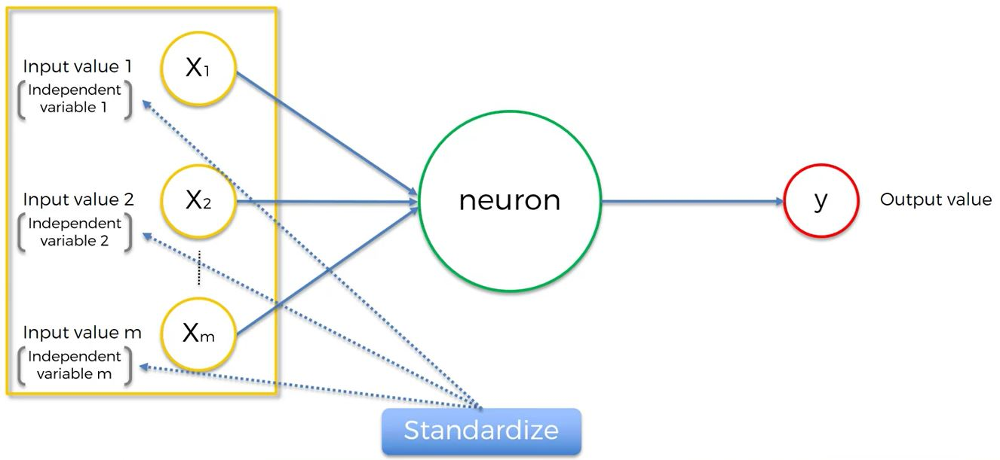

```{r echo=FALSE, warning=FALSE, message=FALSE}
if(!require(easypackages)){
    install.packages("easypackages")
    library(easypackages)
}
packages("caret", "nnet", prompt = FALSE)
```

## Introduction

This document shows how to train and use deep learning models or deep neural networks in the R programming language and environment.  it will give you enough background to help you understand their basics and use 
and interpret the results.

Machine learning is used to develop algorithms that learn from raw data in order to make predictions. Deep learning is a branch of machine learning where a multilayered (deep) architecture is used to map the relations between inputs or observed features and the outcome. This deep architecture makes deep learning particularly suitable for handling a large number of variables and generate features as part of the overall learning algorithm, rather than feature creation being a separate step.

## Deep Learning - The Basics

```{r out.width = "500px", echo=FALSE}
knitr::include_graphics("./images/deeplearning1.JPG")
```

### Introduction

Deep Learning is the most exciting and powerful branch of Machine Learning. Deep Learning models can be used for a variety of complex tasks:

- Artificial Neural Networks for Regression and Classification
- Convolutional Neural Networks for Computer Vision
- Recurrent Neural Networks for Time Series Analysis
- Self Organizing Maps for Feature Extraction
- Deep Boltzmann Machines for Recommendation Systems
- Auto Encoders for Recommendation Systems

#### Neuron

```{r out.width = "500px", echo=FALSE}

knitr::include_graphics("./images/deeplearning3.JPG")


```

The <span style="color:green">green node</span> above represents a neuron in a hidden layer.

#### Activation Function
Let's review the primary activation functions (there are many more).

```{r out.width = "500px", echo=FALSE}
knitr::include_graphics("./images/deeplearning6.JPG")
knitr::include_graphics("./images/deeplearning7.JPG")
```

The one below is most often used:

```{r out.width = "500px", echo=FALSE}
knitr::include_graphics("./images/deeplearning8.JPG")
knitr::include_graphics("./images/deeplearning9.JPG")
```

#### How do Neural Networks learn?

A neural network with a single layer feed forward is called a perceptron.

```{r out.width = "500px", echo=FALSE}
knitr::include_graphics("./images/deeplearning10.JPG")
```

A perceptron will calculate a value.  The difference between the predicted value and the actual value we want is called the cost function.  There are many ways to calculate the cost function but the most common is 1/2 the squared difference.  This is basically the error of the predicted value.

```{r out.width = "500px", echo=FALSE}
knitr::include_graphics("./images/deeplearning11.JPG")
```

When the perceptron evaluates the cost function, the neural net will recalculate new weights to minimize the cost function.  Back propagation adjusts all of the weights at the same time.  

Here is an example:

```{r out.width = "500px", echo=FALSE}
knitr::include_graphics("./images/deeplearning12.JPG")
```

Note above that the Exam column is the actual value.

After calculating the cost function, the net adjusts the weights of this specific record to reduce the cost function.  Only one record is being evaluated.  This continues until cost function is minimized.  (Ideally yhat = y.) 

```{r out.width = "500px", echo=FALSE}

```

Lets now evaluate what happens when we have many records.

For each row, the neural net processes each row sequentially and calculates yhat, compares it to y and calculates the cost function across all the records.  The weights will be updated.  The weights are the same for all of the accounts.  Continues to iterate to minimize the cost function.

This process is called back propagation.

```{r out.width = "500px", echo=FALSE}
knitr::include_graphics("./images/deeplearning14.JPG")
```

#### Gradient Descent

Gradient Descent is a method the determine the optimal value of the weights in the neural net.  If you had only one variable, it would be easy.  A brute force attack could try 1000 weights to determine the minimal cost function:

```{r out.width = "500px", echo=FALSE}
knitr::include_graphics("./images/deeplearning15.JPG")
```

The brute force attach becomes unwieldy when have have more variables.  (Curse of dimensionality)

Gradient Descent simply calculates the slope of the line; when the line has a negative slope, it moves to the right. If the line has  a positive slope, move to the left.

```{r out.width = "500px", echo=FALSE}
knitr::include_graphics("./images/deeplearning16.JPG")
```

#### Stochastic Gradient Descent

Gradient Descent requires the cost function to be convex - it has one global minimum.  A cost function might look like this (a different cost function or one in multi-dimensional space.)

```{r out.width = "500px", echo=FALSE}

```

Recall above that every record was evaluated in the neural net, the cost function is calculated and the weights adjusted for the batch.

In stochastic gradient descent, the weights are calculated for each record individually.

```{r out.width = "500px", echo=FALSE}
knitr::include_graphics("./images/deeplearning18.JPG")

```

Major Differences:

- Stochastic avoids local minimums - more likely to find the global minimum
- Stochastic is faster - does not need to load all the data in memory
- Batch Gradient Descent is deterministic algorithm.  Every time you run it, you will get the same results.  Stochastic is a stochastic - random - algo.  May not get the same result each time because you are picking rows at random.

> There is another method that falls in between called the Mini Batch Gradient Descent where you define the number of records to run in batch and the the algo runs stochastically.

### Training the Artificial Neural Network (ANN) with Stochastic Gradient Descent

```{r out.width = "500px", echo=FALSE}

```

### Terms You Might Hear

- Deep Belief Networks (DBNs):  A DBN is a type of deep neural network where multiple hidden layers and connections between (but not within) layers (a neuron in layer 1 may be connected to a neuron in layer
2 but not connected to another neuron in layer 1).
- Restricted Boltzmann Machine (RBM):  Is a type of DBN except a RBM typically has one input layer and one hidden layer. If several RBMs are stacked together, they form a DBN. The DBN can be trained as a series of RBMs. The first RBM layer is trained and used to transform raw data into hidden neurons which are then treated as a new set of inputs in a second RBM, and the process is repeated.
- Recurrent Neural Network (RNN) where neurons send feedback signals to each other.
- Convolutional Neural Network (CNN).  CNNs work by having each neuron respond to overlapping subregions of an image. CNNs are most commonly used in image recognition. 

DBNs are sometimes used as a pre-training stage for a deep neural network. This allows the fast, greedy layer-by-layer training to be used to provide good initial estimates which are refined in the deep neural network using other slower training algorithms like back propagation.

## R Packages

- `nnet` fits feed-forward neural networks with one hidden layer
- `neuralnet` also fits shallow neural networks with one hidden layer but can train them using back-propagation and allows custom error and neuron activation functions. 
- `RSNNS` allows many types of models to fit in R. Common models are available using convenient wrappers, but the RSNNS package also makes many model components from SNNS available making it possible to train a wide variety of models.
- `deepnet` provides a number of tools for deep learning in R. It can train RBMs and use these as part of DBNs to generate initial values to train deep neural networks. It allows for different activation functions and the use of dropout for regularization.
- `darch`  stands for deep architectures. It can train RBMs and DBNs along with a variety of options related to each. `darch` is a pure R implementation model and training tends to be slow.
- `H2O` provides an interface to the H2O software. H2O is written in Java and is fast and scalable. It provides not only deep learning and a variety of other popular machine learning algorithms.

## `nnet`

Because `nnet` is one of the models supported in `caret`, the example below leverages to consistent modeling interface in `caret` to explore a shallow single layer neural network.

### Get Data

We will use the well-known [Kaggle Digit Recognizer data set](https://www.kaggle.com/c/digit-recognizer/data).

The data files train.csv and test.csv contain gray-scale images of hand-drawn digits, from zero through nine.

Each image is 28 pixels in height and 28 pixels in width, for a total of 784 pixels in total. Each pixel has a single pixel-value associated with it indicating the lightness or darkness of that pixel with higher numbers meaning darker. This pixel-value is an integer between 0 and 255, inclusive.

The training data set, (train.csv), has 785 columns. The first column, called "label" is the digit that was drawn by the user. The rest of the columns contain the pixel-values of the associated image.

Each pixel column in the training set has a name like pixelx, where x is an integer between 0 and 783, inclusive. To locate this pixel on the image, suppose that we have decomposed x as x = i * 28 + j, where i and j are integers between 0 and 27, inclusive. Then pixelx is located on row i and column j of a 28 x 28 matrix, (indexing by zero).

```{r}
digits.train <- read.csv("./data/train.csv")
dim(digits.train)
head(colnames(digits.train))
tail(colnames(digits.train))
head(digits.train[, 1:6])
```

Convert the labels (the digits 0 to 9) to a factor so R knows that this is a classification not a regression problem. If this were a real-world problem, we would want to use all 42,000 observations but for this exercise select the first 10,000 for these first examples of building and training a neural network. Separate the data into the features or predictors (digits.X) and the outcome (digits.Y). 

```{r}
## convert to factor 
digits.train$label <- factor(digits.train$label, levels = 0:9) 
i <- 1:10000 
digits.X <- digits.train[i, -1] #Do not want to trian with the label - duh!
digits.y <- digits.train[i, 1] 
```

It is always wise to check for the distribution of the label.  (If one digit occurs rarely, might need to adjust the modeling approach to ensure it is given enough weight in performance evaluation if we care about accurately predicting that digit.)

```{r}
barplot(table(digits.y))
```
Looks good!  OK to proceed.

### Model Building

Time to build and train using `nnet` through `caret`. 

- `train()` takes the feature or predictor data, x, and the outcome variable, y.  
- `train()` provides a simple way to tune the model using `tuneGrid`. It returns the performance measures for each set of tuning parameters and returns the best trained model. 
     - `decay rate`, sometimes called the learning rate. This controls controls how much each iteration or step can influence the current weights. It is the regularization parameter to avoid over-fitting.
     - `size` is the number of units in hidden layer (recall nnet fits a single hidden layer neural network)
     - `trControl` controls additional aspects of train() and is used, when a variety of tuning parameters are being evaluated, to tell `caret` how to validate and pick the best tuning parameter. (Set the method for training control to "none" because there is only have one set of tuning parameters.) 
     - `named arguments` are passed on to the `nnet()`. Because of the number of predictors (784), we increase the maximum number of weights to 10,000 and specify a maximum of 100 iterations. 

```{r}
set.seed(9876) 
digits.m1 <- train(x = digits.X, y = digits.y, method = "nnet", 
                   tuneGrid = expand.grid(.size = c(5), .decay = 0.1), 
                   trControl = trainControl(method = "none"), MaxNWts = 10000, maxit = 100)
```

`predict()` generates a set of predictions for data. When called on the results of a model without specifying any new data, it just generates predictions on the same data used for training. After calculating and storing the predicted digits, examine their distribution. It is clear this model is not optimal.

```{r}
digits.yhat1 <- predict(digits.m1) 
barplot(table(digits.yhat1))
```

A formal evaluation of model performance is performed using `confusionMatrix()` in `caret`.  The input is simply a frequency cross tab between the actual digits and the predicted digits. 

> Because there is a function by the same name in the RSNNS package, use the caret:: code to tell R which version of the function to use.

```{r}
caret::confusionMatrix(xtabs(~digits.yhat1 + digits.y))
```

Recall:

- sensitivity  =  TP/(TP + FN) - interpretation:  for digit 1 92.97% of 1 digits were correctly predicted to be 1
- specificity = TN/(TN + FP) - interpretation:  The specificity for digit 1 can be interpreted as meaning that 99.20% of cases that were predicted to be a digit other than 1 were not 1. 
-  balanced accuracy is the mean of the sensitivity and specificity

Accuracy : 0.3947 - now that is a problem!  We must do better.

Remeber every predictor or feature connects to each hidden neuron and each hidden neuron connects to each outcome or output. With 784 features, each additional hidden neuron adds a substantial number of parameters which  results in longer run times. These next models take time to finish.

Increase size from 5 --> 10
```{r eval=FALSE}
set.seed(9876) 
digits.m2 <- train(digits.X, digits.y, method = "nnet", 
                   tuneGrid = expand.grid(.size = c(10), .decay = 0.1), 
                   trControl = trainControl(method = "none"), MaxNWts = 50000, maxit = 100)
digits.yhat2 <- predict(digits.m2) 
barplot(table(digits.yhat2))
caret::confusionMatrix(xtabs(~digits.yhat2 + digits.y))
```

The plot sure looks better.  Accuracy : 0.6341 is improved but still not good enough.  (Class 8 sensitivity is poor.)

```{r eval=FALSE}
set.seed(9876) 
digits.m3 <- train(digits.X, digits.y, method = "nnet", 
                   tuneGrid = expand.grid(.size = c(40), .decay = 0.1), 
                   trControl = trainControl(method = "none"), MaxNWts = 50000, maxit = 100)
digits.yhat3 <- predict(digits.m3) 
barplot(table(digits.yhat3))
caret::confusionMatrix(xtabs(~digits.yhat3 + digits.y))
```

Much improved - Accuracy : 0.8688!

Could continue to refine with something like the one below.  There ar emany parameters that could be tried.

```{r eval=FALSE}
set.seed(9876) 
nnetGrid <-  expand.grid(size = seq(from = 1, to = 10, by = 1),
                        decay = seq(from = 0.1, to = 0.5, by = 0.1))

digits.m3 <- train(digits.X, digits.y, method = "nnet", 
              tuneGrid = nnetGrid,  trControl = trainControl(method = "none"), MaxNWts = 50000, maxit = 100)
digits.yhat3 <- predict(digits.m3) 
barplot(table(digits.yhat3))
caret::confusionMatrix(xtabs(~digits.yhat3 + digits.y))
```

```{r unloadAllPackages, echo=FALSE}
#Remove all packages loaded in environment
lapply(paste('package:', names(sessionInfo()$otherPkgs), sep=""), detach, character.only=TRUE, unload=TRUE)
#Apply packages
if(!require(easypackages)){
    install.packages("easypackages")
    library(easypackages)
}
packages("RSNNS", "caret", prompt = FALSE)
#Recreate the data
digits.train <- read.csv("./data/train.csv")
digits.train$label <- factor(digits.train$label, levels = 0:9) 
i <- 1:10000 
digits.X <- digits.train[i, -1] #Do not want to trian with the label - duh!
digits.y <- digits.train[i, 1]
```

### `RSNNS`

`RSNNS` provides an interface to a variety of models using the Stuttgart Neural Network Simulator (SNNS) code. For a basic, singlehidden-layer, feed-forward neural network use `mlp()` which stands for **m**ulti-**l**ayer **p**erceptron. `RSNNS` is more finicky to use than the convenience of `nnet` via `caret` but one benefit is it can be far more flexible and allows for many other types of neural network architectures to be trained, including recurrent neural networks.  It also has a greater variety of learning functions. One difference between `nnet` and `RSNNS` is for multi-class outcomes (such as digits), 

`RSNNS` requires a dummy coded matrix, so each possible class is represented as a column coded as 0/1. Provide this using `decodeClassLabels()`.

```{r}
head(decodeClassLabels(digits.y))
```

Had good success with 40 hidden neurons, so do the same size here. 

> Because a matrix of outcomes is passed, although the predicted probability will not exceed 1 for any single digit, the sum of predicted probabilities across all digits may exceed 1 and also may be less than 1 (that is, for some cases, the model may not predict they are very likely to represent any of the digits). 

We can get in-sample predictions but  we have to use another function, `fitted.values()`. Because this also returns a matrix where each column represents a single digit, use `encodeClassLabels()` to convert back into a single vector of digit labels to plotand evaluate model performance.

```{r}
set.seed(9876) 
digits.m4 <- mlp(as.matrix(digits.X), decodeClassLabels(digits.y), size = 40, learnFunc = "Rprop", 
                 shufflePatterns = FALSE, maxit = 60)
digits.yhat4 <- fitted.values(digits.m4) 
digits.yhat4 <- encodeClassLabels(digits.yhat4) 
barplot(table(digits.yhat4))
caret::confusionMatrix(xtabs(~ I(digits.yhat4 - 1) + digits.y))
#Save this data for later use to avoid wating for the model to complete
#CM_Data <- caret::confusionMatrix(xtabs(~ I(digits.yhat4 - 1) + digits.y))
save(CM_Data, digits.yhat4, digits.m4, file="../Essentials/data/CM_Data.RData")
```

Evaluating model performance is the same as when using `nnet` and `caret`. However, when the output is encoded back into a single vector, the digits are labeled 1 to k, where k is the number of classes. Because the digits are 0 to 9, to make them match the original digit vector, we subtract 1. 

Using the learning algorithms from `RSNNS`, we should have a higher performance with the same number of hidden neurons. (Need to review why this did not occur.  Might be a seed issue.)

### From Probabilities to Discrete Classification

For any given observation, there can be a probability of membership in any of a number of classes (for example, an observation may have a 40% chance of being a "5", a 20% chance of being a "6", and so on). For evaluating the performance of the model, some choices have to be made about how to go from the probability of class membership to a discrete classification. 

#### Examine Some Options

- Provided there are no ties, the simplest method is classify observations based on the high predicted probability. The RSNNS package calls this winner takes all (WTA). WTA selects the class with the highest probability provided there are no ties, the highest probability is above a user-defined threshold, and the remaining classes all have a predicted probability under the maximum minus another user-defined threshold. Otherwise, observations are classified as unknown. If both thresholds are zero (the default), this equates to saying that there must be one unique maximum. 
     - The advantage of such an approach is that it provides quality control. In the digit classification example, there are 10 possible classes. Suppose nine of the digits had a predicted probability of 0.099, and the remaining class had a predicted probability of 0.109. Although one class is technically more likely than the others, the difference is fairly trivial and we may conclude that the model cannot with any certainty classify that observation. 
- 402040 classifies if only one value is above a user-defined threshold, and all other values are below another user-defined threshold; if multiple values are above the first threshold, or any value is not below the second threshold, it treats the observation as unknown. The goal is to provide some quality control. 
- Sometimes not all classes are equally important. For example, in a medical context where a variety of biomarkers and genes are collected on patients and used to classify whether they are healthy or not, at risk of cancer, or at risk of heart disease, even a 40% chance of having cancer may be enough to warrant further investigation, even if they have a 60% chance of being healthy. 
      - Assess aspects such as sensitivity, specificity, and positive and negative predictive values. There are cases where overall accuracy is less important than making sure  no one is missed. 

#### Probability to Discrete - Code Examples

```{r getPreviousData, echo=FALSE}
load("../Essentials/data/CM_Data.RData")
```
```{r}
#fitted is a generic function which extracts fitted values from objects returned by modeling functions. fitted.values is an alias for it.
digits.yhat4.insample <- fitted.values(digits.m4) 
head(round(digits.yhat4.insample, 2))
table(encodeClassLabels(digits.yhat4.insample, method = "WTA", l = 0, h = 0))
```
```{r}
#l = 0, h = .5
table(encodeClassLabels(digits.yhat4.insample, method = "WTA", l = 0.0, h = 0.5))
#l = .2, h = .5
table(encodeClassLabels(digits.yhat4.insample, method = "WTA", l = 0.0, h = 0.5))
#l = 0.4, h = .6
table(encodeClassLabels(digits.yhat4.insample, method = "WTA", l = 0.4, h = 0.6))
#402040: l = .4, h = .6
table(encodeClassLabels(digits.yhat4.insample, method = "402040", l = .4, h = .6))
```

Now generate predicted values for new data using the predict() function. Use the next 5,000 observations. 

```{r}
i2 <- 10001:15000 
digits.yhat4.pred <- predict(digits.m4, as.matrix(digits.train[i2, -1]))
table(encodeClassLabels(digits.yhat4.pred, method = "WTA", l = 0, h = 0))
```

Having generated predictions on out-of-sample data (data that was not used to train the model), proceed to examine problems related to overfitting the data and the impact on the evaluation of model performance. 

## Over Fitting Data

Overfitting occurs when a model fits noise in the training data. It appears to become more accurate as it accounts for the noise, but because the noise changes from one dataset to the next, accuracy does not apply to any data but the training data—it does not generalize.

Overfitting can occur at any time but tends to become more severe as the ratio of parameters to information increases. Usually, this is can be thought of as the ratio of parameters to observations, but not always (for example, suppose the outcome is a rare event that occurs in 1 in 5 million people, a sample size of 15 million may still only have 3 people experiencing the event and would not support a complex model at all—information is low even though the sample size is large). To consider a simple but extreme case, imagine fitting a straight line to two data points. The fit will be perfect, and in those two training data your linear regression model will appear to have fully accounted for all variations in the data. However, if we then applied that line to another 1,000 cases, we might not expect it to fit very well at all. 

Recall the accuracy of past models:

Model 1:  Accuracy : 0.3947 
Model 2:  Accuracy : 0.6341 
Model 3:  Accuracy : 0.8688
Model 4:  Accuracy : 0.7993 (RSNNS - poential seed issue - should be a bit higher that #3)

Examine how the model generalizes by checking the accuracy on the out-of-sample predictions.  See it is still doing well, but the accuracy is reduced to 75.95% on the holdout data. Here there appears to have been approximately a 4% loss; or, put differently, using training data to evaluate model performance resulted in an overly optimistic estimate of the accuracy, and that overestimate was 4%:

Model 4 on holdout data:  Accuracy : 0.7594 

```{r}
caret::confusionMatrix(xtabs(~digits.train[i2, 1] + I(encodeClassLabels(digits.yhat4.pred) - 1)))
```

```{r out.width = "500px", echo=FALSE}

```
See the code for this plot in the appendix

### Example Walkthrough

#### The Data

```{r prepNewChapter}
#Remove all packages loaded in environment
lapply(paste('package:', names(sessionInfo()$otherPkgs), sep=""), detach, character.only=TRUE, unload=TRUE)
#Apply packages
if(!require(easypackages)){
    install.packages("easypackages")
    library(easypackages)
}
packages("parallel", "foreach", "doSNOW", prompt = FALSE)
```

Experiments have been carried out with a group of 30 volunteers within an age bracket of 19-48 years. Each person performed six activities (WALKING, WALKING_UPSTAIRS, WALKING_DOWNSTAIRS, SITTING, STANDING, LAYING) wearing a smartphone (Samsung Galaxy S II) on the waist. Using its embedded accelerometer and gyroscope, we captured 3-axial linear acceleration and 3-axial angular velocity at a constant rate of 50Hz. The  dataset has been randomly partitioned into two sets, where 70% of the volunteers was selected for generating the training data and 30% the test data. 

For each record in the dataset it is provided: 

- Triaxial acceleration from the accelerometer (total acceleration) and the estimated body acceleration. 
- Triaxial Angular velocity from the gyroscope. 
- A 561-feature vector with time and frequency domain variables. 
- Its activity label. 
- An identifier of the subject who carried out the experiment. 

```{r getDataWalkthru}
use.train.x <- read.table("../Essentials/data/X_train.txt")
use.train.y <- read.table("../Essentials/data/y_train.txt")[[1]]
use.test.x <- read.table("../Essentials/data/X_test.txt")
use.test.y <- read.table("../Essentials/data/y_test.txt")[[1]]
use.labels <- read.table("../Essentials/data/activity_labels.txt")
barplot(table(use.train.y))

```

Evaluate a variety of tuning parameters to experiment with different approaches to get the best model. Evaluate the models using different tuning parameters simultaneously
using parallel processing.

Pick tuning parameters and set up a local cluster as the backend for `foreach` for parallel for loops. If you do this on a machine with fewer than five cores, change makeCluster(5) to a lower number.

```{r tuningParams}
tuning <- list(size = c(40, 20, 20, 50, 50), maxit = c(60, 100, 100, 100, 100),
               shuffle = c(FALSE, FALSE, TRUE, FALSE, FALSE),
               params = list(FALSE, FALSE, FALSE, FALSE, c(0.1, 20, 3)))
## setup cluster using 2 cores
## register as a backend for use with the foreach package
cl <- makeCluster(2)
clusterEvalQ(cl, {library(RSNNS)})
clusterExport(cl, c("tuning", "use.train.x", "use.train.y", "use.test.x", "use.test.y"))
registerDoSNOW(cl)
```

Train all the models. Use `parallel` for loop, setting some of the arguments based on the tuning parameters we previously stored in the list.

```{r}
use.models <- foreach(i = 1:5, .combine = 'c') %dopar% {
     if (tuning$params[[i]][1]) {
          set.seed(9876)
          list(Model = mlp(as.matrix(use.train.x), decodeClassLabels(use.train.y),
                           size = tuning$size[[i]], learnFunc = "Rprop",
                           shufflePatterns = tuning$shuffle[[i]],
                           learnFuncParams = tuning$params[[i]],
                           maxit = tuning$maxit[[i]]))
          } else {
               set.seed(9876)
               list(Model = mlp(as.matrix(use.train.x), decodeClassLabels(use.train.y),
                                size = tuning$size[[i]], learnFunc = "Rprop",
                                shufflePatterns = tuning$shuffle[[i]],
                                maxit = tuning$maxit[[i]]))
               }
          }
```

Generating out-of-sample predictions will take time, we will do that in parallel too. First we need to export the model results to each of the workers on our cluster and then calculate the predictions.

```{r}
clusterExport(cl, "use.models")
use.yhat <- foreach(i = 1:5, .combine = 'c') %dopar% {
     list(list(Insample = encodeClassLabels(fitted.values(use.models[[i]])),
               Outsample = encodeClassLabels(predict(use.models[[i]],
               newdata = as.matrix(use.test.x)))
))
}
```

Merge the actual and fitted or predicted values together into a dataset, calculate performance measures on each and store the results.

Additional data management is required because sometimes a model may not predict
each possible response level, but this can make for non-symmetrical frequency cross
tabs, unless we convert the variable to a factor and specify the levels. Also drop
0 values which indicate the model was uncertain how to classify an observation:

```{r walkthuResults}
use.insample <- cbind(Y = use.train.y, do.call(cbind.data.frame, lapply(use.yhat, `[[`, "Insample")))
colnames(use.insample) <- c("Y", paste0("Yhat", 1:5))
performance.insample <- do.call(rbind, lapply(1:5, function(i) {
     f <- substitute(~ Y + x, list(x = as.name(paste0("Yhat", i))))
     use.dat <- use.insample[use.insample[,paste0("Yhat", i)] != 0, ]
     use.dat$Y <- factor(use.dat$Y, levels = 1:6)
     use.dat[, paste0("Yhat", i)] <- factor(use.dat[, paste0("Yhat", i)], levels = 1:6)
     
     res <- caret::confusionMatrix(xtabs(f, data = use.dat))
     cbind(Size = tuning$size[[i]], Maxit = tuning$maxit[[i]], 
           Shuffle = tuning$shuffle[[i]], 
           as.data.frame(t(res$overall[c("AccuracyNull", "Accuracy", "AccuracyLower",
                                         "AccuracyUpper")])))
     }
))
```

```{r}
use.outsample <- cbind(Y = use.test.y, do.call(cbind.data.frame, 
               lapply(use.yhat, `[[`, "Outsample")))
colnames(use.outsample) <- c("Y", paste0("Yhat", 1:5))
performance.outsample <- do.call(rbind, lapply(1:5, function(i) {
     f <- substitute(~ Y + x, list(x = as.name(paste0("Yhat", i))))
     use.dat <- use.outsample[use.outsample[,paste0("Yhat", i)] != 0, ]
     use.dat$Y <- factor(use.dat$Y, levels = 1:6)
     use.dat[, paste0("Yhat", i)] <- factor(use.dat[, paste0("Yhat", i)], levels = 1:6)
  res <- caret::confusionMatrix(xtabs(f, data = use.dat))

  cbind(Size = tuning$size[[i]], Maxit = tuning$maxit[[i]],
        Shuffle = tuning$shuffle[[i]],
        as.data.frame(t(res$overall[c("AccuracyNull", "Accuracy", "AccuracyLower",
                                      "AccuracyUpper")])))
}))
```


Print the in-sample and out-of-sample performance to see how each of the models performed and the effect of varying some of the tuning parameters. 

The fourth column (null accuracy) is dropped as it is not as important for this comparison. 

```{r}
#In Sample
performance.insample[,-4]
# Out Sample
performance.outsample[,-4]
```

####Walkthrough Conclusion

Not only are the in-sample performance measures biased estimates of the models' actual out-of-sample performance, they do not even provide the best way to rank order model performance to choose the best performing model. 

Despite the slightly worse out-of-sample performance, the models still do well—far better than chance alone—and, for our example use case, we could pick the best model (number 1) and be quite confident that using this will provide a good classification of a user's activities.

on page 60


```{r unloadAllPackages}
lapply(paste('package:',names(sessionInfo()$otherPkgs),sep=""), detach,character.only=TRUE,unload=TRUE)
```

## Appendix

### Brief caret Explanation

The Caret package lets you train different models and tuning hyper-parameters using Cross Validation (Hold-Out or K-fold) or Bootstrap. 

There are two different ways to tune the hyper-parameters using Caret: Grid Search and Random Search. If you use Grid Search (Brute Force) you need to define the grid for every parameter according to your prior knowledge or you can fix some parameters and iterate on the remain ones. If you use Random Search you need to specify a tuning length (maximum number of iterations) and Caret is going to use random values for hyper-parameters until the stop criteria holds. 

No matter what method you choose Caret is going to use each combination of hyper-parameters to train the model and compute performance metrics as follows:

1. Split the initial Training samples into two different sets: Training and Validation (For bootstrap or Cross validation) and into k sets (For k-fold Cross Validation).
2. Train the model using the training set and to predict on validation set (For Cross Validation Hold-Out and Bootstrap). Or using k-1 training sets and to predict using the k-th training set (For K-fold Cross Validation).
3. On the validation set Caret computes some performance metrics as ROC, Accuracy...
4. Once the Grid Search has finished or the Tune Length is completed Caret uses the performance metrics to select the best model according to the criteria previously defined (You can use ROC, Accuracy, Sensibility, RSquared, RMSE....)
5. You can create some plot to understand the resampling profile and to pick the best model (Keep in mind performance and complexity)

### H~2~O Install

H2O is a machine learning framework. H2O is  open source and what makes it important is that works right of the box. It supports for R, Python, Scala, Java and also has a REST API and a own WebUI. So you can use it perfectly for research but also in production environments.

H2O is based on Apache Hadoop and Apache Spark which gives it enormous power with in-memory parallel processing.

Super simple to get started:

H~2~O is constantly updated.  Might want to remove and reinstall it.

```{r optional}
# The following two commands remove any previously installed H2O packages for R.
if ("package:h2o" %in% search()) { detach("package:h2o", unload=TRUE) }
if ("h2o" %in% rownames(installed.packages())) { remove.packages("h2o") }
 
# Next, we download, install and initialize the H2O package for R.
install.packages("h2o", repos=(c("http://s3.amazonaws.com/h2o-release/h2o/rel-kahan/5/R", getOption("repos"))))
 
library(h2o)
localH2O = h2o.init(max_mem_size = "3G", nthreads = 2)

#Example functions
#h2oiris <- as.h2o(droplevels(iris[1:100, ]))
# h2o.levels(h2oiris, 5)
# h2omtcars <- h2o.importFile(path = "mtcars.csv")
# h2obin <- h2o.importFile(path = "http://www.ats.ucla.edu/stat/data/binary.csv")
```

> Default port: 54321 --> 127.0.0.1:54321


#### H~2~O Ensemble Learning Example

```{r}
data("Seatbelts")
summary(Seatbelts)
dim(Seatbelts)
trainHex <- as.h2o(Seatbelts)
x_names  <- colnames(trainHex[2:8])
myModel <- h2o.deeplearning(x = x_names, y = "DriversKilled", training_frame = trainHex)
myModel
```

```{r}
h2o.shutdown(prompt = FALSE)
```

### Plot Code Comparing In Sample and Out Sample Model Performance

```{r eval=FALSE}
digits.yhat1.pred <- predict(digits.m1, digits.train[i2, -1])
digits.yhat2.pred <- predict(digits.m2, digits.train[i2, -1])
digits.yhat3.pred <- predict(digits.m3, digits.train[i2, -1])


measures <- c("AccuracyNull", "Accuracy", "AccuracyLower", "AccuracyUpper")

n5.insample <- caret::confusionMatrix(xtabs(~digits.y + digits.yhat1))
n5.outsample <- caret::confusionMatrix(xtabs(~digits.train[i2, 1] + digits.yhat1.pred))

n10.insample <- caret::confusionMatrix(xtabs(~digits.y + digits.yhat2))
n10.outsample <- caret::confusionMatrix(xtabs(~digits.train[i2, 1] + digits.yhat2.pred))

n40.insample <- caret::confusionMatrix(xtabs(~digits.y + digits.yhat3))
n40.outsample <- caret::confusionMatrix(xtabs(~digits.train[i2, 1] + digits.yhat3.pred))

n40b.insample <- caret::confusionMatrix(xtabs(~digits.y + I(digits.yhat4 - 1)))
n40b.outsample <- caret::confusionMatrix(xtabs(~digits.train[i2, 1] +
  I(encodeClassLabels(digits.yhat4.pred) - 1)))

## results
shrinkage <- rbind(
  cbind(Size = 5, Sample = "In", as.data.frame(t(n5.insample$overall[measures]))),
  cbind(Size = 5, Sample = "Out", as.data.frame(t(n5.outsample$overall[measures]))),
  cbind(Size = 10, Sample = "In", as.data.frame(t(n10.insample$overall[measures]))),
  cbind(Size = 10, Sample = "Out", as.data.frame(t(n10.outsample$overall[measures]))),
  cbind(Size = 40, Sample = "In", as.data.frame(t(n40.insample$overall[measures]))),
  cbind(Size = 40, Sample = "Out", as.data.frame(t(n40.outsample$overall[measures]))),
  cbind(Size = 40, Sample = "In", as.data.frame(t(n40b.insample$overall[measures]))),
  cbind(Size = 40, Sample = "Out", as.data.frame(t(n40b.outsample$overall[measures])))
  )
shrinkage$Pkg <- rep(c("nnet", "RSNNS"), c(6, 2))

dodge <- position_dodge(width=0.4)

p.shrinkage <- ggplot(shrinkage, aes(interaction(Size, Pkg, sep = " : "), Accuracy,
                      ymin = AccuracyLower, ymax = AccuracyUpper,
                      shape = Sample, linetype = Sample)) +
  geom_point(size = 2.5, position = dodge) +
  geom_errorbar(width = .25, position = dodge) +
  xlab("") + ylab("Accuracy + 95% CI") +
  theme_classic() +
  theme(legend.key.size = unit(1, "cm"), legend.position = c(.8, .2))
```

