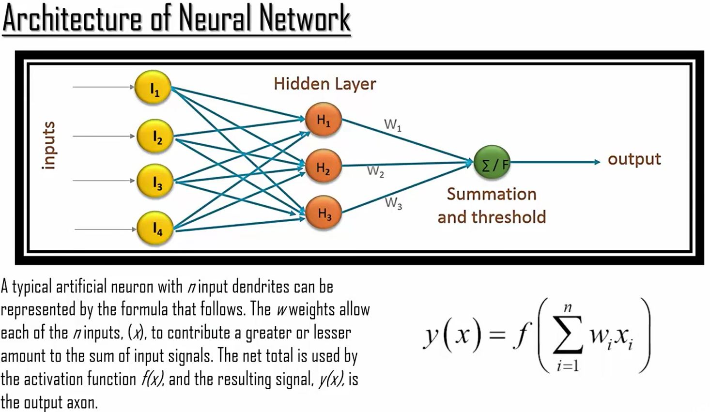
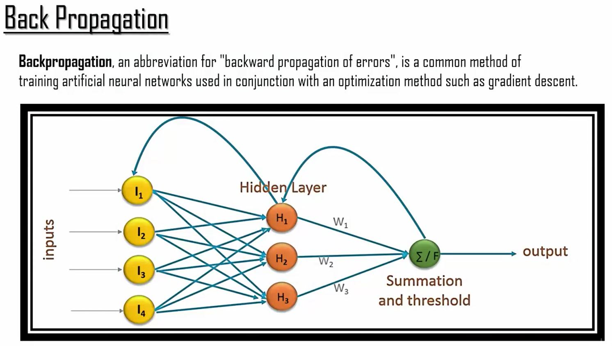

```{r echo=FALSE, warning=FALSE, message=FALSE}
if(!require(easypackages)){install.packages("easypackages")}
library(easypackages)
packages("nnet", "neuralnet", "dplyr", "caret", prompt = FALSE)
```

## Neural Net Introduction

```{r out.width = "500px", echo=FALSE}

```

## Neural Net R Code
```{r}
#----------------------------Neural network Program--------------------
dim(infert)
glimpse(infert)#Infertility after abortions

# Split data into Training and Testing
trainIndex <- createDataPartition(infert$case, p=.7,list=FALSE)
infert.train <-infert[trainIndex, ]
infert.test <- infert[-trainIndex, ]

infert_model<-neuralnet(case~age+parity+induced+spontaneous,
         data=infert.train, hidden=2, err.fct="ce", linear.output=FALSE)
# ce stands for cross entrophy error.To summarize, for a neural network classifier, during training you can use mean squared error or average cross-entropy error. Average cross-entropy error is considered slightly better.
#If you are using back-propagation, the choice of MSE(Mean Squared Error) or ACE(Average Cross Entrophy) affects the computation of the gradient. 
#After training, to estimate the effectiveness of the neural network it's better to use classification error.
# linear.output should be stated as FALSE to ensure that the output of the activation function is mapped to the interval[0,1]. You shall set it to FALSE for categorical outputs
plot(infert_model)

# Overall result i.e. output for each replication
summary(infert_model)
head(unlist(infert_model[[9]]))#infert_model$net.result
head(unlist(infert_model[[10]]))#infert_model$weights
infert_model$result.matrix

# Check the input of each variable
head(unlist(infert_model[[3]]))#infert_model$covariate
# Check the output of actual variable
infert$case

# predict the result
temp_test <- subset(infert.test, select = c("age", "parity","induced","spontaneous"))
infert.results <- neuralnet::compute(infert_model, temp_test)
#Must use neuralnet::compute otherwise conflict with dplyr compute

results <- data.frame(actual = infert.test$case, prediction = infert.results$net.result)
head(results, 20)
# Round to the nearest integer to improve readability
results$prediction <- round(results$prediction)
head(results, 20)
```

### Back Propogation

```{r out.width = "500px", echo=FALSE}

```

### Back Propogation Code

```{r}
infert_model2 <- neuralnet(case~age+parity+induced+spontaneous,
              data=infert,hidden=2,err.fct="ce", linear.output=FALSE)

# check that if probability is less than 50 % then assign 1 otherwise assign 0
nn1<-ifelse(infert_model2$net.result[[1]]>0.5,1,0)
head(nn1, 10)
# Let's check the classification error 
misclassificationError = mean(infert$case!=nn1)
misclassificationError

# Predict or compare the output Side by side
OutputPutVsPred = cbind(infert$case,nn1)
head(OutputPutVsPred,12)

neural_backprop<- neuralnet(formula = case~age+parity+induced+spontaneous,
                  data=infert, hidden=2, learningrate = 0.01, algorithm="backprop",
                  err.fct="ce", linear.output=FALSE)
summary(neural_backprop)

# compare to previous result
summary(infert_model)
plot(neural_backprop)
```

Note that the number of steps is drastically reduced using back propogation.

