CNN - https://www.r-bloggers.com/image-recognition-tutorial-in-r-using-deep-convolutional-neural-networks-mxnet-package/

https://www.r-bloggers.com/build-your-own-neural-network-classifier-in-r/

```{r out.width = "500px", echo=FALSE}
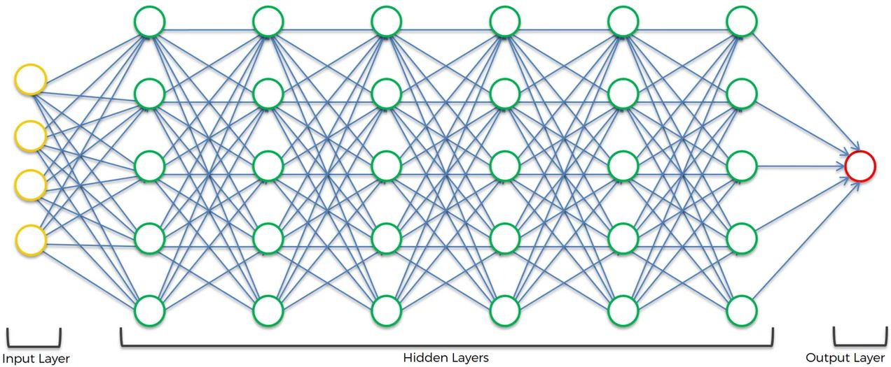
```

### Introduction

Deep Learning is the most exciting and powerful branch of Machine Learning. Deep Learning models can be used for a variety of complex tasks:

- Artificial Neural Networks for Regression and Classification
- Convolutional Neural Networks for Computer Vision
- Recurrent Neural Networks for Time Series Analysis
- Self Organizing Maps for Feature Extraction
- Deep Boltzmann Machines for Recommendation Systems
- Auto Encoders for Recommendation Systems

You will understand and learn how to implement the following Deep Learning models:

1. Artificial Neural Networks for a Business Problem
2. Convolutional Neural Networks for a Computer Vision task 

#### Neuron

```{r out.width = "500px", echo=FALSE}
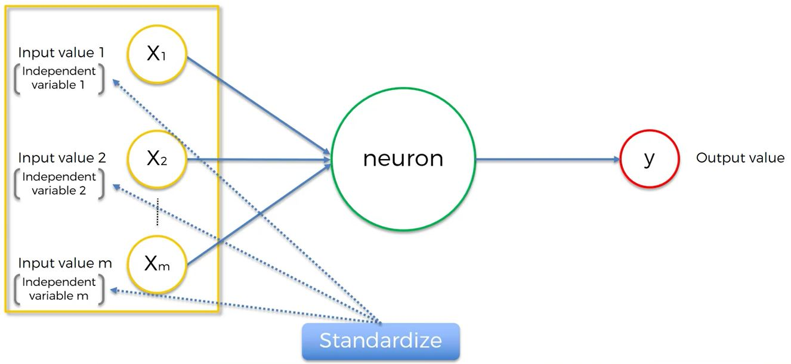
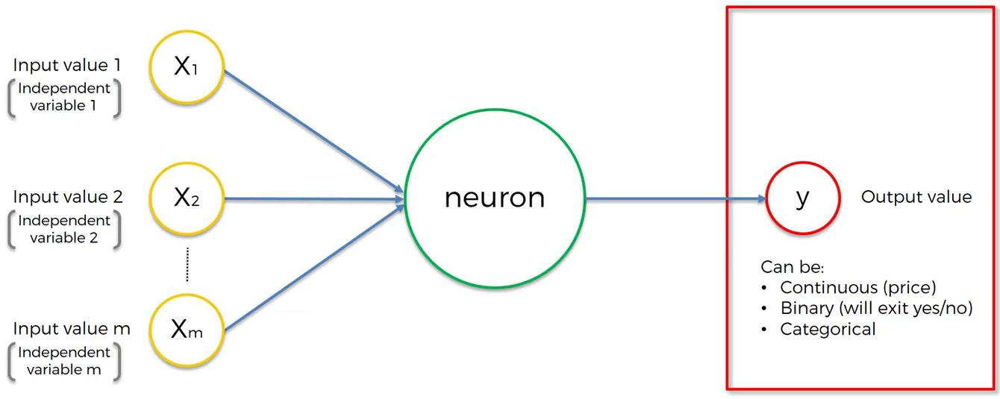
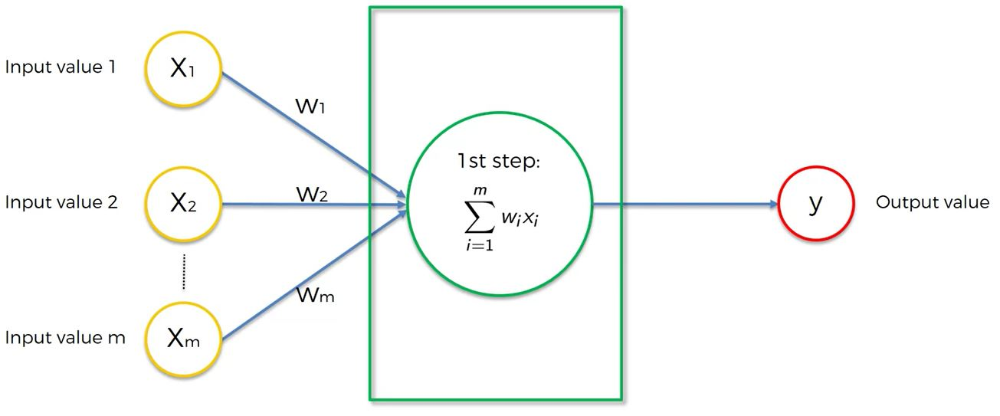
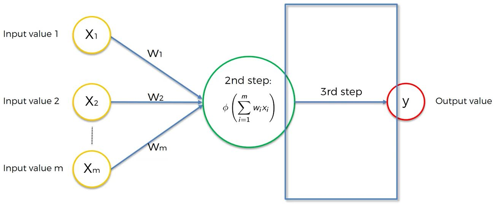
```

The <span style="color:green">green node</span> above represents a neuron in a hidden layer.

#### Activation Function
Let's review the primary activation functions (there are many more).

```{r out.width = "500px", echo=FALSE}
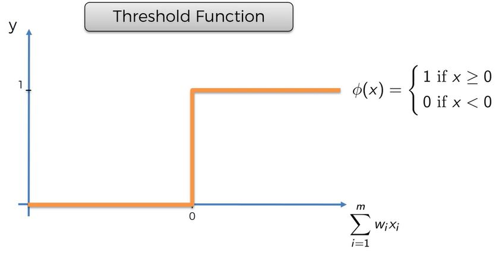
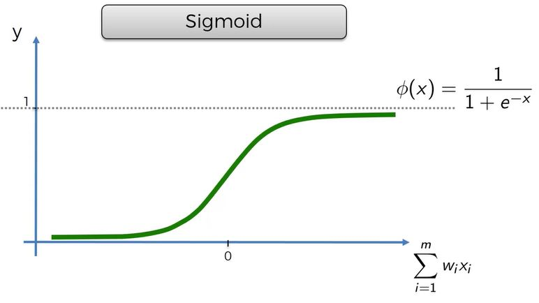
```

The one below is most often used:

```{r out.width = "500px", echo=FALSE}
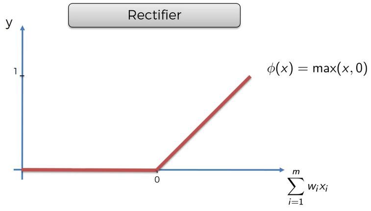
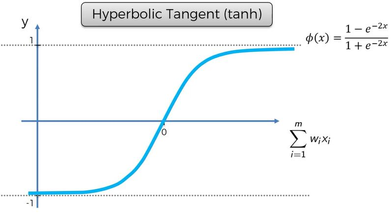
```

#### How do Neural Networks learn?

A neural network with a single layer feed forward is called a perceptron.

```{r out.width = "500px", echo=FALSE}
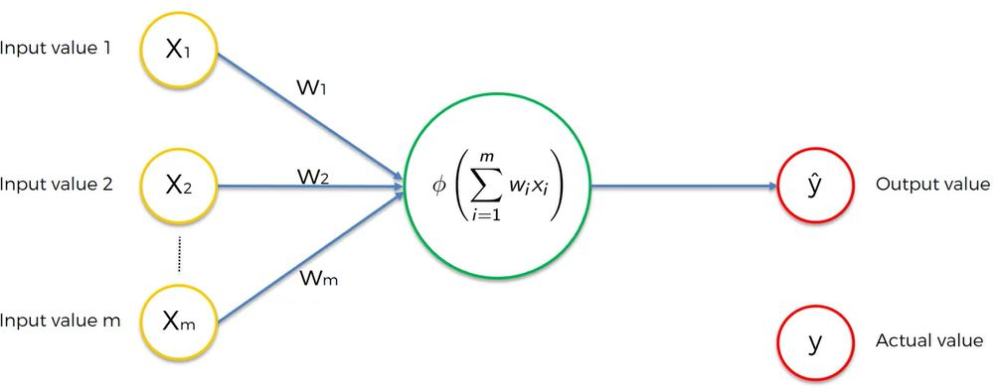
```

A perceptron will calculate a value.  The difference between the predicted value and the actual value we want is called the cost function.  There are many ways to calculate the cost function but the most common is 1/2 the squared difference.  This is basically the error of the predicted value.

```{r out.width = "500px", echo=FALSE}
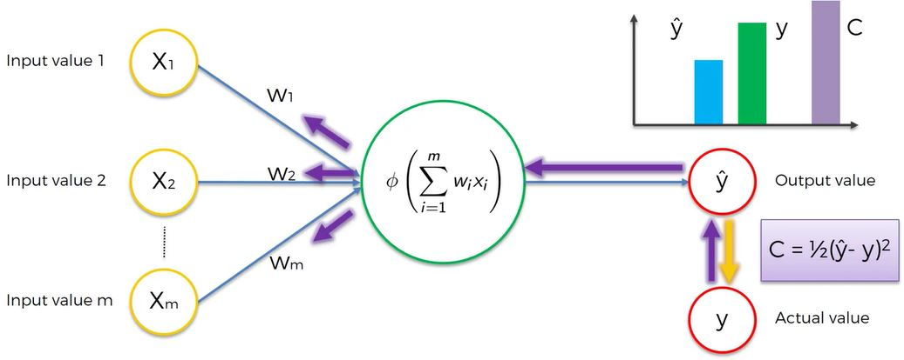
```

When the perceptron evaluates the cost function, the neural net will recalculate new weights to minimize the cost function.  Back propagation adjusts all of the weights at the same time.  

Here is an example:

```{r out.width = "500px", echo=FALSE}
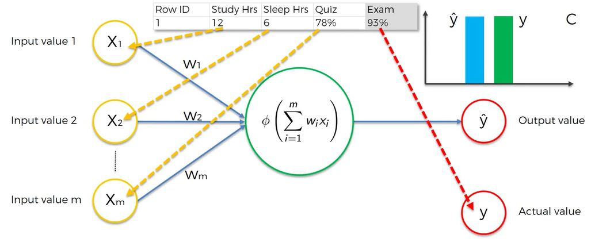
```

Note above that the Exam column is the actual value.

After calculating the cost function, the net adjusts the weights of this specific record to reduce the cost function.  Only one record is being evaluated.  This continues until cost function is minimized.  (Ideally yhat = y.) 

```{r out.width = "500px", echo=FALSE}
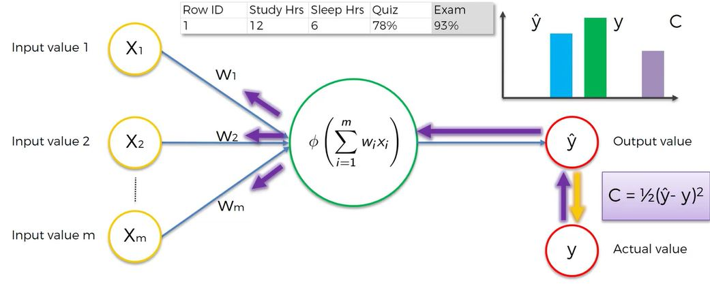
```

Lets now evaluate what happens when we have many records.

For each row, the neural net processes each row sequentially and calculates yhat, compares it to y and calculates the cost function across all the records.  The weights will be updated.  The weights are the same for all of the accounts.  Continues to iterate to minimize the cost function.

This process is called back propagation.

```{r out.width = "500px", echo=FALSE}
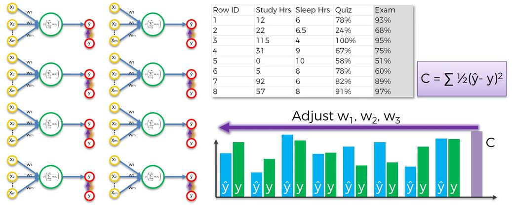
```

#### Gradient Descent

Gradient Descent is a method the determine the optimal value of the weights in the neural net.  If you had only one variable, it would be easy.  A brute force attack could try 1000 weights to determine the minimal cost function:

```{r out.width = "500px", echo=FALSE}
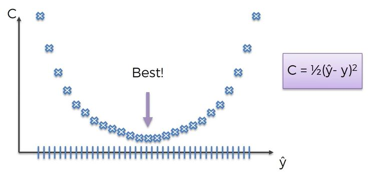
```

The brute force attach becomes unwieldy when have have more variables.  (Curse of dimensionality)

Gradient Descent simply calculates the slope of the line; when the line has a negative slope, it moves to the right. If the line has  a positive slope, move to the left.

```{r out.width = "500px", echo=FALSE}
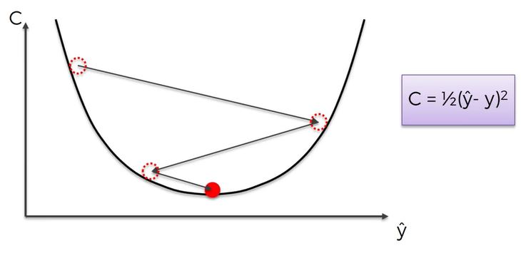
```

#### Stochastic Gradient Descent

Gradient Descent requires the cost function to be convex - it has one global minimum.  A cost function might look like this (a different cost function or one in multi-dimensional space.)

```{r out.width = "500px", echo=FALSE}
knitr::include_graphics("./images/deeplearning17.JPG")
```

Recall above that every record was evaluated in the neural net, the cost function is calculated and the weights adjusted for the batch.

In stochastic gradient descent, the weights are calculated for each record individually.

```{r out.width = "500px", echo=FALSE}
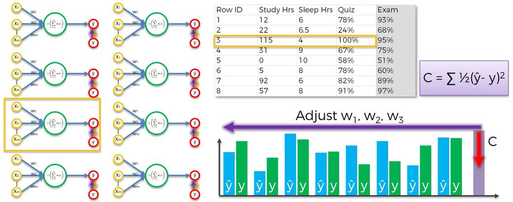
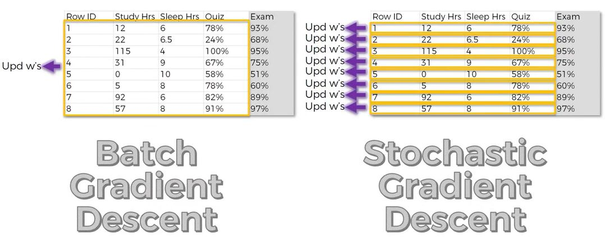
```

Major Differences:

- Stochastic avoids local minimums - more likely to find the global minimum
- Stochastic is faster - does not need to load all the data in memory
- Batch Gradient Descent is deterministic algorithm.  Every time you run it, you will get the same results.  Stochastic is a stochastic - random - algo.  May not get the same result each time because you are picking rows at random.

> There is another method that falls in between called the Mini Batch Gradient Descent where you define the number of records to run in batch and the the algo runs stochastically.

### Training the Artificial Neural Network (ANN) with Stochastic Gradient Descent

```{r out.width = "500px", echo=FALSE}
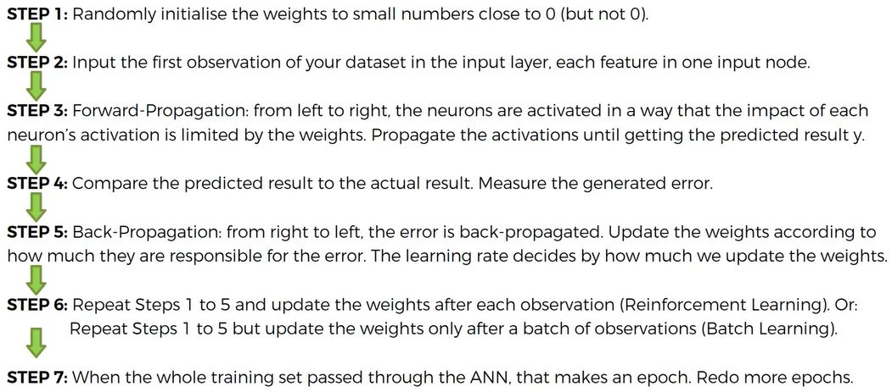
```

Lets build a classification model using ANN.

There are many R packages we might consider.  Here a a few of them:

- [neuralnet](https://cran.r-project.org/web/packages/neuralnet/neuralnet.pdf) - regression, not classifiers
- [nnet](https://cran.r-project.org/web/packages/nnet/nnet.pdf) - one hidden layer only
- [deepnet](https://cran.r-project.org/web/packages/deepnet/deepnet.pdf) - many hidden layers

Below we will use [h20](https://cran.r-project.org/web/packages/h2o/h2o.pdf).  It is fast, efficient, lots of options (number of layers and number of nodes on each layer), contains a parameter tuning feature.

If H~2~O needs to be updated, go here and restart RStudio:  http://h2o-release.s3.amazonaws.com/h2o/rel-ueno/8/index.html

```{r echo=FALSE, warning=FALSE, message=FALSE}
if(!require(easypackages)){install.packages("easypackages")}
library(easypackages)
packages("h2o", "caTools",  prompt = FALSE)
```

```{r startH2O}
# Importing the dataset
dataset = read.csv('./data/Churn_Modelling.csv')
dataset = dataset[4:14]#Do not need RowNumber, CustomerID or Surname. Note keep depdendent variable for trianing.

head(dataset)

# Encoding the categorical variables as numeric factors - required by algo
dataset$Geography = as.numeric(factor(dataset$Geography,
                  levels = c('France', 'Spain', 'Germany'), labels = c(1, 2, 3)))
dataset$Gender = as.numeric(factor(dataset$Gender,
               levels = c('Female', 'Male'), labels = c(1, 2)))

# Splitting the dataset into the Training set and Test set - caTools
set.seed(123)
split = sample.split(dataset$Exited, SplitRatio = 0.8)
training_set = subset(dataset, split == TRUE)
test_set = subset(dataset, split == FALSE)

# Feature Scaling - required.  Training ANN requires all numeric values
training_set[-11] = scale(training_set[-11])#scales everything except depdendent variable
test_set[-11] = scale(test_set[-11])

# Fitting ANN to the Training set
h2o.init(nthreads = -1)# -1 uses all the availle cores in an optimize manner
h2o.no_progress()
model = h2o.deeplearning(y = 'Exited', training_frame = as.h2o(training_set),
          activation = 'Rectifier', hidden = c(6,6), # hidden layers, number of nuerons in each layer. average nun input and ouput nodes (11/2)
          #this is a simple model - likely 1 hidden layer would be OK
          epochs = 100, #how many times to repeat steps to update weights
          train_samples_per_iteration = -2) #1 is reinforcement learning, more than 1 is batch learning; -2 auto-tunes

# Predicting the Test set results
h2o.init(nthreads = -1)# -1 uses all the availle cores in an optimize manner
h2o.no_progress()
y_pred = h2o.predict(model, newdata = as.h2o(test_set[-11]))#class = Environment - need to make this a vector we can evaluate
y_pred = (y_pred > 0.5)#the cm below works with boolean or 0/1 - y_pred = ifelse(prob_pred, 0.5, 1, 0)
y_pred = as.vector(y_pred)# still h2o object
y_pred = as.vector(y_pred)# this gives us 0/1

# Making the Confusion Matrix
cm = table(test_set[, 11], y_pred)
cm
(1535+195)/2000
```

```{r shutDownH2O, message=FALSE, error=FALSE, echo=FALSE}
h2o.shutdown(prompt = FALSE)
```

Not bad, 86% accurate

Another H~2~o example is here: 

http://ethen8181.github.io/machine-learning/h2o/h2o_deep_learning/h2o_deep_learning.html
(I might copy it below at a later date)