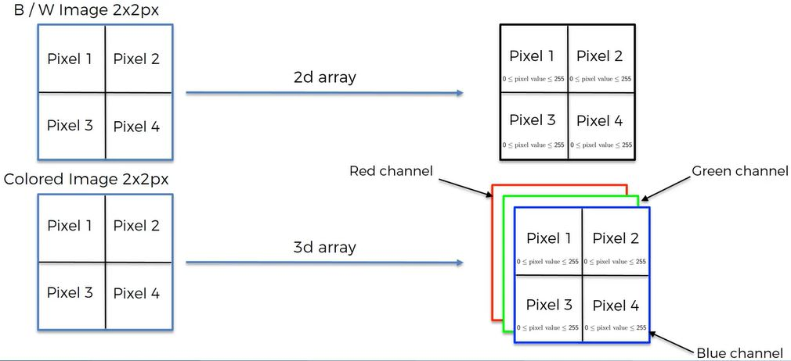
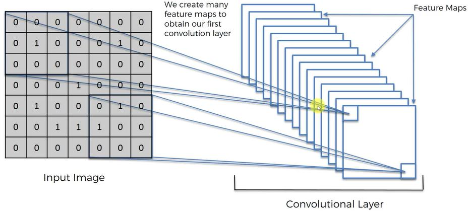
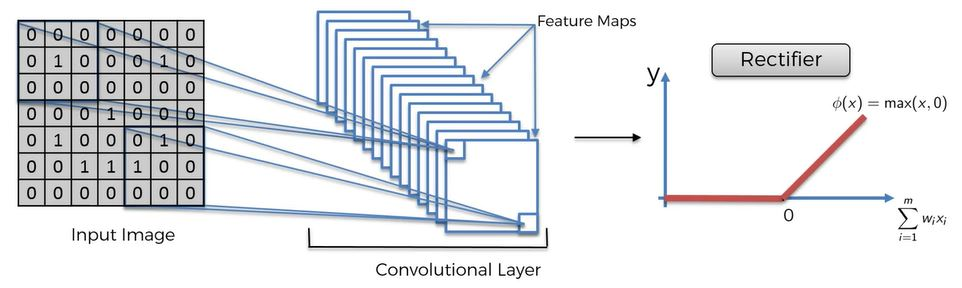
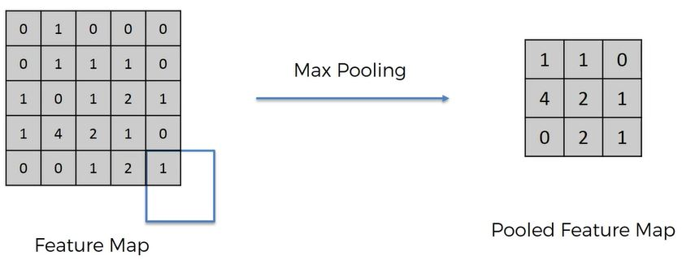
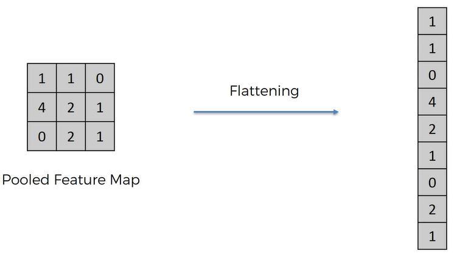
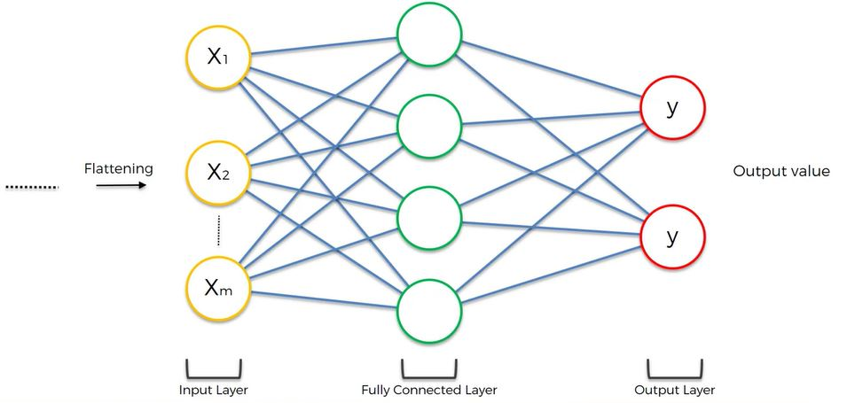
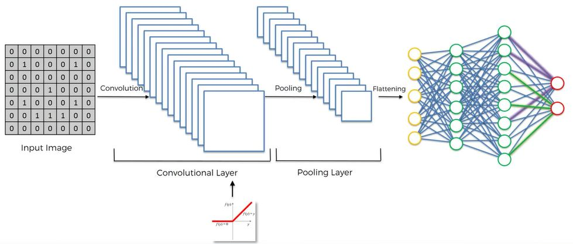
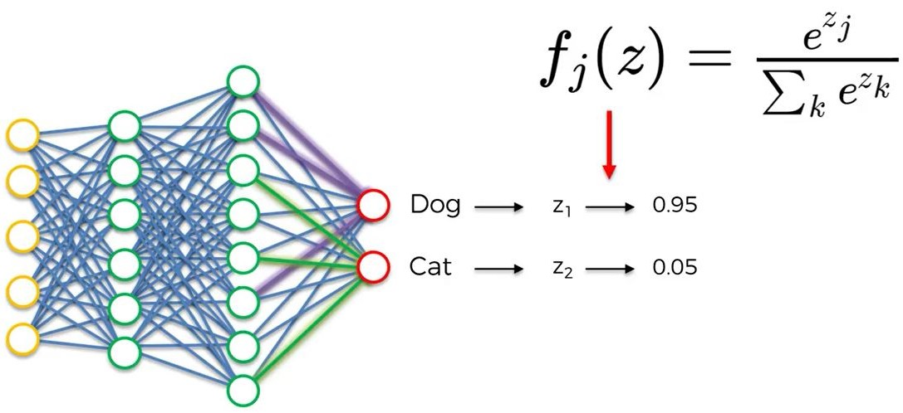

### Introduction

Deep Learning is the most exciting and powerful branch of Machine Learning. Deep Learning models can be used for a variety of complex tasks:

- Artificial Neural Networks for Regression and Classification
- Convolutional Neural Networks for Computer Vision
- Recurrent Neural Networks for Time Series Analysis
- Self Organizing Maps for Feature Extraction
- Deep Boltzmann Machines for Recommendation Systems
- Auto Encoders for Recommendation Systems

You will understand and learn how to implement the following Deep Learning models:

1. Artificial Neural Networks for a Business Problem
2. Convolutional Neural Networks for a Computer Vision task 

### Convolutional Neural Networks

There is much to learn so lets break this into pieces:

1. What are CNNs?
2. Convolution Operation
     - ReLUU Layer
3. Pooling
4. Flattening
5. Full Connection
6. Summary
     - Softmax
     - Cross-Entropy

#### What are CNNs?

CNNs are getting more popular than ANNs.  Suggests that image recognition is being used for more and more applications.

```{r out.width = "500px", echo=FALSE}
knitr::include_graphics("./images/deeplearning21.JPG")

#Super simple example where colors are not 10255 but just 0/1
knitr::include_graphics("./images/deeplearning23.JPG")
```

The steps we will take to evaluate images is Convolution --> Max Pooling --> Flattening --> Full Connection

#### Convolution Operation

A convolution operation is a function that is simply a combined integration of 2 functions. We will ignore that actual equation and get to a practical understanding.

The goals of convolution:

- Find features in an image using Feature Detector and put them into a Feature Map that preserves the spatial relation of pixels.
- The features a neural network will use and detect to recognize images will mean nothing to humans

```{r out.width = "500px", echo=FALSE}
knitr::include_graphics("./images/deeplearning24.JPG")
knitr::include_graphics("./images/deeplearning25.JPG")
```

Feature Detector = kernel = filter
The feature detector is commonly 3X3 but can also be 5x5, 7x7. etc.
A convolutional operation is illustrated by an x in a circle.
The step that you move the square is called the stride.  Conventionally a stride of 2 is used.  
Feature Map --> Convolved Feature --> Activation Map
The whole goal is to make the image smaller to make it easier to process.  

Use many different feature maps to create a convolutional layer.

```{r out.width = "500px", echo=FALSE}

```

##### ReLU Layer

RReLU --> Rectified Linear Units

The rectifier is used to increase non linearity because images are nonlinear.  (Gets rid of intermediary layers.)

```{r out.width = "500px", echo=FALSE}

```

#### Max Pooling

Pooling --> Downsampling

Spatial invariance - features can be a bit different or distorted, the neural network needs flexibility to accommodate.

Below, using max pooling (there are variations) using a stride = 2 ( commonly used), record the max value in each 2x2:

```{r out.width = "500px", echo=FALSE}

```

Pooling is really important:

- Features are preserved
- Getting rid on much of the information we do not need
- Using the max helps account for any distortion
- Reducing the number of parameters.  Helps prevent over fitting and speed processing.
- If a value in the Feature Map like the pixel with value = 4 falls in a different square in another image, the 4 in the Pooled Featured Map does not change. This is how max pooling provides flexibility to recognize features across different images or distortions.

```{r out.width = "500px", echo=FALSE}
knitr::include_graphics("./images/deeplearning29.JPG")
```

Interesting website:  http://scs.ryerson.ca/~aharley/vis/conv/flat.html

Why max pooling?  If interested, read this:  http://ais.uni-bonn.de/papers/icann2010_maxpool.pdf

#### Flattening

```{r out.width = "500px", echo=FALSE}
knitr::include_graphics("./images/deeplearning30.JPG")

```

#### Full Connection

We now add a whole ANN to our CNN.  

> Hidden layers in ANN are called Fully Connected Layers in CNN.  The cost function in ANN is called Loss Function in CNN.

```{r out.width = "500px", echo=FALSE}

```

#### Summary

```{r out.width = "500px", echo=FALSE}

```

In addition to the above remember other things we reviewed: 

- We applied many feature detectors (or filters) to the image to create feature maps.
- The variations of the feature maps make up the Convolutional Layer.
- The  ReLU to remove linearity in images
- During backpropogaton, the feature detectors are trained and adjusted in the gradient descent process too.

Learn about other variations on CNNs:  https://adeshpande3.github.io/adeshpande3.github.io/The-9-Deep-Learning-Papers-You-Need-To-Know-About.html

##### Softmax

Referring to the image below, the neural network does not by itself calculate probabilities for the Dog and Cat to add nicely to 1.  The SoftMax function does this.  Z~1~ and Z~2~ not not necessarily add to 1.  

The softmax function, or normalized exponential function,is a generalization of the logistic function that "squashes" a K-dimensional vector of arbitrary real values to a K-dimensional vector of real values in the range [0, 1] that add up to 1. 

```{r out.width = "500px", echo=FALSE}

```

##### Cross-Entropy

Cross-Entropy is used in CNNs as the loss function instead of the MSE Cost function we used in ANNs.

> Cross-Entropy only for classification

Why use Cross-Entropy over MSE?  Use Cross-Entropy because:

- Helps assess smaller errors during gradient descent because a log is used (moving from 1/1000000 to 1/1000 will be large using cross-entropy but tiny - almost no change - with MSE)

### No Code

In the previous section, we used the powerful H2O package in R to build an ANN for a Business Problem.

If you use H2O to build a CNN for Computer Vision, H2O comes with a framework called Deep Water.

However, this Deep Water framework is still in early stage, and its final version hasn't be released yet. 

https://github.com/h2oai/deepwater

https://www.hackerearth.com/practice/machine-learning/machine-learning-algorithms/understanding-deep-learning-parameter-tuning-with-mxnet-h2o-package-in-r/tutorial/

https://www.r-bloggers.com/image-recognition-in-r-using-convolutional-neural-networks-with-the-mxnet-package/

https://www.r-bloggers.com/deep-learning-in-r-2/

http://dmlc.rstats/2015/11/03/training-deep-net-with-R.html 

https://rpubs.com/kanedglsk/236125

