```{r DoOnce, echo=FALSE, warning=FALSE, message=FALSE, eval=FALSE}
install.packages("Rcpp")
install.packages("devtools")
devtools::install_github("rstudio/reticulate", force=TRUE)
devtools::install_github("r-lib/processx")
library(processx)
devtools::install_github("rstudio/tensorflow")
devtools::install_github("rstudio/keras")
```

```{r echo=FALSE, warning=FALSE, message=FALSE, eval=FALSE}
if(!require(easypackages)){
    install.packages("easypackages")
    library(easypackages)
}
packages("keras", prompt = FALSE)
install_keras()
```

```{r howToDeactivateTensorflow, eval=FALSE, echo=FALSE}
# To activate this environment, use:  activate r-tensorflow
#
# To deactivate this environment, use:  deactivate r-tensorflow
```

## Introduction

This topic has been covered extensively already.  What is provided below is is not original or unique.  However, it is with great pleasure that I publish something proving  Python has nothing over R anyomore.  In fact, R has significant features Python cannot touch.

-----

It has always been a debatable topic to choose between R and Python. The Machine Learning world has been divided over the preference 
of one language over the other. But with the explosion of Deep Learning, the balance shifted towards Python as it had an enormous 
list of Deep Learning libraries and frameworks which R lacked - until now.

With launch of Keras in R, the [R or Python fight](http://rismyhammer.com/Articles/RvPython.html) heats up again.. Python was slowly becoming the de-facto language for Deep Learning models. But with the release of Keras library in R with tensorflow (CPU and GPU compatibility)  at the backend as of now, it is likely that R will again fight Python for the podium even in the Deep Learning space.

### What is Keras?

Keras is a high-level neural networks API developed with a focus on enabling fast experimentation. Keras has the following key features:

- Provides the same code to run on CPU or on GPU, seamlessly.
- User-friendly API which makes it easy to quickly prototype deep learning models.
- Built-in support for convolutional networks (for computer vision) and recurrent networks (for sequence processing). These are capabilities that R used to lack - probably the only example where Python had an edge over R - but no more!
- Keras supports essentially any deep learning model from a memory network to a neural Turing machine.
- Keras runs on top of multiple back-ends including TensorFlow - the default, CNTK, and Theano.

See the [Keras website](https://keras.io) for more detailed information.

## Keras in Action

What is the most sited example of of vision deep learning used by just about every training course out there?  [MNIST](http://yann.lecun.com/exdb/mnist/) of course.

MNIST is a collection of 60,000 images of 500 different people’s handwriting that is used for training CNNs. Another set of 10,000 test images (different from the training images) is used to test the accuracy of the resulting CNN.

An example of the types of images captured in MNIST is shown below.

```{r out.width = "500px", echo=FALSE}
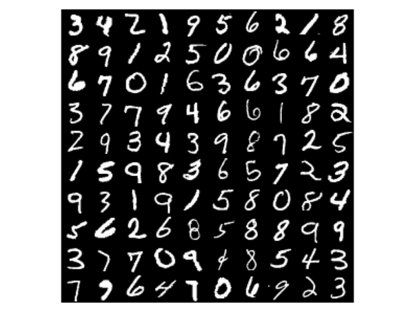
```

```{r loadMNIST, eval=FALSE}
#loading the keras inbuilt mnist dataset
data<-dataset_mnist()

#separating train and test file
train_x<-data$train$x
train_y<-data$train$y
test_x<-data$test$x
test_y<-data$test$y

rm(data)
dim(train_x)
```

The x data is a 3d array (images,width,height) of grayscale values . To prepare the data for training we convert the 3d arrays into matrices by reshaping width and height into a single dimension (28x28 images are flattened into length 784 vectors). Then, we convert the grayscale values from integers ranging between 0 to 255 into floating point values ranging between 0 and 1.

```{r eval=FALSE}
# converting a 2D array into a 1D array for feeding into the MLP and normalising the matrix
train_x <- array(train_x, dim = c(dim(train_x)[1], prod(dim(train_x)[-1]))) / 255
test_x <- array(test_x, dim = c(dim(test_x)[1], prod(dim(test_x)[-1]))) / 255
```

The y data is an integer vector with values ranging from 0 to 9. To prepare this data for training we one-hot encode the vectors into binary class matrices using the Keras `to_categorical()` function.

```{r eval=FALSE}
train_y<-to_categorical(train_y,10)
test_y<-to_categorical(test_y,10)
```

The simplest Keras type of model is the Sequential model - a linear stack of layers.

Begin by creating a sequential model and then adding layers using the pipe (%>%) operator.

```{r eval=FALSE}
model <- keras_model_sequential() 
```

Define the model with 1 input layer[784 neurons], 1 hidden layer[784 neurons] with dropout rate 0.4 and 1 output layer[10 neurons] - i.e number of digits from 0 to 9.

```{r eval=FALSE}
model %>% 
 layer_dense(units = 784, input_shape = 784) %>% 
 layer_dropout(rate=0.4)%>%
 layer_activation(activation = 'relu') %>% 
 layer_dense(units = 10) %>% 
 layer_activation(activation = 'softmax')
```

The `input_shape` argument to the first layer specifies the shape of the input data (a length 784 numeric vector representing a grayscale image). The final layer outputs a length 10 numeric vector (probabilities for each digit) using a [softmax activation function](https://en.wikipedia.org/wiki/Softmax_function).

```{r eval=FALSE}
summary(model)
```

```{r out.width = "600px", echo=FALSE}
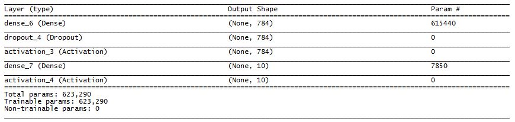
```

Compile the  model with metric = accuracy and optimizer as `adam`.

```{r eval=FALSE}
model %>% compile(loss = 'categorical_crossentropy', optimizer = 'adam', metrics = c('accuracy'))
```

### Training and Evaluation

Use `fit()` to train the model for 100 epochs using batches of 128 images.

```{r eval=FALSE}
model %>% fit(train_x, train_y, epochs = 100, batch_size = 128)
```

```{r out.width = "600px", echo=FALSE}
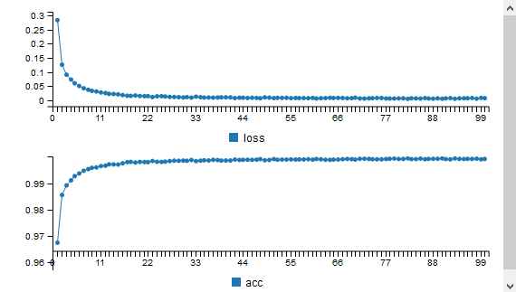
```

### Evaluate the Model Performance

```{r eval=FALSE}
lossmetrics <- model %>% evaluate(test_x, test_y, batch_size = 128)
```

```{r echo=FALSE, eval=FALSE}
print(lossmetrics)
```

`$loss`
`[1] 2.340742`

`$acc`
`[1] 0.1327`

Generate predictions on new data.

```{r eval=FALSE}
classes <- model %>% predict_classes(test_x)
```
```{r eval=FALSE}
head(classes, 30)
```

` [1] 2 1 7 9 9 9 4 8 2 9 2 1 9 9 2 9 9 9 9 9 9 9 7 2 9 7 9 9 9 2`

Keras provides a vocabulary for building deep learning models that is simple, elegant, and intuitive. Building a question answering system, an image classification model, a neural Turing machine, or any other model is just as straightforward.

## Appendix

### CNN Introduction

#### What are CNNs?

CNNs are getting more popular because image recognition is being used for more and more applications.

```{r out.width = "500px", echo=FALSE}
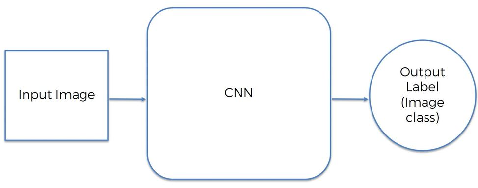
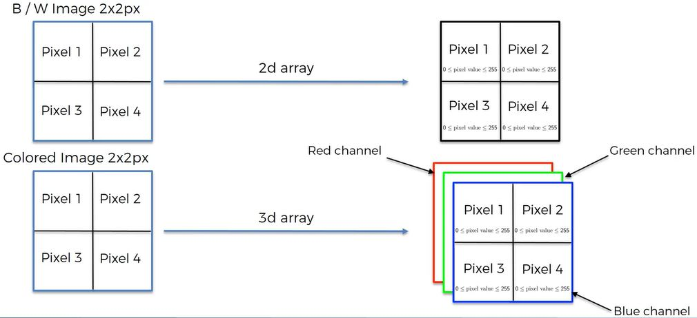
#Super simple example where colors are not 10255 but just 0/1
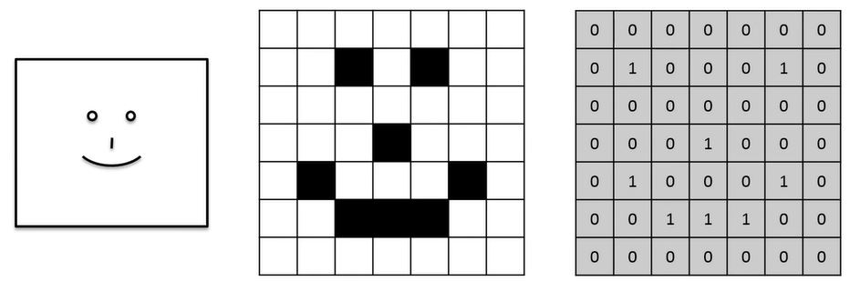
```

#### Convolution Operation

A convolution operation is a function that is simply a combined integration of 2 functions. 

The goals of convolution:

- Find features in an image using Feature Detector and put them into a Feature Map that preserves the spatial relation of pixels.
- The features a neural network will use and detect to recognize images will mean nothing to humans

```{r out.width = "500px", echo=FALSE}
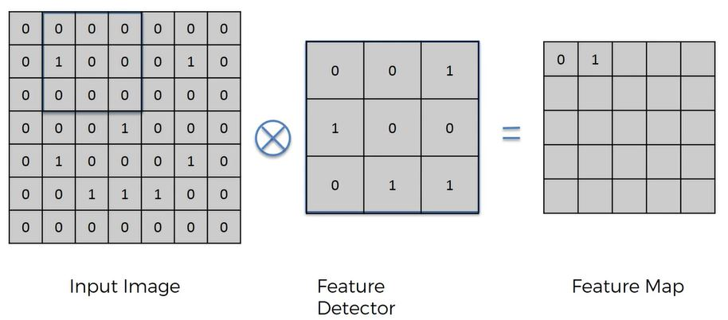
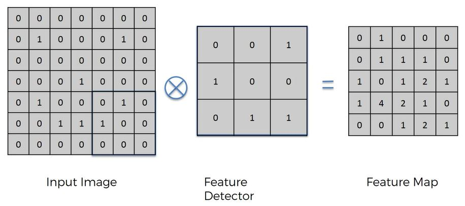
```

- Feature Detector = kernel = filter
- The feature detector is commonly 3X3 but can also be 5x5, 7x7. etc.
- A convolutional operation is illustrated by an x in a circle.
- The step that you move the square is called the stride.  - Conventionally a stride of 2 is used.  
- Feature Map --> Convolved Feature --> Activation Map
- The goal is to make the image smaller to make it easier to process.  

Use many different feature maps to create a convolutional layer.

```{r out.width = "500px", echo=FALSE}
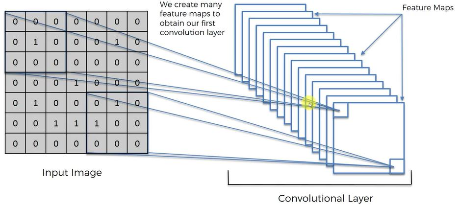
```

##### ReLU Layer

RReLU --> Rectified Linear Units

The rectifier is used to increase non linearity because images are nonlinear.  (Gets rid of intermediary layers.)

```{r out.width = "500px", echo=FALSE}
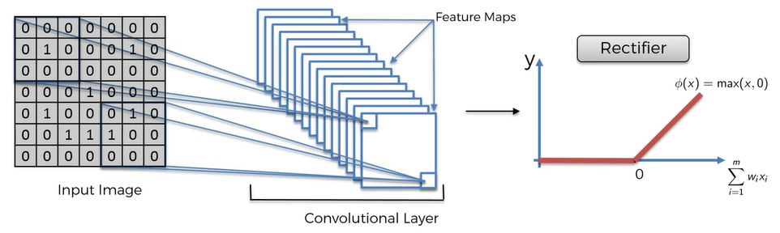
```

#### Max Pooling

Pooling --> Downsampling

Spatial invariance - features can be a bit different or distorted, the neural network needs flexibility to accommodate.

Below, using max pooling (there are variations) using a stride = 2 ( commonly used), record the max value in each 2x2:

```{r out.width = "500px", echo=FALSE}
knitr::include_graphics("./images/deeplearning28.JPG")
```

Pooling is really important:

- Features are preserved
- Getting rid on much of the information we do not need
- Using the max helps account for any distortion
- Reducing the number of parameters.  Helps prevent over fitting and speed processing.
- If a value in the Feature Map like the pixel with value = 4 falls in a different square in another image, the 4 in the Pooled Featured Map does not change. This is how max pooling provides flexibility to recognize features across different images or distortions.

```{r out.width = "500px", echo=FALSE}
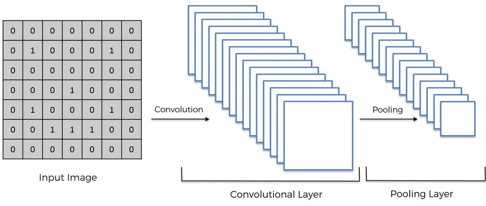
```

Why max pooling?  If interested, read this:  http://ais.uni-bonn.de/papers/icann2010_maxpool.pdf

#### Flattening

```{r out.width = "500px", echo=FALSE}
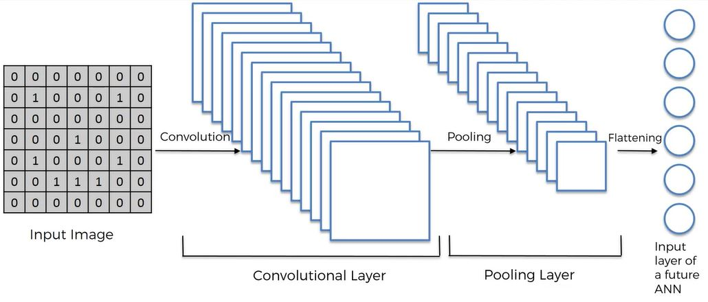
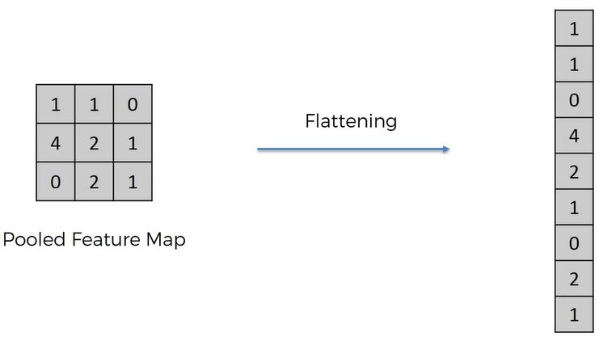
```

#### Full Connection

We now add a whole ANN to our CNN.  

> Hidden layers in ANN are called Fully Connected Layers in CNN.  The cost function in ANN is called Loss Function in CNN.

```{r out.width = "500px", echo=FALSE}
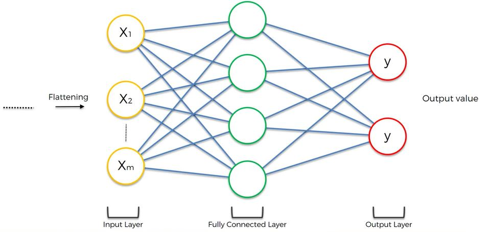
```

#### Summary

```{r out.width = "500px", echo=FALSE}
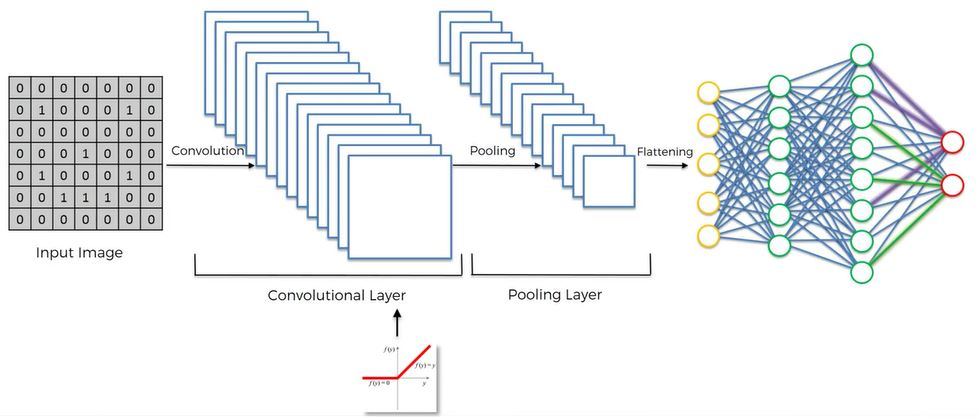
```

In addition to the above remember other things we reviewed: 

- We applied many feature detectors (or filters) to the image to create feature maps.
- The variations of the feature maps make up the Convolutional Layer.
- The  ReLU to remove linearity in images
- During backpropogaton, the feature detectors are trained and adjusted in the gradient descent process too.

Learn about other variations on CNNs:  https://adeshpande3.github.io/adeshpande3.github.io/The-9-Deep-Learning-Papers-You-Need-To-Know-About.html

##### Softmax

Referring to the image below, the neural network does not by itself calculate probabilities for the Dog and Cat to add nicely to 1.  The SoftMax function does this.  Z~1~ and Z~2~ not not necessarily add to 1.  

The softmax function, or normalized exponential function,is a generalization of the logistic function that "squashes" a K-dimensional vector of arbitrary real values to a K-dimensional vector of real values in the range [0, 1] that add up to 1. 

```{r out.width = "500px", echo=FALSE}
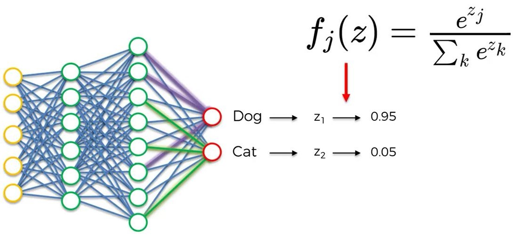
```

##### Cross-Entropy

Cross-Entropy is used in CNNs as the loss function instead of the MSE Cost function we used in ANNs.

> Cross-Entropy only for classification

Why use Cross-Entropy over MSE?  Use Cross-Entropy because:

- Helps assess smaller errors during gradient descent because a log is used (moving from 1/1000000 to 1/1000 will be large using cross-entropy but tiny - almost no change - with MSE)
